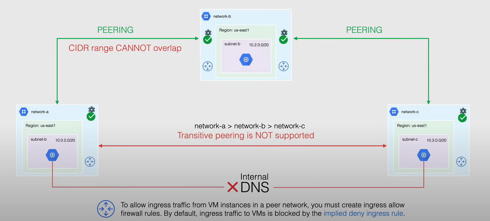
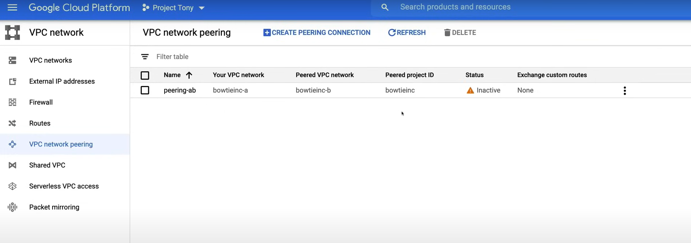
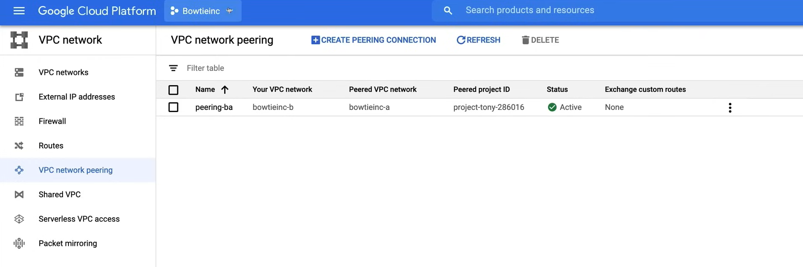

# VPC Network Peering

Per comunicare tra due VPC, è possibile utilizzare **VPC Network Peering**. VPC Network Peering consente di stabilire una connessione diretta tra due VPC. Questa connessione consente alle istanze in entrambi i VPC di comunicare tra loro come se fossero nella stessa rete.

VPC Network Peering:

- Consente la connettività privata tra due reti VPC.
  - ti consente di collegare VPC in modo che i carichi di lavoro in diverse VPC possano comunicare in uno spazio privato che segue lo standard **RC1918**.
  - il traffico tra le VPC non attraversa mai Internet pubblico.
- Collega VPC nello stesso o in diversi progetti e organizzazioni.
- Riduce la **latenza** di rete, poiché tutto il traffico di peering rimane all'interno della rete ad alta velocità di Google.
- Aumenta la **sicurezza** di rete.
- Riduce i **costi** di rete, poiché si risparmia sui costi di uscita per il traffico che lascia GCP.

Il VPC Network Peering presenta alcune caratteristiche:

- Le **reti di peering VPC** rimangono separate amministrativamente, il che significa che le route, le regole del firewall, le VPN e altri strumenti di gestione del traffico vengono amministrati e applicati separatamente.
  - ciò si applica a ciascuna VPC in modo indipendente, il che significa anche che ciascun lato di un'associazione di peering viene configurato in modo indipendente.
- Quando si connette una VPC all'altra, è necessario accedere a ciascuna VPC a cui si sta connettendo per inizializzare ed effettuare la connessione.
- Il peering diventa attivo solo quando la configurazione è completa su entrambi i lati, ciò significa anche che ciascuna VPC può eliminare l'associazione di peering in qualsiasi momento.
- Durante il peering delle VPC, le VPC peer scambiano sempre tutte le route delle subnet, è anche possibile scambiare route personalizzate.
  - Le route delle subnet e le route statiche sono globali.
  - Le route dinamiche sono regionali o globali.
- Una determinata rete VPC può essere collegata a più reti VPC, ma c'è un limite.

Il **VPC Network Peering** presenta alcune restrizioni:

- È necessario tenere presente che il campo di indirizzi CIDR di una subnet in una rete VPC collegata non può sovrapporsi a una route statica in un'altra rete VPC collegata.
  - Questa regola si applica sia alle route delle subnet che alle route statiche.
  - Quando viene creata una subnet VPC o viene espansa la gamma di indirizzi IP di una subnet, Google Cloud effettua un controllo per verificare che la nuova gamma di indirizzi IP della subnet non si sovrapponga a nessuna route statica in nessuna rete VPC collegata. Se ciò accade, l'operazione non riesce.
- Quando si crea una nuova subnet in una rete VPC collegata, il VPC Network Peering non fornisce controlli di route granulari per filtrare quali intervalli CIDR sono raggiungibili tramite la connessione di peering.
- Per consentire il traffico in ingresso dalle istanze VM in una rete peer, è necessario creare regole del firewall per consentire l'ingresso. Per impostazione predefinita, il traffico in ingresso verso le VM è bloccato dalla ***regola di negazione implicita in ingresso***.
- Il peering transitivo non è supportato e solo le reti direttamente collegate possono comunicare tra loro.
- Non è possibile utilizzare un tag o un service account da una rete peer nell'altra rete peer.
- Il DNS interno non è accessibile per le istanze di Compute Engine nelle reti collegate tramite peering, in quanto devono utilizzare un indirizzo IP per comunicare.



## Demo

In this demonstration we are going to go through the steps to create a VPC Network Peering between two VPCs in two different projects. A video demo is available [here](https://youtu.be/jpno8FSqpc8?si=WwAGmqeeaRCB2P74&t=30009).


### Step 1: Create the VPC Networks

We start from the project `Project Tony`.

1. Go to the **VPC Network** page in the Google Cloud Console.
2. Create a new VPC network called `bowtieinc-a` with the following configuration:
   - Name: `bowtieinc-a`
   - Description: `VPC Network for Bowtie Inc.`
   - Subnet Creation Mode: `Custom`
     - Subnet Name: `subnet-a`
     - Region: `us-east1`
     - IP Address Range: `10.0.0.0/20`
3. Click on **Create**.

Now move to the project `Bowtieinc`.

1. Go to the **VPC Network** page in the Google Cloud Console.
2. Create a new VPC network called `bowtieinc-b` with the following configuration:
   - Name: `bowtieinc-b`
   - Description: `VPC Network for Bowtie Inc.`
   - Subnet Creation Mode: `Custom`
     - Subnet Name: `subnet-b`
     - Region: `us-east4`
     - IP Address Range: `10.4.0.0/20`
3. Click on **Create**.


### Step 2: Create the Firewall Rules

Go back to the project `Project Tony` to create the firewall rules.

1. Go to the **VPC Network** page in the Google Cloud Console.
2. Click on **Firewall** section.
3. Click on **Create Firewall Rule**.
    - Name: `project-tony-a`
    - Description: `Allow traffic from bowtieinc-b`
    - Logs: `Off`
    - Network: `bowtieinc-a`
    - Priority: `1000`
    - Direction of traffic: `Ingress`
    - Action on match: `Allow`
    - Targets: `All instances in the network`
    - Source filter: `IP ranges`
    - Source IP ranges: `0.0.0.0/0`
      - Do not use this in production
    - Protocols and ports: `Specified protocols and ports`
      - tcp: `22`
      - icmp
4. Click on **Create**.

Go back to the project `Bowtieinc` to create the firewall rules.

1. Go to the **VPC Network** page in the Google Cloud Console.
2. Click on **Firewall** section.
3. Click on **Create Firewall Rule**.
    - Name: `bowtieinc-b`
    - Description: `Allow traffic from project-tony-a`
    - Logs: `Off`
    - Network: `bowtieinc-b`
    - Priority: `1000`
    - Direction of traffic: `Ingress`
    - Action on match: `Allow`
    - Targets: `All instances in the network`
    - Source filter: `IP ranges`
    - Source IP ranges: `0.0.0.0/0`
      - Do not use this in production
    - Protocols and ports: `Specified protocols and ports`
      - tcp: `22`
      - icmp
4. Click on **Create**.

### Step 3: Create the instances

Now we can create the instances.

In the project `Bowtieinc`.

1. Go to the **Compute Engine** page in the Google Cloud Console.
2. Click on **Create Instance**.
    - Name: `instance-b`
    - Region: `us-east4`
    - Zone: `us-east4-c`
    - Machine type: `e2-micro`
    - on **Management, security, disks, networking, sole tenancy** section:
      - **Networking** tab, under the **Network interfaces** section, click on **Network interface**.
        - Network: `bowtieinc-b`
        - Subnet: `subnet-b`
      - Click on **Done**. 
3. Click on **Create**.

Go back to the project `Project Tony`.

1. Go to the **Compute Engine** page in the Google Cloud Console.
2. Click on **Create Instance**.
    - Name: `instance-a`
    - Region: `us-east1`
    - Zone: `us-east1-b`
    - Machine type: `e2-micro`
    - on **Management, security, disks, networking, sole tenancy** section:
      - **Networking** tab, under the **Network interfaces** section, click on **Network interface**.
        - Network: `bowtieinc-a`
        - Subnet: `subnet-a`
      - Click on **Done**.
3. Click on **Create**.

### Step 4: Create the VPC Network Peering

From the project `Project Tony`. To connect to a VPC network in another project, we need the project ID of the other project, and the name of the VPC network.

1. Go to the **VPC Network** page in the Google Cloud Console.
2. Click on **VPC Network Peering** section.
3. Click on **Create Connection**.
    - Name: `peering-ab`
    - Your VPC network: `bowtieinc-a`
    - Peered VPC network: `In another project`
      - Project ID: `bowtieinc`
      - VPC network: `bowtieinc-b`
3. Click on **Create**.

As we can see in the following image, after the process the connection still `Inactive`, this is because we need to accept the connection from the other side.



So, go to the project `Bowtieinc`.

1. Go to the **VPC Network** page in the Google Cloud Console.
2. Click on **VPC Network Peering** section.
3. Click on **Create Connection**.
    - Name: `peering-ba`
    - Your VPC network: `bowtieinc-b`
    - Peered VPC network: `In another project`
      - Project ID: `project-tony`
      - VPC network: `bowtieinc-a`
3. Click on **Create**.

Now, in both projects, the connection is `Active`.



### Step 5: Test the connection

In project `Project Tony`.

1. Go to the **Compute Engine** page in the Google Cloud Console.
2. Copy the internal IP of the instance `instance-a`.

Now go to the project `Bowtieinc`.

1. Go to the **Compute Engine** page in the Google Cloud Console.
2. Click on the **SSH** button of the instance `instance-b`.
3. Now you can ping the instance `instance-a` using the internal IP.

```bash
ping [internal-ip-instance-a]
```

Finally, remember to delete the resources to avoid unnecessary charges.