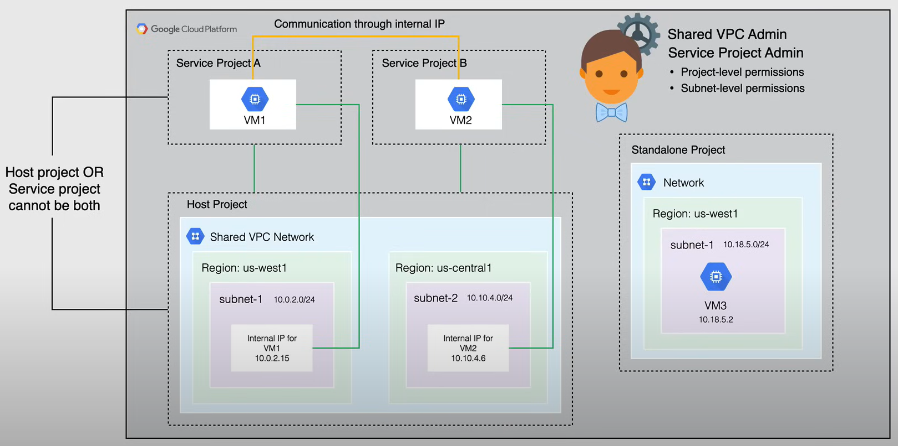
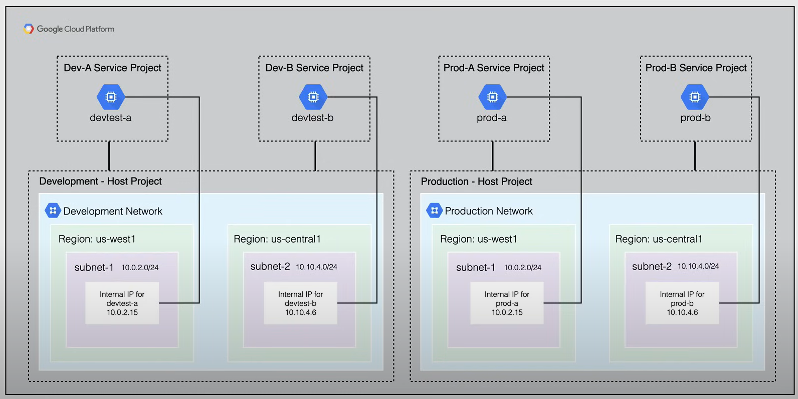
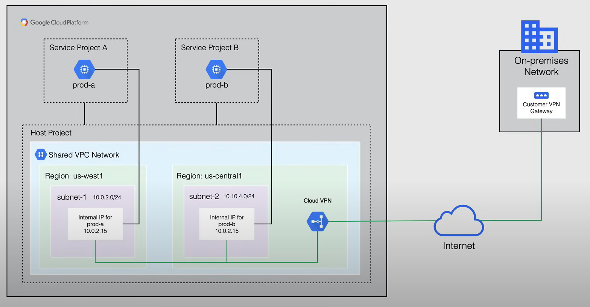
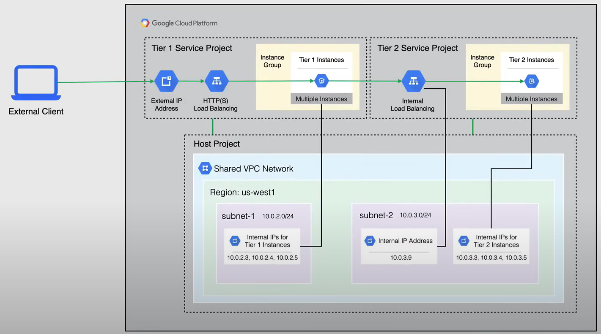

# Shared VPC

Quando viene creato un VPC, di solito è legato a un progetto specifico. Cosa succede quando vogliamo condividere risorse tra diversi progetti, ma mantenere ancora una fatturazione e un accesso separati all'interno dei singoli progetti?

Ecco dove entra in gioco il Shared VPC.

**Shared VPC** consente a un'organizzazione di connettere risorse da più progetti a una rete VPC comune, in modo che possano comunicare tra loro in modo sicuro ed efficiente utilizzando indirizzi IP interni di quella rete VPC.

Quando si utilizza Shared VPC, si designa un progetto come progetto host e si collegano uno o più altri progetti come progetti di servizio.

La rete VPC nel progetto host è considerata la rete VPC condivisa.

**Osservazione**:

- Un progetto che partecipa a un Shared VPC è o un progetto host o un progetto di servizio, ***ma non entrambi***.

  - Un *progetto host* può contenere una o più reti VPC condivise.
  - Un *progetto di servizio* è qualsiasi progetto che è collegato a una rete VPC condivisa. Ogni progetto di servizio può essere collegato solo a una rete VPC condivisa.

- Un progetto che non partecipa a un Shared VPC viene chiamato **progetto autonomo**.

Un **amministratore Shared VPC** ha le autorizzazioni per abilitare i progetti host a collegare i progetti di servizio ai progetti host e delegare l'accesso a una o tutte le subnet, nelle reti VPC condivise, agli amministratori dei progetti di servizio.

Per quanto riguarda un amministratore del progetto di servizio, questo è un amministratore Shared VPC per un determinato progetto host ed è tipicamente anche il proprietario del progetto stesso. Tuttavia, quando si definisce ogni amministratore del progetto di servizio, un amministratore Shared VPC può concedere l'autorizzazione per utilizzare l'intero progetto host o solo alcune subnet.

Quindi ci sono due livelli separati di autorizzazioni che possono essere applicate:

- **Autorizzazioni a livello di progetto**:
  - Questo è un amministratore del progetto di servizio che può essere definito per avere l'autorizzazione per utilizzare tutte le subnet nel progetto host.
- **Autorizzazioni a livello di subnet**:
  - Questo è un amministratore del progetto di servizio che può essere definito per avere l'autorizzazione per utilizzare solo specifiche subnet nel progetto host.

## Use Cases

### First Use Case - Shared VPC

Il codice selezionato modificato con ``` è:

La seguente diagramma mostra il primo scenario di utilizzo:



Qui, viene creato un progetto host con una rete VPC. Successivamente, vengono creati due progetti di servizio e collegati al progetto host. I progetti di servizio possono utilizzare le subnet nella rete VPC del progetto host.

L'amministratore del progetto di servizio nel progetto di servizio A può essere configurato per accedere a tutte o alcune delle subnet nella rete VPC condivisa.
L'amministratore del progetto di servizio con almeno le autorizzazioni a livello di subnet per la subnet `10.0.2.0/24` ha creato la VM1 in una zona situata nella regione us-west1. Questa istanza riceve il suo indirizzo IP interno `10.0.2.15` dal blocco CIDR `10.0.2.0/24`.

L'amministratore del progetto di servizio nel progetto di servizio B può essere configurato per accedere a tutte o alcune delle subnet nella rete VPC condivisa. Un progetto di servizio con almeno le autorizzazioni a livello di subnet per la subnet `10.10.4.0/24` ha creato la VM2 in una zona situata nella regione us-central1. Questa istanza riceve il suo indirizzo IP interno `10.10.4.6` dal blocco CIDR `10.10.4.0/24`.

E, naturalmente, il progetto autonomo non partecipa alla rete VPC condivisa.

Infine, le istanze nei progetti di servizio collegati a un progetto host utilizzando la stessa rete VPC condivisa possono comunicare tra loro utilizzando indirizzi IP interni effimeri o riservati.

### Second Use Case - Multiple Hosts Project

Il seguente diagramma mostra il secondo scenario di utilizzo:

In questo caso, un'organizzazione sta utilizzando due progetti host separati, **Develonment** e **Production**, e ogni progetto host ha due progetti di servizio collegati ad esso.
Entrambi i progetti host hanno una rete VPC condivisa, con subnet configurate per utilizzare gli stessi intervalli CIDR, entrambe le reti di test e di produzione sono state configurate appositamente allo stesso modo, in modo che quando si lavora con risorse legate a un intervallo di subnet, verrà automaticamente tradotto da un ambiente all'altro.



### Third Use Case - Hybrid Environment

In questo caso d'uso, l'organizzazione ha un singolo progetto host con una singola rete Shared VPC.

La rete Shared VPC è connessa tramite Cloud VPN a una rete in locale.

Alcuni servizi e applicazioni sono ospitati su GCP, mentre altri sono ospitati in locale.

In questo modo, team separati possono gestire i propri progetti e ciascun progetto non ha autorizzazioni sugli altri progetti di servizio. Inoltre, ciascun progetto di servizio può essere fatturato separatamente.

Sono state concesse autorizzazioni a livello di subnet o a livello di progetto agli amministratori dei progetti di servizio necessari, in modo che possano creare istanze che utilizzano la rete Shared VPC.

Le istanze in questi progetti di servizio possono essere configurate per comunicare con servizi interni, come database o server di directory situati in locale.



### Fourth Use Case - Two tier web service

In questo caso d'uso, un'organizzazione ha un servizio web che è separato in due livelli e diversi team gestiscono ciascun livello.

Il progetto di servizio del primo livello rappresenta i componenti esterni dietro un bilanciatore di carico HTTP (o HTTPS), come ad esempio un server web.

Il progetto di servizio del secondo livello rappresenta un servizio interno, su cui il servizio del primo livello dipende, ed è bilanciato utilizzando un bilanciatore di carico TCP o UDP interno.

Il Shared VPC consente di mappare ciascun livello del servizio web a diversi progetti, in modo che possano essere gestiti da team diversi, condividendo tutti una rete VPC comune, per ospitare le risorse necessarie per entrambi i livelli.


