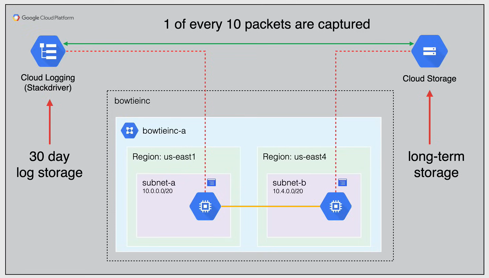
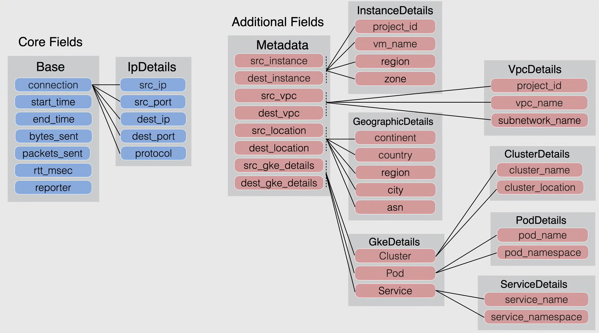
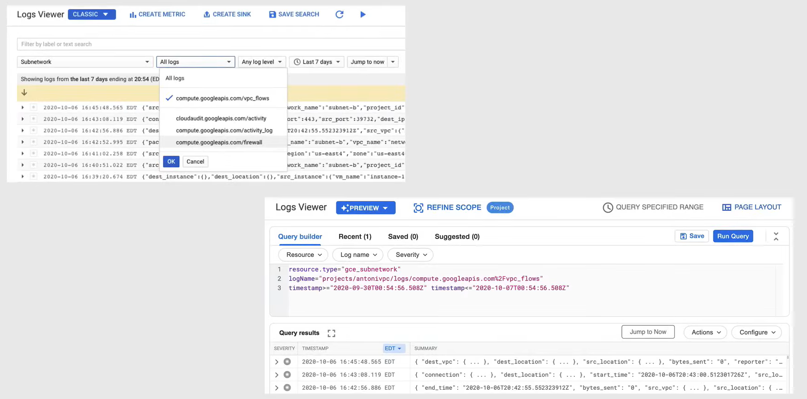
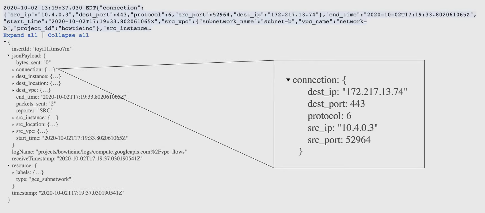

# VPC Flow Logs

**NOTA:** Essenziale per l'esame.

**Flow Logs** è uno strumento essenziale per il monitoraggio della rete e l'analisi del traffico di rete in entrata e in uscita dalle istanze VM all'interno delle VPC. Cattura informazioni sul traffico IP che passa attraverso le interfacce di rete in una VPC.

VPC Flow Logs registra un campione di un flusso di rete inviato e ricevuto dalle istanze VM, inclusi le istanze utilizzate come nodi di Google Kubernetes Engine (GKE).

Questi log possono essere utilizzati per il **monitoraggio della rete**, la **forense**, l'**analisi della sicurezza in tempo reale** e l'**ottimizzazione dei costi**.

Quando si abilita VPC Flow Logs, si abilita per tutte le VM nella subnet, quindi fondamentalmente si **abilita su base subnet**.

I Flow Logs vengono aggregati per connessione dalle VM di Compute Engine e vengono esportati in tempo reale. Questi log possono essere esportati in Cloud Logging per 30 giorni. Se i log sono necessari per un periodo più lungo di 30 giorni, è possibile esportarli in Cloud Storage.

Google Cloud campiona i pacchetti di esempio che lasciano e entrano in una VM per generare i Flow Logs, ma non tutti i pacchetti vengono catturati in un proprio record di log, circa 1 su 10 pacchetti viene catturato, ma questo tasso di campionamento potrebbe essere inferiore a seconda del carico della VM e **non è possibile modificare il tasso di campionamento**.

Pertanto, per questo motivo, si compensa la mancanza di pacchetti interpolando dai pacchetti catturati.

## Use Cases

Ecco alcuni casi d'uso per i VPC Flow Logs:

- **Monitoraggio della rete**
  - Visibilità in tempo reale sul throughput e le prestazioni di rete
- **Analisi dell'utilizzo di rete** e ottimizzazione delle **spese di traffico di rete**
- **Forense di rete** in caso di incidenti
  - Investigare attività di rete sospette
- **Analisi della sicurezza in tempo reale**
  - Stream verso Pub/Sub e integrazione con SIEM (Splunk, Rapid7, LogRhythm, ecc.)

## Record Format

I log di VPC Flow sono registrati in un formato specifico. I record dei log contengono:

- campi base che sono i **campi principali** di ogni record di log
  - sono sempre inclusi
- campi di metadati che aggiungono informazioni aggiuntive
  - i campi di metadati possono essere omessi per risparmiare sui costi di archiviazione

Alcuni campi di log sono in un formato multi-campo con più di un dato in un dato campo. Ad esempio, il campo `connection`, che vedi dai campi `Base`, è nel formato `ipDetails` che contiene gli indirizzi IP e le porte di origine e destinazione, oltre al protocollo, in un singolo campo.

## Sample Logs

The following images are examples of VPC Flow Logs:

