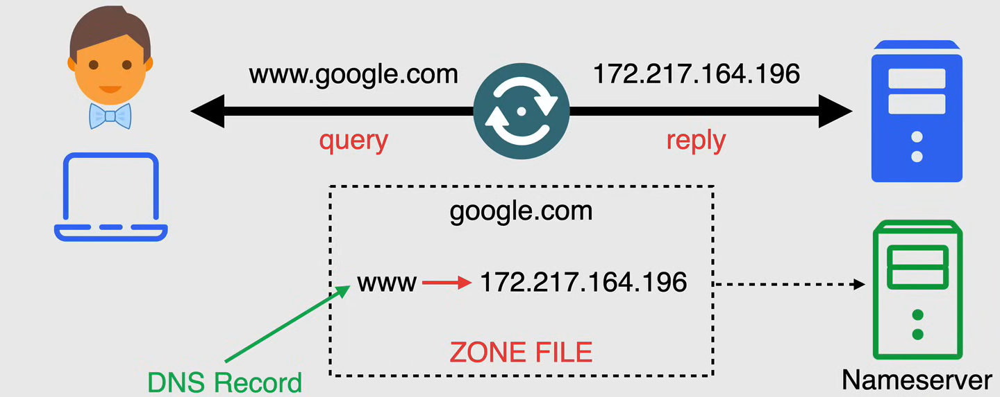
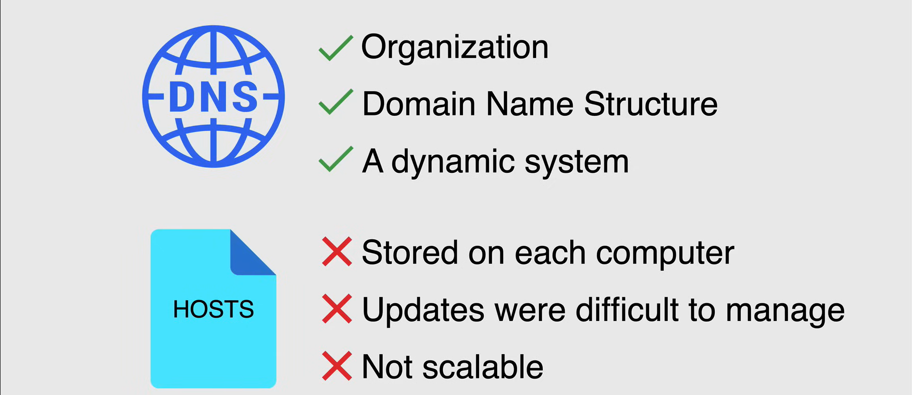
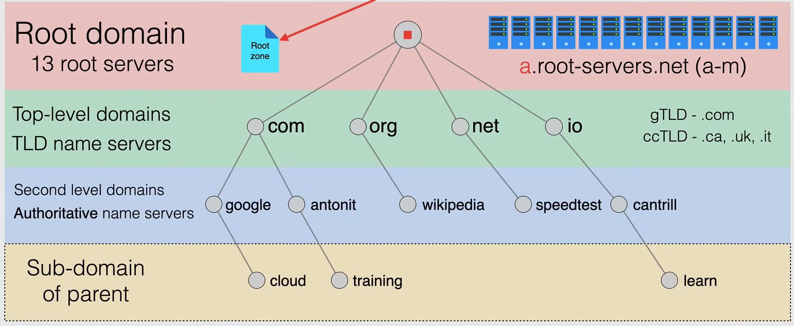
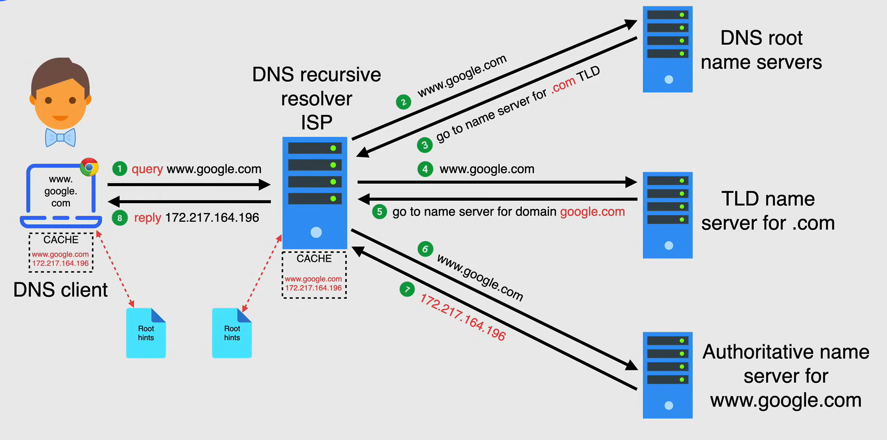

# DNS Fundamentals

Il **Domain Name System (DNS)** è un database globale, decentralizzato e distribuito che fornisce una mappatura tra nomi leggibili dall'uomo e indirizzi IP. È un sistema gerarchico che consente la traduzione dei nomi di dominio in indirizzi IP e viceversa.

Le informazioni per convertire i nomi di dominio in indirizzi IP sono memorizzate nelle **zone DNS**. Una zona DNS è una porzione dello spazio dei nomi DNS che è gestita da un'organizzazione o un amministratore specifico. Ogni zona contiene una collezione di record di risorse che mappano i nomi di dominio agli indirizzi IP.

## Why DNS

Inizialmente, nelle prime reti informatiche, veniva utilizzato un semplice file di testo chiamato **hosts file** per mappare i nomi di dominio agli indirizzi IP. Questo file veniva mantenuto su ogni computer ed era utilizzato per risolvere i nomi di dominio negli indirizzi IP. Tuttavia, con l'aumentare del numero di computer nella rete, mantenere il file hosts è diventato complicato ed inefficiente.

Per superare questa limitazione, è stato sviluppato il DNS. Il DNS fornisce un sistema scalabile e distribuito per risolvere i nomi di dominio negli indirizzi IP. È un componente critico di Internet ed è utilizzato da ogni dispositivo che si connette a Internet.

## DNS Structure

La struttura inizia con un punto, il **root**, e può essere trovata dopo ogni nome di dominio, anche se non è visibile perché il browser lo nasconde. Il root è il vertice della gerarchia DNS e viene rappresentato da un punto (.) nella notazione DNS. Sotto il root ci sono i **top-level domains (TLD)**, che rappresentano il livello più alto della gerarchia DNS. Esempi di TLD includono .com, .org, .net, .edu e .gov.

Lo spazio dei nomi dei domini consiste in una struttura dati gerarchica, ogni nodo ha una label e zero o più record di risorse, che contengono informazioni associate al nome di dominio.

Il nome di dominio stesso è composto dalle label concatenate insieme, con il nome del genitore a destra, separati da un punto. Quindi, il DNS viene sempre assemblato da destra a sinistra.

Questo albero è diviso in zone, che sono sezioni dello spazio dei nomi DNS gestite da un'organizzazione o un amministratore specifico. Ogni zona contiene una collezione di record di risorse che mappano i nomi di dominio agli indirizzi IP.

## How DNS works

Nel processo di ricerca DNS, ci sono otto passaggi che avvengono quando un utente inserisce un nome di dominio in un browser web:

1. Il **DNS Client**, ovvero l'utente, inserisce un nome di dominio in un browser web, come ad esempio www.example.com, e interroga il **DNS Recursive Resolver**, un server che inizia il processo di risoluzione del nome di dominio in un indirizzo IP. Il resolver ricorsivo è tipicamente fornito dal provider di servizi Internet (ISP) dell'utente.

2. Il resolver ricorsivo interroga i **Root Name Servers**, che sono i server di primo livello nella gerarchia DNS. I server root forniscono gli indirizzi IP dei server TLD (Top-Level Domain) responsabili del nome di dominio.

3. I server root DNS rispondono con gli indirizzi IP dei server TLD responsabili del TLD .com.

4. Il resolver ricorsivo interroga i **.com TLD Servers** per ottenere l'indirizzo IP dei server di nome autoritativi per il nome di dominio www.example.com.

5. I server TLD .com rispondono con gli indirizzi IP dei server di nome autoritativi per il nome di dominio www.example.com.

6. Il resolver ricorsivo interroga i **Authoritative Name Servers** per il nome di dominio www.example.com per ottenere l'indirizzo IP del nome di dominio.

7. I server di nome autoritativi rispondono con l'indirizzo IP del nome di dominio www.example.com.

8. Il resolver ricorsivo memorizza nella cache l'indirizzo IP del nome di dominio www.example.com e restituisce l'indirizzo IP al client DNS.

