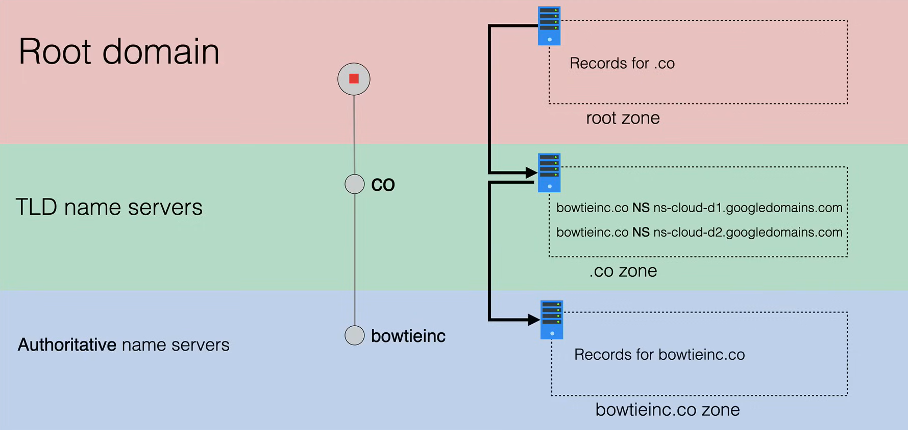
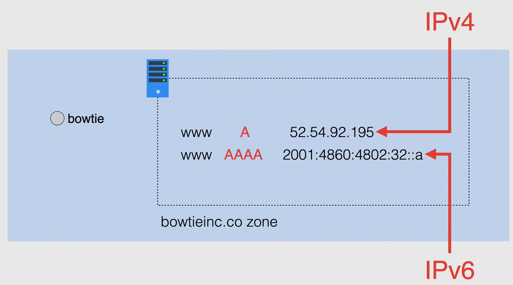
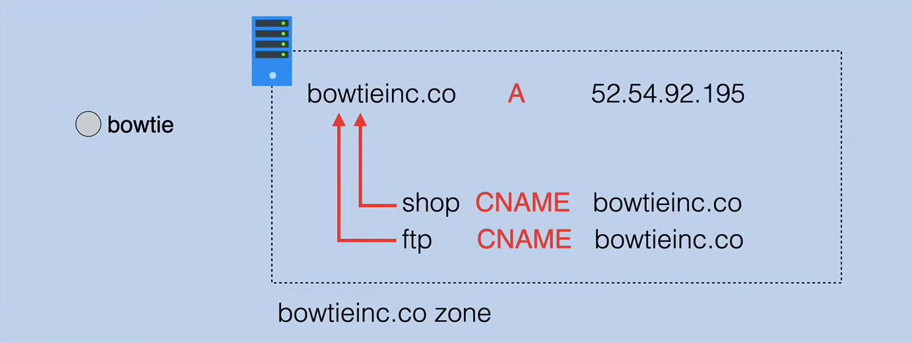
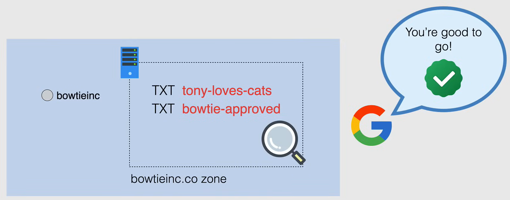
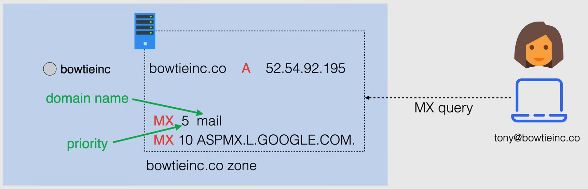
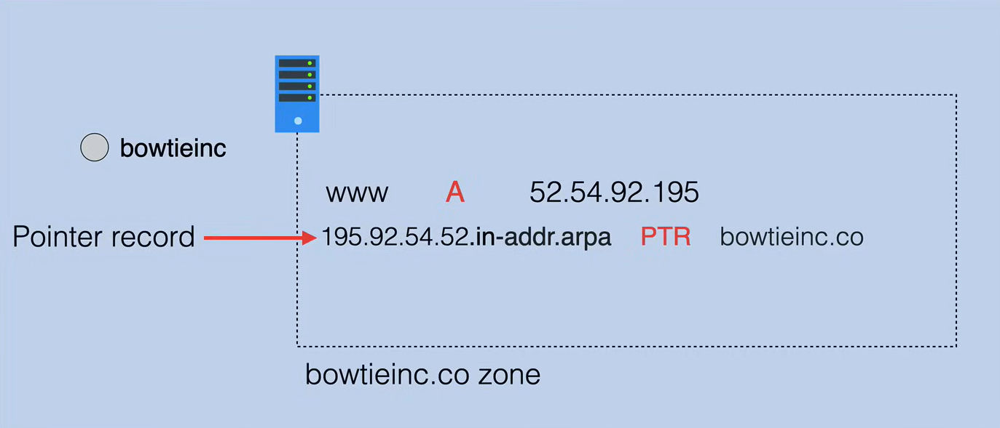
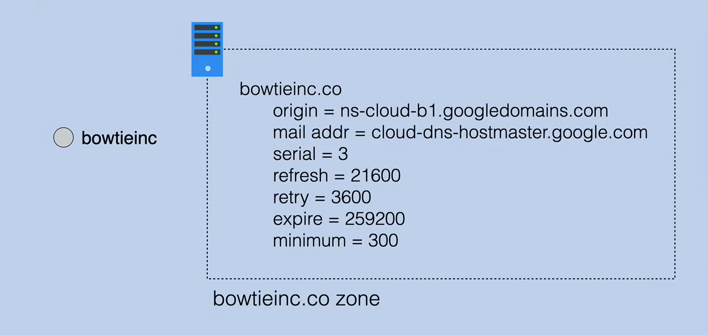

# DNS Record Types

I record delle risorse DNS sono gli elementi di informazione di base del Sistema di Nomi di Dominio (DNS). Sono voci nel database DNS che forniscono informazioni su un host specifico e sono fisicamente memorizzati in un file di zona sul server dei nomi.

I tipi più comuni di record DNS sono:

- **NS** (Name Server) records
- **A** (Address) and **AAAA** (IPv6 Address) records
- **CNAME** (Canonical Name) records
- **TXT** (Text) records
- **MX** (Mail Exchange) records
- **PTR** (Pointer) records
- **SOA** (Start of Authority) records

## NS (Name Server) Records

I record NS identificano quale server DNS contiene il record corrente per il dominio.

Questi server sono di solito trovati presso un registrar o un provider di hosting. Vengono creati per identificare il server di nomi utilizzato per ciascun nome di dominio all'interno di una determinata zona.

Nell'esempio seguente abbiamo la zona `.co` che avrà più record di server di nomi per `bowtieinc.co`.
Questi record di server di nomi sono come avviene la delega della zona `.co` per `bowtieinc.co`, e puntano a server che ospitano la zona `bowtieinc.co`, gestita da `bowtieinc`.
Quindi il flusso di risoluzione DNS parte dalla zona radice, passa alla zona `.co` e poi alla zona `bowtieinc.co`.

## A and AAAA Records

**I record A (Address)** e **AAAA (IPv6 Address)** puntano un nome di dominio a un indirizzo IP.

Ad esempio, quando si digita `www.bowtieinc.co` nel browser, il sistema DNS risolverà il nome di dominio in un indirizzo IP (ad esempio, `52.54.92.195`) utilizzando le informazioni del record A, memorizzate nel file di zona `bowtieinc.co`.

I record A collegano il nome di dominio di un sito web a un indirizzo IPv4, mentre i record AAAA collegano il nome di dominio di un sito web a un indirizzo IPv6.

## CNAME (Canonical Name) Records

I record **CNAME (Canonical Name)** vengono utilizzati per mappare un nome di dominio su un altro nome di dominio. Questo è utile quando si eseguono più servizi (come server FTP, sito web di e-commerce, ecc.) ognuno in esecuzione su porte diverse da un singolo indirizzo IP.

Quindi, se l'indirizzo IP del server cambia, è sufficiente aggiornare il record A per il server e tutti i record CNAME puntano automaticamente al nuovo indirizzo IP.

Ad esempio, è possibile puntare `ftp.bowtieinc.co` e `shop.bowtieinc.co` allo stesso indirizzo IP `bowtieinc.co` (un record A che punta all'indirizzo IP).

### TXT (Text) Records

Un record **TXT (Text)** viene utilizzato per memorizzare informazioni di testo che possono essere recuperate quando necessario. Questi valori di record possono essere leggibili dall'uomo o leggibili dalla macchina.

In molti casi, i record TXT vengono utilizzati per verificare la proprietà del dominio o fornire informazioni leggibili dall'uomo su un server, come il record SPF.

Un dominio può avere più record TXT associati ad esso.

Nell'esempio seguente, Google desidera verificare che tu sia il proprietario del dominio `bowtieinc.co`, in modo che G-Suite possa essere configurato e richiede la verifica tramite il dominio a Google tramite la creazione di un record TXT e l'aggiunta dello stesso alla zona.
Google fornisce quindi un record di verifica del testo da aggiungere ai record DNS dell'host di dominio e inizia a scansionare il record di testo per verificare il dominio.
Il record di testo fornito viene quindi aggiunto al file di zona per `bowtieinc.co`, dall'amministratore di dominio. Nel frattempo, Google effettua controlli di verifica a intervalli di tempo e, quando finalmente vede il record TXT, il dominio viene verificato.

## MX (Mail Exchange) Records

**I record MX (Mail Exchange)** vengono utilizzati per indirizzare le email a un server di posta. Indicano come devono essere instradati i messaggi di posta e a quale server di posta devono essere inviati.

Come i record `CNAME`, un record `MX` deve puntare a un dominio, non a un indirizzo IP. Il dominio deve avere un record `A` che punti all'indirizzo IP del server di posta.

Il record MX è composto da due parti: la **priorità** e il **nome di dominio**.

- La priorità è un numero (prima del dominio) che indica l'ordine in cui devono essere utilizzati i server di posta. Più basso è il numero, maggiore è la priorità.
- Il nome di dominio è il server di posta che riceverà l'email.

## PTR (Pointer) Records

**I record PTR (Pointer)** vengono utilizzati per le ricerche DNS inverse. Mappano un indirizzo IP a un nome di dominio. Quindi sono l'opposto dei **record A**.

Quando un utente cerca di raggiungere un dominio, il server DNS cercherà l'indirizzo IP del dominio. La ricerca DNS è l'opposto di questo processo. Cerca il nome di dominio di un indirizzo IP.

Mentre i **record A** sono archiviati sotto il nome di dominio specificato, i **record PTR** sono archiviati sotto l'indirizzo IP.

I **record PTR** vengono utilizzati per misure anti-spam, risoluzione dei problemi relativi alla consegna delle email e registrazione.

## SOA (Start of Authority) Records

**I record SOA (Start of Authority)** vengono creati per te quando crei la tua zona gestita e specificano le informazioni autoritative, inclusi i parametri globali sulla zona DNS.

Questo tipo di record memorizza informazioni importanti su un dominio o una zona, come l'indirizzo email dell'amministratore, quando il dominio è stato aggiornato l'ultima volta e quanto tempo il server dovrebbe attendere tra i refresh.

Ogni zona DNS registrata deve avere un SOA secondo lo standard RFC1035, ed esattamente un record SOA per zona. Contiene le informazioni principali sulla tua zona, quindi non è possibile che la tua zona funzioni senza tali informazioni.

Vengono utilizzati per ridurre la larghezza di banda tra i server dei nomi, aumentare la velocità di accesso al sito web e garantire che il sito sia attivo anche se il server primario va giù.

