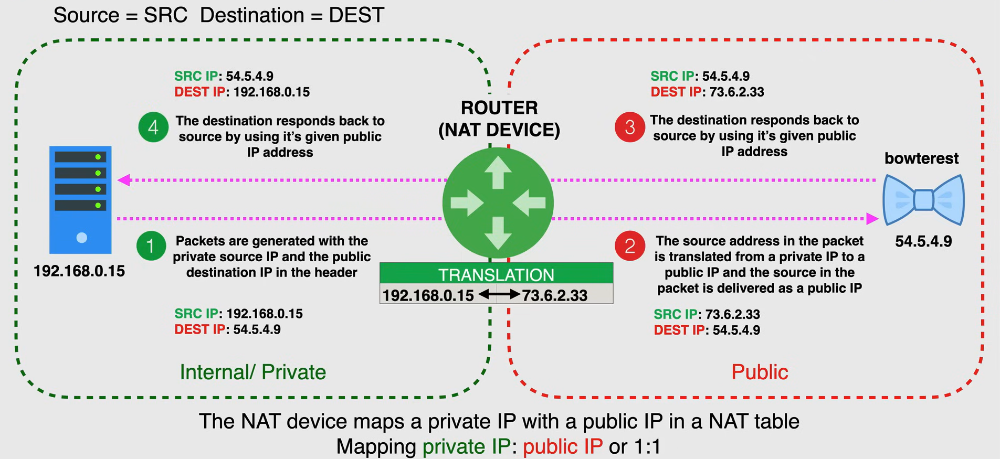
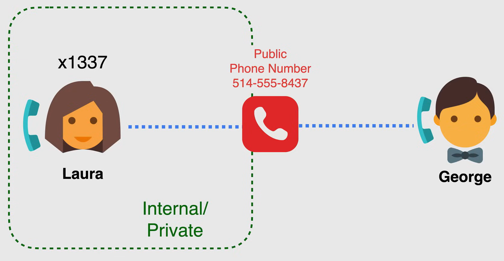
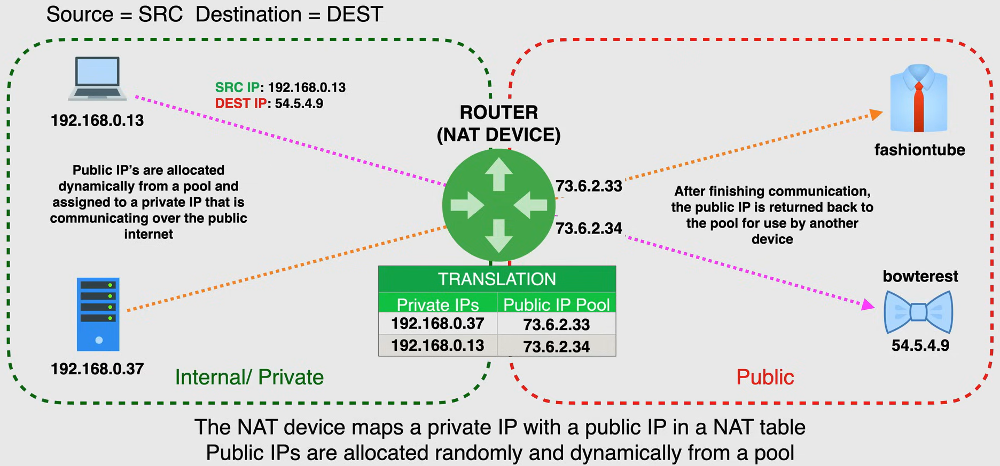
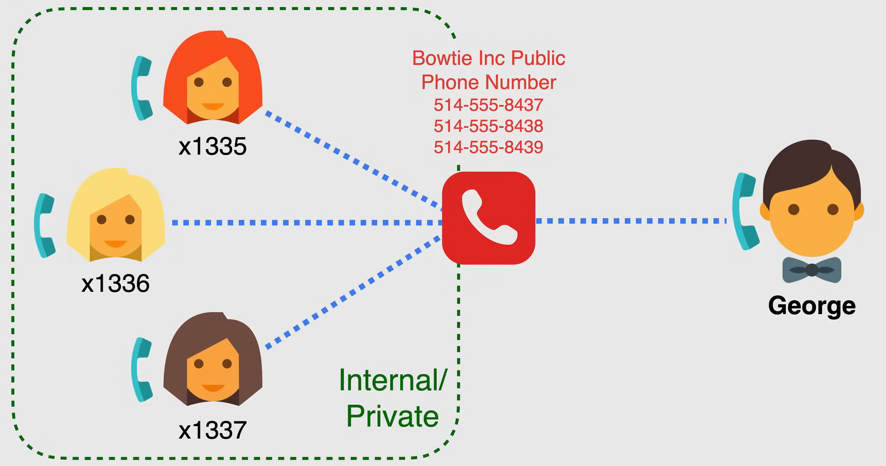
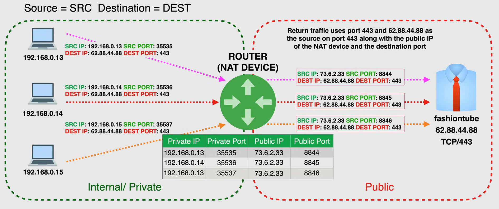
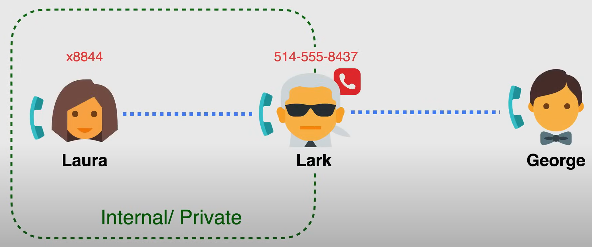

# Network Address Translation

NAT è un modo per mappare più indirizzi IP privati locali a un indirizzo IP pubblico, prima di trasferire le informazioni.

- Questo viene fatto modificando i dati dell'indirizzo di rete nell'intestazione IP del pacchetto dati durante il transito.

- È stato originariamente progettato per affrontare la scarsità di indirizzi IPv4 liberi.

  - Le reti IPv6 non richiedono NAT in quanto non vi è carenza di indirizzi.

- Fornisce sicurezza e privacy nascondendo gli indirizzi IP dei dispositivi sulla rete locale.

Ci sono diversi tipi di NAT:

- **Static NAT**: Mappa un singolo indirizzo IP privato a un singolo indirizzo IP pubblico su base uno a uno.
- **Dynamic NAT**: Mappa un singolo indirizzo IP privato a un singolo indirizzo IP pubblico da un pool di indirizzi IP pubblici.
- **PAT** (Port Address Translation): Mappa più indirizzi IP privati a un singolo indirizzo IP pubblico utilizzando porte diverse.

## Static NAT

Static NAT è una mappatura uno a uno degli indirizzi IP privati agli indirizzi IP pubblici.

Nell'esempio seguente, abbiamo una rete privata a sinistra e uno spazio IP pubblico a destra, con un router o un dispositivo NAT in mezzo.

In questo esempio c'è un server a sinistra che ha bisogno di accedere a servizi esterni, e per questo esempio il servizio esterno è il servizio "bowterest", un sito di condivisione di immagini per tutti i tipi di papillon.

Il server a sinistra è privato, con un indirizzo IP privato di `192.168.0.15`, il che significa che non può instradare pacchetti su Internet pubblico, perché ha solo un indirizzo IP privato. Il servizio "bowterest", d'altra parte, è un servizio pubblico, e ha un indirizzo IP pubblico di `54.5.4.9`.

Quindi non possono comunicare direttamente, perché il server a sinistra ha un indirizzo IP privato e il servizio "bowterest" ha un indirizzo IP pubblico. Quindi, è necessario tradurre l'indirizzo IP privato del server in un indirizzo IP pubblico, in modo che possa comunicare con il servizio "bowterest".

Il dispositivo NAT mappa l'indirizzo IP privato del server a un indirizzo IP pubblico, utilizzando una **tabella NAT**. La tabella NAT è una tabella che tiene traccia delle corrispondenze tra gli indirizzi IP privati e gli indirizzi IP pubblici.

1. Il server privato invia un pacchetto (come al solito) al servizio pubblico, ma il pacchetto passa attraverso il dispositivo NAT, che è il gateway predefinito della rete privata.
2. Il dispositivo NAT quindi traduce l'indirizzo IP privato del server in un indirizzo IP pubblico e invia il pacchetto al servizio pubblico.
3. Il processo viene invertito quando il servizio pubblico invia un pacchetto al server.
4. Il dispositivo NAT traduce l'indirizzo IP pubblico del servizio pubblico nell'indirizzo IP privato del server e invia il pacchetto al server.

Un'analogia comune per il NAT è l'operatore telefonico, che collega una linea telefonica privata a una linea telefonica pubblica, in modo che la linea telefonica privata possa comunicare con la linea telefonica pubblica.

## Dynamic NAT

**I dispositivi NAT mappano un indirizzo IP privato con un indirizzo IP pubblico in una tabella NAT, e gli indirizzi IP pubblici vengono allocati casualmente e dinamicamente da un pool di indirizzi IP pubblici.**

Questo metodo è simile al NAT statico, ma i dispositivi non vengono assegnati un indirizzo IP pubblico permanente. Invece, vengono allocati da un pool di indirizzi IP pubblici man mano che sono necessari, e la mappatura da pubblico a privato è basata sull'allocazione.

Questo tipo di NAT viene utilizzato quando più host interni con indirizzi IP privati condividono un numero uguale o inferiore di indirizzi IP pubblici.

Nell'esempio seguente, abbiamo una rete privata a sinistra, con due dispositivi, e secondo la tabella NAT, abbiamo due indirizzi IP pubblici disponibili nel pool.

1. Quindi, quando il laptop a sinistra cerca di accedere al servizio "bowterest", genera un pacchetto in cui l'indirizzo IP sorgente è l'indirizzo privato `192.168.0.13` e l'indirizzo IP destinazione è l'indirizzo pubblico `54.5.4.9`.
2. Il router al centro è il gateway predefinito, quindi controlla se l'indirizzo IP privato ha un'allocazione corrente di indirizzamento pubblico dal pool e, se non ne ha uno e uno è disponibile, lo alloca dinamicamente, in questo caso l'indirizzo IP pubblico `73.6.2.34`. Quindi il pacchetto viene inviato al servizio "bowterest".
3. Più dispositivi privati possono condividere lo stesso indirizzo IP pubblico, purché utilizzino porte diverse, e il dispositivo NAT tiene traccia dei numeri di porta nella tabella NAT. Quindi, quando il dispositivo termina la comunicazione, il dispositivo NAT libera l'indirizzo IP pubblico per un uso futuro.
4. Nell'esempio c'è un altro indirizzo IP disponibile nel pool, quindi quando il server privato a sinistra cerca di accedere al servizio "fashiontube", genera un pacchetto in cui l'indirizzo IP sorgente è l'indirizzo privato `192.168.0.37` e la mappatura viene effettuata con l'indirizzo IP pubblico `73.6.2.33`.

**NOTA:** Se non è disponibile un indirizzo IP pubblico nel pool, il dispositivo NAT non sarà in grado di allocare un indirizzo IP pubblico e il dispositivo non sarà in grado di comunicare con il servizio pubblico.

L'immagine seguente è un esempio di NAT dinamico con l'analogia dell'operatore telefonico.

## PAT (Port Address Translation)

**PAT è un tipo di NAT che mappa più indirizzi IP privati a un singolo indirizzo IP pubblico utilizzando porte diverse.**

PAT è anche conosciuto come NAT Overload, perché consente a più dispositivi di condividere un singolo indirizzo IP pubblico, e lo fa utilizzando porte diverse.

Nell'esempio seguente, abbiamo una rete privata a sinistra, con tre dispositivi diversi, e un singolo indirizzo IP pubblico a destra, cioè `fashiontube` a `62.88.44.88` con la porta TCP `443`, e un dispositivo NAT in mezzo.

Per consentire a più dispositivi di condividere lo stesso indirizzo IP pubblico, il dispositivo NAT utilizza porte diverse per tenere traccia dei diversi dispositivi.

La porta di origine viene assegnata casualmente dal client, quindi finché la porta di origine è sempre univoca, molti client privati possono utilizzare lo stesso indirizzo IP pubblico, e tutte queste informazioni vengono registrate nella **tabella NAT** sul dispositivo NAT.

Ad esempio, quando il dispositivo `192.168.0.13` genera un pacchetto per il servizio `fashiontube`, con l'indirizzo IP di destinazione `62.88.44.88`, e la porta di destinazione `443`, la porta di origine viene assegnata casualmente dal client (ad esempio `35535`), e il dispositivo NAT tiene traccia della corrispondenza tra l'indirizzo IP privato e la porta di origine, e l'indirizzo IP pubblico e la porta di destinazione.

Quando il dispositivo `192.168.0.14` fa la stessa cosa, lo stesso processo viene ripetuto. Lo stesso vale per il dispositivo `192.168.0.15`.

Il dispositivo NAT registra l'indirizzo IP di origine e la porta di origine in una tabella NAT.
L'indirizzo IP di origine viene sostituito con un IP pubblico e le porte di origine pubbliche vengono allocate da un pool che consente il sovraccarico molti a uno.

Per l'analogia del telefono, è come avere un operatore che collega più linee telefoniche private a una singola linea telefonica pubblica, e l'operatore tiene traccia delle diverse linee telefoniche utilizzando diverse estensioni.

