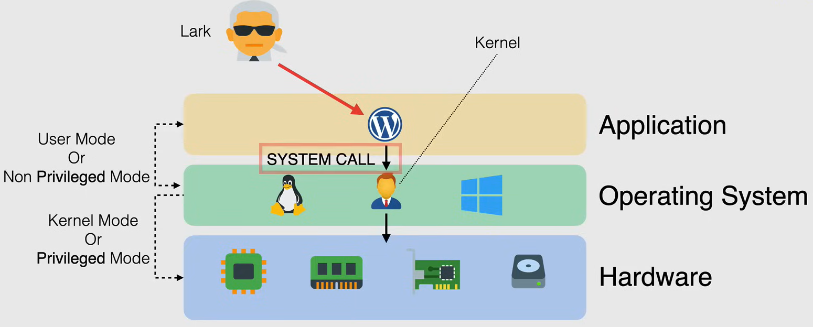
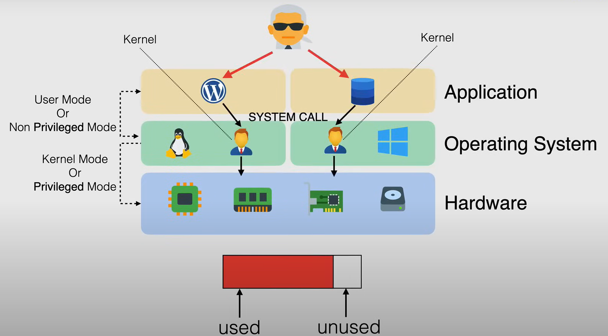
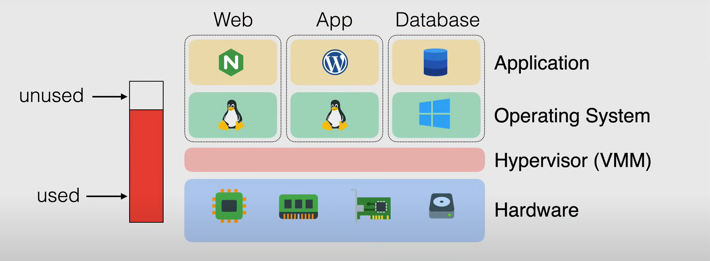
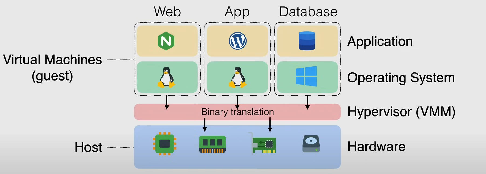
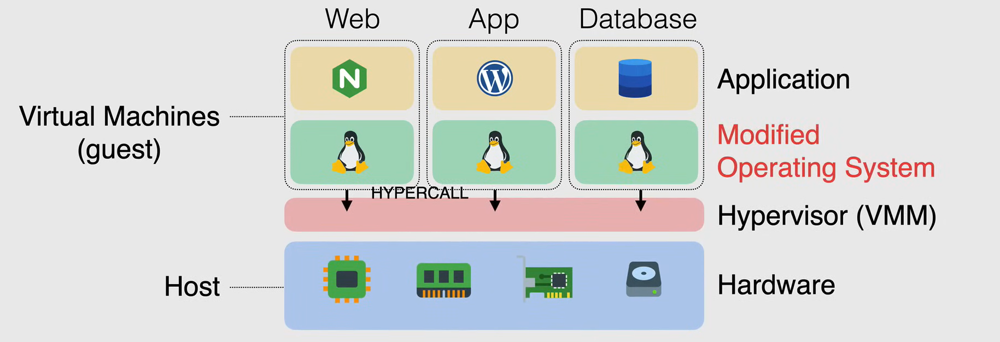
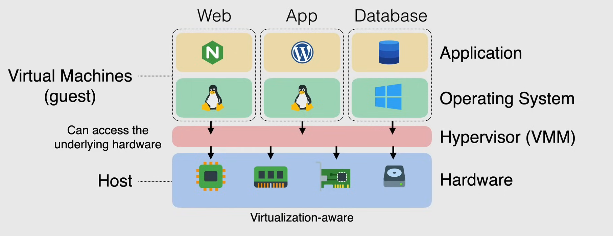
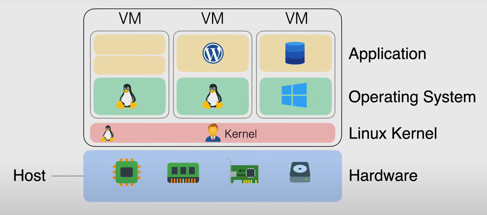

# Virtualization Fundamentals

## What is Virtualization?

Virtualization is the process of running multiple Operating Systems on a single physical machine, simultaneously.

### Before Virtualization

Before virtualization, each physical server was dedicated to a single Operating System. In the OS there is a middle layer called the **Kernel**, which is responsible for managing the hardware resources. The kernel is the interface between the hardware and the software.

The kernel operates in **Kernel Mode** (also called **Privileged Mode**), which has full access to the hardware. So an application running in the OS can't directly access the hardware. Instead, it has to go through the kernel, this is called a **User Mode** (also called **Unprivileged Mode**). SO, an application running in the OS, to access the hardware, has to make a **system call** to the kernel.

With this setup, the server is not utilized to its full potential. The server is running only one OS, and the resources are not shared among multiple OS.

### Multiple OS

Using multiple OS on a single machine permits to increase the utilization of the server, but each CPU at this given moment in time, could only one thing running as privileged mode.

So having multiple OS running on their own, in a unmodified state and expeting to be running on their own in a privileged state, running privileged instructions, was causing instability in systems, ***causing not just applications crashes, but the whole system to crash.***

### Hypervisor

The solution to this problem was the **Hypervisor**, also called **Virtual Machine Monitor (VMM)**.

The hypervisor is a software that runs on the physical machine and allows multiple OS to run on the same machine, but in a controlled way.

## Types of Virtualization

There are different types of virtualization techniques, each with its own advantages and disadvantages.

### Emulation

Initially, virtualization was done in software, and the operating system with its applications put in logical container known as a **Virtual Machine (VM)**.

The Operating System would be installed on the host which included additional capabilities called a Hypervisor, which would allow the OS to run in a VM.

The Hypervisor expose the interface of the hardware device that is available on the host and allowed to be mapped to the virtual machine and emulated the behavior of the hardware device. This allows the Virtual Machine to use the Operating System drivers that were designed to interact with the emulated device, without installing any additional drivers.

The problem here is that it was all emulated, so it was slow.

### Para-Virtualization

With **Para-Virtualization**, a modified guest OS is able to communicate directly with the hypervisor, without going through the emulation layer. This makes the communication between the guest OS and the hypervisor much faster.

This involves having the OS kernel to be modified and recompiled before the installation on the VM.

### Hardware-Assisted Virtualization

**Hardware-Assisted Virtualization**, enables efficient full virtualization using help from hardware capabilities, on the host CPU.

With this model the OS has direct access to the hardware, so the hardware itself becomes virtualization aware.

So thr Kenel no longer needs to be modified and recompiled. It provides improved performance and reduces the overhead of the hypervisor.

### Kernel Level Virtualization

**Kernel Level Virtualization** is a technique that allows multiple isolated user space instances or containers to run on a single kernel.

Instead of using an hypervisor, the kernel itself is modified to create isolated containers. This is a lightweight virtualization technique, as it doesn't require a separate OS for each container.

