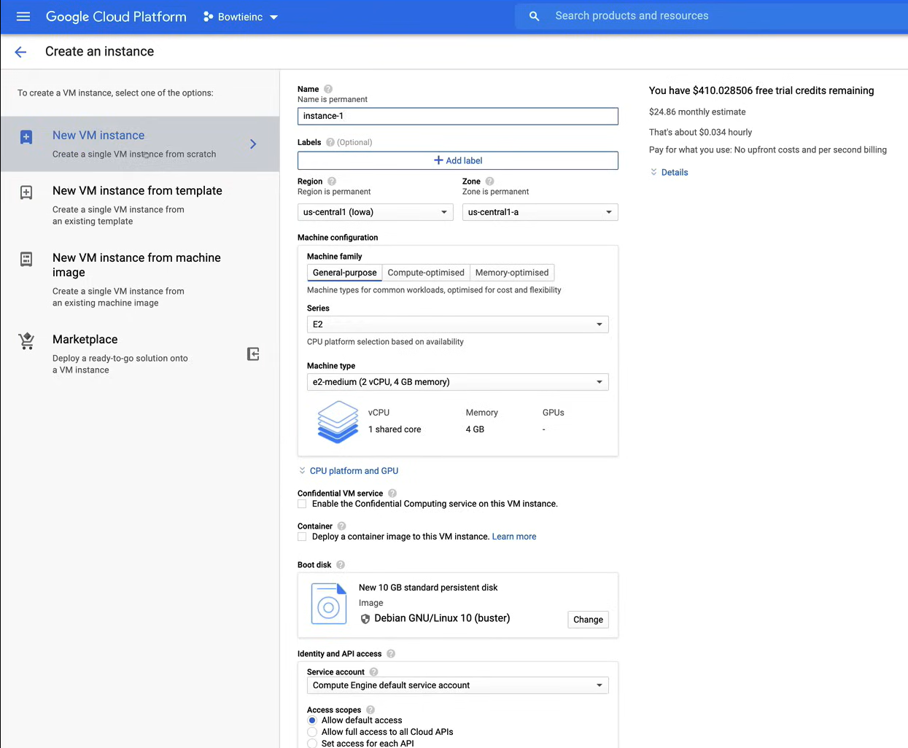
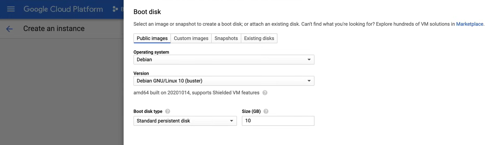
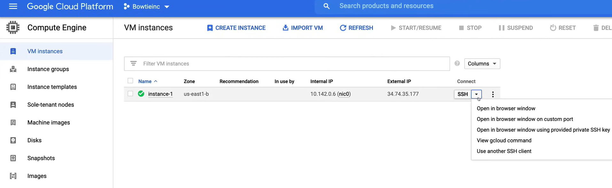
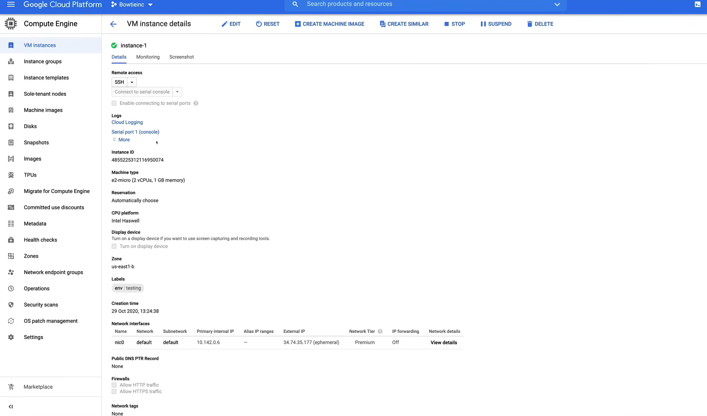

# Creating a VM Instance

## Demo

A video demo of this task is available [here](https://youtu.be/jpno8FSqpc8?si=AlTSiSI-o4pSqD91&t=36577).

1. Go to the **Compute Engine** page in the Google Cloud Console.
2. Now there is a prompt to **Create** , **Import** or **Take the quickstart**. Click on **Create**.
3. A focus on the left-hand menu.
    1. **New VM Instance**: you can create a new VM instance from scratch.
    2. **New VM Instance from Template**: you can create a new VM instance from a template.
    3. **New VM Instance from machine image**: you can create a new VM instance from a machine image.
    4. **Marketplace**: you can deploy solutions from the Google Cloud Marketplace.

        
4. Fill the fields in the **Create an instance** page.
    - Name: `instance-1`
    - Label: `env: testing`
    - Region: `us-east1`
    - Zone: `us-east1-b`
      - **NOTE:** After we create the instance, we can't change the region or zone.
    - Machine Configuration: `General-purpose`
      - Series: `E2`
      - Machine type: `e2-micro`
      - **NOTE:** After the machine type selection, on the right side, you can see the estimated cost per month.
    - CPU platform and GPU
      - CPU platform: `Automatic` [Intel or AMD]
      - GPUs: `None`
      - **NOTE:**
        - The CPU platform selection is permanent.
        - GPUs can be added only to the `N1` machine types.
    - Display device: `Unchecked`
      - **NOTE:** It is a feature that allows you to see a virtual display of the VM instance, for system management tools, remote software, and any application that requires a display.
    - Confidential VM service: `Unchecked`
      - **NOTE:** It is a security feature to encrypt sensitive code and data that is in memory.
    - Container: `Unchecked`
      - **NOTE:** It is a feature that allows you to run a container on the VM instance. We can run only one container per VM instance.
    - Boot disk: Click on `Change`
      - Public images
        - Operating system: `Ubuntu`
        - Version: `Ubuntu 16.04 LTS`
        - Boot disk type: `Standard persistent disk`
        - Size: `10 GB`

        

    - Identity and API access
      - Service account: `Compute Engine default service account`
      - Access scopes: `Allow default access`
    - Firewall
      - Allow HTTP traffic: `Unchecked`
      - Allow HTTPS traffic: `Unchecked`
    - Management, security, disks, networking, sole tenancy, and advanced settings: Leave the default values.

5. Click on the **Create** button.

The result will be displayed in the **VM instances** page.



Now let's dive into the details of the VM instance.



If we click on **EDIT** , we can change some of the configurations on the fly, and for some configurations, we need to stop the instance (like the **Machine type**, or **Display device**).

And there are some configurations like the **Network Interfaces** where we would have to delete the instance and create a new one.

The command to create a VM instance using the `gcloud` CLI is:

```bash
gcloud beta compute
    --project=[PROJECT_ID]
    instances create [INSTANCE_NAME]
    --zone=[ZONE]
    --machine-type=[MACHINE_TYPE]
    --subnet=[SUBNET]
    --network-tier=PREMIUM
    --maintenance-policy=MIGRATE
    --service-account=[SERVICE_ACCOUNT]
    --scopes=[SCOPES]
    --image=[IMAGE]
    --image-project=[IMAGE_PROJECT]
    --boot-disk-size=[BOOT_DISK_SIZE]
    --boot-disk-type=[BOOT_DISK_TYPE]
    --boot-disk-device-name=[BOOT_DISK_DEVICE_NAME]
    --no-shielded-secure-boot
    --shielded-vtpm
    --shielded-integrity-monitoring
    --labels=[KEY=VALUE,...]
    --reservation-affinity=any
```