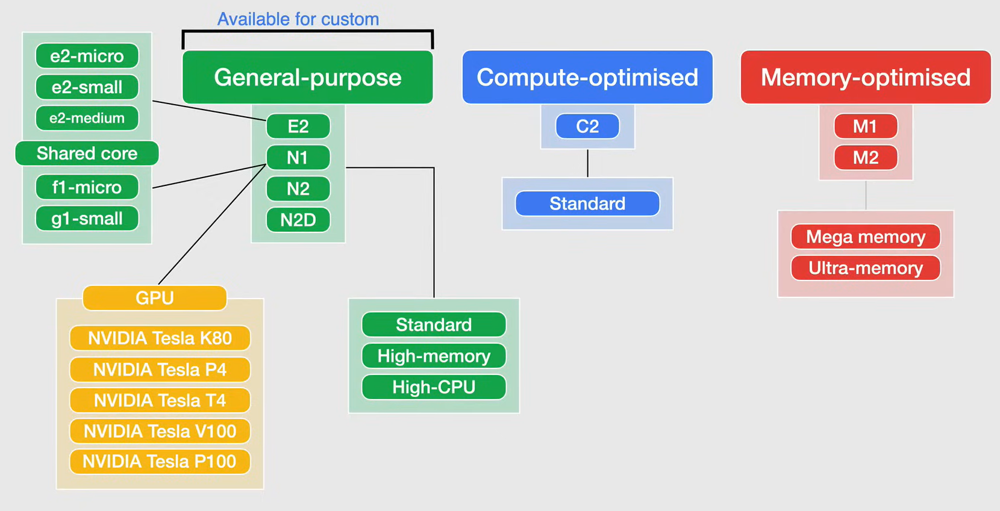
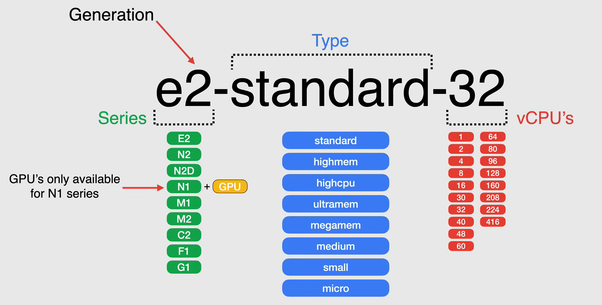
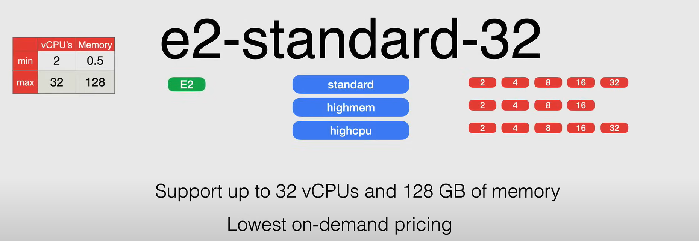
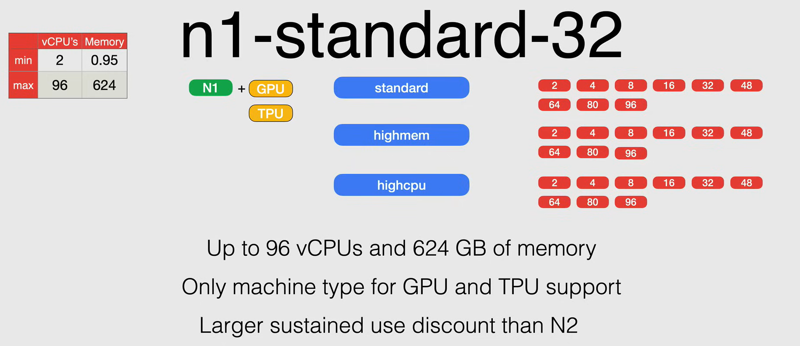
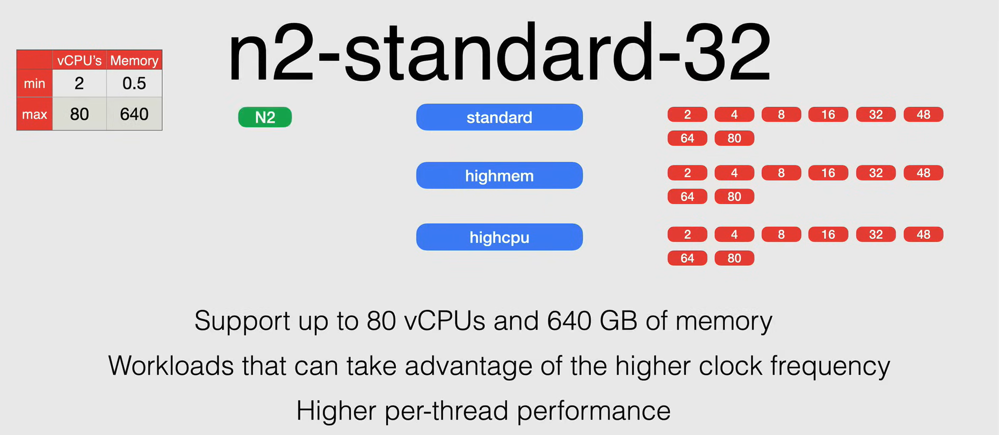
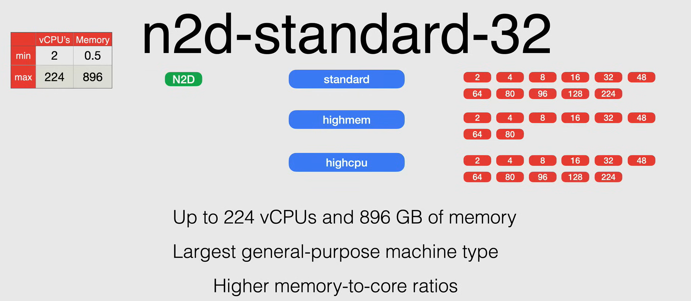
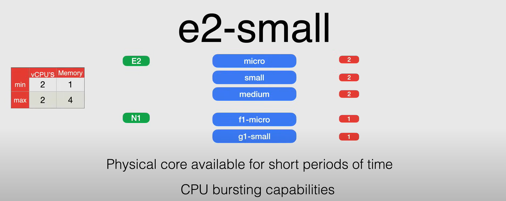
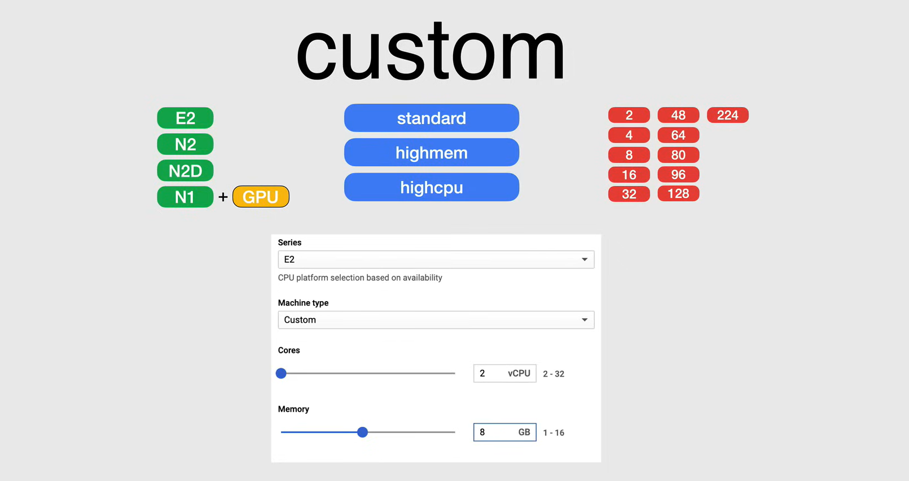
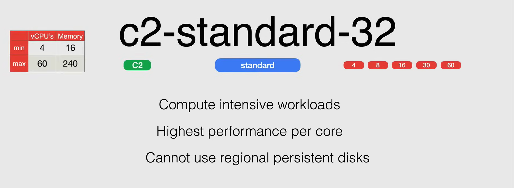
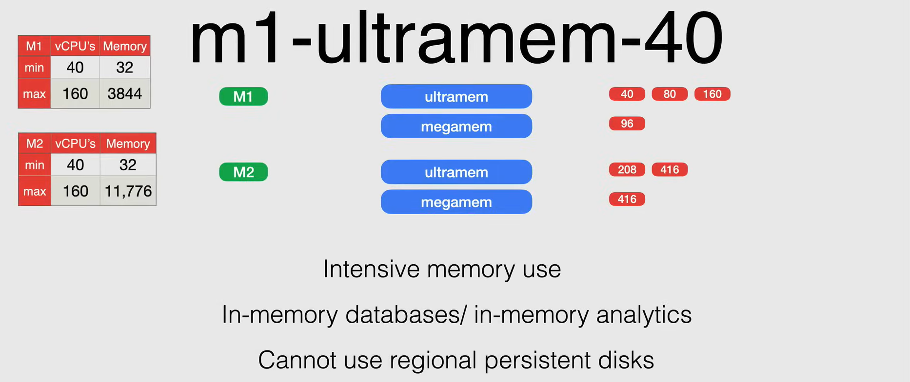

# Compute Engine Machine Types

A **machine type** is a set of virtualized hardware resources available to a virtual machine (VM) instance, including the system memory size, virtual CPU (vCPU) count, and persistent disk limits.

In Google Cloud, machine types are grouped and curated by families for different workloads. The machine type families include:

- **General-purpose**: Balanced CPU and memory resources.
- **Memory-optimized**: High memory-to-CPU ratio.
- **Compute-optimized**: High CPU-to-memory ratio.

If you need a more granular control over the resources, you can create a **custom machine type**.

The machine type identifier is composed of the following parts:

- **Series**: The series of machine types that the machine type belongs to.
  - The number after the series letter indicates the **generation** of the machine type.
- **Machine type**: The machine type within the series.
- **Number of vCPUs**: The number of vCPUs that the machine type provides.

For example, the machine type `e2-standard-32` belongs to the `E2` series, has `32` vCPUs, and is a `standard` machine type.

**NOTE:** The GPU are available only for the `N1` machine types.

## General-purpose Machine Types

The general-purpose machine types are suitable for a variety of workloads, including web servers, small databases, and development environments.

The general-purpose machine types are grouped into three machine type families:

- **Standard**: The standard machine types provide a balance of CPU and memory resources.
- **High-memory**: The high-memory machine types provide more memory relative to the number of vCPUs.
- **High-CPU**: The high-CPU machine types provide more vCPUs relative to the amount of memory.

The general-purpose machine types are grouped into the following series:

- **E2**
  - *They are designed for a day-to-day computing at a lower cost*. The E2 series provides a *cost-optimized* option for running general-purpose workloads.
  - Some use cases for the E2 series include:
    - Web Serving
    - App Serving
    - Back Office Applications
    - Small/Medium Databases
    - Microservices
    - Virtual Desktops
    - Development Environments

  - They offer a sizing between 2 to 32 vCPUs and 0.5 to 128 GB of memory.  

    

- **N**-series
  - *They are designed for balanced price/performance across a wide range of VM shapes*.
  - Some use cases for the N-series include:
    - Web Serving
    - App Serving
    - Back Office Applications
    - Medium/Large Databases
    - Caching
    - Media/Streming
  
  - **N1**: The N1 series are the first generation of general-purpose machine types.
    - They offer a sizing between 2 to 96 vCPUs and 0.95 to 624 GB of memory.
    - This is the only series that supports GPUs and TPUs.
    - They have a larger sustained use discount than the N2 series.
  
    

  - **N2**: The N2 series are the second generation of general-purpose machine types.
    - They offer a sizing between 2 to 80 vCPUs and 0.5 to 640 GB of memory.
    - They offer an overall performance improvement over the N1 series.
    - Workloads that can get higher per thread performance while benefiting from all the flexibility that a general purpose machine type provides.
    - They offer the extended memory feature, which allows you to create VMs with more memory than the standard memory configurations.

    

  - **N2D**: The N2D series are the second generation of general-purpose machine types with local SSDs.
    - They offer a sizing between 2 to 224 vCPUs and 0.5 to 896 GB of memory.

    

### Shared-core Machine Types

The shared-core machine types are suitable for running burstable workloads, cost-effective, non-resource-intensive applications.

They use **context switching** to share a physical core between vCPUs for the purpose of multitasking. Different shared core machine types sustains different amount of time on a physical core, which allows Google Cloud to cut the price.

Shared-core instances can be more cost effective for running small, non-resource-intensive applications than standard, high-memory, or high-CPU machine types.

These shared-core machine types offer bursting capabilities, that allow instances to use additional physical CPU for short periods of time when required by the workload.

Bursting happens automatically when your instance requires more physical CPU than it is allocated. During the spike, your instance will take advantage of available physical CPU in bursts.

The `E2` shared-core machine types are offered in:

- `e2-micro`
- `e2-small`
- `e2-medium`

While the `N1` shared-core machine types are offered in:

- `f1-micro`
- `g1-small`

All of these machine types have a maximum of 2 vCPUs and 4 GB of memory.

### Custom Machine Types

Custom machine types allow you to create a machine type that is tailored to your workloads. You can specify the number of vCPUs and the amount of memory for the custom machine type.

They cost more than predefined machine types, and there are some limitations in the amount of memory and vCPUs that you can use.

When creating a custom machine type, you can choose between `E2`, `N1`, and `N2` series.

### Available GPUs

The GPUs are available only for the `N1` machine types. The available GPUs are:

- **NVIDIA Tesla K80**
- **NVIDIA Tesla P4**
- **NVIDIA Tesla T4**
- **NVIDIA Tesla V100**
- **NVIDIA Tesla P100**

## Compute-optimized Machine Types

The compute-optimized machine types are suitable for compute-bound applications that benefit from high-performance processors.

The compute-optimized machine types are grouped into the following series:

- **C2**
  - *They are designed for high-performance computing workloads*.
  - Some use cases for the C2 series include:
    - High-Performance Computing
    - Electronic Design Automation
    - Gaming
    - Single-threaded applications

  - They offer a sizing between 4 to 60 vCPUs and 16 to 240 GB of memory.
  - High-performance per core
  - *Cannot use regional persistent disks*
  - *They are available in specific regions only.*

    

## Memory-optimized Machine Types

The memory-optimized machine types are suitable for memory-intensive workloads, such as in-memory databases and real-time data processing.

The memory-optimized machine types are grouped into the following series:

- **M**-series
  - *They are designed for memory-intensive workloads*.
  - Some use cases for the M-series include:
    - Large In-memory Databases, like SAP HANA
    - In-memory Analytics
  - *Cannot use regional persistent disks*
  - *Available in specific regions only.*
  - Only available as predefined machine types.

  - **M1**: The M1 series are the first generation of memory-optimized machine types.
    - They offer a sizing between 40 to 160 vCPUs and 32 to 3844 GB of memory.

  - **M2**: The M2 series are the second generation of memory-optimized machine types.
    - They offer a sizing between 40 to 160 vCPUs and 32 to 11.776 GB of memory.

    