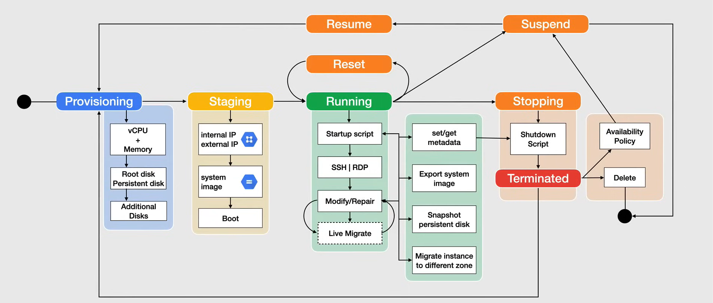
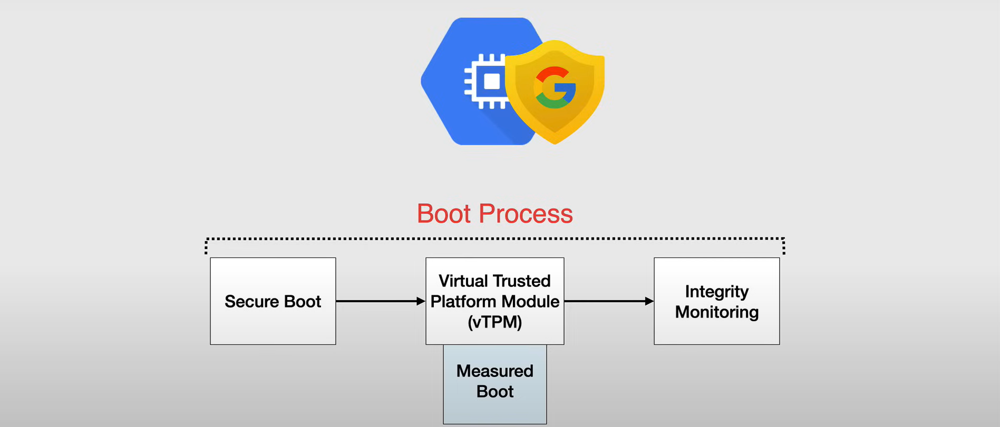
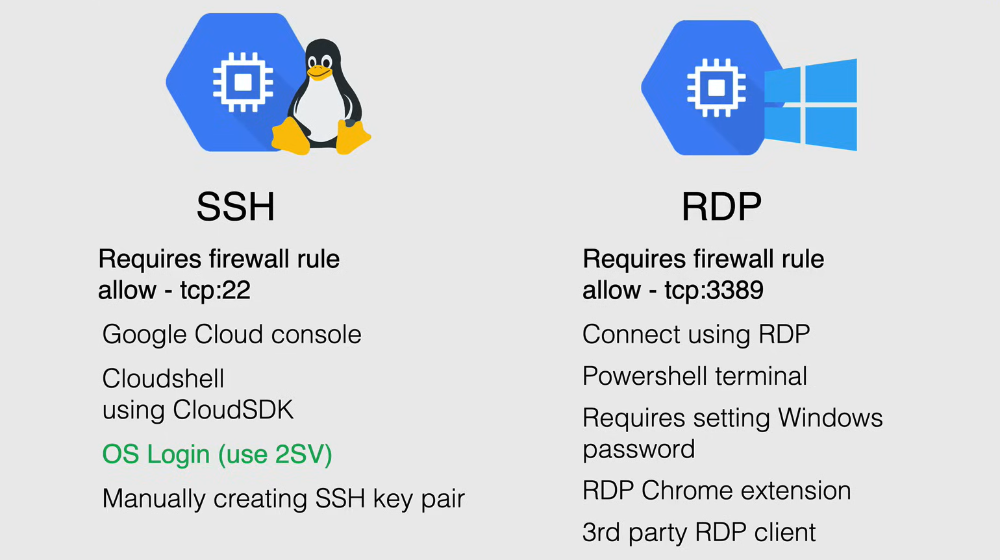
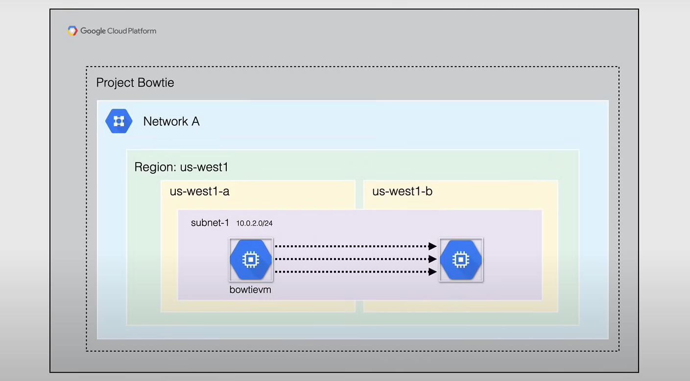

# Managing Instances

**NOTE:** This is a big topic in the exam.



Every instance has a predefined lifecycle from its starting provisioning state to its deletion.

The instance can transition between many states.

1. **Provisioning**: When you first create an instance, **Compute Engine** provisions resources to start the instance.

2. **Staging**: After the instance is provisioned, the instance enters the staging state. In this state, the instance is prepared for booting, and finally boots up.

3. **Running**: After it boots up, the instance enters the running state. In this state, the instance is running and can be accessed. During its lifetime, a running instance can be repeatedly stopped and restarted, or suspended and resumed.

4. **Terminated**: When you delete an instance, the instance enters the terminated state. In this state, the instance is shut down and the resources used by the instance are released.

## Provisioning

In this state the resources are being allocated for the instance.

The instance is not yet running and is being allocated its requested amount of CPU and memory, along with its root disk and any additional disks that are attached to it (if any).

In term of cost, while in the provisioning state, there are no costs that are being incurred.

## Staging

After finishing the provisioning state, the instance enters the staging state.

In this state the resources have been acquired and the instance is being prepared for booting.

Both internal and external IP addresses are being assigned to the instance, and they can be both static or ephemeral.

In the system image that was originally chosen for this instance, is used to boot up the instance, and this can be either a public image or a custom image.

In term of cost, while in the staging state, there are no costs that are being incurred.

### Boot


#### Shielded VMs

When creating an instance, you have the option of using shielded VMs, for added security, and when using them the instance would instantiate them as the instance boots and enters into the running state.

Shielded VMs provide verifiable integrity of your VM instances, so you can ensure that your instances haven't been compromised by boot or kernel-level malware or rootkits.



This is achieved through a four-step process, which is covered by:

- **Secure Boot**
  - This helps to ensure that the system only runs authentic software by verifying the digital signature of all boot components, and stopping the boot process if signature verification fails.
  - Shielded VMs run firmware that is signed and verified suing Google's Certificate Authority.
  - On each and every boot component that isn't properly signed at all, is not allow to run.
- **Virtual Trusted Platform Module (vTPM)**
  - Used to protect the integrity of the VM instance in the Measured Boot process.
  - A specialized chip that can store cryptographic keys and measurements.
- **Measured Boot**
  - Creates the integrity policy baseline for the first set of measurements and stores them.
  - Each time the VM boots, the measurements are taken and compared to the baseline, in the next step.
- **Integrity Monitoring**
  - Allow to determine if there have been changes to a VM instance's boot sequence, and this policy is loaded onto a vTPM

## Running

When the instance has left the staging state, it enters the running state.

In this state the instance is running and can be accessed, either using SSH or RDP, within a short period due to any startup scripts or any boot maintenance tasks for the OS.

### Startup Scripts


When an instance is starting up, you can run a script that will be executed on the instance, this is called a **startup script**.

#### Metadata Server

Compute Engine provides a method for storing and retrieving instance metadata, in the form of the metadata server.

This service provides a central point to set metadata in the form of key-value pairs, which is then provided to virtual machines at runtime.

You can query the metadata server from within the instance programmatically using the Compute Engine API. This is great for use startup and shutdown scripts.

Metadata can be assigned to a project, as well as to an instance, and project metadata propagates to all instances in the project.


**NOTE:** When you make a request to get information from the metadata server your request and the subsequent response never leaves the physical machine that the instance is running on.

#### Guest Environment

When you start a Vm instance, using Google provided public images, a **guest environment** is installed on the instance, i.e. a set of scripts, daemons, and binary that read the content of the metadata server to make a virtual machine run properly on Compute Engine.

A **metadata server** is a communication channel for transferring information from a client to the guest OS.

VM instances created using Google provided public images have the guest environment installed by default.

Creating a VM instance using a custom image, you must install the guest environment yourself. It is available for both Linux and Windows operating systems, and each OS requires a specific guest environment package.

In term of Linux guest environment, it either built by Google or of the owner of the OS, and there are some key components that are applicable to all builds, for example a base component of a Linux guest environment is the `python` package.

With Windows guest environment, a similar approach applies where a package is available with main scripts and binaries as a part of the guest environment.

### SSH - RDP


When the instance has booted and has gone through the startup scripts, you can access the instance using SSH or RDP.

There are some different methods to access both to Linux and Windows instances.



#### Linux

For Linux instances, you can use SSH to access the instance on port 22.

**NOTE:** We need a firewall rule to allow SSH traffic to the instance.

To connect to a Linux instance, you can use the `gcloud` command-line tool, or the `ssh` command.

```bash
gcloud compute ssh INSTANCE_NAME
```

```bash
ssh USERNAME@EXTERNAL_IP
```

Google Cloud recommends using the OS login feature, over using SSH keys, as it is more secure, because lets you use Compute Engine IAM roles to manage SSH access to Linux instances.

#### Windows

For Windows instances, you can use RDP to access the instance on port 3389.

**NOTE:** We need a firewall rule to allow RDP traffic to the instance.

To connect to a Windows instance, you can use the `gcloud` command-line tool, or the `mstsc` command.

```bash
gcloud compute rdp INSTANCE_NAME
```

```bash
mstsc /v:EXTERNAL_IP
```

it requires to set a Windows password, and it can be done either to the console or with command line.

### Modify/Repairs


When your instance is booted up and you are logged in, you have the option of modifying the instance, and it can be done manually, by modifying it on the fly, or by stopping the instance and then modifying it.

### Live Migration

When you want to migrate an instance to a different zone in the same region, this isn't possible without shutting down the instance, using a feature called **Live Migration**.



With Live Migration, Compute Engine migrates your instances to another host in the same zone instead of requiring your instances to be rebooted. This allow Google to perform maintenance reliably, without interrupting any of your VMs.

When a VM is scheduled to be live migrated, Google provides a notification to the guest that a migration is coming soon.

Live Migration keeps your instances running during compute engine hosts that are in need of regular infrastructure maintenance and upgrades, replacement of failed hardware and system configuration changes.

When Google migrates a running instance, from one host to another, it moves the complete instance state from the source to the destination, in a way that is transparent to the guest OS and anyone communicating with it.

Google also gives the option of doing live migration manually, from one zone to another within the same region, either using the console or the `gcloud` command-line tool.

```bash
gcloud compute instances move INSTANCE_NAME --zone=ZONE --destination-zone=ZONE
```

**NOTE:** *Instances with GPUs attached cannot be live migrated.*

## Reset

During the running state, you can **Reset** your instance, and this is where you would wipe the memory contents of the VM instance and reset the Virtual Machine to its initial state. Resetting an instance causes an immediate hard reset of the VM and therefore, the VM does not do a graceful shutdown for the guest OS. However, the VM retains all persistent disk data, and none of the instance property change.
So, the instance remains in the running state.

During the running state, a repair operation can happen due to the instance encountering an internal error, or the underlying machine is unavailable due to maintenance or other reasons.

During this time the instance is unusable, and if the repair is successful the instance returns to the running state.

In term of cost, this state is where the instance starts to incur them, and is related to the resources that are being used by the instance.

## Suspending

When you are **suspending** an instance, it is like closing the lid of a laptop, this will preserve the OS memory and otherwise, the application state will be discarded.

From this state you can resume the instance, and it will be in the same state as it was before it was suspended, or to delete the instance.

## Stopping

When you are **stopping** an instance, either a user has made a request to stop the instance, or the instance has been stopped due to an internal error.

This is a temporary status and the instance will move to terminated.

In term of cost, when suspending or stopping an instance, you pay for the resources that are being used by the instance, such as the static IP and the persistent disk, but you do not pay for the CPU and memory.

Ephemeral external IP addresses are released when the instance is stopped, and they will be reassigned when the instance is started again.

## Terminated

The instance enters the **terminated** state when the user has requested to shut down the instance, or the instance has been stopped due to an internal error.

The user can choose to restart or to delete the instance, and this will release the resources that are being used by the instance, such as the CPU, memory, and the persistent disk.

In term of cost, when the instance is in the terminated state, you still pay for the static IP and the persistent disk, but you do not pay for the CPU and memory.