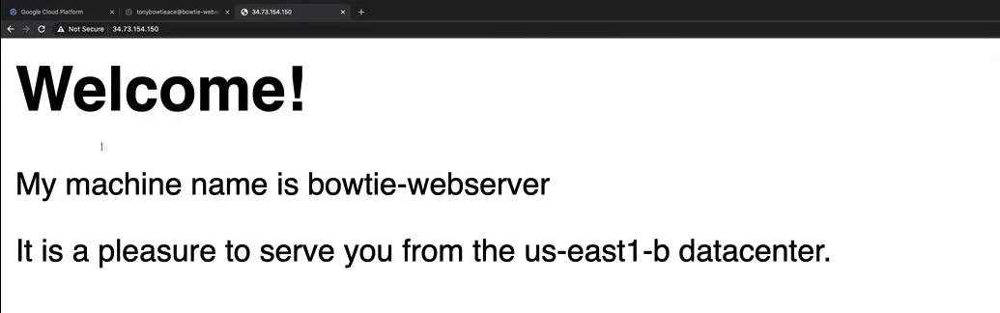

# Metadata and Startup Scripts

## Demo

A video demo of this lab is available [here](https://youtu.be/jpno8FSqpc8?si=zadNq84nxbJn46ly&t=40994).

### Metadata

**NOTE:** Metadata can be assigned to a specific instance or to a project.

- To assign metadata to a project, you can go on the **Metadata** section of the **Compute Engine** page in the GCP Console.
- To assign metadata to a specific instance, you can go to the **Details** page of the instance and click on the **Edit** button.

First, let's create a new instance. But before that, ensure that you have a default VPC network created.

1. Go to the **Compute Engine** page in the GCP Console.
2. Go to the **VM instances** tab.
3. Click on the **Create** button.
    - **Name**: `bowtie-webswerver`
    - **Region**: `us-east1`
    - **Zone**: `us-east1-b`
    - **Machine type**: `e2-micro`
    - **Identity and API access**
       - **Service account**: `Compute Engine default service account`
       - **Access scopes**: `Set access for each API`
         - **Compute Engine**: `Read/Write`
    - Leave the rest of the settings as default.
 
    - **NOTE:** Under the section **Management, security, disks, networking, sole tenancy**, you can set the **Metadata** for the instance.

4. Click on the **Create** button.

Now we can start querying the metadata server, from the instance, because the metadata server is only accessible from within the instance.

So, log in to the instance clicking on the **SSH** button.

#### Instance Metadata

To query the metadata server, we use `curl` command, which is a command-line tool for transferring data with URLs.

```bash
curl -H "Metadata-Flavor: Google" http://metadata.google.internal/computeMetadata/v1/instance/

# Output:
# attributes/
# cpu-platform
# description
# disks/
# guest-attributes/
# hostname
# id
# image
# legacy-endpoint-access
# license/
# machine-type
# maintenance-event
# name
# network-interfaces/
# preempted
# remaining-cpu-time
# scheduling/
# service-accounts/
# tags
# virtual-clock/
# zone
```

**NOTE:**

- When we query the metadata server, we need to specify the `Metadata-Flavor: Google` header, otherwise, the request will be rejected.
- If the metadata is not an endpoint, we need to put a `/` at the end of the URL, because it is a directory.

#### Project Metadata

Instead, if we want to query project-wide metadata, we can use the following command:

```bash
curl -H "Metadata-Flavor: Google" http://metadata.google.internal/computeMetadata/v1/project/

# Output:
# attributes/
# numeric-project-id
# project-id
```

#### Custom Metadata

To create custom metadata with the `gcloud` command, we can use the following command:

```bash
gcloud compute instances add-metadata <PROJECT_ID> --metadata <custom-key>=<custom-value> --zone <ZONE>
```

We can also query custom metadata, from the `attributes` directory, using the following command:

```bash
curl -H "Metadata-Flavor: Google" http://metadata.google.internal/computeMetadata/v1/instance/attributes/

# Output:
# custom-key
```

```bash
curl -H "Metadata-Flavor: Google" http://metadata.google.internal/computeMetadata/v1/instance/attributes/custom-key

# Output:
# custom-value
```

### Startup and Shutdown Scripts

Compute Engine lets you create and your own startup and shutdown scripts on your instances.

This allows you to perform automation, that perform actions when starting up such as installing software, performing updates, etc.

When shutting down, you can allow instances to clean up resources, save data, etc.

1. Go to the **Compute Engine** page in the GCP Console.
2. Go to the **VM instances** section.
3. Click on the **bowtie-webswerver** instance and then click on the **Edit** button.
4. Under the section **Firewalls**, check the box **Allow HTTP traffic** and **Allow HTTPS traffic**, to allow the display of the Apache web server.
5. Scroll down to the **Custom metadata** section.
6. Click on the **Add item** button.
    - **Key**: `startup-script`
    - **Value**:

        ```bash
        #! /bin/bash
        NAME=$(curl -H "Metadata-Flavor: Google" http://metadata.google.internal/computeMetadata/v1/instance/name)
        ZONE=$(curl -H "Metadata-Flavor: Google" http://metadata.google.internal/computeMetadata/v1/instance/zone | sed 's@.*/@@')
        apt-get update
        apt-get install -y apache2
        cat <<EOF> /var/www/html/index.html
        <body style="font-family: sans-serif">
        <html><body><h1>Welcome!</h1>
        <p>My machine name is $NAME</p>
        <p>It is a pleasure to serve you from the $ZONE datacenter.</p>
        </body></html>
        EOF
        ```

        - **NOTE:** In the bash script we are pulling in a variable `NAME` which will query the metadata server for the instance name and `ZONE` which will query the metadata server for the instance zone. Then we install an Apache web server and create an `index.html` file with a welcome message and the instance name and zone.

7. Click on the **Save** button.
8. After a few seconds, click on **Reset** button to restart the instance to run the startup script.
    - **NOTE:** **Do not do this if you are running a production instance**, as it does not do a clean shutdown.

To test the startup script, copy the **External IP** of the instance and paste it into a new browser tab.



Another way to use the startup script is to pull it in from a Cloud Storage bucket.

1. Go to the **Storage** page in the GCP Console.
2. Open the **Browser** section.
3. Click on the **Create bucket** button.
    - **Name**: `bowtie-webserver-site`
    - Leave the rest of the settings as default.
4. Click on the **Create** button.
5. Click on the **Upload files** button, and upload the `bowtie-startup-final.sh` file.
6. Once the file is uploaded, click on the file and copy the **URI**.

7. Go back to the **Compute Engine** page.
8. Click on the instance and then click on the **Edit** button.
9. Scroll down to the **Custom metadata** section.
10. Remove the `startup-script` key and value.
11. Click on the **Add item** button.
    - **Key**: `startup-script-url`
    - **Value**: `<URI>`
12. Click on the **Save** button.

Now reset the instance to run the startup script.