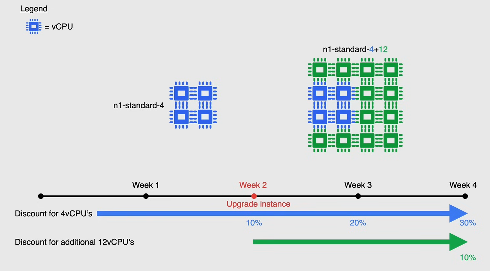

# Compute Engine Billing

The instances are charged by the second after the first minute of usage.

- Each vCPU and each GB of memory on Compute Engine is **billed separately**, rather than as a part of a single machine type.
- All vCPUs, GPUs, and GB of memory are **charged by the second** with a **minimum of 1 minute**.
  - For example, if you run your virtual machine for 30 seconds, you will be charged for 1 minute of usage. After one minute, instances are charged in 1-second increments.
- The **Instance uptime** is the number of seconds between when you start an instance and when you stop an instance (`TERMINATED` status).
  - if the instance is idle, but still has a status of `RUNNING`, you are still charged for the instance uptime.

## Reservations

Reservations are designed to reserve the VM instances you need in advance, so you can use them when you need them.

- Ensuring resources are **available for when you need it.**
  - During the creation process you can choose how a reservation process it to be used, for example you can choose for a reservation to be automatically applied to any or existing VM instances, **that match the reservation properties**, or you can specify that reservation to be consumed by a specific VM instance.
- Reservation are great to ensure that your oroject has resources for:
  - Future increases in demand
  - Planned or unplanned spikes in usage
  - Backup and disaster recovery scenarios
  - Buffer when you are planning growth

When you no longer need the reservation, you can release it and stop being charged for it.

Reservations are charged like normal VMs, i.e. based on existing on-demand rates which **include sustained use and committed use discounts**.

Purchasing a reservation comes with some caveats:

- They apply only to Compute Engine, Dataproc, and Google Kubernetes Engine (GKE) VM instances.
- They do not apply to Shared-core machine types, preemptible VM instances, or sole-tenant nodes, Cloud SQL and Dataflow.

## Discounts Types

As mentioned before, each vCPU and each GB of memory on Compute Engine is billed separately, rather than as a part of a single machine type, and is billed as individual CPUs and memory used per hour.

Resource-based pricing allows Compute Engine to offer discounts for sustained use and committed use.

There are three types of discounts:

- **Sustained use discounts**
- **Committed use discounts**
- **Preemptible VM instances**

### Sustained Use Discounts

Sustained use discounts are automatic discounts that you get for running a VM instance for a significant portion of the billing month.

For example when you run on of these instances for more than 25% of the month, you get a discount.

The following table shows the discount rates for sustained use:

Sustained use discounts are applied automatically to VMs created by both GKE and Compute Engine, as well they do not apply to VMs created by using App Engine flexible environment, Dataflow, and E2 machine types.

Subsequent discounts are applied on incremental use, after you reach certain usage thresholds, this mean that you pay only for the number of minutes that you use an instance and Compute Engine automatically gives you the best price.

Now, consider a scenario where you have two instances or sole-tenant nodes in the same region that have different machine types and run at different times of the month.
Compute Engine breaks down the number of vCPUs and memory used across all instances that use predefined machine types and combines the resources to qualify for the largest sustained usage discount possible.

In the following example, assume you run the following two instances in the same region (e.g. us-east1) for the entire month.

For the first half of the month, you run a `n1-standard-4` instance (4 vCPUs, 15 GB of memory).

For the second half of the month, you run a `n1-standard-16` instance (16 vCPUs, 60 GB of memory).

In these scenarios, Compute Engine re-organizes these machines types into individual vCPUs and memory, and combines their usage to create the following resources for vCPUs and memory.

Because 4 vCPUs being used for the entire month, discount here would be 30%, the additional 12 vCPUs are added on week 2 of the month, so the discount would be 10%.

### Committed Use Discounts

Committed use discounts are discounts that you get for committing to use a specific amount of resources for a specific period of time.

- Purchased **1 year or 3 years contracts** in return for deeply discounted prices.
  - Comprised of vCPUs, memory, GPUs, and local SSDs.
- They are ideal for workloads with a predictable resource needs.
- Discount is up to 57% for most resources.
- With memory-optimized machine types, you can save up to 70%.
- When you purchase a committed use contract, it can be applied at the project level, as well as share discounts across multiple projects.

There are some caveats to committed use discounts:

- Shared-core machine types are excluded.
- You can purchase committed use contracts only on a per-region basis.
- If a reservation is attached to a committed use discount, the reservation can't be deleted until the committed use discount expires.
- To purchase a committed for GPUs, or local SSD, you must purchase a general purpose N1 commitment.
- After you create a commitment, you can't delete it.

### Preemptible VM Instances

Preemptible VM are up to 80% cheaper than standard instances.

Pricing is fixed and will not change during the life of the instance.

A preemptible VM is an instance that you can create and run at a much lower price than normal instances, however, **Compute Engine might stop (preempt) these instances if it requires access to those resources for other tasks.**

Compute Engine generally avoids preempting instances, but it doesn't use an instant CPU usage or other behavior whether or not to preempt it.

If you accidentally spin up a preemptible VM, and you want to shut it down, there is no charge if it's running for less than 10 minutes.

**NOTE** (Important for the exam):

- A crucial characteristic of preemptible VMs is that Compute Engine **always terminates (preempts) these instances after they run for 24 hours.**
- Preemptible VMs **can't be live migrated** to another host, and they **can't be automatically restarted**.
- **Use Preemptible VMs when your application is fault-tolerant and can withstand possible instance preemptions.**
  - For example, if you are running a batch processing job, you can use preemptible VMs to save money.
  - Since containers are naturally stateless and fault-tolerant, they are a good fit for preemptible VMs. So running preemptible VMs in a Kubernetes Engine cluster is a good use case.