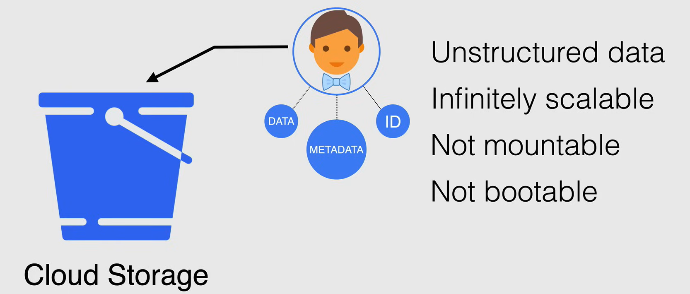

# Storage Fundamentals

## Types of Storage

There are three types of storage in Google Cloud Platform:

1. **Block Storage**: If you look for high performance storage.
2. **File Storage**: If you looking for share files across multiple systems, or have multiple applications that need to access the same files and directories.
3. **Object Storage**: If you are looking to store terabytes of data for your web
applications, and you don't to worry about scaling.

### Block Storage

**Block storage** (or Block level storage) is a technology that is used to store data files on storage systems or cloud-based storage environments. 

It is the **fastest available storage** type and it is also efficient and reliable.

With Block Storage, the files are **split into evenly sized blocks of data**, each with own **unique identifier**. 

It is presented to the OS as structureless raw data in the form of logical volume or a hard drive, and the OS structures it with a file system like EXT3, or EXT4 on Linux, or NTFS on Windows. It would then mount this volume or drive as the root volume in Linux or the `C:`, or `D:` drive in Windows.

Block Storage is usually delivered on physical media in the case of Google CLoud it is delivered as either spinning *hard disk drives (HDD)* or *solid-state drives (SSD).*

**NOTE:** Block Storage volume can be used as your boot volume.

### File Storage

**File storage** (or File level storage, File based storage) is presented to the user and applications as a file system, i.e. they receive data through directory trees folders and files.

The structure has already been applied and cannot be adjusted after the fact. This type of structure only has the capability of being **mountable**, but **not bootable**.

**NOTE:** You cannot install an OS on a file storage system, but you can store files, documents, images, videos, and other data.

Due to the structure of the file system, the service that is serving the file system has some underlying software that can handle access rights, file sharing, file locking and other controls related to file storage.

In Google Cloud the service that serves file storage is called **Cloud Filestore**, and it is usually presented over the network to users in your VPC network using the **NFSv3** protocol.

### Object Storage

**Object storage** is a general terms that refers to the way in which we organize and work with units of storage called objects.

This is a storage type that is a flat collection of **unstructured data**, and this type of storage holds no structure or hierarchy, and it is made up of three characteristics:

1. **Data**: The actual data that is stored in the object, like a file, image, video, or document.
2. **Metadata**: The data about the data, like the file name, file size, file type, and other information.
3. **Unique Identifier**: A unique identifier that is used to access the object.

This allows object storage to be **scalable**, as it doesn't matter where the object is stored. This type of storage can be found on Google Cloud in the form of **Cloud Storage**.

Cloud Storage is a flat storage system with a logical container called a **bucket**. Buckets are used to store objects, and objects are stored in buckets.

Although this type of storage is **not bootable** (and **not mountable**), using an open-source tool called **Filestore FUSE**, that storage type can be mounted in Google Cloud.

## Storage Performance Terms

To define the performance of storage, we can use different terms.

- **I/O**: It is a single read or write operation to a storage device, and it can be measured in block sizes (like 4KB, 8KB, 16KB, etc.).
- **I/O Queue Depth**: It is the number of I/O operations that are waiting to be processed by the storage device. The request are queued when they are requested faster than the storage device can process them.
- **IOPS (Input/Output Operations Per Second)**: It is the number of I/O operations that can be performed by the storage device in one second. It is a common performance measurement used with storage devices.
- **Throughput**: It is the amount of data that can be transferred from one place to another in a given amount of time. It is usually measured in MB/s or GB/s.
- **Latency**: It is the measurement of delay between the time data is requested and the time the data is received. It is usually measured in milliseconds (ms).

Finally we have:

- **Sequential Access**: It is the process of reading or writing data in sequential order, like reading a book from the first page to the last page.
- **Random Access**: It is the process of reading or writing data in a non-sequential order, like reading a book by jumping from one page to another. It is much slower than sequential access.

