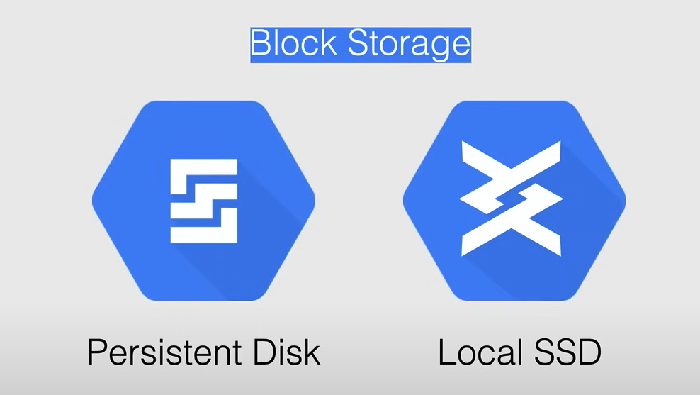
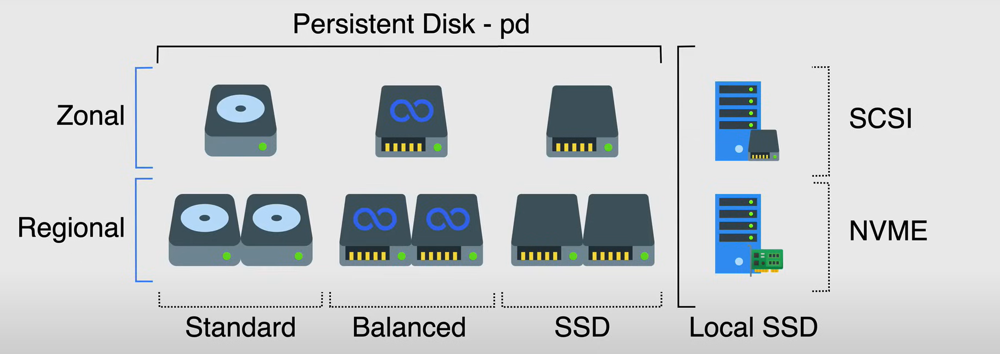
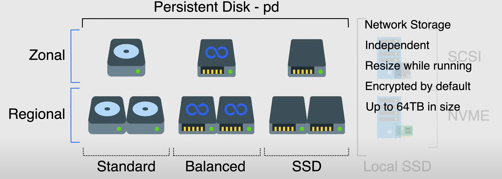
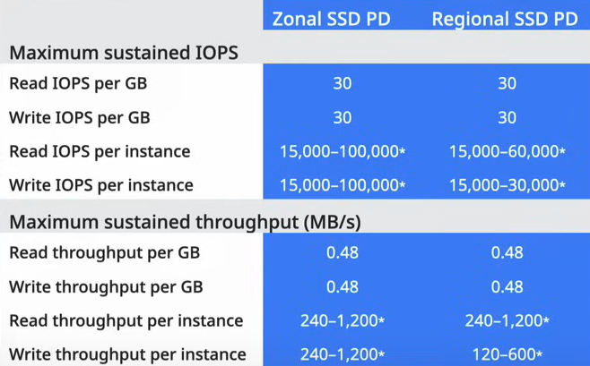
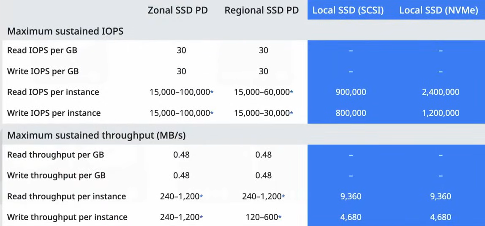

# Persistent Disk and Local SSDs

Persistent Disk and Local SSDs are the two types of block storage devices that are available in Google Cloud Platform.

By default each Compute Engine instance comes with a boot disk that is a *persistent disk*. This disk is used to store the OS and the applications that are installed on the instance. 

When you required additional storage space, you can add one or more persistent disks or local SSDs to the instance.

Persistent disks and Local SSDs comes in different types, and they are available in both zonal and regional configurations.

## Persistent Disks

Persistent Disks are durable and high-performance block storage devices that are used to store data.

- They are **not physically attached to the instance**, but they are network-attached storage devices that are accessible from the instance.

- So, they are *independent* of the instance, and they can persist even if the instance is deleted (turning on the appropriate flag during creation).
  - You can also detach the disk and move it to another instance when you need to.

- *Scaling* persistent disks can be done automatically and ***on the fly***, by using the disk resizing feature, without downtime and even add additional disks to your instance for additional performance and storage.

- They are ***encrypted by default***, and Google gives you the option to use custom keys for encryption.

- Each persistent disk can be up to 64 TB in size, and most instances can have up to 128 of persistent disks and up to 257 TB of total disk space attached to them.

**NOTE:** Shared-core machine types can have up to 16 persistent disks and 3 TB of total disk space attached to them.

For Persistent Disks, there are two geographic options available:

- **Zonal Persistent Disks**: These disks are available in one zone and one region.
  - These disks are the most commonly used disks and are used by instances in the same zone.
  - They are *redundant within the same zone*, but they are not replicated across zones.
    - So, they are *subject to data loss* if the zone fails.
  - They can be used with any machine type.

- **Regional Persistent Disks**: These disks are replicated across multiple zones in a region and can be used by instances in any of those zones.
  - They provide durable storage and *replication of data between two zones in the same region*.
  - If you are designing systems that require *high availability*, you should use regional persistent disks, combined with snapshots for durability.
  - They are designed to work with regional managed instances groups, in the unlikely event that a zone fails, you can usually fail over your workloads running regional persistent disks to another zone by using the `force attached` flag.
  - They are *slower than zonal* persistent disks because of the replication that is happening between the zones.

**NOTE:** 

- *Standard Regional Persistent Disks have a 200 GB size minimum.*
- *You can't use Regional Persistent Disks with memory-optimized machine types or compute-optimized machine types.*

There are three types of persistent disks available in Google Cloud Platform:

- **Standard** (`pd-standard`): This is the default disk type that is used for general-purpose storage. It is a magnetic disk that is used for storing data that is not accessed frequently.
  - Backed by standard hard disk drives (*HDDs*).
  - *Cost-effective* and ideal for workloads that are not I/O intensive.
    - Lowest priced persistent disk option.
  - Great for large data processing workloads that primarily use *sequential I/O*.
  - Performance:
    - Throughput and IOPS depend on the size of the disk, the number of vCPUs, etc.
    - Zonal PD has an higher Read IOPS than Regional PD, because the latter has to access data from two different disks, in two different zones.

- **Balanced** (`pd-balanced`): This disk type is used for workloads that require a balance between performance and cost. It is a solid-state disk that is used for storing data that is accessed frequently.
  - Alternative to SSD persistent disks that balances performance and cost.
  - It has the same maximum IOPS as SSD PD, but lower IOPS per GB.
  - They are general purpose.
  - Price in between Standard and SSD persistent disks.

- **SSD** (`pd-ssd`): This disk type is used for workloads that require high performance and low latency. It is a solid-state disk that is used for storing data that is accessed frequently.
  - Great fot enterprise applications and high-performance databases that demand lower latency and more IOPS.
  - Single digit millisecond latency.
  - They are the faster and more expensive option.

 

## Local SSDs

Local SSDs (`local SSD`) are high-performance block storage devices that are physically attached to the instance.

They have higher throughput and lower latency than persistent disks.

Data on local SSDs persists until instance is stopped or deleted.

Each local SSD is 375 GB in size, but you can attach a maximum of 24 local SSDs to an instance, for a total of 9 TB of local SSD storage.

They are great when you need a fast scratch disk or a cache, and you don't want to use instance memory.

They are available in two flavors:

- **SCSI**:
  - It is an older protocol and made specifically for Hard Drives.
  - It is has the limitation of having one queue for commands.

- **NVMe**:
  - It is a newer protocol and made specifically for SSDs.
  - It has the advantage of having multiple queues (up to 64K), and each queue can have up to 64K commands.
  - It has an higher cost than SCSI.

You can't use customer supplied encryption keys with local SSDs, because Compute Engine automatically encrypts the data.

They are only available for `N1`, `N2`, and compute-optimized machine types.

In terms of performance, the throughput is the same between SCSI and NVMe, but the read/write IOPS are higher in NVMe.

## Performance Scaling

It pertains to block storage on Compute Engine instances.

Persistent disks performance scales with the size of the disk and with the number of vCPUs on your instance.

- *The performance scales linearly until it reaches either the limits of the volume or the limits of the instance.*

**NOTE:** An IO operation is a network operation, because the persistent disk is network-attached storage, so the CPU of the instance is used to process the IO operations.

- The recommendation by Google is to have one available vCPU for every 2000 to 2500 IOPS of expected traffic.