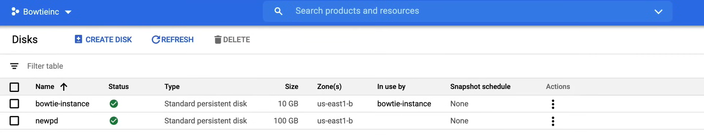

# Managing disks on Compute Engine

## Demo

A video demo of this lab is available [here](https://youtu.be/jpno8FSqpc8?si=-xtyglrJU4QiSTeQ&t=44512).

In this lab we will learn how to manage and interact with disks on Compute Engine.

### Create a VM instance

First, make sure to have the `default` VPC network created, and the necessary firewall rules to allow SSH traffic on port 22.

1. Go to the **Compute Engine** page.
2. Click on **VM instances** and then click on **Create**.
    - **Name:** `bowtie-instance`
    - **Labels:** `env: testing`
    - **Region:** `us-east1`
    - **Zone:** `us-east1-b`
    - **Machine Configuration:**
        - **Series:** `E2`
        - **Machine type:** `e2-micro`
    - **Identity and API access:**
        - **Service account:** `Compute Engine default service account`
        - **Access scopes:** `Set access for each API`
            - **Compute Engine API:** `Read/Write`
    - Leave the rest as default.
3. Click on **Create**.

### Create a disk

1. Go to the **Compute Engine** page.
2. Click on **Disks**, and we can see the disk of the instance we just created.
3. Click on **Create Disk**.
    - **Name:** `newpd`
    - **Description:** `New persistent disk`
    - **Type:** `Standard persistent disk`
    - **Region:** `us-east1`
    - **Zone:** `us-east1-b`
      - **NOTE:**
        - It must be in the same zone as the VM instance, to attach it.
        - To change in a regional disk, check `Replicate the disk within region`.
    - **Size (GB):** `100`
      - **NOTE:** Larger the disk size, the more IOPS it can handle.
    - **Labels:** `env: testing`
    - Leave the rest as default.



This can be done with command line as well:

```bash
gcloud compute disks create newpd --size=100GB --zone=us-east1-b
```

### Attach the disk to the VM instance

1. Go to the **Compute Engine** page.
2. Click on **VM instances**.
3. Click on the SSH button of the `bowtie-instance` VM instance.
    
    1. First list all Block devices:

        ```bash
        lsblk
        ```
    
    2. Attach the disk to the instance:

        ```bash
        gcloud compute instances attach-disk bowtie-instance --disk=newpd --zone=us-east1-b
        ```

    3. Check the state of the disk device:

        ```bash
        sudo file -s /dev/sdb

        # Output:
        # /dev/sdb: data
        ```

    4. To interact with the disk, we need to format it with a filesystem. We will use `ext4`:

        ```bash
        sudo mkfs.ext4 -F /dev/sdb
        ```
    
    5. We can check the disk again:

        ```bash
        sudo file -s /dev/sdb

        # Output:
        # /dev/sdb: Linux rev 1.0 ext4 filesystem data, UUID=...
        ```
    
    6. Now we can mount the disk:

        ```bash
        sudo mkdir /newpd
        sudo mount /dev/sdb /newpd
        ```
    
    7. We can check the disk again:

        ```bash
        lsblk

        # Output:
        # NAME   MAJ:MIN RM SIZE RO TYPE MOUNTPOINT
        # sda      8:0    0  10G  0 disk
        # └─sda1   8:1    0  10G  0 part /
        # sdb      8:16   0 100G  0 disk /newpd
        ```

### Interact with the disk

Now we can interact with the disk as a normal directory.

For example we can change the mount point:
    
```bash
cd /newpd

ls
# Output:
# lost+found
```

**NOTE:** The `lost+found` directory is found on each Linux filesystem, and is used to place orphaned or corrupted files.

Now create a new file inside the disk:

```bash
sudo nano fileofbowties.txt
```

In the text editor, write something and save the file.

Now we can check the file:

```bash
ls

# Output:
# fileofbowties.txt  lost+found
```

Now we can reboot the instance and check if the disk is still attached:

```bash
sudo reboot
```

Reconnect to the instance with SSH and check the disk:

```bash
lsblk

# Output:
# NAME   MAJ:MIN RM SIZE RO TYPE MOUNTPOINT
# sda      8:0    0  10G  0 disk
# └─sda1   8:1    0  10G  0 part /
# sdb      8:16   0 100G  0 disk
```

As we can see, the disk is not mounted anymore, this is because there is a configuration file in Linux that points to which partitions get mounted automatically upon startup, that we need to update.

Run the following command to get the UUID of the disk:

```bash
sudo blkid /dev/sdb

# Output:
# /dev/sdb: UUID="..." TYPE="ext4"
```

Copy the UUID and edit the `/etc/fstab` file:

```bash
sudo nano /etc/fstab
```

Add the following line at the end of the file:

```bash
UUID=... /newpd ext4 defaults,nofail
```

Run the following command to mount the disk:

```bash
sudo mount -a
```

To check if the disk is mounted:

```bash
lsblk

# Output:
# NAME   MAJ:MIN RM SIZE RO TYPE MOUNTPOINT
# sda      8:0    0  10G  0 disk
# └─sda1   8:1    0  10G  0 part /
# sdb      8:16   0 100G  0 disk /newpd
```

### Resize the disk

1. Go to the **Compute Engine** page.
2. Click on **Disks** section.
3. Click on the `newpd` disk.
4. Click on **Edit**.
5. Change the size to `150GB`.

Instead, with the command line:

```bash
gcloud compute disks resize newpd --size 150 --zone us-east1-b
```

**NOTE:** *When you resize a disk, you can only increase the size, not decrease it.*

If we run the following command, we can see that the disk is still 100GB:

```bash
df -k
```

This is because we need to resize the filesystem as well:

```bash
sudo resize2fs /dev/sdb
```

And we can check that the file `fileofbowties.txt` is still there.

```bash
ls /newpd

# Output:
# fileofbowties.txt  lost+found
```

**NOTE:** The data on persistent disks is preserved through the lifecycle of the disk (mounting, unmounting, resizing, and so on).

As a final step, we can detach the disk from the instance, to delete it:

```bash
gcloud compute instances detach-disk bowtie-instance --disk=newpd --zone=us-east1-b
```

To delete the disk go to the **Disks** section, click on the disk and then click on **Delete**.