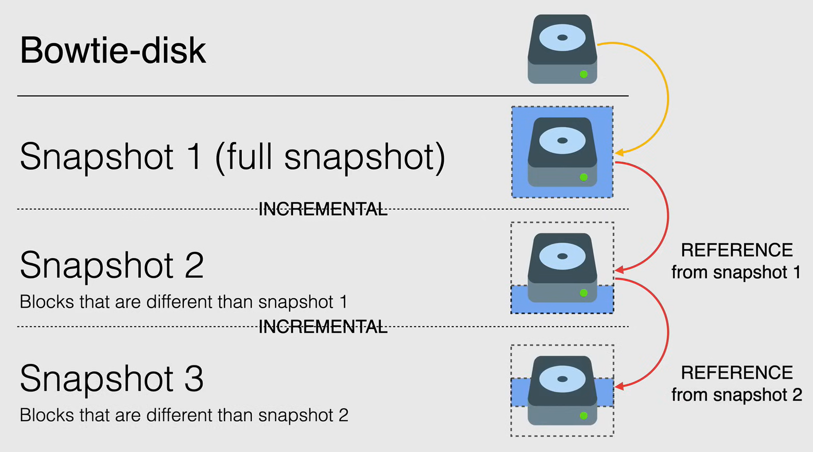
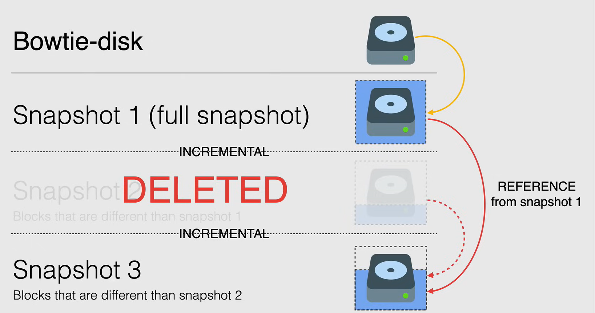

# Snapshot

Snapshots are a great way to backup data from any running or stopped instances from unexpected data loss.

Snapshots are also a great strategy for use in a backup plan for any and all instances, no matter where they are located.

- **Backup** and **restore** of persistent disk.
- **Global**  resources, so any snapshot is accessible from any resource within the same project.
  - You can share snapshots across projects.
- Support for **zonal** and **regional** Persistent Disks.
- **Incremental**  and automatically **compressed**.
- Snapshots are stored in **Cloud Storage**.
- Stored in **regional** or **multi-regional** location.
  - With multi-regional, it is replicated across multiple regions, so we have high availability, but an higher cost.

## Create a snapshot

The snapshot are incremental, so the first snapshot of a persistent disk, is a **full snapshot**, that contains all the data of the disk.

The subsequent snapshots are incremental, so they only contain the data that has changed since the last snapshot.

When we decide to delete a snapshot, if it has no dependencies, it will be deleted immediately, but if it has dependencies, there will be some steps that will happen behind the scenes.

For example, if we delete the snapshot `Snapshot 2`, the next snapshot from the full snapshot no longer references the snapshot for deletion, so `Snapshot 1` becomes the reference for `Snapshot 3`, and the relative data required for restoring other snapshots is moved to the next snapshot.

## Schedule snapshots

The Snapshot schedule is a great way to automate the process of creating snapshots.

- **Best practices** for baclup:
- Must be in **same region** as the Persistent Disk.

There are two ways to create a snapshot schedule:

1. Create a snapshot schedule and then **attach** it to an existing Persistent Disk.
2. Create a new disk with a snapshot schedule.

Some options when creating snapshots schedules are both retention policy and **source disk deletion rules.**

- We have also the option of setting up a **snapshot retention policy**, that defines how long you want to keep the snapshots.
  - If you choose to setup a snapshot retention policy, you must do it as part of your snapshot schedule.
- When you create a snapshot schedule, is when you can also **set a source disk deletion rule**, *that controls what happens to the snapshot when the source disk is deleted.*

There are some caveats to be aware on scheduling snapshots:

- A persistent disk can have only one snapshot schedule attached to it at a time.
- You cannot delete a snapshot schedule if it is attached to a disk.
- After you create a snapshot schedule, you cannot edit it, to update the schedule, you must delete the snapshot schedule and create a new one.

## Managing snapshots

- You can snapshot a disk at most once every 10 minutes.
  - You are unable to snapshot a disk at intervals shorter than 10 minutes.
- You should create snapshot at regular schedule to minimize data loss if there was an unexpected failure.
  - If you have existing snapshots of a persistent disk, the system automatically uses them as a baseline for future snapshots.
- To improve performance, you can **eliminate excessive snapshots** by creating an **image** and reusing it.
  - It is useful also in terms of cost.
- Set schedule to **off-peak hours** to minimize the impact on the performance of the instance.
- If you use Windows, create a **VSS snapshot** to ensure data consistency.