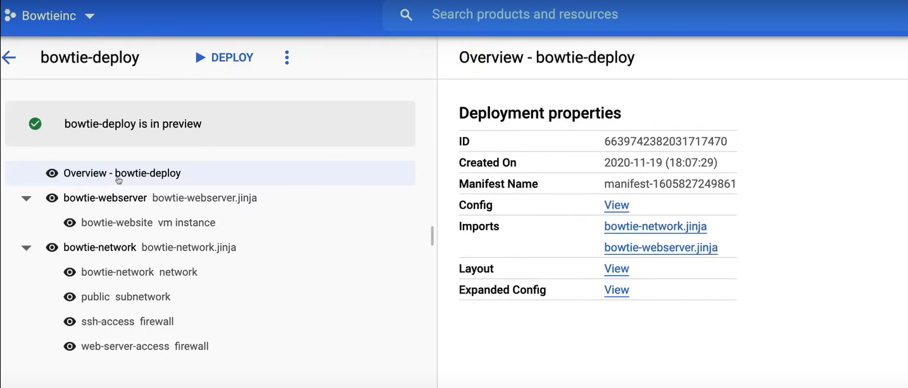
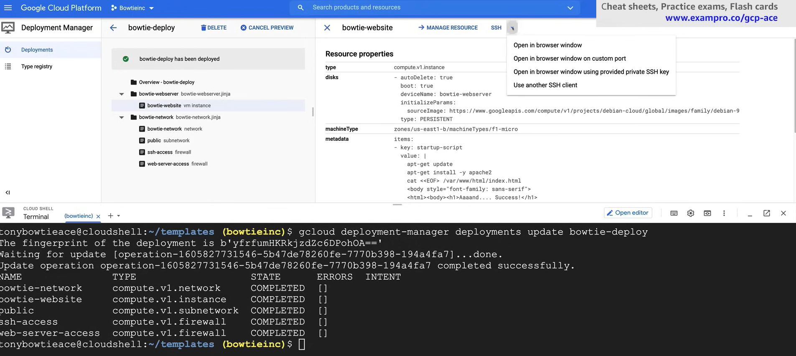

# Deployment Manager

Deployment Manager is an infrastructure deployment service that automates the creation and management of Google Cloud resources. It allows you to create, deploy, and manage complex Cloud environments using simple templates (YAML, Jinja, Python etc.).

## Configuration

A **configuration** defines the structure of your deployment, as you must specify a configuration file to create a deployment. 

It can be written in YAML, and it list all the resources that you want to deploy, and their properties.

Each resource must contain the following three components:

- **Name**: The name of the resource.
  - It is a user-defined string that must be unique within the deployment.
  - It must not contain any spaces or special characters.
- **Type**: The type of resource you are deploying.
  - A type can represent a single API resource (*base type*) or a collection of resources (*composite type*).
  - The syntax for a base type is `[API].[VERSION].[RESOURCE]`.
    - For example, `compute.v1.instance`.
  - The syntax for a composite type is `gcp-types/[PROVIDER]:[RESOURCE]`.
    - For example, `gcp-types/compute-v1:addresses`.
- **Properties**: The properties of the resource.
  - These are the parameters that you want to set for the resource.
  - They must match the properties of the resource type you are deploying.

Without these three components, the deployment will fail.

Example of a configuration file:

```yaml
resources:
- name: my-vm
  type: compute.v1.instance
  properties:
    zone: us-central1-a
    machineType: zones/us-central1-a/machineTypes/n1-standard-1
    disks:
    - deviceName: boot
      type: PERSISTENT
      boot: true
      autoDelete: true
      initializeParams:
        sourceImage: projects/debian-cloud/global/images/debian-9-stretch-v20190213
    networkInterfaces:
    - network: global/networks/default
      accessConfigs:
      - name: External NAT
        type: ONE_TO_ONE_NAT
```

### Templates

A configuration can contain **templates**, which are reusable pieces of configuration that can be used to create resources.

Templates are imported and used as types in the configuration file.

We can use modules to create dynamic configurations, and we can use variables to make our configurations more flexible.

They can be written in Jinja, or Python.

Example of a template file in Python:

```python
resources.append({
    'name': 'my-vm',
    'type': 'compute.v1.instance',
    'properties': {
        'zone': 'us-central1-a',
        'machineType': 'zones/us-central1-a/machineTypes/n1-standard-1',
        'disks': [{
            'deviceName': 'boot',
            'type': 'PERSISTENT',
            'boot': True,
            'autoDelete': True,
            'initializeParams': {
                'sourceImage': 'projects/debian-cloud/global/images/debian-9-stretch-v20190213'
            }
        }],
        'networkInterfaces': [{
            'network': 'global/networks/default',
            'accessConfigs': [{
                'name': 'External NAT',
                'type': 'ONE_TO_ONE_NAT'
            }]
        }]
    }
})
```

One of the advantages of using templates is the ability to create and define custom **template properties**, i.e. arbitrary variables that you define in template files.

Any template or configuration file that uses the template in question can provide a value for the template property without changing the template itself.

This lets you abstract the property so you can change the property value for each unique deployment.

Example of a template file with a template property for the project ID:

```yaml
resources:
- name: my-vm
  type: compute.v1.instance
  properties:
    zone: us-central1-a
    machineType: https://www.googleapis.com/compute/v1/projects/{{ env["project"] }}/zones/us-central1-a/machineTypes/n1-standard-1
    disks:
    - deviceName: boot
      type: PERSISTENT
      boot: true
      autoDelete: true
      initializeParams:
        sourceImage: projects/debian-cloud/global/images/debian-9-stretch-v20190213
```

## Deployment

A **Deployment** is a collection of resources that are deployed and managed together, using a configuration file.

### Deploy

When you **deploy** you provide a valid configuration file, and Deployment Manager creates the resources specified in the configuration.

You can deploy a configuration file using the `gcloud` command-line tool:

```bash
gcloud deployment-manager deployments create my-deployment --config my-config.yaml
```

**NOTE:** You cannot deploy with the Google Cloud Console.

Google Cloud offers a number of **predefined templates** from the GCP market, that you can use to deploy common resources, such as VM instances, networks, and storage buckets.

### Update

When you create a deployment, then you can **update** it whenever you want, by adding, removing, or modifying (changing properties) resources in the configuration file.

When you update a deployment, each deployment has a corresponding **manifest**, a *read only property*, that describes the resources that are part of the deployment, and it is automatically updated when you update the deployment.

### Delete

When you **delete** a deployment, all the resources that are part of the deployment are also deleted. If you want to delete only specific resources, delete them from the configuration file and update the deployment.

## Best Practices

- **Break up your configuration** into logical unit
  - For example you should create separate configurations for networking, storage, and compute resources, so in this way each team will be able to work on their domain without having to sift through a large configuration file.
- **Use references** - enforce order resources are created
  - References should be used for values that are not define until a resource is created.
  - For example, resources self-link, IP address, or system generated ID.
  - Without references, Deployment Manager will *create resources in parallel*, which can cause errors.
- **Preview** your deployment
  - Use the `--preview` flag to see what resources will be created, updated, or deleted before you actually deploy the configuration. 
- **Automate** the creation of resources
  - Use Deployment Manager to automate the creation of resources, so you can easily create, update, and delete resources in a repeatable way.
  - This allows you to create an *infrastructure as code*, and to version control your configurations.
- **Use a version control system**
  - Store your configuration files in a version control system, so you can track changes and revert to previous versions if needed.
    - Previous known good configurations
    - Audit trail of changes
    - Use configuration for CI/CD pipelines

## Demo

A video demo of Deployment Manager can be found [here](https://youtu.be/jpno8FSqpc8?si=832eJD6JNcjAq9cK&t=47808).

First open the Google Cloud Editor.

1. Create a `templates` folder to store your configuration files.
2. Upload `bowtie-deploy.yaml`, `bowtie-network.jinja`, and `bowtie-webserver.jinja` to the `templates` folder. 

   - `bowtie-deploy.yaml`:

        ```yaml
        imports:
        - path: bowtie-webserver.jinja
        - path: bowtie-network.jinja

        resources:
        #Create bowtie-instance
        - name: bowtie-webserver
        type: bowtie-webserver.jinja
        properties:
            zone: us-east1-b
            machineType: f1-micro
            network: $(ref.bowtie-network.selfLink)

        #Create bowtie-network
        - name: bowtie-network
        type: bowtie-network.jinja
        properties:
            region: us-east1
        ```

        - `imports` section: 
          - It specifies the templates that are used in the configuration file.
          - The `path` attribute specifies the path to the template file.
        - `resources` section:
          - It specifies the resources that are created in the deployment.
          - The `type` attribute specifies the template that is used to create the resource.

   - `bowtie-webserver.jinja`:

        ```jinja
        resources:
        - name: bowtie-website
        type: compute.v1.instance
        properties:
            zone: {{ properties["zone"] }}
            machineType: zones/{{ properties["zone"] }}/machineTypes/{{ properties["machineType"] }}
            disks:
            - deviceName: {{ env["name"] }}
            type: PERSISTENT
            boot: true
            autoDelete: true
            initializeParams:
                sourceImage: https://www.googleapis.com/compute/v1/projects/debian-cloud/global/images/family/debian-9
            metadata:
            items:
            - key: startup-script
                value: |
                apt-get update
                apt-get install -y apache2
                cat <<EOF> /var/www/html/index.html
                <body style="font-family: sans-serif">
                <html><body><h1>Aaaand.... Success!</h1>
                <p>My, you look dapper today!</p>
                <p></p>
                </body></html>
                EOF
            tags:
            items: ["http-server"]
            networkInterfaces:
            - network: $(ref.bowtie-network.selfLink)
            subnetwork: $(ref.public.selfLink)
            # Access Config required to give the instance a public IP address
            accessConfigs:
            - name: External NAT
                type: ONE_TO_ONE_NAT
        ```

        - `properties` section:
          - It specifies the properties of the resource that is created.
          - The `zone` and `machineType` properties are set using the values provided in the configuration file.
        - `env` is the environment variable.

   - `bowtie-network.jinja`:

        ```jinja
        resources:
        - name: bowtie-network
        type: compute.v1.network
        properties:
            autoCreateSubnetworks: false
        - name: public
        type: compute.v1.subnetwork
        properties:
            ipCidrRange: 10.0.0.0/24
            network: $(ref.bowtie-network.selfLink)
            privateIpGoogleAccess: false
            region: {{ properties["region"] }}
        - name: ssh-access
        type: compute.v1.firewall
        properties:
            network: $(ref.bowtie-network.selfLink)
            sourceRanges: ["0.0.0.0/0"]
            allowed:
            - IPProtocol: TCP
            ports: ["22"]
        - type: compute.v1.firewall
        name: web-server-access
        properties:
            network: $(ref.bowtie-network.selfLink)
            targetTags: ["http-server"]
            sourceRanges: ["0.0.0.0/0"]
            allowed:
            - IPProtocol: TCP
                ports: ["80"] 
        ```

3. Turn on the Deployment Manager API.
   1. Search for `Deployment Manager API` in the search bar.
   2. Enable the API.

4. Create a new deployment.

   1. Enter into the folder where the configuration file is located.

        ```bash
        cd templates
        ```

   2. Deploy the configuration file.

        ```bash
        gcloud deployment-manager deployments create bowtie-deploy --config bowtie-deploy.yaml --preview
        ```

        

   3. If we click on the links under the section `Imports`, we can see the content of the templates.

5. But it is only a preview, so we need to deploy it. Deploy the configuration file. We can click on the `Deploy` button in the Google Cloud Console, or we can deploy it using the command line.

    ```bash
    gcloud deployment-manager deployments update bowtie-deploy
    ```

    

6. Now we can check the resources that have been created.

   1. Go to the `Compute Engine` section in the Google Cloud Console.
   2. Click on `VM instances` page. Check the VM instance that has been created.
   3. Go to the `VPC Network` section in the Google Cloud Console.
   4. Click on `VPC networks` page. Check the network that has been created.
   5. Click on `Firewall rules` page. Check the firewall rules that have been created.
    
7. Check the website.

    1. Copy the `External IP` of the VM instance.
    2. Open a new tab in your browser and paste the `External IP` of the VM instance.
    3. You should see the website that has been created. 

8. Now we can delete the deployment, either from the Google Cloud Console clicking on the `Delete` button on the Deployment Manager page, or using the command line.

    ```bash
    gcloud deployment-manager deployments delete bowtie-deploy
    ```