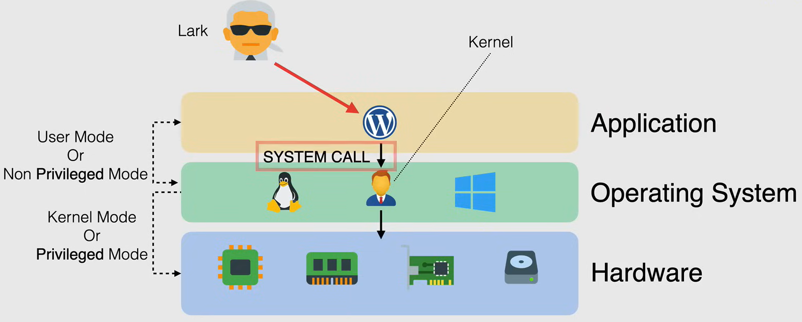
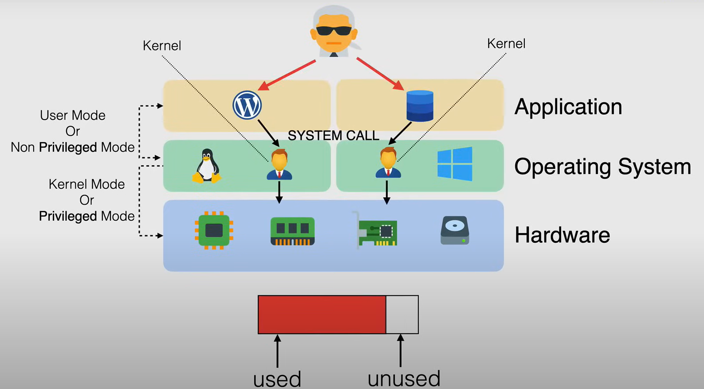
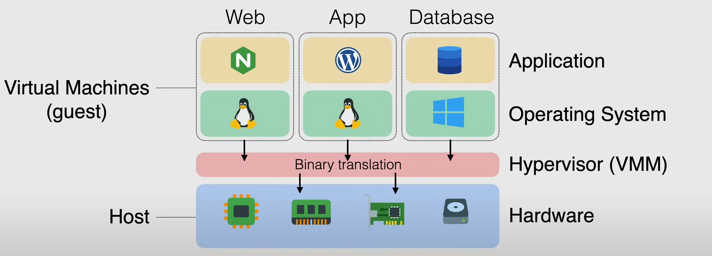
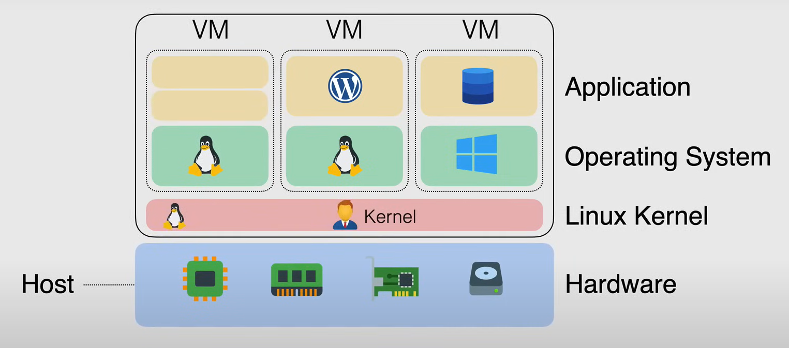

# Virtualization Fundamentals

## What is Virtualization?

La virtualizzazione è il processo di esecuzione simultanea di più sistemi operativi su una singola macchina fisica.

### Before Virtualization

Prima della virtualizzazione, ogni server fisico era dedicato a un singolo sistema operativo. Nel sistema operativo c'è uno strato intermedio chiamato **Kernel**, che è responsabile della gestione delle risorse hardware. Il kernel è l'interfaccia tra l'hardware e il software.

Il kernel opera in **Kernel Mode** (detto anche **Privileged Mode**), che ha pieno accesso all'hardware. Quindi un'applicazione in esecuzione nel sistema operativo non può accedere direttamente all'hardware. Invece, deve passare attraverso il kernel, questo è chiamato **User Mode** (detto anche **Unprivileged Mode**). Quindi, un'applicazione in esecuzione nel sistema operativo, per accedere all'hardware, deve effettuare una **system call** al kernel.

Con questa configurazione, il server non viene utilizzato al massimo delle sue potenzialità. Il server sta eseguendo solo un sistema operativo e le risorse non vengono condivise tra più sistemi operativi.

### Multiple OS

L'utilizzo di più sistemi operativi su una singola macchina consente di aumentare l'utilizzo del server, ma ogni CPU in un dato momento può eseguire solo una cosa in modalità privilegiata.

Quindi, avere più sistemi operativi in esecuzione autonomamente, in uno stato non modificato e aspettarsi di essere eseguiti autonomamente in uno stato privilegiato, eseguendo istruzioni privilegiate, causava instabilità nei sistemi, causando non solo il blocco delle applicazioni, ma anche il blocco dell'intero sistema.

### Hypervisor

La soluzione a questo problema è l'**Hypervisor**, anche chiamato **Virtual Machine Monitor (VMM)**.

L'hypervisor è un software che viene eseguito sulla macchina fisica e consente a più sistemi operativi di essere eseguiti sulla stessa macchina, ma in modo controllato.

## Types of Virtualization

Ci sono diversi tipi di tecniche di virtualizzazione, ognuna con i propri vantaggi e svantaggi.

### Emulation

Inizialmente, la virtualizzazione veniva eseguita tramite software, e il sistema operativo con le sue applicazioni veniva inserito in un contenitore logico noto come **Virtual Machine (VM)**.

Il sistema operativo veniva installato sull'host, che includeva funzionalità aggiuntive chiamate Hypervisor, che consentivano all'OS di essere eseguito in una VM.

L'Hypervisor esponeva l'interfaccia del dispositivo hardware disponibile sull'host e consentiva di essere mappato alla macchina virtuale ed emulava il comportamento del dispositivo hardware. Ciò consentiva alla macchina virtuale di utilizzare i driver del sistema operativo progettati per interagire con il dispositivo emulato, senza installare driver aggiuntivi.

Il problema qui è che tutto era emulato, quindi era lento.

### Para-Virtualization

Con **Para-Virtualization**, un guest OS modificato è in grado di comunicare direttamente con l'hypervisor, senza passare attraverso il livello di emulazione. Ciò rende la comunicazione tra il guest OS e l'hypervisor molto più veloce.

Questo comporta la necessità di modificare e ricompilare il kernel del sistema operativo prima dell'installazione sulla VM.

### Hardware-Assisted Virtualization

**Hardware-Assisted Virtualization**, permette una virtualizzazione completa efficiente utilizzando l'aiuto delle capacità hardware, sulla CPU dell'host.

Con questo modello, il sistema operativo ha accesso diretto all'hardware, quindi l'hardware stesso diventa consapevole della virtualizzazione.

Quindi il kernel non ha più bisogno di essere modificato e ricompilato. Ciò fornisce prestazioni migliorate e riduce l'overhead dell'hypervisor.

### Kernel Level Virtualization

**Kernel Level Virtualization** è una tecnica che consente l'esecuzione di più istanze o container utente isolate su un singolo kernel.

Invece di utilizzare un hypervisor, il kernel stesso viene modificato per creare container isolati. Questa è una tecnica di virtualizzazione leggera, in quanto non richiede un sistema operativo separato per ogni container.

