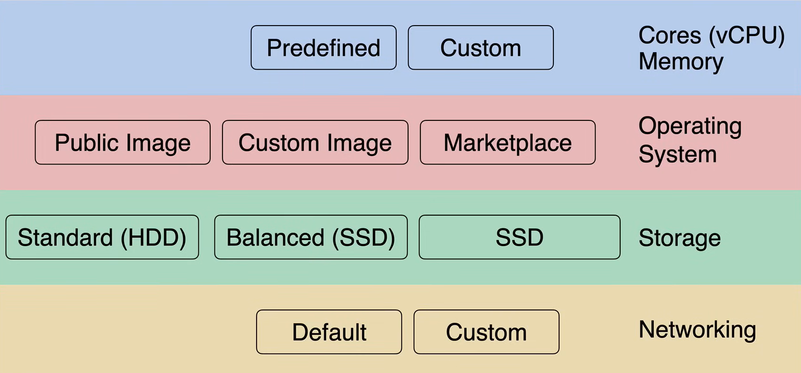

# Compute Engine Overview

**Compute Engine** è un servizio che consente di creare ed eseguire macchine virtuali note come **istanze**, che sono ospitate nell'infrastruttura di Google.

Quindi è un **Infrastructure as a Service (IaaS)**, perché Google si occupa della piattaforma di virtualizzazione, del server fisico, della rete, dello storage e della sicurezza.

Le istanze sono disponibili in diverse **dimensioni** e **tipi**, e ogni istanza viene addebitata al secondo dopo il primo minuto, perché si tratta di un modello basato sul consumo.

Le istanze vengono avviate in una rete VPC e verranno posizionate su host in **zone**, che sono posizioni isolate all'interno di una regione. Abbiamo la possibilità di utilizzare:

- un host **multi-tenant**, in cui il server che ospita la tua istanza è condiviso con altri, ma ogni istanza è isolata
- un host **sole-tenant**, in cui il server è dedicato a te

## Machine Configuration

Quando si crea un'istanza, abbiamo diverse opzioni per configurare la macchina:

- **Cores e Memory**
  - Tipi di macchine *Predefiniti* o *Personalizzati*
    - possiamo scegliere tra molti tipi di macchine *Predefinite*, per scopi generali, ottimizzate per la memoria, ottimizzate per il calcolo, ecc., oppure possiamo creare un tipo di macchina *Personalizzato*
    - possiamo scegliere tra processori Intel e AMD
    - ogni *vCPU* è un'iper-thread di un core fisico
    - la larghezza di banda di rete è fino a *2 Gbps per vCPU*, quindi se abbiamo una macchina con 4 vCPU, avremo una larghezza di banda di rete di 8 Gbps

- **Sistema Operativo**
  - Immagini *Pubbliche*
    - Compute Engine fornisce un set di immagini *pubbliche*, come Linux o Windows
    - il disco di avvio è un disco persistente, che viene collegato all'istanza con la stessa dimensione che si sceglie
  - Immagini *Personalizzate*
    - un disco di avvio di proprietà e con accesso controllato
    - sono disponibili solo per il tuo progetto cloud a meno che tu non decida specificamente di condividerle con altri progetti o organizzazioni
    - è possibile creare un'immagine personalizzata da uno snapshot del disco di avvio o da un file immagine che si carica
    - le immagini personalizzate che si importano non aggiungono costi alle istanze, ma si paga per lo spazio di archiviazione che utilizzano
  - Immagini *Marketplace*
    - distribuire rapidamente pacchetti software funzionali che vengono eseguiti su Google Cloud
    - è un unico modello di istanza che include il sistema operativo e il software

- **Archiviazione**: possiamo scegliere il tipo di archiviazione e la quantità di archiviazione
  - Prestazioni vs Costo
    - Disco persistente *Standard*
      - HDD
      - basso costo
      - buono per lettura/scrittura sequenziale
    - SSD *Bilanciato* e *SSD*
      - SSD
      - alte prestazioni
      - buono per lettura/scrittura casuale
    - *Local SSD*
      - SSD
      - alte prestazioni
      - buono per dati temporanei
      - è fisicamente collegato alla macchina host
      - i dati vengono persi quando l'istanza viene terminata

- **Networking**
  - Rete Auto, Predefinita o Personalizzata
    - *Rete Auto*
      - Compute Engine crea automaticamente una rete per te
      - è una rete globale
    - *Rete Predefinita*
      - Compute Engine crea automaticamente una rete per te
      - è una rete regionale
    - *Rete Personalizzata*
      - crei tu la rete
      - è una rete globale
  - Molte *regioni* e *zone* disponibili
  - *Regole del firewall*
    - possiamo creare regole del firewall per consentire o negare il traffico all'istanza
    - la regola predefinita consente tutto il traffico dalla stessa rete e nega tutto il traffico dalle altre reti
  - *Network Load Balancer*
    - distribuisce il traffico su più istanze
    - è un servizio globale
    - è un servizio gestito, quindi non dobbiamo preoccuparci dell'infrastruttura