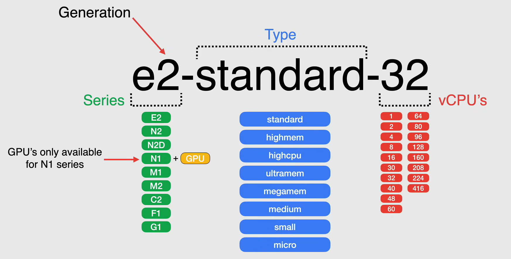
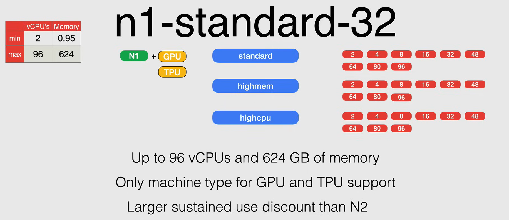
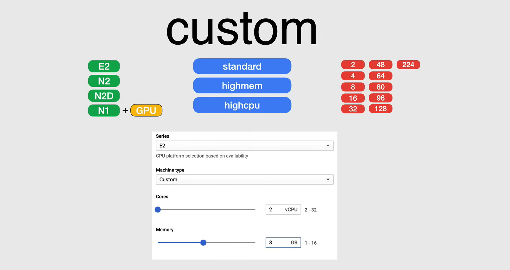
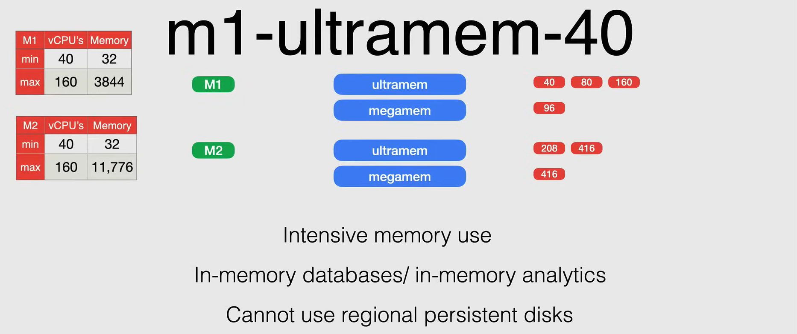

# Compute Engine Machine Types

Un **machine type** è un insieme di risorse hardware virtualizzate disponibili per un'istanza di macchina virtuale (VM), inclusa la dimensione della memoria di sistema, il numero di CPU virtuali (vCPU) e i limiti del disco persistente.

In Google Cloud, i machine type sono raggruppati e curati per famiglie per diversi carichi di lavoro. Le famiglie di machine type includono:

- **General-purpose**: Risorse CPU e memoria bilanciate.
- **Memory-optimized**: Rapporto memoria-CPU elevato.
- **Compute-optimized**: Rapporto CPU-memoria elevato.

Se hai bisogno di un controllo più dettagliato sulle risorse, puoi creare un **custom machine type**.

L'identificatore del machine type è composto dalle seguenti parti:

- **Series**: La serie di machine type a cui appartiene il machine type.
  - Il numero dopo la lettera della serie indica la **generazione** del machine type.
- **Machine type**: Il machine type all'interno della serie.
- **Numero di vCPUs**: Il numero di vCPUs che il machine type fornisce.

Ad esempio, il machine type `e2-standard-32` appartiene alla serie `E2`, ha `32` vCPUs ed è un machine type `standard`.

**NOTA:** Le GPU sono disponibili solo per i machine type `N1`.

## General-purpose Machine Types
I machine type di uso generale sono adatti a una varietà di carichi di lavoro, tra cui server web, piccoli database e ambienti di sviluppo.

I machine type di uso generale sono raggruppati in tre famiglie di machine type:

- **Standard**: I machine type standard forniscono un equilibrio tra risorse CPU e memoria.
- **High-memory**: I machine type high-memory forniscono più memoria rispetto al numero di vCPUs.
- **High-CPU**: I machine type high-CPU forniscono più vCPUs rispetto alla quantità di memoria.

I machine type di uso generale sono raggruppati nelle seguenti serie:

- **E2**
  - *Sono progettati per un calcolo quotidiano a un costo inferiore*. La serie E2 offre un'opzione *ottimizzata in termini di costo* per l'esecuzione di carichi di lavoro di uso generale.
  - Alcuni casi d'uso per la serie E2 includono:
    - Web Serving
    - App Serving
    - Back Office Applications
    - Piccoli/Medi Database
    - Microservizi
    - Desktop Virtuali
    - Ambienti di Sviluppo

  - Offrono una dimensione compresa tra 2 e 32 vCPUs e da 0,5 a 128 GB di memoria.  

    

- **N**-series
  - *Sono progettati per un equilibrio tra prezzo e prestazioni in una vasta gamma di forme di VM*.
  - Alcuni casi d'uso per la serie N includono:
    - Web Serving
    - App Serving
    - Back Office Applications
    - Database di Medie/Grandi Dimensioni
    - Caching
    - Media/Streming
  
  - **N1**: La serie N1 è la prima generazione di machine type di uso generale.
    - Offrono una dimensione compresa tra 2 e 96 vCPUs e da 0,95 a 624 GB di memoria.
    - Questa è l'unica serie che supporta GPU e TPU.
    - Hanno uno sconto di utilizzo sostenuto maggiore rispetto alla serie N2.
  
    

  - **N2**: La serie N2 è la seconda generazione di machine type di uso generale.
    - Offrono una dimensione compresa tra 2 e 80 vCPUs e da 0,5 a 640 GB di memoria.
    - Offrono un miglioramento complessivo delle prestazioni rispetto alla serie N1.
    - Carichi di lavoro che possono ottenere prestazioni più elevate per thread beneficiando di tutta la flessibilità che un machine type di uso generale offre.
    - Offrono la funzionalità di memoria estesa, che consente di creare VM con più memoria rispetto alle configurazioni di memoria standard.

    

  - **N2D**: La serie N2D è la seconda generazione di machine type di uso generale con SSD locali.
    - Offrono una dimensione compresa tra 2 e 224 vCPUs e da 0,5 a 896 GB di memoria.

    

### Shared-core Machine Types

I machine type condivisi sono adatti per l'esecuzione di carichi di lavoro burstable, applicazioni a basso costo e non intensivi in termini di risorse.

Utilizzano **context switching** per condividere un core fisico tra vCPUs allo scopo di multitasking. Diversi tipi di machine type condivisi supportano un diverso periodo di tempo su un core fisico, il che consente a Google Cloud di ridurre il prezzo.

Le istanze condivise possono essere più convenienti per l'esecuzione di piccole applicazioni non intensivi in termini di risorse rispetto ai machine type standard, ad alta memoria o ad alta CPU.

Questi machine type condivisi offrono capacità di bursting, che consentono alle istanze di utilizzare CPU fisiche aggiuntive per brevi periodi di tempo quando richiesto dal carico di lavoro.

Il bursting avviene automaticamente quando la tua istanza richiede più CPU fisiche di quelle allocate. Durante il picco, la tua istanza sfrutterà la CPU fisica disponibile in burst.

I machine type condivisi `E2` sono offerti in:

- `e2-micro`
- `e2-small`
- `e2-medium`

Mentre i machine type condivisi `N1` sono offerti in:

- `f1-micro`
- `g1-small`

Tutti questi machine type hanno un massimo di 2 vCPUs e 4 GB di memoria.

### Custom Machine Types
I machine type personalizzati ti consentono di creare un machine type adattato alle tue esigenze. Puoi specificare il numero di vCPUs e la quantità di memoria per il machine type personalizzato.

Costano più dei machine type predefiniti e ci sono alcune limitazioni sulla quantità di memoria e vCPUs che puoi utilizzare.

Quando crei un machine type personalizzato, puoi scegliere tra le serie `E2`, `N1` e `N2`.

### Available GPUs

Le GPU sono disponibili solo per i machine type `N1`. Le GPU disponibili sono:

- **NVIDIA Tesla K80**
- **NVIDIA Tesla P4**
- **NVIDIA Tesla T4**
- **NVIDIA Tesla V100**
- **NVIDIA Tesla P100**

## Compute-optimized Machine Types

I machine type ottimizzati per il calcolo sono adatti per applicazioni legate al calcolo che traggono vantaggio da processori ad alte prestazioni.

I machine type ottimizzati per il calcolo sono raggruppati nelle seguenti serie:

- **C2**
  - *Sono progettati per carichi di lavoro di calcolo ad alte prestazioni*.
  - Alcuni casi d'uso per la serie C2 includono:
    - Calcolo ad alte prestazioni
    - Progettazione elettronica automatizzata
    - Gioco
    - Applicazioni single-threaded

  - Offrono una dimensione compresa tra 4 e 60 vCPUs e da 16 a 240 GB di memoria.
  - Elevate prestazioni per core
  - *Non possono utilizzare dischi persistenti regionali*
  - *Sono disponibili solo in specifiche regioni.*

    

## Memory-optimized Machine Types

I machine type ottimizzati per la memoria sono adatti per carichi di lavoro intensivi in termini di memoria, come database in memoria e elaborazione dei dati in tempo reale.

I machine type ottimizzati per la memoria sono raggruppati nelle seguenti serie:

- **M**-series
  - *Sono progettati per carichi di lavoro intensivi in termini di memoria*.
  - Alcuni casi d'uso per la serie M includono:
    - Grandi database in memoria, come SAP HANA
    - Analisi in memoria
  - *Non possono utilizzare dischi persistenti regionali*
  - *Sono disponibili solo in specifiche regioni.*
  - Disponibili solo come machine type predefiniti.

  - **M1**: La serie M1 è la prima generazione di machine type ottimizzati per la memoria.
    - Offrono una dimensione compresa tra 40 e 160 vCPUs e da 32 a 3844 GB di memoria.

  - **M2**: La serie M2 è la seconda generazione di machine type ottimizzati per la memoria.
    - Offrono una dimensione compresa tra 40 e 160 vCPUs e da 32 a 11.776 GB di memoria.

    