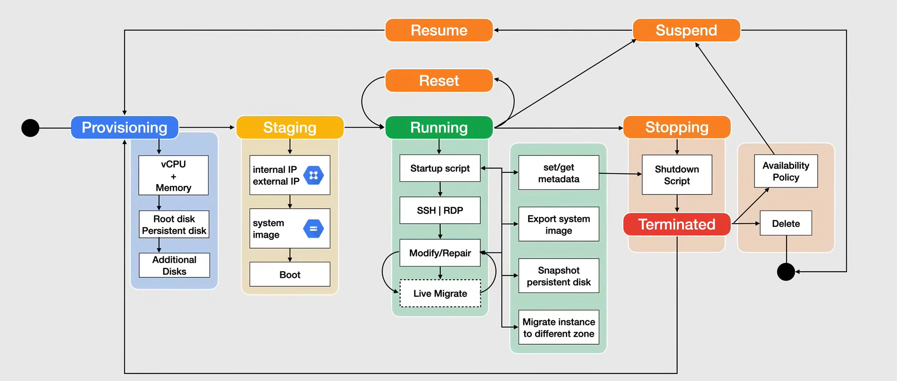
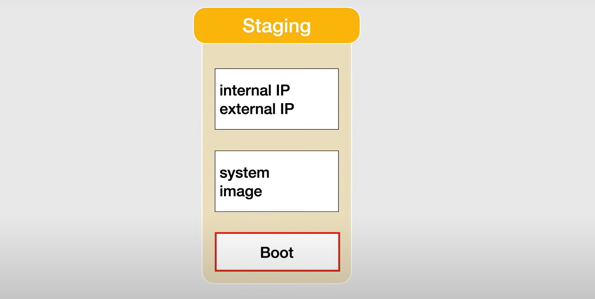
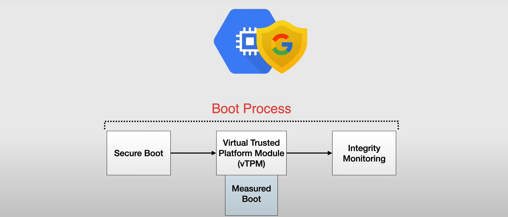
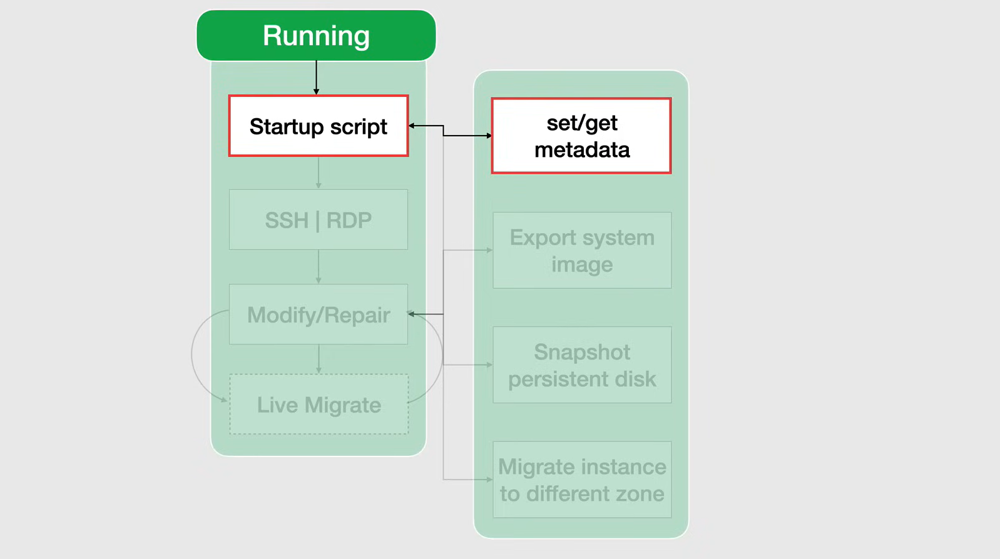
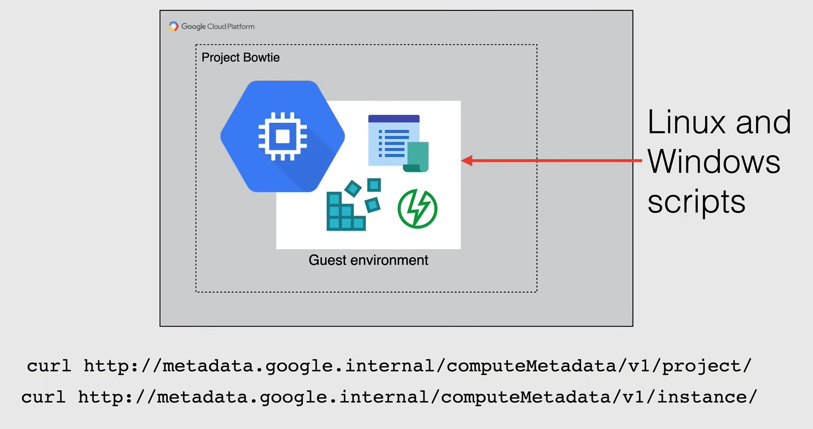
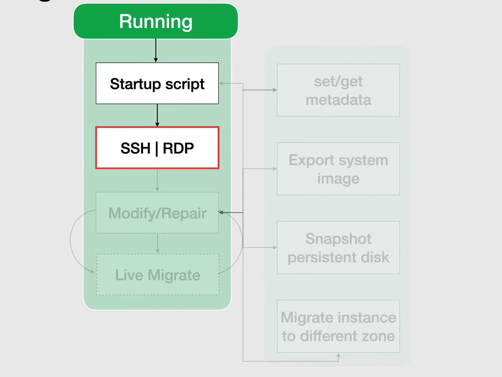
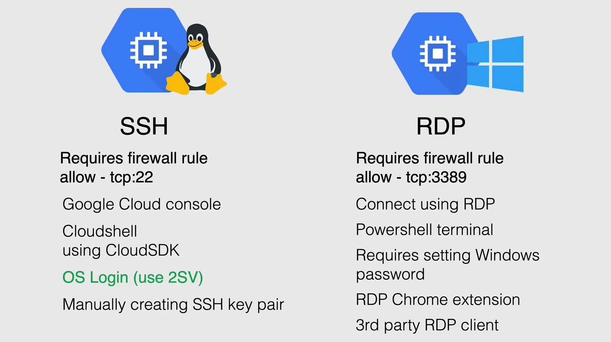
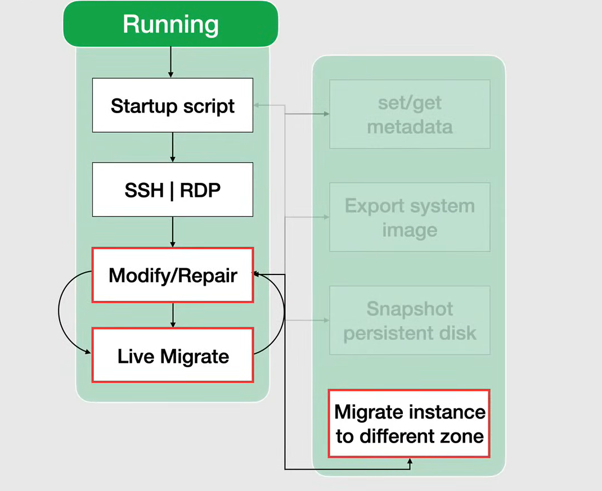
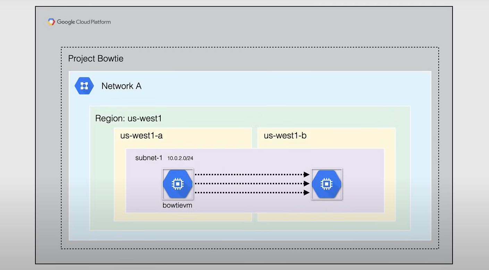

# Managing Instances

**NOTA:** Questo è un argomento importante nell'esame.



Ogni istanza ha un ciclo di vita predefinito, che va dallo stato di provisioning iniziale alla cancellazione.

L'istanza può passare attraverso molti stati.

1. **Provisioning**: Quando crei per la prima volta un'istanza, **Compute Engine** provvede alle risorse per avviare l'istanza.

2. **Staging**: Dopo che l'istanza è stata provisionata, entra nello stato di staging. In questo stato, l'istanza viene preparata per l'avvio e infine si avvia.

3. **Running**: Dopo l'avvio, l'istanza entra nello stato di running. In questo stato, l'istanza è in esecuzione e può essere accessibile. Durante la sua durata, un'istanza in esecuzione può essere ripetutamente arrestata e riavviata, o sospesa e ripresa.

4. **Terminated**: Quando elimini un'istanza, questa entra nello stato di terminated. In questo stato, l'istanza viene arrestata e le risorse utilizzate dall'istanza vengono rilasciate.

## Provisioning

In questo stato vengono allocate le risorse per l'istanza.

L'istanza non è ancora in esecuzione e vengono allocate la quantità richiesta di CPU e memoria, insieme al disco radice e eventuali dischi aggiuntivi ad esso collegati (se presenti).

In termini di costo, durante lo stato di provisioning non vengono sostenuti costi.

## Staging

Dopo aver completato lo stato di provisioning, l'istanza entra nello stato di staging.

In questo stato, le risorse sono state acquisite e l'istanza viene preparata per l'avvio.

All'istanza vengono assegnati sia indirizzi IP interni che esterni, che possono essere statici o effimeri.

Viene utilizzata l'immagine di sistema scelta originariamente per avviare l'istanza, che può essere un'immagine pubblica o un'immagine personalizzata.

In termini di costo, durante lo stato di staging non vengono sostenuti costi.

### Boot



#### Shielded VMs

Quando crei un'istanza, hai la possibilità di utilizzare le VM protette (shielded VMs) per una maggiore sicurezza, e quando le utilizzi l'istanza le istanzia durante l'avvio e passa allo stato di running.

Le VM protette garantiscono l'integrità verificabile delle tue istanze VM, in modo da assicurarti che le tue istanze non siano state compromesse da malware o rootkit a livello di boot o kernel.



Questo viene realizzato attraverso un processo in quattro fasi, che è coperto da:

- **Secure Boot**
  - Questo aiuta a garantire che il sistema esegua solo software autentico verificando la firma digitale di tutti i componenti di avvio e interrompendo il processo di avvio se la verifica della firma fallisce.
  - Le VM protette eseguono firmware firmato e verificato utilizzando l'Autorità di Certificazione di Google.
  - Ogni componente di avvio che non è correttamente firmato non viene eseguito.
- **Virtual Trusted Platform Module (vTPM)**
  - Utilizzato per proteggere l'integrità dell'istanza VM nel processo di avvio misurato.
  - Un chip specializzato che può memorizzare chiavi crittografiche e misurazioni.
- **Measured Boot**
  - Crea la linea guida di integrità per il primo set di misurazioni e le memorizza.
  - Ogni volta che la VM si avvia, le misurazioni vengono prese e confrontate con la linea guida, nella fase successiva.
- **Integrity Monitoring**
  - Permette di determinare se ci sono state modifiche alla sequenza di avvio di un'istanza VM, e questa politica viene caricata su un vTPM.

## Running

Quando l'istanza ha lasciato lo stato di staging, entra nello stato di running.

In questo stato, l'istanza è in esecuzione e può essere accessibile, sia tramite SSH che RDP, entro un breve periodo a causa di eventuali script di avvio o attività di manutenzione del sistema operativo durante l'avvio.

### Startup Scripts



Quando un'istanza si avvia, è possibile eseguire uno script che verrà eseguito sull'istanza, questo viene chiamato **startup script**.

#### Metadata Server

Compute Engine fornisce un metodo per archiviare e recuperare i metadati dell'istanza, sotto forma di server di metadati.

Questo servizio fornisce un punto centrale per impostare i metadati sotto forma di coppie chiave-valore, che vengono quindi forniti alle macchine virtuali durante l'esecuzione.

È possibile interrogare il server di metadati dall'interno dell'istanza in modo programmato utilizzando l'API di Compute Engine. Questo è ottimo per l'utilizzo di script di avvio e arresto.

I metadati possono essere assegnati a un progetto, così come a un'istanza, e i metadati del progetto si propagano a tutte le istanze nel progetto.



**NOTA:** Quando si effettua una richiesta per ottenere informazioni dal server di metadati, la richiesta e la successiva risposta non lasciano mai la macchina fisica su cui l'istanza è in esecuzione.

#### Guest Environment

Quando si avvia un'istanza VM, utilizzando le immagini pubbliche fornite da Google, viene installato un **guest environment** sull'istanza, ovvero un insieme di script, daemon e binari che leggono il contenuto del server di metadati per far funzionare correttamente la macchina virtuale su Compute Engine.

Un **metadata server** è un canale di comunicazione per trasferire informazioni da un client al sistema operativo guest.

Le istanze VM create utilizzando le immagini pubbliche fornite da Google hanno il guest environment installato per impostazione predefinita.

Creando un'istanza VM utilizzando un'immagine personalizzata, è necessario installare il guest environment manualmente. È disponibile per entrambi i sistemi operativi Linux e Windows, e ogni sistema operativo richiede un pacchetto specifico del guest environment.

Per quanto riguarda il guest environment Linux, può essere costruito da Google o dal proprietario del sistema operativo, e ci sono alcuni componenti chiave che sono applicabili a tutte le build, ad esempio un componente di base di un guest environment Linux è il pacchetto `python`.

Per quanto riguarda il guest environment Windows, si applica un approccio simile in cui è disponibile un pacchetto con script principali e binari come parte del guest environment.

### SSH - RDP



Quando l'istanza è stata avviata e ha completato gli script di avvio, è possibile accedere all'istanza utilizzando SSH o RDP.

Ci sono diversi metodi per accedere sia alle istanze Linux che a quelle Windows.



#### Linux

Per le istanze Linux, è possibile utilizzare SSH per accedere all'istanza sulla porta 22.

**NOTA:** È necessaria una regola del firewall per consentire il traffico SSH all'istanza.

Per connettersi a un'istanza Linux, è possibile utilizzare lo strumento da riga di comando `gcloud` o il comando `ssh`.


#### Windows
Per le istanze Windows, è possibile utilizzare RDP per accedere all'istanza sulla porta 3389.

**NOTA:** È necessaria una regola del firewall per consentire il traffico RDP all'istanza.

Per connettersi a un'istanza Windows, è possibile utilizzare lo strumento da riga di comando `gcloud` o il comando `mstsc`.

```bash
gcloud compute rdp INSTANCE_NAME
```

```bash
mstsc /v:EXTERNAL_IP
```

è necessario impostare una password Windows, e può essere fatto sia dalla console che tramite linea di comando.

### Modify/Repairs



Quando la tua istanza è avviata e hai effettuato l'accesso, hai la possibilità di modificare l'istanza, e può essere fatto manualmente, modificandola al volo, o arrestando l'istanza e quindi modificandola.

### Live Migration

Quando si desidera migrare un'istanza in una diversa zona nella stessa regione, ciò non è possibile senza spegnere l'istanza, utilizzando una funzionalità chiamata **Live Migration**.



Con Live Migration, Compute Engine migra le tue istanze su un altro host nella stessa zona anziché richiedere il riavvio delle istanze. Ciò consente a Google di eseguire in modo affidabile la manutenzione senza interrompere alcuna delle tue VM.

Quando una VM è programmata per essere live migrata, Google fornisce una notifica al guest che una migrazione è imminente.

La Live Migration mantiene le tue istanze in esecuzione durante la manutenzione regolare dell'infrastruttura e gli aggiornamenti degli host di Compute Engine, la sostituzione dell'hardware guasto e le modifiche alla configurazione di sistema.

Quando Google migra un'istanza in esecuzione da un host all'altro, sposta lo stato completo dell'istanza dalla sorgente alla destinazione, in modo trasparente per il sistema operativo guest e chiunque comunichi con esso.

Google offre anche la possibilità di eseguire la migrazione live manualmente, da una zona all'altra all'interno della stessa regione, utilizzando la console o lo strumento da riga di comando `gcloud`.

```bash
gcloud compute instances move INSTANCE_NAME --zone=ZONE --destination-zone=ZONE
```

**NOTE:** *Instances with GPUs attached cannot be live migrated.*

## Reset

Durante lo stato di esecuzione, è possibile **Reset**tare l'istanza, e qui si cancellano i contenuti della memoria dell'istanza VM e si ripristina la macchina virtuale al suo stato iniziale. Il reset di un'istanza provoca un riavvio immediato e forzato della VM e, pertanto, la VM non esegue uno spegnimento corretto per il sistema operativo guest. Tuttavia, la VM conserva tutti i dati del disco persistente e nessuna delle proprietà dell'istanza cambia. Quindi, l'istanza rimane nello stato di esecuzione.

Durante lo stato di esecuzione, può verificarsi un'operazione di riparazione a causa di un errore interno dell'istanza o perché la macchina sottostante non è disponibile a causa di manutenzione o altri motivi.

Durante questo periodo, l'istanza non è utilizzabile e, se la riparazione ha successo, l'istanza torna allo stato di esecuzione.

In termini di costi, questo stato è in cui l'istanza inizia a incorrerne, ed è legato alle risorse utilizzate dall'istanza.

## Suspending

Quando **sospendi** un'istanza, è come chiudere il coperchio di un laptop, ciò preserverà la memoria del sistema operativo, mentre lo stato dell'applicazione verrà scartato.

Da questo stato è possibile riprendere l'istanza, che si troverà nello stesso stato in cui si trovava prima di essere sospesa, oppure eliminare l'istanza.

## Stopping

Quando **stopping** un'istanza, o un utente ha fatto richiesta di fermare l'istanza, o l'istanza è stata fermata a causa di un errore interno.

Questo è uno stato temporaneo e l'istanza passerà allo stato di terminated.

In termini di costi, quando si sospende o si ferma un'istanza, si paga per le risorse utilizzate dall'istanza, come l'indirizzo IP statico e il disco persistente.

Gli indirizzi IP esterni effimeri vengono rilasciati quando l'istanza viene fermata e verranno assegnati nuovamente quando l'istanza viene avviata di nuovo.

## Terminated

L'istanza entra nello stato **terminated** quando l'utente ha richiesto di spegnere l'istanza, o l'istanza è stata fermata a causa di un errore interno.

L'utente può scegliere di riavviare o di eliminare l'istanza, e ciò rilascerà le risorse che vengono utilizzate dall'istanza, come la CPU, la memoria e il disco persistente.

In termini di costi, quando l'istanza è nello stato terminated, si paga ancora per l'IP statico e il disco persistente, ma non si paga per la CPU e la memoria.