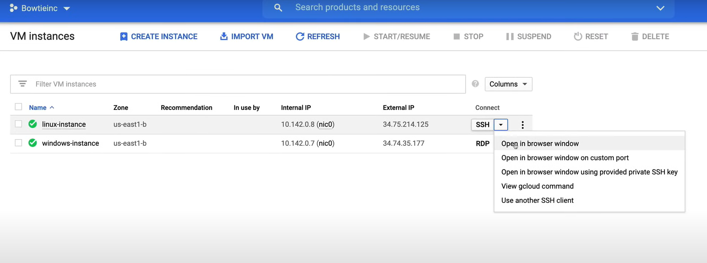

# Connecting to Your Instances

## Demo

A video demo of this lab is available [here](https://youtu.be/jpno8FSqpc8?si=zUfxMNVBIEBX5Gsa&t=39643).

We will create two instances in this lab. One will be a Windows instance and the other will be a Linux instance. We will connect to both instances using the Remote Desktop Protocol (RDP) and Secure Shell (SSH) respectively.

**NOTE:** Before creating the instances, make sure that you have enabled a default network in the VPC network.

### Windows Instance

1. Go to the **Compute Engine** page in the Google Cloud Console.
2. Go to the **VM instances** page and click on **Create Instance** and configure the instance as follows:
   - **Name**: `windows-instance`
   - **Region**: `us-east1`
   - **Zone**: `us-east1-b`
   - **Machine type**: `e2-medium`
   - **Boot disk**: Click on `Change`
     - Public images
        - Operating system: `Windows Server`
        - Version: `Windows Server 2019 Datacenter`
        - Boot disk type: `Standard persistent disk`
        - Size: `50 GB`
3. Click on **Create**.


**NOTE:** From the drop-down menu on the right side of the `RDP` button, we have a couple of options:

- **Set Windows password**: This will allow us to set the password for the Windows instance.
- **Download the RDP file**: This will download an RDP file that we can use to connect to the Windows instance. It contains the IP address of the instance and the username.
- **View gcloud command**: This will show the gcloud command that we can use to connect to the Windows instance.

Now, we can set the password for the Windows instance.

1. Click on the drop-down menu on the right side of the `RDP` button and click on `Set Windows password`.
2. In the new pop-up window, click on `Set` to set the username.
3. Now you can copy and save the password displayed on the screen and click on `Close`.

To log in to the Windows instance, we need to make sure of a couple of things:

- **Firewall Rules**: Make sure that the firewall rules allow RDP traffic on port 3389.
- **RDP Client**: Make sure that you have an RDP client installed on your local machine.

To satisfy the first requirement, we need to create a firewall rule.

1. Go to the **VPC network** page in the Google Cloud Console.
2. Select **Firewall**.

The firewall rule should be already created. If not, create it.


#### Remote Desktop Connection

Now we can log in to the Windows instance, from our Windows local machine.

1. Copy the IP address of the instance.
2. In our local Windows machine, open the Remote Desktop Connection application.
3. Paste the IP address in the Computer field and click on **Connect**.
4. Insert the username and password that you set earlier and click on **OK**.
5. Accept the security certificate by clicking on **Yes**.
6. Now we are connected to the Windows instance.


**NOTE:** In the Windows instance we have already the Google Cloud SDK installed.

#### PowerShell

An alternative way to connect to the Windows instance is by using the PowerShell, but first we need to create a firewall rule to allow the TCP traffic on port 5986.

1. Go to the **VPN network** page in the Google Cloud Console.
2. Go to the **Firewall** page and click on **Create Firewall**.
    - **Name**: `allow-powershell`
    - **Description**: `Allow PowerShell traffic`
    - **Targets**: `All instances in the network`
    - **Source IP ranges**: `0.0.0.0/0`
      - **NOTE:** This is not recommended for production environments.
    - **Protocols and ports**: `Specified protocols and ports`
      - **tcp**: `5986`
    - Leave the rest of the fields as default.
3. Click on **Create**.


On the Windows local machine:

1. Open the PowerShell.
2. Use a variable to store the Username and Password, to avoid to insert them every time.
   1. Run the following command:
      ```powershell
      $credentails = Get-Credential
      ```
   2. Insert the username and password. 
3. To log in to the Windows instance, first copy the IP of the Windows instance, and then run the following command:
   ```powershell
   Enter-PSSession -ComputerName <IP_ADDRESS> -UseSSL -SessionOption (New-PSSessionOption -SkipCACheck -SkipCNCheck) -Credential $credentails 
   ```
4. Press `Enter`. Now we are connected to the Windows instance.

If we are using a MacOS, we can use the Chrome Extension or the `Microsoft Remote Desktop` for Mac application.

### Linux Instance

1. Go to the **Compute Engine** page in the Google Cloud Console.
2. Go to the **VM instances** page and click on **Create Instance** and configure the instance as follows:
   - **Name**: `linux-instance`
   - **Region**: `us-east1`
   - **Zone**: `us-east1-b`
   - **Machine type**: `e2-medium`
   - **Boot disk**: Leave the default values (Debian GNU/Linux 10 (buster))
   - Leave the rest of the fields as default.
3. Click on **Create**.



**NOTE:** If we click on the drop-down menu on the right side of the `SSH` button, we have a couple of options:

- **Open in browser window**: This will open a new browser window with the SSH connection.
- **Open in browser window on custom port**: This will open a new browser window with the SSH connection on a custom port.
- **Open in browser window using gcloud provided private key**: This will open a new browser window with the SSH connection using the gcloud provided private key.
- **View gcloud command**: This will show the gcloud command that we can use to connect to the Linux instance.
    
    ```bash
    gcloud beta compute ssh [INSTANCE_NAME] --zone=[ZONE] --project=[PROJECT_ID]
    ```

- **Use another SSH client**: This will show the command that we can use to connect to the Linux instance using another SSH client.

#### SSH Connection

To log in to the Linux instance, we need to make sure that we have a Firewall Rule that allows SSH traffic on port 22.

1. Go to the **VPC network** page in the Google Cloud Console.
2. Select **Firewall**.
3. The firewall rule should be already created. If not, create it.


To connect to the Linux instance, we can easily click on the `SSH` button.

When you connect to the Linux instance for the first time, **Compute Engine will generate an SSH key pair for you**. The key pair is stored in the metadata of the project and is used for authentication.

#### OS Login

To connect to the Linux instance, Google recommends using the OS Login feature. This feature allows you to use your Google Cloud credentials to authenticate to the instance.

To configure OS Login, in our local machine:

1. Check the default user account that we are using.

    ```bash
    gcloud init
    ```

2. Generate a key pair. Run the following command, and enter the path where you want to save the key pair, and the passphrase.

    ```bash
    ssh-keygen
    ```


On Google Cloud Console:

1. Go to the **Compute Engine** page.
2. Go to the **VM instances** page.
3. Click on the instance that you want to connect to.
4. Click on **Edit**.
    - In the **Custom metadata** section, click on **Add item**.
        - **Key**: `enable-oslogin`
        - **Value**: `TRUE`
5. Click on **Save**.

**NOTE:** Important for the exam.

- The checkbox `Block project-wide SSH keys` under the **SSH Keys** is meant to give user access to all of the Linux instances in a project that allow project-wide public SSH keys. So, if an instance blocks project-wide SSH keys, the user will not be able to connect to the instance using the project-wide public SSH keys. Unless the same public SSH key is added to the instance's metadata.

To enable OS Login, for all the instances in the project:

1. Go to the **Compute Engine** page.
2. Go to the **Metadata** page.
3. Add the key-value pair:
    - **Key**: `enable-oslogin`
    - **Value**: `TRUE`

The project-wide public SSH keys are stored in the project's metadata. So we can go to this section to see and manage the public SSH keys. But it is recommended to use it only as a last resort, and instead use the OS Login feature.


Now that we have enabled OS Login, we can connect to the Linux instance using the following command from our local machine:

```bash
gcloud beta compute os-login ssh-key add --key-file=<PATH_TO_PUBLIC_KEY>
```

Get the username from the output of the previous command, and run the following command:

```bash
ssh -i <PATH_TO_PRIVATE_KEY> <USERNAME>@<IP_ADDRESS>
```

**NOTE:** One caveat that regards permissions with OS Login is that we need to have the `roles/compute.osLogin` or `roles/compute.osAdminLogin` role to be able to connect to the instance.