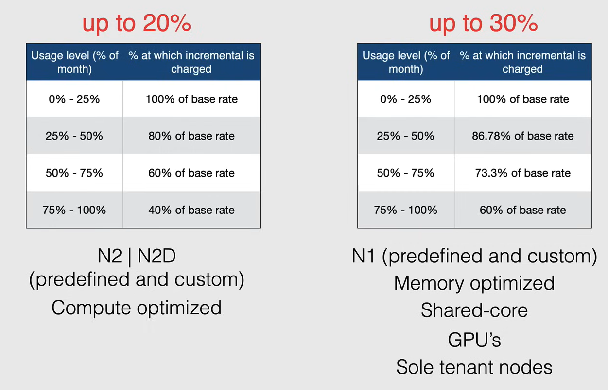

# Compute Engine Billing

Le istanze vengono addebitate al secondo dopo il primo minuto di utilizzo.

- Ogni vCPU e ogni GB di memoria su Compute Engine viene addebitato separatamente, anziché come parte di un singolo tipo di macchina.
- Tutte le vCPU, le GPU e i GB di memoria vengono addebitati al secondo con un minimo di 1 minuto.
  - Ad esempio, se esegui la tua macchina virtuale per 30 secondi, ti verrà addebitato 1 minuto di utilizzo. Dopo un minuto, le istanze vengono addebitate in incrementi di 1 secondo.
- L'uptime dell'istanza è il numero di secondi tra l'avvio di un'istanza e l'arresto di un'istanza (stato "TERMINATED").
  - Se l'istanza è inattiva, ma ha ancora uno stato "RUNNING", ti verrà comunque addebitato l'uptime dell'istanza.

## Reservations

Le prenotazioni sono progettate per riservare in anticipo le istanze VM di cui hai bisogno, in modo da poterle utilizzare quando ne hai bisogno.

- Assicurano che le risorse siano disponibili quando ne hai bisogno.
  - Durante il processo di creazione puoi scegliere come utilizzare una prenotazione, ad esempio puoi scegliere che una prenotazione venga applicata automaticamente a qualsiasi istanza VM esistente che corrisponda alle proprietà della prenotazione, oppure puoi specificare che la prenotazione venga utilizzata da una specifica istanza VM.
- Le prenotazioni sono ottime per garantire che il tuo progetto abbia risorse per:
  - Aumenti futuri della domanda
  - Picchi di utilizzo pianificati o non pianificati
  - Scenari di backup e ripristino di emergenza
  - Buffer quando stai pianificando la crescita

Quando non hai più bisogno della prenotazione, puoi rilasciarla e smettere di pagarla.

Le prenotazioni vengono addebitate come le normali VM, ovvero in base alle tariffe on-demand esistenti che includono sconti per l'uso continuativo e l'uso impegnativo.

L'acquisto di una prenotazione comporta alcune limitazioni:

- Si applicano solo a istanze VM di Compute Engine, Dataproc e Google Kubernetes Engine (GKE).
- Non si applicano a tipi di macchine con core condivisi, istanze VM preemptible o nodi dedicati, Cloud SQL e Dataflow.

## Tipi di sconti

Come già accennato, ogni vCPU e ogni GB di memoria su Compute Engine viene addebitato separatamente, anziché come parte di un singolo tipo di macchina, e viene addebitato come CPU e memoria individuali utilizzate per ora.

La tariffazione basata sulle risorse consente a Compute Engine di offrire sconti per l'uso continuativo e l'uso impegnativo.

Ci sono tre tipi di sconti:

- **Sustained use discounts**
- **Committed use discounts**
- **Preemptible VM instances**

### Sustained Use Discounts

Gli sconti per l'utilizzo continuativo sono sconti automatici che ottieni per l'esecuzione di un'istanza VM per una parte significativa del mese di fatturazione.

Ad esempio, quando esegui una di queste istanze per più del 25% del mese, ottieni uno sconto.

La tabella seguente mostra le tariffe di sconto per l'utilizzo continuativo:

Gli sconti per l'utilizzo continuativo vengono applicati automaticamente alle VM create sia da GKE che da Compute Engine, ma non si applicano alle VM create utilizzando l'ambiente flessibile di App Engine, Dataflow e ai tipi di macchine E2.

Gli sconti successivi vengono applicati all'utilizzo incrementale, dopo aver raggiunto determinate soglie di utilizzo, il che significa che paghi solo per il numero di minuti in cui utilizzi un'istanza e Compute Engine ti offre automaticamente il miglior prezzo.

Considera ora uno scenario in cui hai due istanze o nodi dedicati nella stessa regione con diversi tipi di macchine e che vengono eseguiti in momenti diversi del mese.
Compute Engine suddivide il numero di vCPU e la memoria utilizzati in tutte le istanze che utilizzano tipi di macchine predefiniti e combina le risorse per qualificarsi per lo sconto sull'utilizzo continuativo più grande possibile.

Nell'esempio seguente, supponiamo che tu esegua le seguenti due istanze nella stessa regione (ad esempio us-east1) per l'intero mese.

Nella prima metà del mese, esegui un'istanza `n1-standard-4` (4 vCPU, 15 GB di memoria).

Nella seconda metà del mese, esegui un'istanza `n1-standard-16` (16 vCPU, 60 GB di memoria).

In questi scenari, Compute Engine riorganizza questi tipi di macchine in singole vCPU e memoria e combina il loro utilizzo per creare le seguenti risorse per vCPU e memoria.

Poiché 4 vCPU vengono utilizzate per l'intero mese, lo sconto qui sarebbe del 30%, le 12 vCPU aggiuntive vengono aggiunte nella seconda settimana del mese, quindi lo sconto sarebbe del 10%.

### Committed Use Discounts

Gli sconti per l'utilizzo impegnativo (Committed Use Discounts) sono sconti che ottieni impegnandoti a utilizzare una quantità specifica di risorse per un periodo di tempo specifico.

- Acquisti contratti di 1 anno o 3 anni in cambio di prezzi scontati in modo significativo.
  - Comprendono vCPU, memoria, GPU e SSD locali.
- Sono ideali per carichi di lavoro con esigenze di risorse prevedibili.
- Lo sconto può arrivare fino al 57% per la maggior parte delle risorse.
- Con i tipi di macchine ottimizzate per la memoria, puoi risparmiare fino al 70%.
- Quando acquisti un contratto di utilizzo impegnativo, può essere applicato a livello di progetto e condividere gli sconti tra più progetti.

Ci sono alcune limitazioni per gli sconti per l'utilizzo impegnativo:

- I tipi di macchine con core condivisi sono esclusi.
- Puoi acquistare contratti di utilizzo impegnativo solo su base regionale.
- Se una prenotazione è associata a uno sconto per l'utilizzo impegnativo, la prenotazione non può essere eliminata fino alla scadenza dello sconto per l'utilizzo impegnativo.
- Per acquistare uno sconto per l'utilizzo impegnativo per GPU o SSD locali, devi acquistare un impegno di tipo N1 a uso generale.
- Dopo aver creato un impegno, non puoi eliminarlo.

### Preemptible VM Instances

Le VM preemptive costano fino all'80% in meno rispetto alle istanze standard.

Il prezzo è fisso e non cambierà durante la vita dell'istanza.

Una VM preemptive è un'istanza che puoi creare ed eseguire a un prezzo molto più basso rispetto alle istanze normali, tuttavia, **Compute Engine potrebbe interrompere (preempt) queste istanze se necessita di accedere a quelle risorse per altri compiti.**

Compute Engine generalmente evita di interrompere le istanze, ma non usa un utilizzo istantaneo della CPU o altro comportamento per decidere se interromperla o meno.

Se per errore avvii una VM preemptive e vuoi spegnerla, non c'è alcun costo se è in esecuzione per meno di 10 minuti.

**NOTA** (Importante per l'esame):

- Una caratteristica cruciale delle VM preemptive è che Compute Engine **termina sempre (preempt) queste istanze dopo che sono state in esecuzione per 24 ore.**
- Le VM preemptive **non possono essere migrate live** su un altro host e **non possono essere riavviate automaticamente**.
- **Usa le VM preemptive quando la tua applicazione è tollerante ai guasti e può sopportare possibili interruzioni dell'istanza.**
  - Ad esempio, se stai eseguendo un lavoro di elaborazione batch, puoi utilizzare VM preemptive per risparmiare denaro.
  - Poiché i container sono naturalmente senza stato e tolleranti ai guasti, si adattano bene alle VM preemptive. Quindi, l'esecuzione di VM preemptive in un cluster di Kubernetes Engine è un buon caso d'uso.