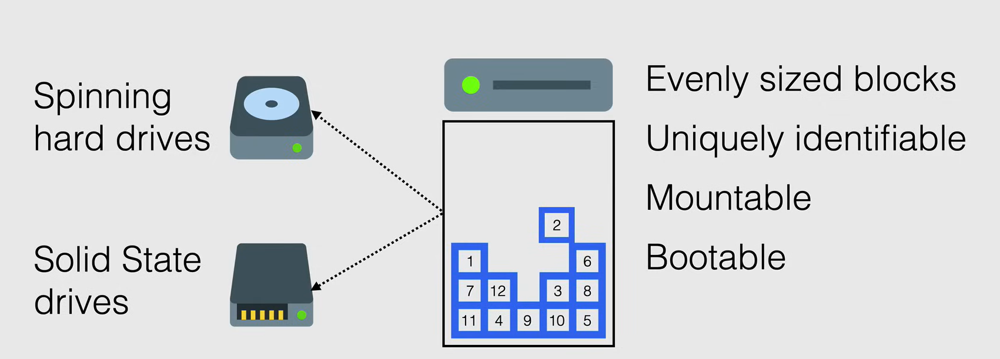
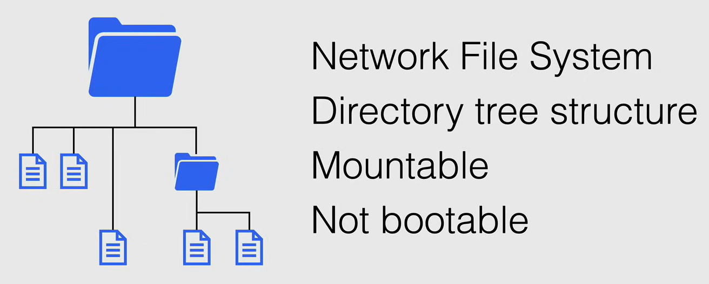
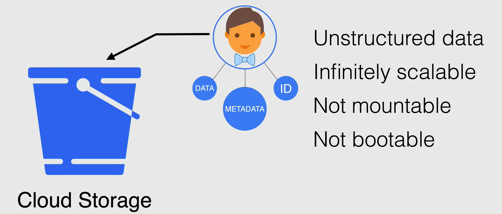
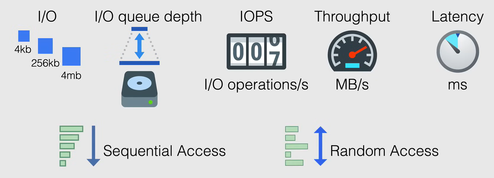

# Storage Fundamentals

## Types of Storage

Ci sono tre tipi di storage in Google Cloud Platform:

1. **Block Storage**: Se cerchi uno storage ad alte prestazioni.
2. **File Storage**: Se hai bisogno di condividere file tra più sistemi o se hai più applicazioni che devono accedere agli stessi file e directory.
3. **Object Storage**: Se hai bisogno di archiviare terabyte di dati per le tue applicazioni web e non vuoi preoccuparti dello scaling.

### Block Storage

**Block storage** (o storage a livello di blocco) è una tecnologia utilizzata per archiviare file di dati su sistemi di archiviazione o ambienti di archiviazione basati su cloud.

È il tipo di archiviazione più veloce disponibile ed è anche efficiente e affidabile.

Con Block Storage, i file vengono suddivisi in blocchi di dati di dimensioni uniformi, ciascuno con un proprio identificatore univoco.

Viene presentato al sistema operativo come dati grezzi senza struttura sotto forma di volume logico o disco rigido, e il sistema operativo lo struttura con un sistema di file come EXT3 o EXT4 su Linux o NTFS su Windows. Successivamente, questo volume o disco viene montato come volume radice in Linux o come unità `C:` o `D:` in Windows.

Block Storage di solito viene fornito su supporti fisici, nel caso di Google Cloud viene fornito come *hard disk drives (HDD)* o *solid-state drives (SSD)*.

**NOTA:** Il volume di Block Storage può essere utilizzato come volume di avvio.

### File Storage

**File storage** (o File level storage, File based storage) viene presentato all'utente e alle applicazioni come un sistema di file, ovvero ricevono i dati tramite alberi di directory, cartelle e file.

La struttura è già stata applicata e non può essere modificata successivamente. Questo tipo di struttura ha solo la capacità di essere **montabile**, ma **non avviabile**.

**NOTA:** Non è possibile installare un sistema operativo su un sistema di archiviazione file, ma è possibile archiviare file, documenti, immagini, video e altri dati.

A causa della struttura del sistema di file, il servizio che serve il sistema di file ha un software sottostante che può gestire i diritti di accesso, la condivisione dei file, il blocco dei file e altri controlli relativi all'archiviazione file.

In Google Cloud il servizio che serve l'archiviazione file si chiama **Cloud Filestore**, ed è di solito presentato sulla rete agli utenti nella tua rete VPC utilizzando il protocollo **NFSv3**.

### Object Storage

**Object storage** è un termine generale che si riferisce al modo in cui organizziamo e lavoriamo con unità di archiviazione chiamate oggetti.

Questo è un tipo di archiviazione che è una collezione piatta di **dati non strutturati**, e questo tipo di archiviazione non ha struttura o gerarchia, ed è composto da tre caratteristiche:

1. **Dati**: I dati effettivi che vengono archiviati nell'oggetto, come un file, un'immagine, un video o un documento.
2. **Metadati**: I dati sui dati, come il nome del file, la dimensione del file, il tipo di file e altre informazioni.
3. **Identificatore univoco**: Un identificatore univoco utilizzato per accedere all'oggetto.

Ciò consente all'archiviazione degli oggetti di essere **scalabile**, poiché non importa dove l'oggetto sia archiviato. Questo tipo di archiviazione può essere trovato su Google Cloud nella forma di **Cloud Storage**.

Cloud Storage è un sistema di archiviazione piatto con un contenitore logico chiamato **bucket**. I bucket vengono utilizzati per archiviare gli oggetti e gli oggetti vengono archiviati nei bucket.

Anche se questo tipo di archiviazione non è **avviabile** (e **non montabile**), utilizzando uno strumento open-source chiamato **Filestore FUSE**, è possibile montare questo tipo di archiviazione su Google Cloud.

## Storage Performance Terms

Per definire le prestazioni dello storage, possiamo utilizzare diversi termini.

- **I/O**: È un'operazione di lettura o scrittura singola su un dispositivo di archiviazione e può essere misurata in dimensioni di blocco (come 4KB, 8KB, 16KB, ecc.).
- **I/O Queue Depth**: È il numero di operazioni di I/O in attesa di essere elaborate dal dispositivo di archiviazione. Le richieste vengono accodate quando vengono richieste più velocemente di quanto il dispositivo di archiviazione possa elaborarle.
- **IOPS (Input/Output Operations Per Second)**: È il numero di operazioni di I/O che possono essere eseguite dal dispositivo di archiviazione in un secondo. È una misura comune delle prestazioni utilizzata con i dispositivi di archiviazione.
- **Throughput**: È la quantità di dati che può essere trasferita da un luogo all'altro in un determinato periodo di tempo. Di solito viene misurata in MB/s o GB/s.
- **Latency**: È la misura del ritardo tra il momento in cui viene richiesto un dato e il momento in cui il dato viene ricevuto. Di solito viene misurata in millisecondi (ms).

Infine abbiamo:

- **Sequential Access**: È il processo di lettura o scrittura dei dati in ordine sequenziale, come leggere un libro dalla prima pagina all'ultima pagina.
- **Random Access**: È il processo di lettura o scrittura dei dati in un ordine non sequenziale, come leggere un libro saltando da una pagina all'altra. È molto più lento rispetto all'accesso sequenziale.

