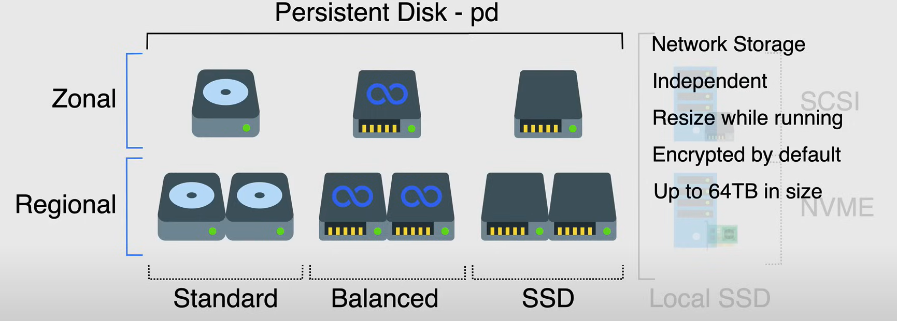
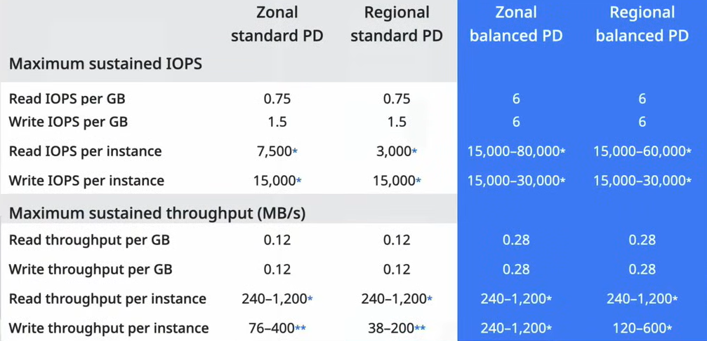
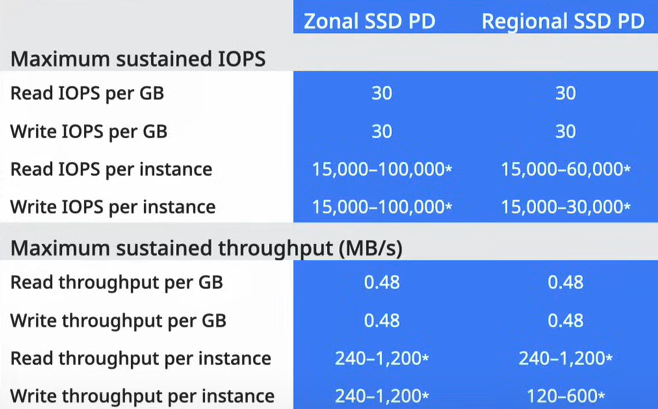

# Persistent Disk e Local SSD

I Persistent Disk e i Local SSD sono i due tipi di dispositivi di archiviazione a blocchi disponibili in Google Cloud Platform.

Per impostazione predefinita, ogni istanza di Compute Engine viene fornita con un disco di avvio che è un *persistent disk*. Questo disco viene utilizzato per archiviare il sistema operativo e le applicazioni installate sull'istanza.

Quando è necessario uno spazio di archiviazione aggiuntivo, è possibile aggiungere uno o più persistent disk o local SSD all'istanza.

I persistent disk e i local SSD sono disponibili in diversi tipi e possono essere configurati sia a livello zonale che regionale.

## Persistent Disks

I Persistent Disks sono dispositivi di archiviazione a blocchi durevoli e ad alte prestazioni utilizzati per archiviare dati.

- Non sono fisicamente collegati all'istanza, ma sono dispositivi di archiviazione collegati in rete accessibili dall'istanza.

- Quindi, sono indipendenti dall'istanza e possono persistere anche se l'istanza viene eliminata (attivando l'apposita flag durante la creazione).
  - È anche possibile scollegare il disco e spostarlo su un'altra istanza quando necessario.

- L'espansione dei persistent disks può essere effettuata automaticamente e ***in tempo reale***, utilizzando la funzionalità di ridimensionamento del disco, senza tempi di inattività e aggiungendo anche dischi aggiuntivi all'istanza per prestazioni e archiviazione aggiuntive.

- Sono ***crittografati per impostazione predefinita*** e Google ti offre la possibilità di utilizzare chiavi personalizzate per la crittografia.

- Ogni persistent disk può avere una dimensione massima di 64 TB e la maggior parte delle istanze può avere fino a 128 persistent disks e fino a 257 TB di spazio totale su disco collegato ad essi.

**NOTA:** Le istanze di tipo shared-core possono avere fino a 16 persistent disks e 3 TB di spazio totale su disco collegato ad essi.

Per i Persistent Disks, sono disponibili due opzioni geografiche:

- **Zonal Persistent Disks**: Questi dischi sono disponibili in una zona e una regione.
  - Questi dischi sono i dischi più comunemente utilizzati e vengono utilizzati dalle istanze nella stessa zona.
  - Sono *ridondanti all'interno della stessa zona*, ma non sono replicati tra le zone.
    - Quindi, sono *soggetti a perdita di dati* se la zona fallisce.
  - Possono essere utilizzati con qualsiasi tipo di macchina.

- **Regional Persistent Disks**: Questi dischi sono replicati in più zone all'interno di una regione e possono essere utilizzati da istanze in una qualsiasi di queste zone.
  - Forniscono archiviazione durevole e *replicazione dei dati tra due zone nella stessa regione*.
  - Se si progettano sistemi che richiedono *alta disponibilità*, è consigliabile utilizzare dischi persistenti regionali, combinati con snapshot per la durabilità.
  - Sono progettati per funzionare con gruppi di istanze gestite regionali, nel caso improbabile che una zona fallisca, è possibile spostare di solito i carichi di lavoro in esecuzione su dischi persistenti regionali in un'altra zona utilizzando il flag `force attached`.
  - Sono *più lenti dei dischi zonali* a causa della replicazione che avviene tra le zone.

**NOTA:** 

- *I dischi persistenti regionali standard hanno una dimensione minima di 200 GB.*
- *Non è possibile utilizzare dischi persistenti regionali con tipi di macchine ottimizzate per la memoria o tipi di macchine ottimizzate per il calcolo.*

Ci sono tre tipi di dischi persistenti disponibili in Google Cloud Platform:

- **Standard** (`pd-standard`): Questo è il tipo di disco predefinito utilizzato per l'archiviazione a uso generale. È un disco magnetico utilizzato per archiviare dati a cui non si accede frequentemente.
  - Supportato da unità disco rigido standard (*HDD*).
  - *Economico* e ideale per carichi di lavoro non intensivi in termini di I/O.
    - Opzione di disco persistente a prezzo più basso.
  - Ottimo per carichi di lavoro di elaborazione di grandi quantità di dati che utilizzano principalmente *I/O sequenziale*.
  - Prestazioni:
    - La larghezza di banda e gli IOPS dipendono dalla dimensione del disco, dal numero di vCPU, ecc.
    - Il PD zonale ha un numero di IOPS di lettura superiore rispetto al PD regionale, poiché quest'ultimo deve accedere ai dati da due dischi diversi, in due zone diverse.

- **Balanced** (`pd-balanced`): Questo tipo di disco viene utilizzato per carichi di lavoro che richiedono un equilibrio tra prestazioni e costo. È un disco a stato solido utilizzato per archiviare dati a cui si accede frequentemente.
  - Alternativa ai dischi persistenti SSD che bilancia prestazioni e costo.
  - Ha lo stesso numero massimo di IOPS dei dischi persistenti SSD, ma un numero inferiore di IOPS per GB.
  - Sono a uso generale.
  - Prezzo compreso tra i dischi persistenti Standard e SSD.

- **SSD** (`pd-ssd`): Questo tipo di disco viene utilizzato per carichi di lavoro che richiedono elevate prestazioni e bassa latenza. È un disco a stato solido utilizzato per archiviare dati a cui si accede frequentemente.
  - Ottimo per applicazioni aziendali e database ad alte prestazioni che richiedono una latenza inferiore e più IOPS.
  - Latenza nell'ordine dei millisecondi a cifra singola.
  - Sono l'opzione più veloce e costosa.

 

## Local SSDs

I Local SSD (`local SSD`) sono dispositivi di archiviazione a blocchi ad alte prestazioni che sono fisicamente collegati all'istanza.

Hanno una maggiore velocità di trasferimento e una latenza inferiore rispetto ai persistent disks.

I dati sui local SSD persistono fino a quando l'istanza viene arrestata o eliminata.

Ogni local SSD ha una dimensione di 375 GB, ma è possibile collegare un massimo di 24 local SSD a un'istanza, per un totale di 9 TB di archiviazione su local SSD.

Sono ottimi quando è necessario un disco di lavoro veloce o una cache e non si desidera utilizzare la memoria dell'istanza.

Sono disponibili in due varianti:

- **SCSI**:
  - È un protocollo più vecchio e creato specificamente per i dischi rigidi.
  - Ha il limite di avere una sola coda per i comandi.

- **NVMe**:
  - È un protocollo più recente e creato specificamente per gli SSD.
  - Ha il vantaggio di avere più code (fino a 64K), e ogni coda può avere fino a 64K comandi.
  - Ha un costo più elevato rispetto a SCSI.

Non è possibile utilizzare chiavi di crittografia fornite dal cliente con i local SSD, perché Compute Engine crittografa automaticamente i dati.

Sono disponibili solo per i tipi di macchine `N1`, `N2` e le macchine ottimizzate per il calcolo.

In termini di prestazioni, la velocità di trasferimento è la stessa tra SCSI e NVMe, ma le IOPS di lettura/scrittura sono superiori in NVMe.

## Performance Scaling

Si riferisce all'archiviazione a blocchi sulle istanze di Compute Engine.

Le prestazioni dei persistent disks scalano in base alla dimensione del disco e al numero di vCPU presenti nell'istanza.

- *Le prestazioni scalano linearmente fino a raggiungere i limiti del volume o i limiti dell'istanza.*

**NOTA:** Un'operazione di I/O è un'operazione di rete, poiché il persistent disk è un'archiviazione collegata in rete, quindi la CPU dell'istanza viene utilizzata per elaborare le operazioni di I/O.

- La raccomandazione di Google è di avere una vCPU disponibile per ogni 2000-2500 IOPS di traffico previsto.
