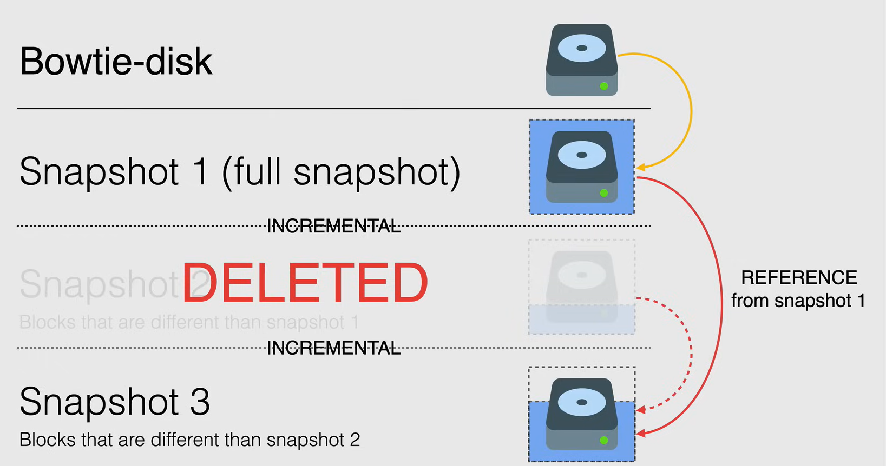

# Snapshot

I snapshot sono un ottimo modo per eseguire il backup dei dati da istanze in esecuzione o interrotte per evitare la perdita di dati imprevista.

I snapshot sono anche una strategia eccellente da utilizzare in un piano di backup per tutte le istanze, indipendentemente dalla loro posizione.

- **Backup** e **restore** del disco persistente.
- Risorse **globali**, quindi ogni snapshot è accessibile da qualsiasi risorsa all'interno dello stesso progetto.
  - È possibile condividere gli snapshot tra progetti.
- Supporto per dischi persistenti **zonal** e **regionali**.
- **Incrementali** e compressi automaticamente.
- Gli snapshot vengono archiviati in **Cloud Storage**.
- Archiviati in una posizione **regionale** o **multi-regionale**.
  - Con la modalità multi-regionale, vengono replicati in più regioni, garantendo l'alta disponibilità ma a un costo maggiore.

## Create a snapshot

Gli snapshot sono incrementali, quindi il primo snapshot di un disco persistente è uno **snapshot completo**, che contiene tutti i dati del disco.

Gli snapshot successivi sono incrementali, quindi contengono solo i dati che sono cambiati rispetto all'ultimo snapshot.

Quando decidiamo di eliminare uno snapshot, se non ha dipendenze, verrà eliminato immediatamente, ma se ha dipendenze, ci saranno alcune operazioni che avverranno dietro le quinte.

Ad esempio, se eliminiamo lo snapshot `Snapshot 2`, lo snapshot successivo allo snapshot completo non fa più riferimento allo snapshot da eliminare, quindi `Snapshot 1` diventa il riferimento per `Snapshot 3`, e i dati relativi necessari per il ripristino di altri snapshot vengono spostati allo snapshot successivo.

## Schedule snapshots

Lo scheduling degli snapshot è un ottimo modo per automatizzare il processo di creazione degli snapshot.

- **Best practices** per il backup:
- Deve essere nella **stessa regione** del disco persistente.

Ci sono due modi per creare uno scheduling degli snapshot:

1. Creare uno scheduling degli snapshot e poi **collegarlo** a un disco persistente esistente.
2. Creare un nuovo disco con uno scheduling degli snapshot.

Alcune opzioni quando si crea uno scheduling degli snapshot sono la politica di conservazione e le **regole di eliminazione del disco di origine**.

- Abbiamo anche l'opzione di impostare una **politica di conservazione degli snapshot**, che definisce per quanto tempo si desidera conservare gli snapshot.
  - Se si sceglie di impostare una politica di conservazione degli snapshot, è necessario farlo come parte dello scheduling degli snapshot.
- Quando si crea uno scheduling degli snapshot, è possibile anche **impostare una regola di eliminazione del disco di origine**, *che controlla cosa succede allo snapshot quando il disco di origine viene eliminato.*

Ci sono alcune limitazioni da tenere presente per quanto riguarda lo scheduling degli snapshot:

- Un disco persistente può avere solo uno scheduling degli snapshot collegato ad esso alla volta.
- Non è possibile eliminare uno scheduling degli snapshot se è collegato a un disco.
- Dopo aver creato uno scheduling degli snapshot, non è possibile modificarlo, per aggiornare lo scheduling è necessario eliminare lo scheduling degli snapshot e crearne uno nuovo.

## Gestire gli snapshot

- È possibile creare uno snapshot di un disco al massimo una volta ogni 10 minuti.
  - Non è possibile creare uno snapshot di un disco a intervalli inferiori a 10 minuti.
- È consigliabile creare snapshot a intervalli regolari per ridurre al minimo la perdita di dati in caso di un guasto imprevisto.
  - Se si hanno snapshot esistenti di un disco persistente, il sistema li utilizza automaticamente come base per i futuri snapshot.
- Per migliorare le prestazioni, è possibile **eliminare snapshot eccessivi** creando un'**immagine** e riutilizzandola.
  - È utile anche in termini di costo.
- Impostare lo scheduling nelle **ore non di punta** per ridurre l'impatto sulle prestazioni dell'istanza.
- Se si utilizza Windows, creare uno **snapshot VSS** per garantire la coerenza dei dati.