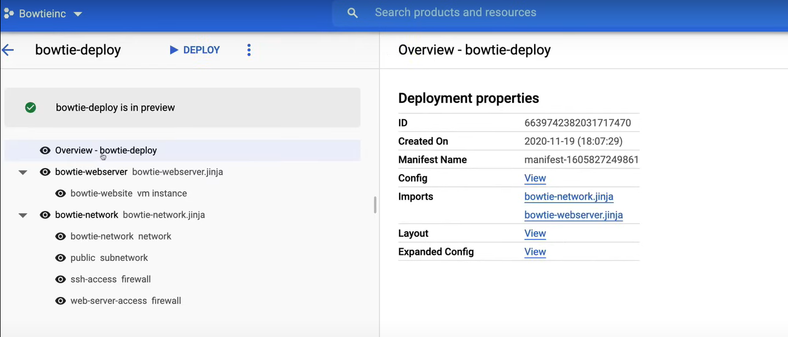
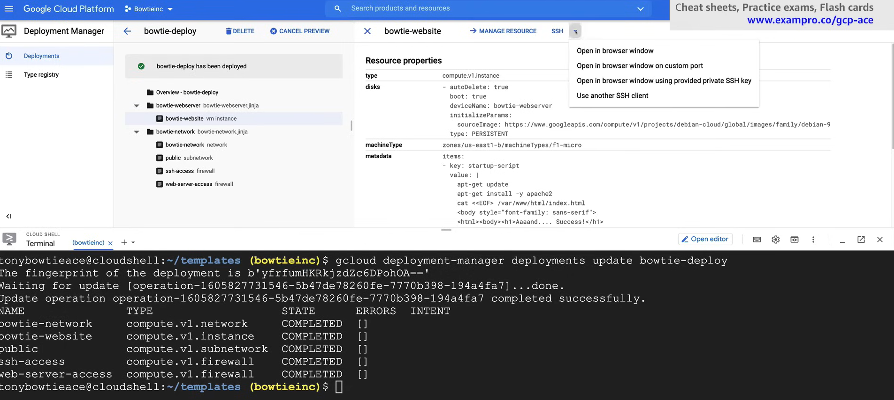

# Deployment Manager

# Deployment Manager

Deployment Manager è un servizio di distribuzione dell'infrastruttura che automatizza la creazione e la gestione delle risorse di Google Cloud. Consente di creare, distribuire e gestire ambienti Cloud complessi utilizzando semplici modelli (YAML, Jinja, Python, ecc.).

## Configuration

Una **configurazione** definisce la struttura della tua distribuzione, poiché è necessario specificare un file di configurazione per creare una distribuzione.

Può essere scritta in YAML e elenca tutte le risorse che desideri distribuire e le loro proprietà.

Ogni risorsa deve contenere i seguenti tre componenti:

- **Nome**: Il nome della risorsa.
  - È una stringa definita dall'utente che deve essere univoca all'interno della distribuzione.
  - Non deve contenere spazi o caratteri speciali.
- **Tipo**: Il tipo di risorsa che stai distribuendo.
  - Un tipo può rappresentare una singola risorsa API (*tipo di base*) o una collezione di risorse (*tipo composito*).
  - La sintassi per un tipo di base è `[API].[VERSIONE].[RISORSA]`.
    - Ad esempio, `compute.v1.instance`.
  - La sintassi per un tipo composito è `gcp-types/[PROVIDER]:[RISORSA]`.
    - Ad esempio, `gcp-types/compute-v1:addresses`.
- **Proprietà**: Le proprietà della risorsa.
  - Questi sono i parametri che desideri impostare per la risorsa.
  - Devono corrispondere alle proprietà del tipo di risorsa che stai distribuendo.

Senza questi tre componenti, la distribuzione fallirà.

Esempio di un file di configurazione:

```yaml
resources:
- name: my-vm
  type: compute.v1.instance
  properties:
    zone: us-central1-a
    machineType: zones/us-central1-a/machineTypes/n1-standard-1
    disks:
    - deviceName: boot
      type: PERSISTENT
      boot: true
      autoDelete: true
      initializeParams:
        sourceImage: projects/debian-cloud/global/../images/debian-9-stretch-v20190213
    networkInterfaces:
    - network: global/networks/default
      accessConfigs:
      - name: External NAT
        type: ONE_TO_ONE_NAT
```

### Templates

Una configurazione può contenere **template**, che sono pezzi di configurazione riutilizzabili che possono essere utilizzati per creare risorse.

I template vengono importati e utilizzati come tipi nel file di configurazione.

Possiamo utilizzare moduli per creare configurazioni dinamiche e possiamo utilizzare variabili per rendere le nostre configurazioni più flessibili.

Possono essere scritti in Jinja o Python.

Esempio di un file di template in Python:

```python
resources.append({
    'name': 'my-vm',
    'type': 'compute.v1.instance',
    'properties': {
        'zone': 'us-central1-a',
        'machineType': 'zones/us-central1-a/machineTypes/n1-standard-1',
        'disks': [{
            'deviceName': 'boot',
            'type': 'PERSISTENT',
            'boot': True,
            'autoDelete': True,
            'initializeParams': {
                'sourceImage': 'projects/debian-cloud/global/../images/debian-9-stretch-v20190213'
            }
        }],
        'networkInterfaces': [{
            'network': 'global/networks/default',
            'accessConfigs': [{
                'name': 'External NAT',
                'type': 'ONE_TO_ONE_NAT'
            }]
        }]
    }
})
```

Uno dei vantaggi dell'uso dei template è la capacità di creare e definire personalizzate **proprietà del template**, ovvero variabili arbitrarie che definisci nei file di template.

Qualsiasi file di template o di configurazione che utilizza il template in questione può fornire un valore per la proprietà del template senza modificare il template stesso.

Questo ti permette di astrarre la proprietà in modo da poter cambiare il valore della proprietà per ogni deployment unico.

Esempio di un file di template con una proprietà di template per l'ID del progetto:

```yaml
resources:
- name: my-vm
  type: compute.v1.instance
  properties:
    zone: us-central1-a
    machineType: https://www.googleapis.com/compute/v1/projects/{{ env["project"] }}/zones/us-central1-a/machineTypes/n1-standard-1
    disks:
    - deviceName: boot
      type: PERSISTENT
      boot: true
      autoDelete: true
      initializeParams:
        sourceImage: projects/debian-cloud/global/../images/debian-9-stretch-v20190213
```

## Deployment

Un **deployment** è una raccolta di risorse che vengono implementate e gestite insieme, utilizzando un file di configurazione.

### Implementa

Quando **deploy**, fornisci un file di configurazione valido e il Gestore di Implementazione crea le risorse specificate nella configurazione.

Puoi implementare un file di configurazione utilizzando lo strumento da riga di comando `gcloud`:

```bash
gcloud deployment-manager deployments create my-deployment --config my-config.yaml
```

**NOTA:** Non puoi implementare con la Console di Google Cloud.

Google Cloud offre una serie di **template predefiniti** dal mercato GCP, che puoi utilizzare per implementare risorse comuni, come istanze VM, reti e bucket di archiviazione.

### Aggiorna

Quando crei un'implementazione, poi puoi **aggiornarla** quando vuoi, aggiungendo, rimuovendo o modificando (cambiando proprietà) risorse nel file di configurazione.

Quando aggiorni un'implementazione, ogni implementazione ha un **manifesto** corrispondente, una *proprietà di sola lettura*, che descrive le risorse che fanno parte dell'implementazione, ed è automaticamente aggiornato quando aggiorni l'implementazione.

### Elimina

Quando **elimini** un'implementazione, tutte le risorse che fanno parte dell'implementazione vengono anch'esse eliminate. Se vuoi eliminare solo risorse specifiche, eliminali dal file di configurazione e aggiorna l'implementazione.

## Migliori Pratiche

- **Suddividi la tua configurazione** in unità logiche
  - Ad esempio, dovresti creare configurazioni separate per networking, storage e risorse di calcolo, in modo che ogni team possa lavorare nel proprio dominio senza dover setacciare un grande file di configurazione.
- **Usa i riferimenti** - impone l'ordine di creazione delle risorse
  - I riferimenti dovrebbero essere utilizzati per valori che non sono definiti fino a quando una risorsa non viene creata.
  - Ad esempio, l'auto-link delle risorse, l'indirizzo IP o l'ID generato dal sistema.
  - Senza riferimenti, il Gestore di Implementazione *creerà risorse in parallelo*, il che può causare errori.
- **Anteprima** della tua implementazione
  - Usa il flag `--preview` per vedere quali risorse saranno create, aggiornate o eliminate prima di implementare effettivamente la configurazione.
- **Automatizza** la creazione di risorse
  - Usa il Gestore di Implementazione per automatizzare la creazione di risorse, in modo da poter facilmente creare, aggiornare ed eliminare risorse in modo ripetibile.
  - Questo ti permette di creare un'*infrastruttura come codice*, e di versionare le tue configurazioni.
- **Usa un sistema di controllo versione**
  - Conserva i tuoi file di configurazione in un sistema di controllo versione, in modo da poter tracciare le modifiche e tornare alle versioni precedenti se necessario.
    - Configurazioni precedenti note come buone
    - Traccia di audit delle modifiche
    - Usa la configurazione per i pipeline CI/CD
## Demo

A video demo of Deployment Manager can be found [here](https://youtu.be/jpno8FSqpc8?si=832eJD6JNcjAq9cK&t=47808).

First open the Google Cloud Editor.

1. Create a `templates` folder to store your configuration files.
2. Upload `bowtie-deploy.yaml`, `bowtie-network.jinja`, and `bowtie-webserver.jinja` to the `templates` folder. 

   - `bowtie-deploy.yaml`:

        ```yaml
        imports:
        - path: bowtie-webserver.jinja
        - path: bowtie-network.jinja

        resources:
        #Create bowtie-instance
        - name: bowtie-webserver
        type: bowtie-webserver.jinja
        properties:
            zone: us-east1-b
            machineType: f1-micro
            network: $(ref.bowtie-network.selfLink)

        #Create bowtie-network
        - name: bowtie-network
        type: bowtie-network.jinja
        properties:
            region: us-east1
        ```

        - `imports` section: 
          - It specifies the templates that are used in the configuration file.
          - The `path` attribute specifies the path to the template file.
        - `resources` section:
          - It specifies the resources that are created in the deployment.
          - The `type` attribute specifies the template that is used to create the resource.

   - `bowtie-webserver.jinja`:

        ```jinja
        resources:
        - name: bowtie-website
        type: compute.v1.instance
        properties:
            zone: {{ properties["zone"] }}
            machineType: zones/{{ properties["zone"] }}/machineTypes/{{ properties["machineType"] }}
            disks:
            - deviceName: {{ env["name"] }}
            type: PERSISTENT
            boot: true
            autoDelete: true
            initializeParams:
                sourceImage: https://www.googleapis.com/compute/v1/projects/debian-cloud/global/../images/family/debian-9
            metadata:
            items:
            - key: startup-script
                value: |
                apt-get update
                apt-get install -y apache2
                cat <<EOF> /var/www/html/index.html
                <body style="font-family: sans-serif">
                <html><body><h1>Aaaand.... Success!</h1>
                <p>My, you look dapper today!</p>
                <p></p>
                </body></html>
                EOF
            tags:
            items: ["http-server"]
            networkInterfaces:
            - network: $(ref.bowtie-network.selfLink)
            subnetwork: $(ref.public.selfLink)
            # Access Config required to give the instance a public IP address
            accessConfigs:
            - name: External NAT
                type: ONE_TO_ONE_NAT
        ```

        - `properties` section:
          - It specifies the properties of the resource that is created.
          - The `zone` and `machineType` properties are set using the values provided in the configuration file.
        - `env` is the environment variable.

   - `bowtie-network.jinja`:

        ```jinja
        resources:
        - name: bowtie-network
        type: compute.v1.network
        properties:
            autoCreateSubnetworks: false
        - name: public
        type: compute.v1.subnetwork
        properties:
            ipCidrRange: 10.0.0.0/24
            network: $(ref.bowtie-network.selfLink)
            privateIpGoogleAccess: false
            region: {{ properties["region"] }}
        - name: ssh-access
        type: compute.v1.firewall
        properties:
            network: $(ref.bowtie-network.selfLink)
            sourceRanges: ["0.0.0.0/0"]
            allowed:
            - IPProtocol: TCP
            ports: ["22"]
        - type: compute.v1.firewall
        name: web-server-access
        properties:
            network: $(ref.bowtie-network.selfLink)
            targetTags: ["http-server"]
            sourceRanges: ["0.0.0.0/0"]
            allowed:
            - IPProtocol: TCP
                ports: ["80"] 
        ```

3. Turn on the Deployment Manager API.
   1. Search for `Deployment Manager API` in the search bar.
   2. Enable the API.

4. Create a new deployment.

   1. Enter into the folder where the configuration file is located.

        ```bash
        cd templates
        ```

   2. Deploy the configuration file.

        ```bash
        gcloud deployment-manager deployments create bowtie-deploy --config bowtie-deploy.yaml --preview
        ```

        

   3. If we click on the links under the section `Imports`, we can see the content of the templates.

5. But it is only a preview, so we need to deploy it. Deploy the configuration file. We can click on the `Deploy` button in the Google Cloud Console, or we can deploy it using the command line.

    ```bash
    gcloud deployment-manager deployments update bowtie-deploy
    ```

    

6. Now we can check the resources that have been created.

   1. Go to the `Compute Engine` section in the Google Cloud Console.
   2. Click on `VM instances` page. Check the VM instance that has been created.
   3. Go to the `VPC Network` section in the Google Cloud Console.
   4. Click on `VPC networks` page. Check the network that has been created.
   5. Click on `Firewall rules` page. Check the firewall rules that have been created.
    
7. Check the website.

    1. Copy the `External IP` of the VM instance.
    2. Open a new tab in your browser and paste the `External IP` of the VM instance.
    3. You should see the website that has been created. 

8. Now we can delete the deployment, either from the Google Cloud Console clicking on the `Delete` button on the Deployment Manager page, or using the command line.

    ```bash
    gcloud deployment-manager deployments delete bowtie-deploy
    ```