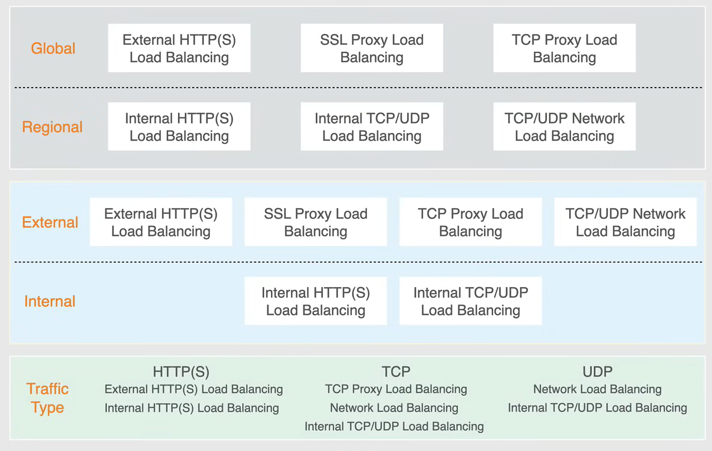
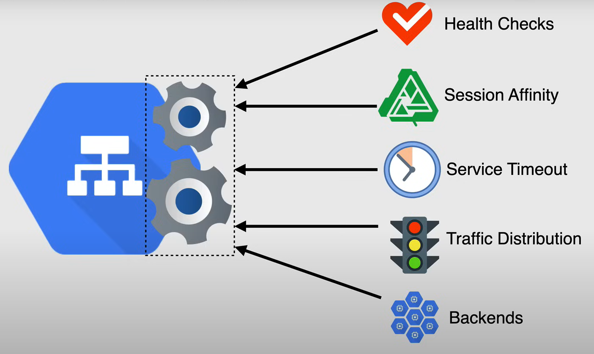
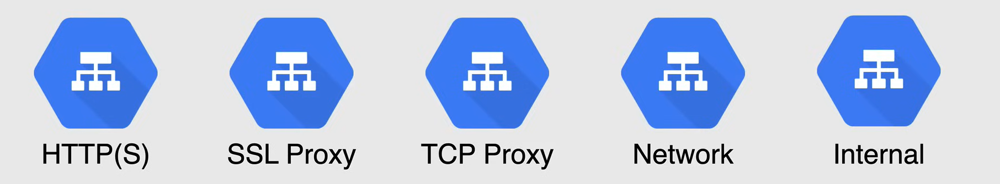
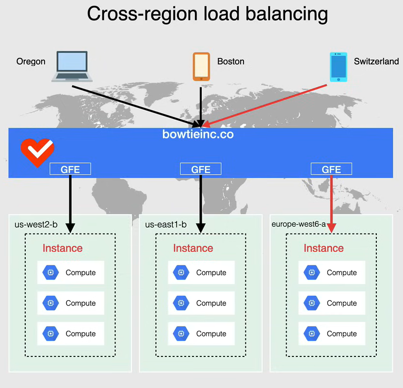
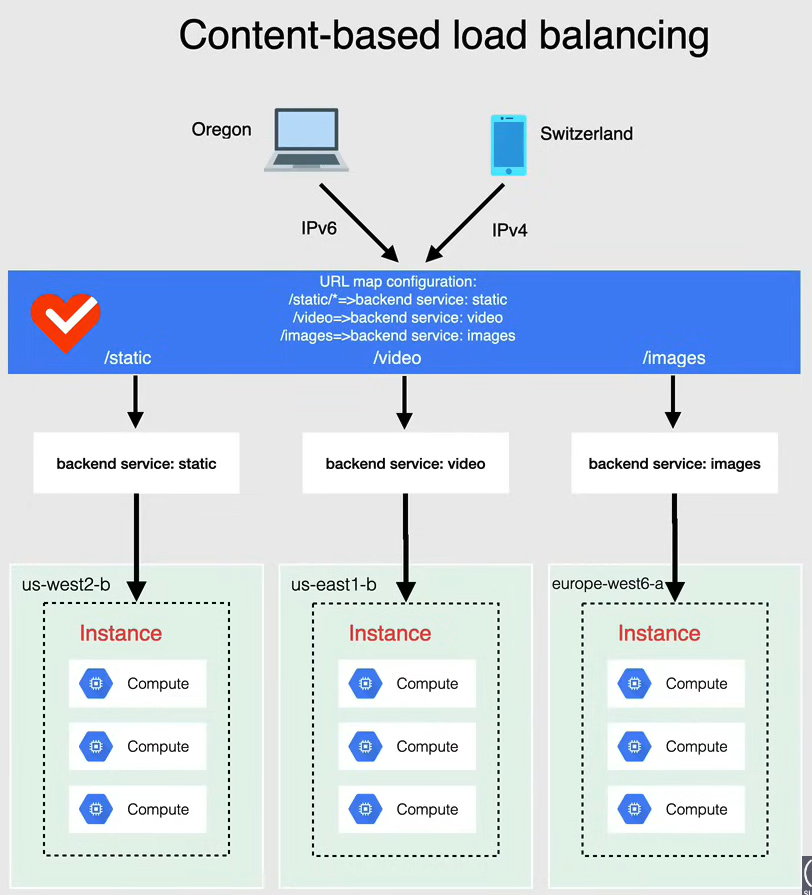
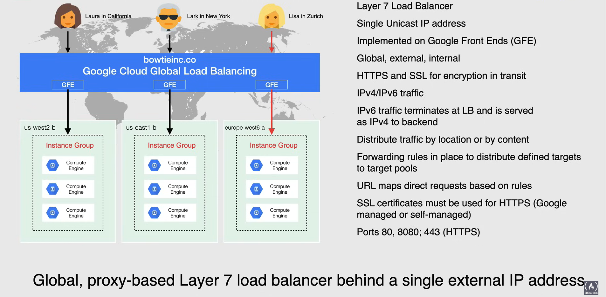
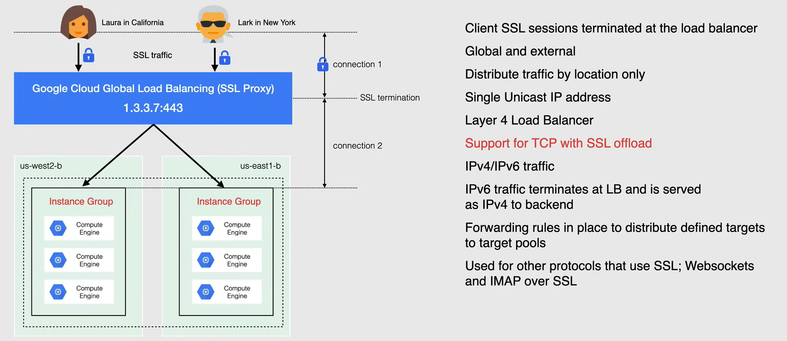
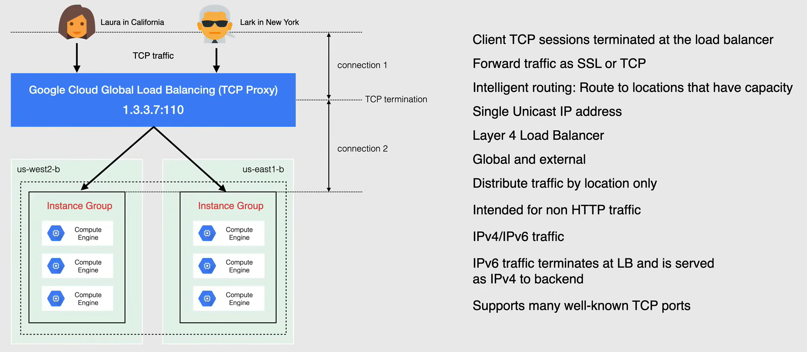
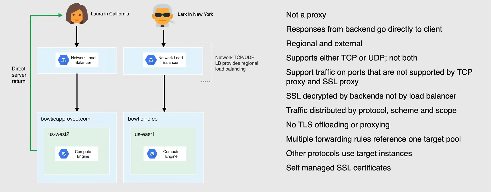
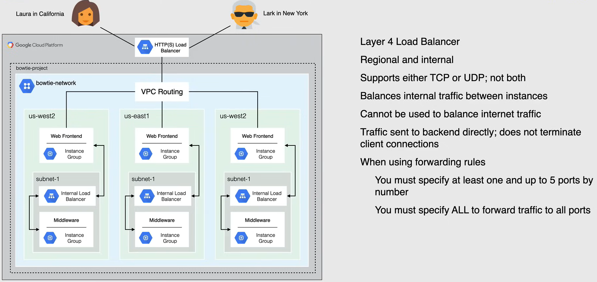

# Cloud Load Balancers

Google Cloud Load balancing is essential when using it with instance groups, kubernetes cluster, and it is pretty much the defacto when it comes to balancing the load across multiple instances.

- A Load balancer **distributes user traffic** across multiple instances.
  - By spreading the load, you reduce the risk of overloading a single instance.

- It is a single point of entry with **multiple backends**.
  - In GCP, the backend can be an instance group, a zonal or regional managed instance group, or a zonal or regional unmanaged instance group.

- It is a **fully distributed, software-defined managed service**.
  - It is not a physical device, but a service that is fully managed by Google. 

- It is **global** or **regional**.

- It is meant to serve content as close as possible to the users to reduce latency.

- Google Cloud Load Balancer offers autoscaling with **health checks**.
  - It checks the health of the instances and removes unhealthy instances from the pool.

## Types of Load Balancers

There are three types of load balancers in Google Cloud:

- **Global vs Regional Load Balancer**
  - **Global**
    - It is used for **global applications** that need to serve content to users around the world.
    - It is a single anycast IP that can be used to balance the load across multiple regions.
    - It is great when your backends are distributed across multiple regions, and users need to access to the same application and content.

  - **Regional**
    - It is a single IP that can be used to balance the load across multiple zones within a region.
    - It is used for **regional applications** that need to serve content to users in a specific region.

- **Internal vs External Load Balancer**
  - **Internal**
    - It is used for **internal applications** that need to serve content to internal users.
    - It is not accessible from the internet.
    - It is used for internal applications that need to serve content to internal users.
    - They are designed to distribute traffic within your network.

  - **External**
    - It is used for **external applications** that need to serve content to external users.
    - It is accessible from the internet.
    - They are designed to distribute traffic coming into your network from the internet

- **Traffic Type**:
  - **HTTP(S) Load Balancer**
  - **TCP Load Balancer**
  - **UDP Load Balancer**

## Backend Services

Define how Cloud Load Balancing distributes traffic to a set of backends.

The backend service configuration contains a set of values such as the protocol used to connect the backends, various distribution in session settings, and the health check configuration.

These settings provide a fine grain control over how your balancer behaves.

The backend of a backend service can be an instance groups, or network endpoint groups, also known as **NEG**s, but not a combination of both.

The values of the backend service are:

- **Health Check**
  - Google Cloud uses the overall health state of each back-end to determine its eligibility to receive new requests or connections.
  - Backends that respond successfully for the configured number of times are considered *healthy*.
  - Backends that fail to respond successfully for a separate number of times are considered *unhealthy*, and so the traffic is not be routed to them.

- **Session Affinity**
  - It sends all requests from the same client to the same backend if the backend is healthy and it has capacity.

- **Session Timeout**
  - It is the maximum time that Load Balancer waits for a backend to return a full response to a request.

- **Traffic Distribution**
  - It is comprised of three different values:
    - **Balancing Mode**: It is the method used to measure back-end readiness for the new requests or connections.
    - **Target Capacity**: It defines a target maximum number of connections, a target maximum rate, or a target maximum CPU utilization.
    - **Capacity Scaler**: It adjusts overall available capacity without changing the target capacity.

- **Backends**
  - It is a group of endpoints that receive traffic from the load balancer.
  - There are several types of backends:
    - **Instance Groups**: Managed or unmanaged instance groups.
    - **Network Endpoint Groups (NEGs)**: It is a collection of network endpoints that are used to define the backends for a backend service.

## Google Cloud Load Balancers

### HTTP(S) Traffic Management

HTTP(S) Load Balancing is **cross-region** load balancing and **content-based** routing for HTTP(S) requests.

- HTTP(S) Load Balancing is **cross-region** load balancing, which means that it can intelligently route requests from users to the nearest backend instance group or NEG based on proximity, health, and other factors.

  - When you configure an external HTTP or HTTP(S) load balancer in premium tier, it uses a global external IP address and can intelligently route requests from users to the nearest backend instance group or NEG based on proximity, health, and other factors.

  - For example if you set up instance groups in north america and europe, and attach them to a low balancer back-end service, users requests around the world are automatically sent to the VMs closest to them, assuming the VMs are healthy and have enough capacity.

  - If the closest VMs are unhealthy or at capacity, the load balancer will automatically reroute the request to the next closest VMs.

    

- HTTP(S) Load Balancing supports **content-based** load balancing, using URL maps to select a backend service based on the requested host name, request path, or both.

  - For example, you can use a set of instance groups or NEGs to handle your video content, and another set to handle static as well as another set to handle any images.
  
  - You can use HTTP(S) Load Balancing with Cloud Storage Bucket, and after you have your balancer setup, you can add Cloud Storage Bucket to it.

    

HTTP(S) Load Balancing is a **global** proxy-based Layer 7 load balancer which is at the Application Layer of the OSI model.

- With all the other Load Balancers available in GCP is HTTP(S) Load Balancer is the only Layer 7 Load Balancer.
  - All the other Load Balancers are Layer 4 Load Balancers, and work at the Network Layer of the OSI model.

- It enables you to serve your application worldwide behind a single external unicast IP address.

- It distributes HTTP(S) traffic to back-end hosted on Compute Engine, G and GKE.

- External HTTP(S) Load Balancing is implemented on Google front-ends (or GFEs), as shown in the following diagram.

  - GFEs are distributed globally and operate together using the Google global network and control plane
  - In the premium tier, GFEs offer cross-region load balancing directing traffic to the closest healthy backend that has capacity and terminating the HTTP(S) traffic as close as possible to the user.
  - In the standard tier, the load balancing is handled regionally.

- This load balancer is available to be used both internally and externally.
  - It makes this load balancer **global, external, and internal**.

- It gives support for HTTPS and SSL which covers TLS for encryption in transit.

- It accepts all traffic whether it is IPv4 or IPv6.
  - IPv6 traffic terminates at Load Balancer and is served as IPv4 to the backends.

- The traffic is distributed by location or by content.

- Forwarding rules are in place to distribute defined targets to each target pool for the instance groups.

- URL maps direct your requests based on rules.
  - So you can create different rules depending on what type of traffic you want to direct and put them in maps.

- SSL certificates are needed for HTTPS traffic.
  - It can be Google-managed or self-managed.

- The ports used are `80`, `8080`, `443` (HTTPS) 

### SSL Proxy

SSL Proxy Load Balancing is a reverse proxy load balancer that distributes the SSL traffic coming from the internet to the VMs.

- User SSL connection are terminated at the load balancer, and then proxied to the closest available backend instances, by either using SSL or TCP.

- Global and external.
  - With the premium tier SSL proxy load balancer, can be configured as a global load balancing service.
  - With the standard tier SSL proxy load balancer handles load balancing regionally.

- Distributes traffic **by location only**. 

- Single Unicast IP address. 
  - SSL Proxy Load Balancing lets you use a single IP address for all users worldwide.

- It is a Layer 4 Load Balancer, it works at the Network Layer of the OSI model.

- **It supports TCP with SSL offload** (Important for the exam)
  - Which means that the SSL connection is terminated at the load balancer and then proxied to the closest available backend instances.

- It is not like HTTP(S) Load Balancer, where we can use specific rules or specific configuration in order to direct traffic.

- It supports both IPv4 and IPv6 traffic. 
  - it does terminate IPv6 traffic at the load balancer and serves it as IPv4 to the backends.

- Forwarding rules are in place to distribute defined targets to each target pool for the instance groups.

- Encryption is supported by configuring back-end services to accept all the traffic over SSL.

- It can be used for other protocols that use SSL, such as WebSockets, and IMAP over SSL.
  - It carries a number of open ports to support them.

### TCP Proxy

TCP Proxy Load Balancing is a reverse proxy load balancer that distributes TCP traffic coming from the internet to the VMs.

- Client TCP sessions terminated at the load balancer.
  - When using TCP Proxy Load Balancing, traffic coming over a TCP connection is **terminated at the load balancer**

- Forwards traffic as SSL or TCP.
  - After the traffic is terminated at the load balancer, it is then forwarded to the closest available backend instances by either using SSL or TCP.

- **Intelligent routing**
  - Routes traffic to the closest available backend instances based on proximity, health, and other factors.

- Single Unicast IP address.
  - TCP Proxy Load Balancing lets you use a single IP address for all users worldwide. 
  - Automatically routes traffic to the backend instances that are closest to the user.

- It is a Layer 4 Load Balancer, it works at the Network Layer of the OSI model.

- Global and external.
  - With the premium tier TCP proxy load balancer, can be configured as a global load balancing service.
  - With the standard tier TCP proxy load balancer handles load balancing regionally.

- Distributes traffic **by location only**. 

- It is intended for specifically non-HTTP(S) traffic.
  - Although you can decide if you want to use SSL between the proxy and your backends.
  - You can do it by selecting a certificate on the backend service.

- It supports both IPv4 and IPv6 traffic. 
  - it does terminate IPv6 traffic at the load balancer and serves it as IPv4 to the backends. 

- It is intended for TCP traffic and supports many well-known TCP ports, such as `25` for simple mail transfer protocol (SMTP).

### Network Load Balancer

Network Load Balancing is a regional pass-through load balancer that distributes TCP and UDP traffic to the VMs.

- It is not a proxy-based load balancer.

- Responses from backend go directly to the client, and not back through the load balancer.
  - The term for this is **direct server return**.

- It is a Layer 4 Load Balancer, it works at the Network Layer of the OSI model. 

- Regional and external.
  - Network Load Balancing is a regional load balancer, which means that it can only distribute traffic within a single region.
  - It is not a global load balancer.

- Supports TCP and UDP traffic, but not both at the same time.
  - You can create a TCP load balancer or a UDP load balancer, but not both. 

- Supports traffic on ports that are not supported by TCP proxy and SSL proxy load balancers.

- SSL traffic can be decrypted by the backend instances, but not by the load balancer.

- Traffic is distributed by incoming protocol data, scheme and scope.

- There isn't TLS offloading or proxying.

- Forwarding rules are in place to distribute defined targets to their target pools and this for TCP and UDP only.

- With other protocols it uses target instances as opposed to instance groups.

- It can also only support self-managed SSL certificates, as opposed to Google-managed SSL certificates.

### Internal Load Balancer

Internal Load Balancer is a regional pass-through load balancer that distributes TCP and UDP traffic to the VMs.

- It is a layer 4 load balancer, it works at the Network Layer of the OSI model.

- Regional and internal.
  - It distributes traffic behind an internal load balancing IP address that is accessible only to the internal VMs.
  - - It used to balance traffic between your VMs in the same region.

- Supports TCP and UDP traffic, but not both at the same time.

- Cannot be used to balance internal traffic, as it is an internal load balancer.

- Traffic is automatically sent to the backend, as it does not terminate the client connections.

- When using forwarding rules:
  - You must specify at least one and up to 5 ports by number.
  - You must specify ALL to forward traffic to all ports.

- Like network load balancer, you can use either TCP or UDP.

