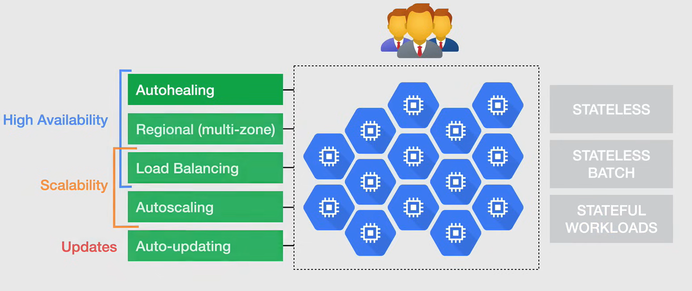
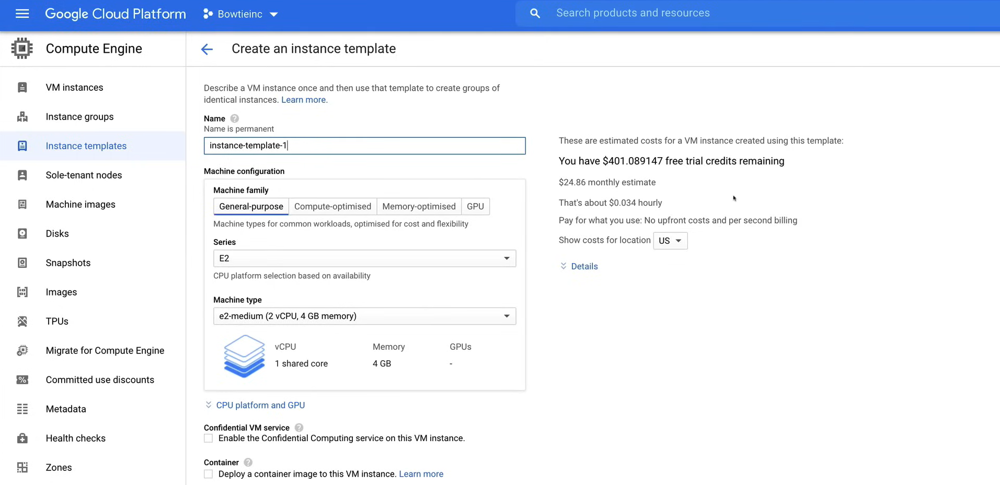
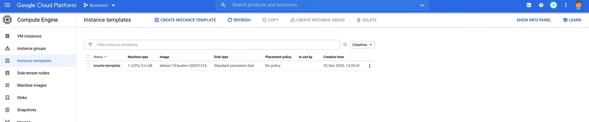
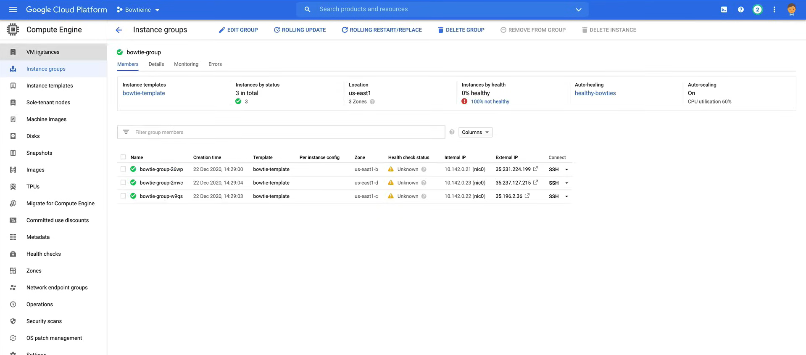
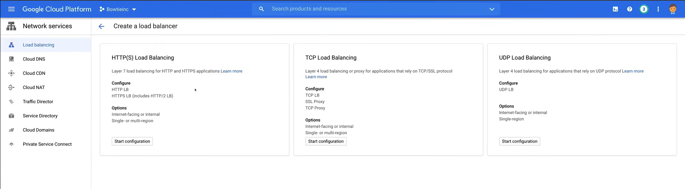
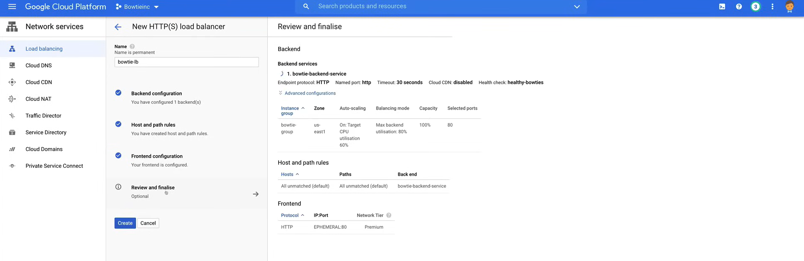
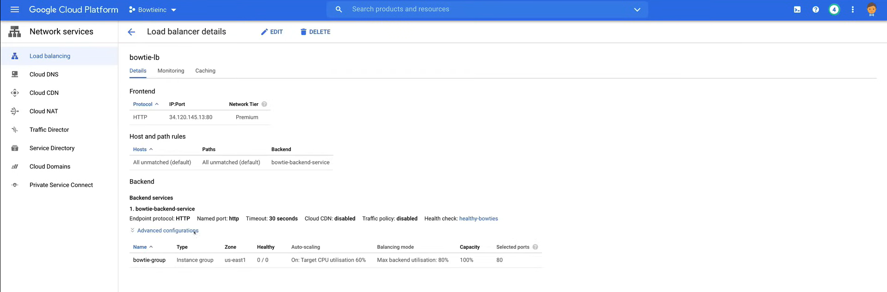
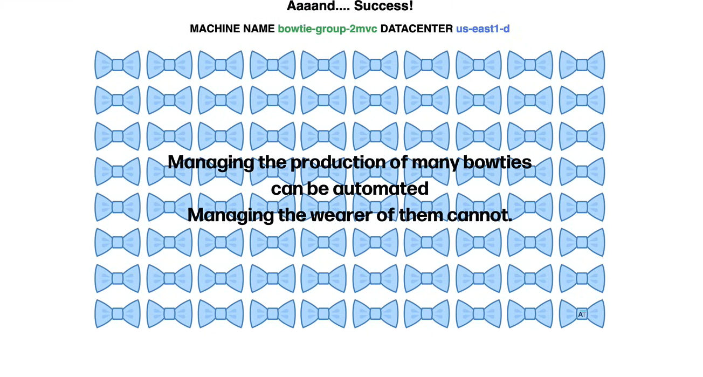
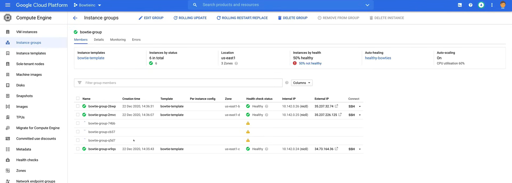

# Instance Groups and Instance Templates

Instance groups are a great way to setup a group of identical servers.

Used in conjunction with instance groups, instance templates handle the instance properties to deploy instance groups into your environment.

## Instance Groups

**Instance groups** are a collection of virtual machine (VM) instances that you can manage as a single entity.

Compute Engine offers two types of instance groups:

- **Managed** instance groups or MIGs
  - Let you operate applications on multiple identical VMs.
  - You can make your workload scalable and highly available by taking advantage of automated MIG features, like:
    - autoscaling
    - autohealing
    - regional (multi-zone) deployment
    - automatic updating

- **Unmanaged** instance groups
  - Let you low balance across a fleet of VMs that you manage yourself.

### Managed Instance Groups

Managed instance groups are a collection of virtual machine (VM) instances that you can manage as a single entity.



In terms of use cases, MIGs are ideal for:

- **Stateless serving** workloads
  - Such as web-site front ends, web-servers, and web-site applications.
  - As they does not preserve its state and saves no data to persistent storage.
  - All user and session data stays with the client and makes scaling up and down easier.

- **Stateless batch** workloads
  - These are high performance or high throughput computing workloads.
  - Such as image processing from a queue.

- **Stateful workloads**
  - Use stateful managed instance groups or stateful MIGs.
  - They include application with stateful data or configuration, such as databases, legacy monolith type applications, and long running batch computations with checkpoints.
  - You can improve uptime and resiliency of these type of application with autohealing, controlled updates, and regional (multi-zone) deployment, while preserving each instance's unique state, including instance names, persistent disks, and metadata.

The types of workloads that you can run on managed instance groups are:

- **Auto-healing**
  - MIGs maintains high availability of your application by proactively keeping your instances in a *running* state.
  - A MIG will automatically *recreate* an instance if it is terminated due to a failure (not in a *running* state).
  - It takes care of application-based auto-healing
  - Improve application availability by relying on a health check that detects freezing, crashing, or overloading, and then *recreates* the instance.

- **Regional (multi-zone) deployment**
  - There is the option to deploy a MIG in a single zone or across multiple zones in a region.
  - Regional MIGs provide higher availability, because the instances are spread across multiple zones in a region.
  - Google recommends using regional MIGs over zonal MIGs as you can manage twice as many MIGs as zonal MIGs (2000 vs 1000).
  - You can spread your application among multiple zones, instead of a single zone, or managing multiple zonal MIGs across different zones.
  - This protect against zonal failures and improve application availability.


- **Load balancing**
  - It can use instance groups to serve traffic, so you can add instance groups to a target pool or to a backend.
  - Instance group is a type of backend, and the instances in the instance groups respomf to traffic from the load balancer.
  - The backend service in turn knows which instances it can use and how much traffic they can handle and how much traffic they are currently handling.
  - The backend service monitors the health checking and does not send new connections to unhealthy instances.

- **Auto-scaling**
  - Dynamically add or remove instances from the MIG based on the load.
  - You can configure policies to automatically scale the number of instances in a managed instance group based on the load.

- **Auto-updating**
  - You can easily and safely deploy new versions of your application by updating the instance template that the MIG uses.
  - You can also control the speed and the scope of the update, in order to minimize disruptions to your application.
  - You can perform rolling updates, which gradually replace instances in the MIG with instances created from the new template.
  - And also perform canary updates, which create a small number of instances from the new template and gradually increase the number of instances until all instances are running the new version.

You can reduce the cost of your workloads by using preemptible VMs in a managed instance group, and when they are deleted, auto-healing will recreate them, when the preemptible capacity is available.

You can also deploy containers to instances in a managed instance group, by using a container-optimized OS image or a container-optimized instance template.

When you create a managed instance group, you must define a VPC network that will reside in. When you don't specify a network, Google attempts to use the default network.

### Unmanaged Instance Groups

Unmanaged instance groups can contain heterogeneous instances, and these are instances that are of mixed sizes of CPU, RAM, as well as instance types.

You can remove instances from an unmanaged instance group wheneever you want.

But there is a major downside, indeed, Unmanaged instance groups **do not provide autoscaling, autohealing, or rolling updates, anf multi-zone deployment.**

They are not a good choice for deploying highly available and scalable workloads.

You can use unmanaged instance groups if you need **to apply load balancing** to a groups of these mixed types of instances or if you need to manage the instances yourself.

## Instance Templates

To launch an instance group into any environment, you need to define an **instance template**, i.e. a resource that you can use to create virtual machine instances and manage instance groups.

- Instance templates define:
  - Machine type
  - Boot disk image or container image
  - Labels
  - Other instance properties

- You can use an instance template to create a MIG or a VM instance.
  - It is a global resource, that is not bound to a zone or region, but you can restrict a template to a specific zone, by calling out specific zonal resources.

**If you want to create a group of identical instances you must use an instance template to create a MIG.**

- Instance templates are designed to create instances with identical configurations, so **you cannot update or change an existing instance template** after you create it.
  - If you need to make changes to the configuration, you must create a new instance template.

- You can create a template based on an existing instance, or existing instance template. to use an existing VM as template, you can save the configuration with:

    ```bash
    gcloud instance-templates create
    ```

    or using the Google Cloud Console, goin to the instance template page and click on the **Create instance template** button.

- To make changes, you can create another one with similar properties using the console.

## Demo

A video demo of the following lab is available [here](https://youtu.be/jpno8FSqpc8?si=W-YdFzf5R2Kncw68&t=50736).

First, make sure you have the default VPC network created.

### Create an Instance Template

Now, we want to create an instance template, so we can create a managed instance group.

1. Go to the **Compute Engine** page in the Google Cloud Console.
2. Click on **Instance templates** in the left-hand menu.
3. Click on **Create instance template**.
  
  

   - **NOTE:** There are no monthly costs associated with instance templates, but the estimate on the right-hand side shows the cost of each instance created from the template.

4. Populate the fields:
   - **Name:** `bowtie-template`
   - **Machine Configuration:**
     - **Machine Family:** `General-purpose`
     - **Series:** `N1`
     - **Machine Type:** `f1-micro`
   - **Firewall:** `Allow HTTP traffic`
   - **Management, security, disks, networking, sole tenancy, and advanced settings:**
     - **Startup script:** Paste the following script:

        ```bash
        #! /bin/bash
        NAME=$(curl -H "Metadata-Flavor: Google" http://metadata.google.internal/computeMetadata/v1/instance/name)
        ZONE=$(curl -H "Metadata-Flavor: Google" http://metadata.google.internal/computeMetadata/v1/instance/zone | sed 's@.*/@@')
        sudo apt-get update
        sudo apt-get install -y stress apache2
        sudo systemctl start apache2
        cat <<EOF> /var/www/html/index.html
        <html>
          <head>
            <title> Managed Bowties </title>
            </head>
            <style>
        h1 {
          text-align: center;
          font-size: 50px;
        }
        h2 {
          text-align: center;
          font-size: 40px;
        }
        h3 {
          text-align: right;
        }
        </style>
            <body style="font-family: sans-serif"></body>
          <body>
            <h1>Aaaand.... Success!</h1>
                <h2>MACHINE NAME <span style="color: #3BA959">$NAME</span> DATACENTER <span style="color: #5383EC">$ZONE</span></h2>
            <section id="photos">
              <p style="text-align:center;"></p>
            </section>
          </body>
        </html>
        EOF
        ```

   - Leave the rest of the settings as default.

5. Click on **Create**.



### Create an Instance Group

Now, we want to create a managed instance group using the instance template.

1. Go to the **Compute Engine** page in the Google Cloud Console.
2. Click on **Instance groups** in the left-hand menu.
3. Click on **Create instance group**.
4. Select the **New managed instance group (stateless)** option on the left-hand side and fill in the following fields:
   - **Name:** `bowtie-group`
   - Description: `Managed instance group for bowties`
   - **Location:** `Multiple zones`
   - **Region:** `us-east1`
   - **Configure zones:**
     - **Zones:** Check `us-east1-b`, `us-east1-c`, `us-east1-d`
   - **Instance template:** `bowtie-template`
   - **Minimum number of instances:** `3`
   - **Maximum number of instances:** `6`
   - **Autohealing:** Click on `Create new health check` and fill in the following fields:
     - **Name:** `healthy-bowties`
     - **Description:** `Health check for bowties`
     - **Protocol:** `TCP`
     - **Port:** `80`
     - **Health Criteria:**
       - **Check interval:** `10`
       - **Timeout:** `5`
       - **Healthy threshold:** `2`
       - **Unhealthy threshold:** `3`
     - Leave the rest of the settings as default and click on **Save**.
5. Click on **Create**.



The instances in the managed instance group will be defined as **unhealthy**, because we need to create a firewall rule that will allow Google Cloud health checks to reach the instances.

1. Go to the **VPC network** page in the Google Cloud Console.
2. Click on **Firewall** in the left-hand menu.
3. Click on **Create firewall rule** and fill in the following fields:
   - **Name:** `allow-health-checks`
   - **Description:** `Allow health checks to reach instances`
   - **Network:** `default`
   - **Priority:** `1000`
   - **Direction of traffic:** `Ingress`
   - **Action on match:** `Allow`
   - **Targets:** `All instances in the network`
   - **Source filter:** `IP ranges`
     - **Source IP ranges:** Enter the IP of the health checker `130.211.0.0/22`, `35.191.0.0/16`
   - **Protocols and ports:**
     - **Specified protocols and ports:** `tcp:80`
4. Click on **Create**.

If we go back to the **Instance groups** page, we can see that the instances are now **healthy**.

### Create a Load Balancer

Now, we want to create a load balancer to distribute traffic to the instances in the managed instance group.

1. Go to the **Network services** page in the Google Cloud Console.
2. Click on **Load balancing** in the left-hand menu.
3. Click on **Create load balancer**. We have the option to create an HTTP(S) load balancer, a TCP Load Balancer, or a UDP Load Balancer.



4. Select the **HTTP(S) Load Balancing** option and click on **Start configuration**.
5. Check the **From Internet to my VMs** option and click on **Continue**.
6. Fill in the following fields:
   - **Name:** `bowtie-lb`
   - **Backend configuration:** Select the **Backend services** option and click on **Create a backend service**.
     - **Name:** `bowtie-backend-service`
     - **Backend type:** `Instance group`
     - **Protocol, named port and timeout:**
       - **Protocol:** `HTTP`
       - **Named port:** `http`
       - **Timeout:** `30`
     - **Backeds:**
       - **Instance group:** `bowtie-group`
       - **Port number:** `80`
       - Leave the rest of the settings as default and click on **Done**.
     - **Health check:** `healthy-bowties`
     - Leave the rest of the settings as default and click on **Create**.
   - **Frontend configuration:** Select the **Frontend configuration** option and click on **Create a frontend IP and port**.
     - **Name:** `bowtie-frontend-service`
     - **Protocol:** `HTTP`
     - **Network service tier:** `Premium`
     - **IP version:** `IPv4`
     - **IP address:** `Ephemeral`
     - **Port:** `80`
     - Click on **Done**.
   - Click on **Review and finalize** and then click on **Create**.

    

We can see that the load balancer is now created.



We can check also with the IP address of the load balancer, that the instances are healthy.
So, we can copy the IP address (`IP Port`) of the load balancer and paste it into a browser.

Every time we refresh the page, we can see that the machine name and the datacenter are changing, because the load balancer is distributing the traffic to the instances in the managed instance group.



### Set Up Autoscaling

Now, we want to set up autoscaling for the managed instance group, to do this we are going to do a stress test on one of the instances.

1. Go to the **Compute Engine** page in the Google Cloud Console.
2. Click on **VM instances** in the left-hand menu.
3. Click on the **SSH** button for one of the instances in the managed instance group, to run the stress test from there.
4. Run the following command to install the stress tool:

    ```bash
    sudo apt-get install stress
    ```

5. Run the following command to run the stress test:

    ```bash
    stress --cpu 2 --io 1 --vm 2 --vm-bytes 128M --timeout 30s
    ```

6. Go back to the **Compute Engine** page in the Google Cloud Console.
7. Click on **Instance groups** in the left-hand menu.

We can see, after a few minutes, that the instances in the managed instance group have increased from 3 to 6.



To verify that the instances are healthy, we can go back to the load balancer and check the IP address of the load balancer in a browser.

So, we have just simulated a scale-out event, now we want to simulate a scale-in event, but regards it there is a **10 minute stabilization period** that cannot be adjusted for scaling, and it is a built in feature into Google Cloud.

But there is a workaround to trigger a scale-in event sooner (use only for testing purposes).

1. Go to the **Compute Engine** page in the Google Cloud Console.
2. Click on **Instance groups** in the left-hand menu.
3. Click on the **bowtie-group** instance group.
4. Click on **Rolling restart/replace** and fill in the following fields:
   - **Operation:** `Restart`
     - **NOTE:** This will restart all the instances in the managed instance group and only bring up the ones that are needed.
   - Leave the rest of the settings as default and click on **Restart**.

Now we can see that the instances in the managed instance group have decreased from 6 to 3.

### Clean Up

Clean up the resources created in this lab.

For a more specific guide on how to clean up the resources, you can refer to the [managed-bowties-instructions.txt](res\02_Instance_Groups_and_Instance_Template\managed-bowties-instructions.txt)