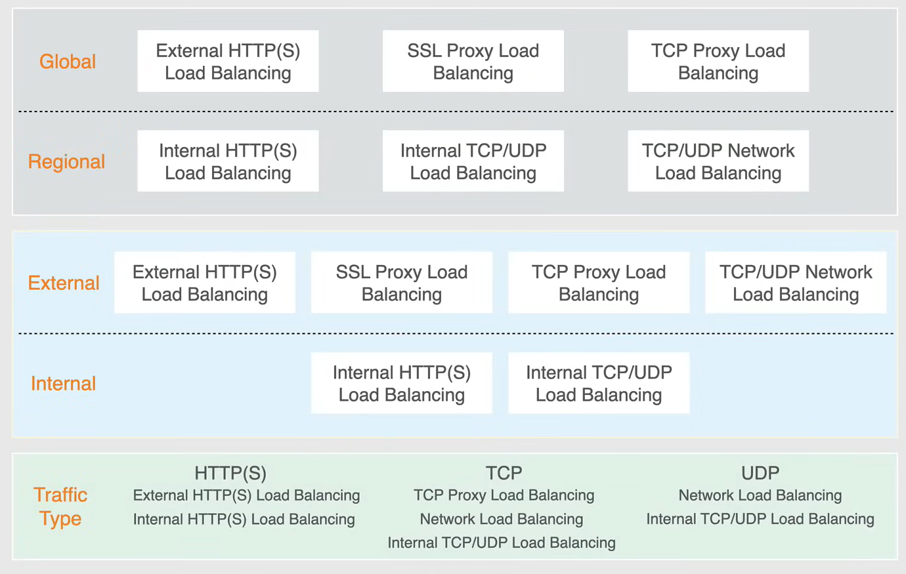
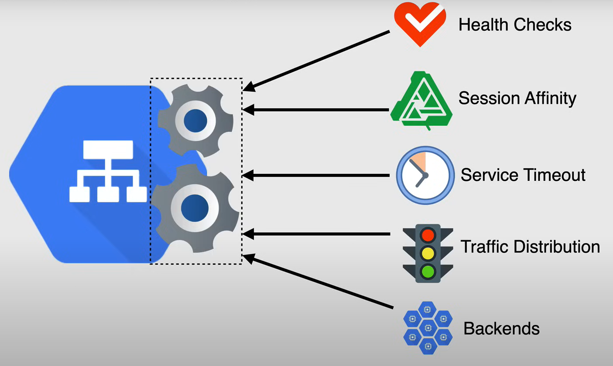
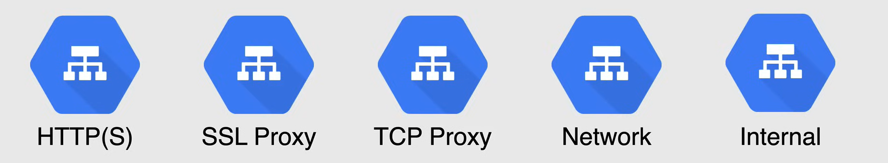
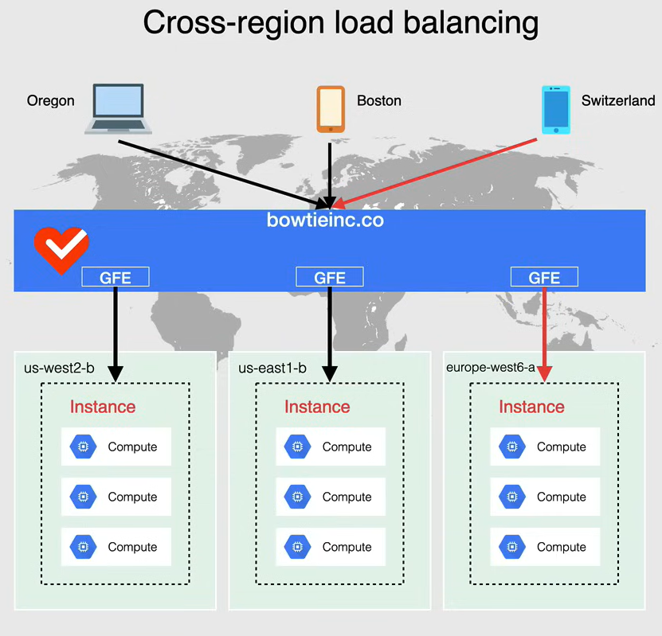
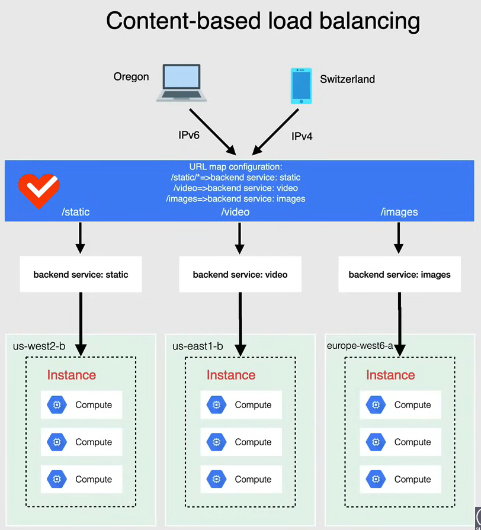
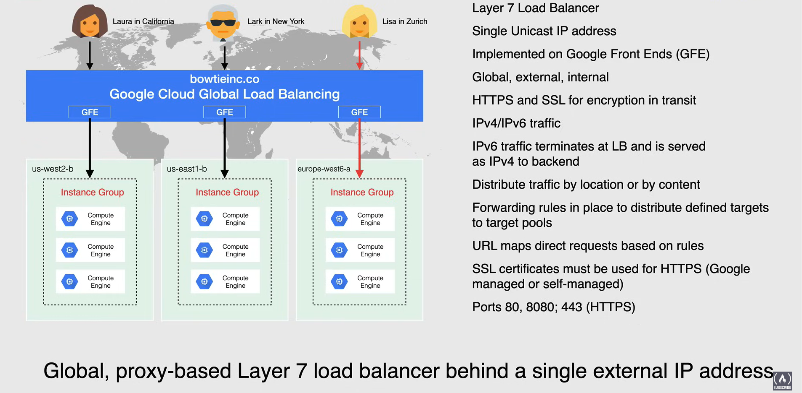
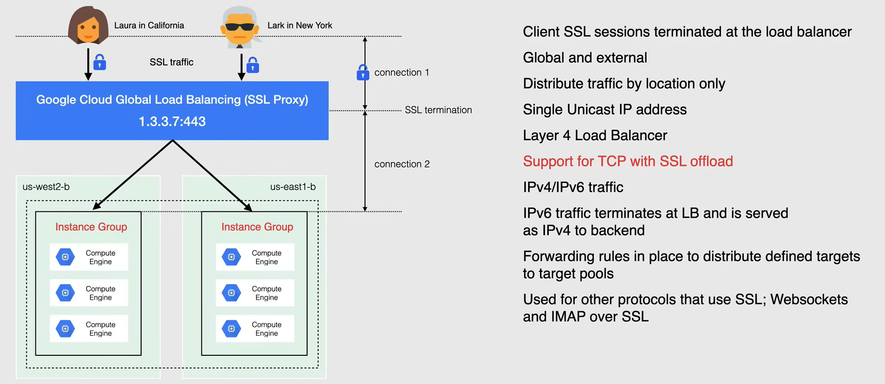
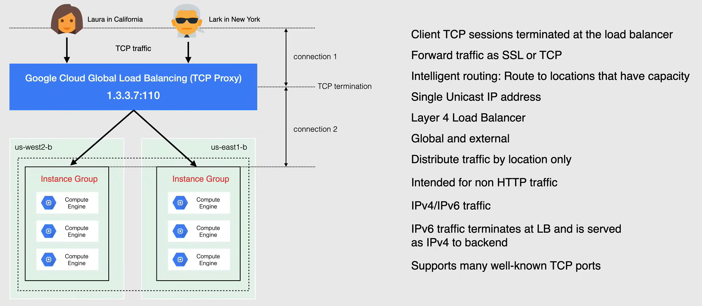
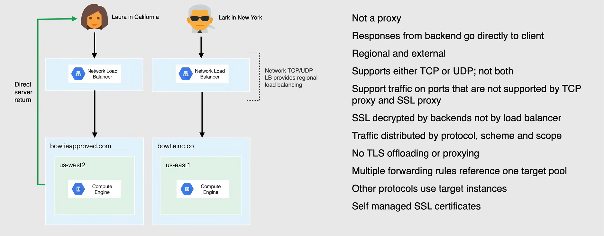
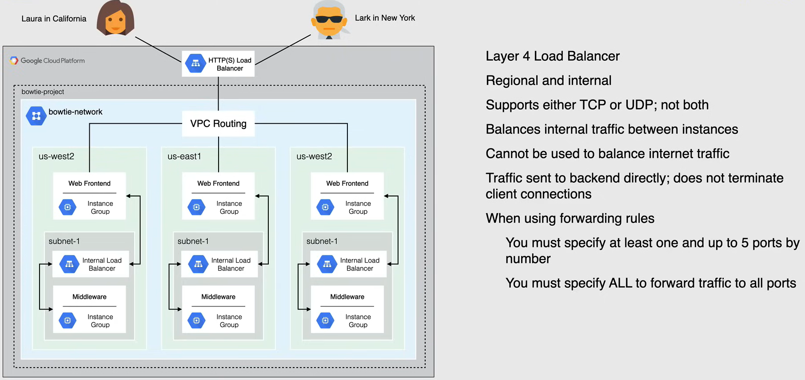

# Cloud Load Balancers

Google Cloud Load balancing è essenziale quando viene utilizzato con gruppi di istanze, cluster Kubernetes ed è praticamente il defacto quando si tratta di bilanciare il carico su più istanze.

- Un bilanciatore di carico **distribuisce il traffico degli utenti** su più istanze.
  - Spargendo il carico, si riduce il rischio di sovraccaricare una singola istanza.

- È un punto di ingresso unico con **backend multipli**.
  - In GCP, il backend può essere un gruppo di istanze, un gruppo di istanze gestito zonale o regionale, o un gruppo di istanze non gestito zonale o regionale.

- È un servizio gestito **completamente distribuito e definito dal software**.
  - Non è un dispositivo fisico, ma un servizio completamente gestito da Google.

- È **globale** o **regionale**.

- È destinato a servire contenuti il più vicino possibile agli utenti per ridurre la latenza.

- Google Cloud Load Balancer offre il ridimensionamento automatico con **controlli di salute**.
  - Controlla lo stato di salute delle istanze e rimuove le istanze non sane dal pool.

## Types of Load Balancers
Ci sono tre tipi di bilanciatori di carico in Google Cloud:

- **Global vs Regional Load Balancer**
  - **Global**
    - È utilizzato per **applicazioni globali** che devono servire contenuti agli utenti di tutto il mondo.
    - È un singolo indirizzo IP anycast che può essere utilizzato per bilanciare il carico su più regioni.
    - È ottimo quando i tuoi backend sono distribuiti su più regioni e gli utenti devono accedere alla stessa applicazione e contenuti.

  - **Regional**
    - È un singolo indirizzo IP che può essere utilizzato per bilanciare il carico su più zone all'interno di una regione.
    - È utilizzato per **applicazioni regionali** che devono servire contenuti agli utenti in una specifica regione.

- **Internal vs External Load Balancer**
  - **Internal**
    - È utilizzato per **applicazioni interne** che devono servire contenuti agli utenti interni.
    - Non è accessibile dall'internet.
    - È utilizzato per applicazioni interne che devono distribuire il traffico all'interno della tua rete.

  - **External**
    - È utilizzato per **applicazioni esterne** che devono servire contenuti agli utenti esterni.
    - È accessibile dall'internet.
    - È progettato per distribuire il traffico che arriva nella tua rete dall'internet

- **Traffic Type**:
  - **HTTP(S) Load Balancer**
  - **TCP Load Balancer**
  - **UDP Load Balancer**

## Backend Services

Definisci come Cloud Load Balancing distribuisce il traffico a un insieme di back-end.

La configurazione del servizio di back-end contiene un insieme di valori come il protocollo utilizzato per connettersi ai back-end, varie impostazioni di distribuzione delle sessioni e la configurazione del controllo di salute.

Queste impostazioni forniscono un controllo dettagliato su come si comporta il tuo bilanciatore.

Il back-end di un servizio di back-end può essere un gruppo di istanze o gruppi di endpoint di rete, noti anche come NEG (Network Endpoint Groups), ma non una combinazione di entrambi.

I valori del servizio di backend sono:

- **Health Check**
  - Google Cloud utilizza lo stato di salute complessivo di ogni backend per determinare la sua idoneità a ricevere nuove richieste o connessioni.
  - I backend che rispondono con successo per il numero di volte configurato sono considerati *sani*.
  - I backend che non riescono a rispondere con successo per un numero separato di volte sono considerati *non sani*, e quindi il traffico non viene instradato verso di loro.

- **Session Affinity**
  - Invia tutte le richieste dello stesso client allo stesso backend se il backend è sano e ha capacità.

- **Session Timeout**
  - È il tempo massimo che il bilanciatore di carico attende che un backend restituisca una risposta completa a una richiesta.

- **Traffic Distribution**
  - È composto da tre valori diversi:
    - **Balancing Mode**: È il metodo utilizzato per misurare la prontezza del backend per le nuove richieste o connessioni.
    - **Target Capacity**: Definisce un numero massimo di connessioni, un tasso massimo o un utilizzo massimo della CPU.
    - **Capacity Scaler**: Regola la capacità complessiva disponibile senza modificare la capacità di destinazione.

- **Backends**
  - È un gruppo di endpoint che ricevono il traffico dal bilanciatore di carico.
  - Ci sono diversi tipi di backends:
    - **Instance Groups**: Gruppi di istanze gestiti o non gestiti.
    - **Network Endpoint Groups (NEGs)**: È una raccolta di endpoint di rete che vengono utilizzati per definire i backends per un servizio di backend.

## Google Cloud Load Balancers

### Gestione del Traffico HTTP(S)

HTTP(S) Load Balancing è un bilanciamento del carico **cross-regionale** e un routing **basato sul contenuto** per le richieste HTTP(S).

- HTTP(S) Load Balancing è un bilanciamento del carico **cross-regionale**, il che significa che può instradare in modo intelligente le richieste degli utenti verso il gruppo di istanze o il NEG più vicino in base alla prossimità, alla salute e ad altri fattori.

  - Quando si configura un bilanciatore di carico HTTP(S) nella modalità premium, utilizza un indirizzo IP esterno globale e può instradare in modo intelligente le richieste degli utenti verso il gruppo di istanze o il NEG più vicino in base alla prossimità, alla salute e ad altri fattori.

  - Ad esempio, se si configurano gruppi di istanze in diverse regioni, quando si utilizza un servizio di backend del bilanciatore di carico, le richieste degli utenti di tutto il mondo vengono inviate automaticamente alle VM più vicine a loro, a condizione che le VM siano sane e abbiano abbastanza capacità.

  - Se le VM più vicine sono non sane o al limite della capacità, il bilanciatore di carico instraderà automaticamente la richiesta verso le VM più vicine successive.

    

- HTTP(S) Load Balancing supporta il bilanciamento del carico **basato sul contenuto**, utilizzando le mappe URL per selezionare un servizio di backend in base al nome host richiesto, alla richiesta o a entrambi.

  - Ad esempio, è possibile utilizzare un insieme di gruppi di istanze o NEGs per gestire i contenuti video e un altro insieme per gestire i contenuti statici e un altro ancora per gestire le immagini.

  - È possibile aggiungere un bucket di Cloud Storage al bilanciatore di carico HTTP(S) per configurare il bilanciatore con un bucket di Cloud Storage.

    

HTTP(S) Load Balancing è un bilanciatore di carico **globale** basato su proxy di livello 7 che si trova al livello applicativo del modello OSI.

- Rispetto agli altri bilanciatori di carico disponibili in GCP, l'HTTP(S) Load Balancer è l'unico bilanciatore di carico di livello 7.
  - Tutti gli altri bilanciatori di carico sono bilanciatori di carico di livello 4 e lavorano al livello di rete del modello OSI.

- Ti consente di servire la tua applicazione in tutto il mondo utilizzando un singolo indirizzo IP esterno unicast.

- Distribuisce il traffico HTTP(S) verso i backend ospitati su Compute Engine, GKE e G.

- L'HTTP(S) Load Balancing esterno è implementato su front-end di Google (o GFE), come mostrato nel diagramma seguente.

  - GFEs sono distribuiti globalmente e operano insieme utilizzando la rete globale e il piano di controllo di Google
  - Nel livello premium, le GFEs offrono il bilanciamento del carico tra le regioni, dirigendo il traffico verso il backend più vicino e sano che ha capacità e terminando il traffico HTTP(S) il più vicino possibile all'utente.
  - Nel livello standard, il bilanciamento del carico è gestito a livello regionale.

- Questo bilanciatore di carico può essere utilizzato sia internamente che esternamente.
  - Ciò rende questo bilanciatore di carico **globale, esterno e interno**.

- Supporta HTTPS e SSL che coprono TLS per la crittografia durante il transito.

- Accetta tutto il traffico, sia IPv4 che IPv6.
  - Il traffico IPv6 termina al Load Balancer e viene servito come IPv4 ai backend.

- Il traffico è distribuito per località o per contenuto.

- Sono in atto regole di inoltro per distribuire obiettivi definiti a ciascun pool di destinazione per i gruppi di istanze.

- Le mappe degli URL dirigono le richieste in base alle regole.
  - Quindi, puoi creare regole diverse a seconda del tipo di traffico che vuoi dirigere e inserirle nelle mappe.

- Sono necessari certificati SSL per il traffico HTTPS.
  - Possono essere gestiti da Google o autogestiti.

- Le porte utilizzate sono `80`, `8080`, `443` (HTTPS).

### SSL Proxy

SSL Proxy Load Balancing è un bilanciatore di carico a proxy inverso che distribuisce il traffico SSL proveniente dall'internet alle VM.

- Le connessioni SSL degli utenti vengono terminate presso il bilanciatore di carico e quindi inviate ai backend più vicini, utilizzando SSL o TCP.

- Globale ed esterno.
  - Con il livello premium, il bilanciatore di carico SSL proxy può essere configurato come un servizio di bilanciamento del carico globale.
  - Con il livello standard, il bilanciatore di carico SSL proxy gestisce il bilanciamento del carico a livello regionale.

- Distribuisce il traffico solo per località.

- Indirizzo IP unicast singolo.
  - Il bilanciatore di carico SSL Proxy consente di utilizzare un singolo indirizzo IP per tutti gli utenti in tutto il mondo.

- È un bilanciatore di carico di livello 4, funziona al livello di rete del modello OSI.

- **Supporta TCP con SSL offload** (Importante per l'esame)
  - Ciò significa che la connessione SSL viene terminata presso il bilanciatore di carico e quindi inviata ai backend più vicini disponibili.

- Non è come il bilanciatore di carico HTTP(S), dove è possibile utilizzare regole specifiche o configurazioni specifiche per indirizzare il traffico.

- Supporta sia il traffico IPv4 che IPv6.
  - Termina il traffico IPv6 presso il bilanciatore di carico e lo serve come IPv4 ai backend.

- Sono in atto regole di inoltro per distribuire obiettivi definiti a ciascun pool di destinazione per i gruppi di istanze.

- La crittografia è supportata configurando i servizi di backend per accettare tutto il traffico tramite SSL.

- Può essere utilizzato per altri protocolli che utilizzano SSL, come WebSockets e IMAP su SSL.
  - Supporta un numero di porte aperte per supportarli.

### TCP Proxy

TCP Proxy Load Balancing è un bilanciatore di carico a proxy inverso che distribuisce il traffico TCP proveniente dall'internet alle VM.

- Le sessioni TCP del client vengono terminate presso il bilanciatore di carico.
  - Quando si utilizza il bilanciamento del carico TCP Proxy, il traffico proveniente da una connessione TCP viene **terminato presso il bilanciatore di carico**.

- Inoltra il traffico come SSL o TCP.
  - Dopo che il traffico viene terminato presso il bilanciatore di carico, viene inoltrato alle istanze di backend più vicine utilizzando SSL o TCP.

- **Routing intelligente**
  - Instrada il traffico verso le istanze di backend più vicine in base alla prossimità, alla salute e ad altri fattori.

- Indirizzo IP unicast singolo.
  - Il bilanciamento del carico TCP Proxy consente di utilizzare un singolo indirizzo IP per tutti gli utenti in tutto il mondo.
  - Instrada automaticamente il traffico verso le istanze di backend più vicine all'utente.

- È un bilanciatore di carico di livello 4, funziona al livello di rete del modello OSI.

- Globale ed esterno.
  - Con il livello premium, il bilanciatore di carico TCP proxy può essere configurato come un servizio di bilanciamento del carico globale.
  - Con il livello standard, il bilanciatore di carico TCP proxy gestisce il bilanciamento del carico a livello regionale.

- Distribuisce il traffico **solo per località**.

- È destinato specificamente al traffico non HTTP(S).
  - È possibile decidere se utilizzare SSL tra il proxy e i backend.
  - È possibile farlo selezionando un certificato sul servizio di backend.

- Supporta sia il traffico IPv4 che IPv6.
  - Termina il traffico IPv6 presso il bilanciatore di carico e lo serve come IPv4 ai backend.

- È destinato al traffico TCP e supporta molte porte TCP ben note, come `25` per il protocollo di trasferimento di posta semplice (SMTP).

### Network Load Balancer

Network Load Balancing è un bilanciatore di carico regionale che distribuisce il traffico TCP e UDP alle VM.

- Non è un bilanciatore di carico basato su proxy.

- Le risposte dal backend vanno direttamente al client, e non passano di nuovo attraverso il bilanciatore di carico.
  - Il termine per questo è **direct server return**.

- È un bilanciatore di carico di livello 4, funziona al livello di rete del modello OSI.

- Regionale ed esterno.
  - Network Load Balancing è un bilanciatore di carico regionale, il che significa che può distribuire il traffico solo all'interno di una singola regione.
  - Non è un bilanciatore di carico globale.

- Supporta il traffico TCP e UDP, ma non entrambi contemporaneamente.
  - È possibile creare un bilanciatore di carico TCP o un bilanciatore di carico UDP, ma non entrambi.

- Supporta il traffico su porte non supportate dai bilanciatori di carico TCP proxy e SSL proxy.

- Il traffico SSL può essere decifrato dalle istanze di backend, ma non dal bilanciatore di carico.

- Il traffico viene distribuito in base ai dati del protocollo in ingresso, allo schema e all'ambito.

- Non c'è offloading o proxying TLS.

- Sono in atto regole di inoltro per distribuire obiettivi definiti a ciascun pool di destinazione e questo solo per TCP e UDP.

- Con altri protocolli utilizza istanze di destinazione invece di gruppi di istanze.

- Può supportare solo certificati SSL autogestiti, a differenza dei certificati SSL gestiti da Google.

### Internal Load Balancer

L'Internal Load Balancer è un bilanciatore di carico regionale di tipo pass-through che distribuisce il traffico TCP e UDP alle VM.

- È un bilanciatore di carico di livello 4, funziona al livello di rete del modello OSI.

- Regionale ed interno.
  - Distribuisce il traffico dietro un indirizzo IP di bilanciamento del carico interno che è accessibile solo alle VM interne.
  - Viene utilizzato per bilanciare il traffico tra le tue VM nella stessa regione.

- Supporta il traffico TCP e UDP, ma non entrambi contemporaneamente.

- Non può essere utilizzato per bilanciare il traffico interno, in quanto è un bilanciatore di carico interno.

- Il traffico viene inviato automaticamente al backend, in quanto non termina le connessioni del client.

- Quando si utilizzano le regole di inoltro:
  - È necessario specificare almeno una e fino a 5 porte per numero.
  - È necessario specificare ALL per inoltrare il traffico a tutte le porte.

- Come il bilanciatore di carico di rete, è possibile utilizzare sia TCP che UDP.

