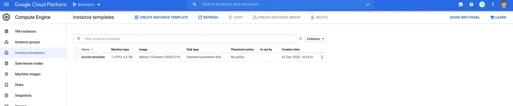
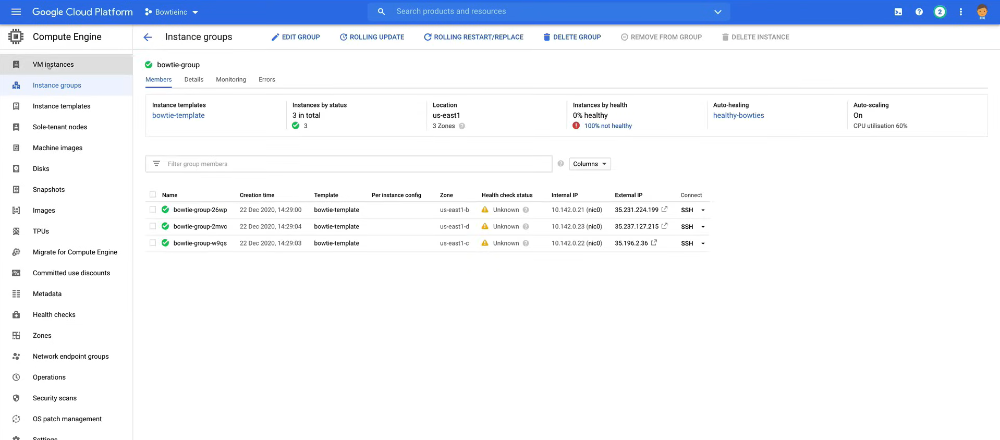
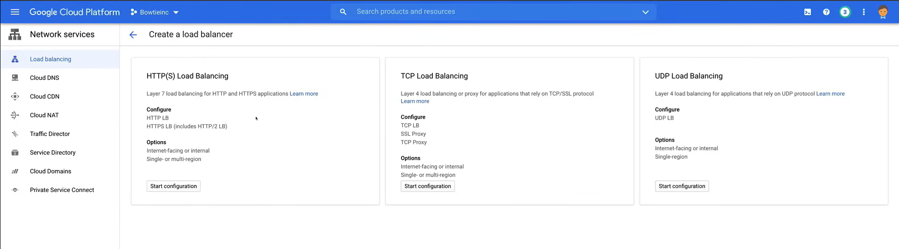

# Instance Groups and Instance Templates

# Gruppi di istanze e modelli di istanze

I gruppi di istanze sono una collezione di istanze di macchine virtuali (VM) che è possibile gestire come un'entità singola.

Compute Engine offre due tipi di gruppi di istanze:

- Gruppi di istanze **gestiti** o MIG
  - Consentono di eseguire applicazioni su più VM identiche.
  - È possibile rendere il proprio carico di lavoro scalabile e altamente disponibile sfruttando le funzionalità MIG automatizzate, come:
    - autoscaling
    - autohealing
    - distribuzione regionale (multi-zona)
    - aggiornamenti automatici

- Gruppi di istanze **non gestiti**
  - Consentono di bilanciare il carico su un insieme di VM che si gestiscono autonomamente.

### Gruppi di istanze gestiti

I gruppi di istanze gestiti sono una collezione di istanze di macchine virtuali (VM) che è possibile gestire come un'entità singola.

  - Sono adatti per carichi di lavoro ad alte prestazioni o ad alta velocità di calcolo.
  - Ad esempio, l'elaborazione di immagini da una coda.

- **Carichi di lavoro con stato**
  - Utilizzare gruppi di istanze gestiti con stato o MIG con stato.
  - Questi includono applicazioni con dati o configurazioni con stato, come database, applicazioni legacy di tipo monolitico e calcoli batch a lungo termine con checkpoint.
  - È possibile migliorare l'uptime e la resilienza di questi tipi di applicazioni con autohealing, aggiornamenti controllati e distribuzione regionale (multi-zona), preservando allo stesso tempo lo stato univoco di ogni istanza, inclusi i nomi delle istanze, i dischi persistenti e i metadati.

I tipi di carichi di lavoro che è possibile eseguire su gruppi di istanze gestiti sono:

- **Autohealing**
  - I MIG mantengono l'alta disponibilità dell'applicazione mantenendo in modo proattivo le istanze in uno stato "running".
  - Un MIG ricreerà automaticamente un'istanza se viene terminata a causa di un errore (non in uno stato "running").
  - Si occupa dell'autohealing basato sull'applicazione.
  - Migliora la disponibilità dell'applicazione affidandosi a un controllo di salute che rileva il congelamento, il crash o il sovraccarico e quindi ricrea l'istanza.

- **Distribuzione regionale (multi-zona)**
  - È possibile distribuire un MIG in una singola zona o in più zone in una regione.
  - I MIG regionali offrono una maggiore disponibilità, poiché le istanze sono distribuite in più zone in una regione.
  - Google consiglia di utilizzare i MIG regionali anziché i MIG zonali, in quanto è possibile gestire il doppio dei MIG rispetto ai MIG zonali (2000 rispetto a 1000).
  - È possibile distribuire l'applicazione su più zone anziché su una singola zona o gestire più MIG zonali in diverse zone.
  - Ciò protegge da guasti zonali e migliora la disponibilità dell'applicazione.

- **Bilanciamento del carico**
  - È possibile utilizzare i gruppi di istanze per gestire il traffico, in modo da poter aggiungere gruppi di istanze a un pool di destinazione o a un backend.
  - Il gruppo di istanze è un tipo di backend e le istanze nei gruppi di istanze rispondono al traffico proveniente dal bilanciatore di carico.

  - Aggiungere o rimuovere dinamicamente istanze dal MIG in base al carico.
  - È possibile configurare le politiche per scalare automaticamente il numero di istanze in un gruppo di istanze gestito in base al carico.

- **Aggiornamenti automatici**
  - È possibile distribuire facilmente e in modo sicuro nuove versioni dell'applicazione aggiornando il modello di istanza utilizzato dal MIG.
  - È anche possibile controllare la velocità e l'ambito dell'aggiornamento al fine di ridurre al minimo le interruzioni dell'applicazione.

È possibile ridurre i costi dei carichi di lavoro utilizzando VM preemptible in un gruppo di istanze gestito e, quando vengono eliminati, l'autohealing li ricrea quando la capacità preemptible è disponibile.

È anche possibile distribuire contenitori su istanze in un gruppo di istanze gestito utilizzando un'immagine del sistema operativo ottimizzata per i contenitori o un modello di istanza ottimizzato per i contenitori.

Quando si crea un gruppo di istanze gestito, è necessario definire una rete VPC in cui risiederà. Se non si specifica una rete, Google cercherà di utilizzare la rete predefinita.

È possibile rimuovere istanze da un gruppo di istanze non gestito in qualsiasi momento.

Tuttavia, c'è un grande svantaggio: i gruppi di istanze non gestiti **non offrono autoscaling, autohealing o aggiornamenti rolling e distribuzione multi-zona**.

Non sono una buona scelta per distribuire carichi di lavoro altamente disponibili e scalabili.

È possibile utilizzare gruppi di istanze non gestiti se è necessario **applicare il bilanciamento del carico** a un gruppo di istanze di tipi misti o se è necessario gestire autonomamente le istanze.

## Modelli di istanze

I modelli di istanze gestiscono le proprietà delle istanze per distribuire gruppi di istanze nel proprio ambiente.

- È possibile utilizzare un modello di istanza per creare un MIG o un'istanza di VM.
  - È una risorsa globale, non legata a una zona o a una regione specifica, ma è possibile limitare un modello a una zona specifica specificando risorse zonali specifiche.


    gcloud instance-templates create
    ```

    oppure utilizzando la Google Cloud Console, andando alla pagina del modello di istanza e facendo clic sul pulsante **Crea modello di istanza**.

- Per apportare modifiche, è possibile crearne un altro con proprietà simili utilizzando la console.

## Demo

Ora vogliamo creare un modello di istanza in modo da poter creare un gruppo di istanze gestito.

1. Vai alla pagina **Compute Engine** nella Google Cloud Console.
2. Fai clic su **Modelli di istanze** nel menu di sinistra.
3. Fai clic su **Crea modello di istanza**.

   - **NOTA:** Non ci sono costi mensili associati ai modelli di istanze, ma l'indicazione a destra mostra il costo di ogni istanza creata dal modello.

4. Compila i campi:
   - **Nome:** `bowtie-template`
   - **Configurazione della macchina:**


        ```bash
        #! /bin/bash
        NAME=$(curl -H "Metadata-Flavor: Google" http://metadata.google.internal/computeMetadata/v1/instance/name)
        ZONE=$(curl -H "Metadata-Flavor: Google" http://metadata.google.internal/computeMetadata/v1/instance/zone | sed 's@.*/@@')
        sudo apt-get update
        sudo apt-get install -y stress apache2
        sudo systemctl start apache2
        cat <<EOF> /var/www/html/index.html
        <html>
          <head>
            <title> Managed Bowties </title>
            </head>
            <style>
        h1 {
          text-align: center;
          font-size: 50px;
        }
        h2 {
          text-align: center;
          font-size: 40px;
        }
        h3 {
          text-align: right;
        }
        </style>
            <body style="font-family: sans-serif"></body>
          <body>
            <h1>Aaaand.... Success!</h1>
                <h2>MACHINE NAME <span style="color: #3BA959">$NAME</span> DATACENTER <span style="color: #5383EC">$ZONE</span></h2>
            <section id="photos">
              <p style="text-align:center;"></p>
            </section>
          </body>
        </html>
        EOF
        ```

   - Lascia le altre impostazioni come predefinite.

5. Fai clic su **Crea**.



### Creare un gruppo di istanze

Ora vogliamo creare un gruppo di istanze gestito utilizzando il modello di istanza.

1. Vai alla pagina **Compute Engine** nella Google Cloud Console.
2. Fai clic su **Gruppi di istanze** nel menu di sinistra.

   - **Configura zone:**
     - **Zone:** Seleziona `us-east1-b`, `us-east1-c`, `us-east1-d`
   - **Modello di istanza:** `bowtie-template`
   - **Numero minimo di istanze:** `3`
   - **Numero massimo di istanze:** `6`
   - **Autohealing:** Fai clic su `Crea nuovo controllo di salute` e compila i seguenti campi:
     - **Nome:** `healthy-bowties`
     - **Descrizione:** `Controllo di salute per bowties`
     - **Protocollo:** `TCP`
     - **Porta:** `80`
     - **Criteri di salute:**
       - **Intervallo di controllo:** `10`
       - **Timeout:** `5`
       - **Soglia di salute:** `2`
       - **Soglia di non salute:** `3`
     - Lascia le altre impostazioni come predefinite e fai clic su **Salva**.
5. Fai clic su **Crea**.



Le istanze nel gruppo di istanze gestito saranno definite come **non sane**, perché è necessario creare una regola del firewall che consenta ai controlli di salute di Google Cloud di raggiungere le istanze.


   - **Filtro di origine:** `Intervallo di indirizzi IP`
     - **Intervallo di indirizzi IP di origine:** Inserisci l'IP del controllore di salute `130.211.0.0/22`, `35.191.0.0/16`
   - **Protocolli e porte:**
     - **Protocolli e porte specificati:** `tcp:80`
4. Fai clic su **Crea**.

Se torniamo alla pagina **Gruppi di istanze**, possiamo vedere che le istanze sono ora **sane**.

### Creare un bilanciatore di carico

Ora vogliamo creare un bilanciatore di carico per distribuire il traffico alle istanze nel gruppo di istanze gestito.

1. Vai alla pagina **Servizi di rete** nella Google Cloud Console.
2. Fai clic su **Bilanciamento del carico** nel menu di sinistra.
3. Fai clic su **Crea bilanciatore di carico**. Abbiamo la possibilità di creare un bilanciatore di carico HTTP(S), un bilanciatore di carico TCP o un bilanciatore di carico UDP.



Per una guida più specifica su come eliminare le risorse, puoi fare riferimento al file [managed-bowties-instructions.txt](res\02_Instance_Groups_and_Instance_Template\managed-bowties-instructions.txt)