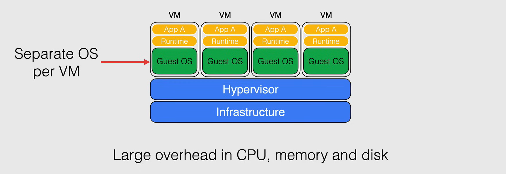
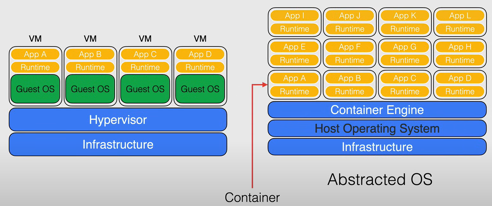
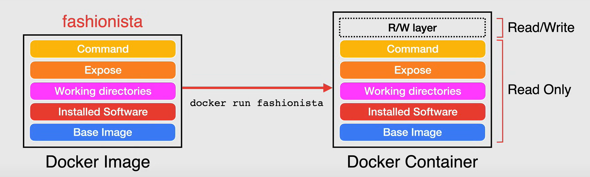
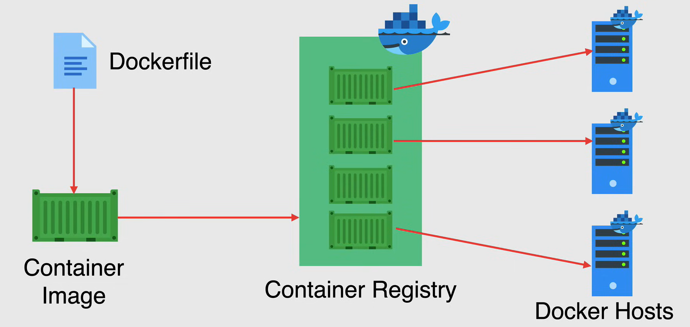

# Introduction to Containers

## Containers

Container technology gets its name from the shipping industry. In the shipping industry, containers are used to transport goods. Containers are **standardized**, so they can be loaded onto ships, trains, and trucks. This standardization makes it easy to move containers between different modes of transportation.

### Virtual Machines vs. Containers

A great way to discuss containers is to compare them to virtual machines. 

With the VMs the systems are virtualized through a **hypervisor**, that sits on top of the underlying hardware and the latter is virtualized so that multiple Operating Systems instances can run on the same hardware.
Each VM runs its own OS, and has access to virtualized resources representing the underlying hardware.

Due to this process VM comes with a **large overhead**, as it needs to run a full OS, and the hypervisor, which is a large piece of software. There is also a lack of standardization, as each VM can run a different OS, and the **VMs are not portable** between different hypervisors.



Instead with **containers**, the underlying host infrastructure still there, but instead of just using an hypervisor and abstracting the underlying hardware, with containerization we abstract the OS, thus leaving the application with all of its dependencies and libraries, in a neatly packaged, standardized container.

THis is done by installing the OS on top of the host infrastructure and then a separate layer on top of the host OS, called the **container engine**. Instead of having their own OS, the containers share the OS kernel with other containers, while operating independently running just the application code and the dependencies needed to run that application.

This allows each container to consume very little memory or disk, making containers very **lightweight**, **efficient** and **portable**. 

Containerized applications can start in seconds, and many more of the instances of the application can fit onto the machine compared to a VM environment.

This containers can be brought over to other environments, running **Docker** and able to run without having the worries of running into issues of compatibility.



## Docker Image Breakdown

A **Docker image** is a collection or a stack of layers, that are created from a sequential instructions in a *Dockerfile*. 

Each line in the Dockerfile is run line by line, and a unique read-only layer is written to the images.
What makes Docker images unique is that each time you add another instruction in the Dockerfile, a new layer is created.

Now going to a practical example, let's say we have a Dockerfile with the following content:

```Dockerfile
FROM ubuntu:12.04

# Install the necessities
RUN apt-get update
    apt-get install -y apache2
    echo "Hello, bowtie lovers" > /var/www/index.html
ENV APACHE_RUN_USER www_data
ENV APACHE_RUN_GROUP www_data
ENV APACHE_LOG_DIR /var/log/apache2

# Define the port number the container should expose
EXPOSE 8080

# Run the command
CMD ["-D", "FOREGROUND"]
```

When we build the image, the Docker engine will create a layer for each instruction in the Dockerfile.

- **Base Image Layer**: This is the base image layer, which is the Ubuntu 12.04 image, this is the `FROM` instruction.
- **Installed Software Layer**: This layer installs Apache2, it is the `RUN` instruction.
- **Working Directory Layer**: This layer creates the environment variables, it is the `ENV` instructions.
- **Exposed Port Layer**: This layer exposes the port 8080, it is the `EXPOSE` instruction.
- **Command Layer**: This layer runs the command to execute the Apache2 server, it is the `CMD` instruction.

**NOTE:**

- Each Docker image starts with a base image, which is the first layer.
- Each instruction in the Dockerfile creates a new layer.
- All the layers are read-only, and cannot be changed unless the Dockerfile is changed and the image is rebuilt.


## Docker Image to Docker Container

A **Docker container** is a running instance of a Docker image. 

Containers using the same image are identical to each other in terms of their application code and runtime dependencies. So we could use the same image to run multiple copy of the same container that have different tasks.

What makes each individual container different is that running containers include a writable layer on of the read-only content. Runtime changes including any rights and updates to data and files are saved in this writable layer.

So, using the previous example, using the command:

```bash
docker run fashionista
```

A Docker container will be instantiated from the Docker image `fashionista`, and a read/write layer will be added on top of the read-only layers, writing any necessary files that's needed for the application.

**NOTE:** Docker containers are always created from Docker images, and containers can use the same image yet will always have a different read/write layer, no matter the amount of containers running on a given host.



## Container Registry

When containers are built, they are stored in a **container registry**.

A **container registry** is a single place for you to store and manage docker images. When you create your Dockerfile and then build your image, you want to store that image in a central image repository, whether be a public or private registry.

- A **public registry** is a registry that is open to the public, and anyone can pull images from it. The most popular public registry is **Docker Hub**.

- A **private registry** is a registry that is only accessible to a select group of people. This is useful when you want to keep your images private, and not share them with the public.

When you have your container registry, you need to be able to run these containers, so you need **Docker Hosts**, and these can consist of any machine running the *Docke Engine*.

