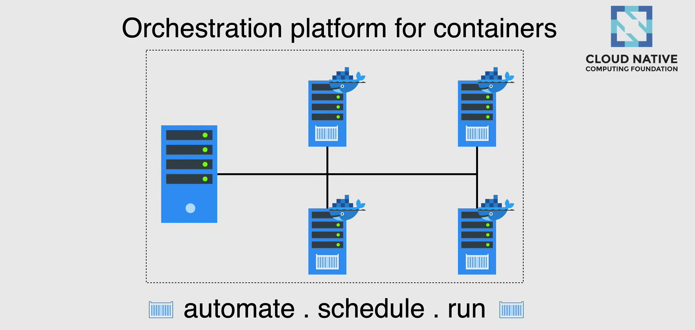
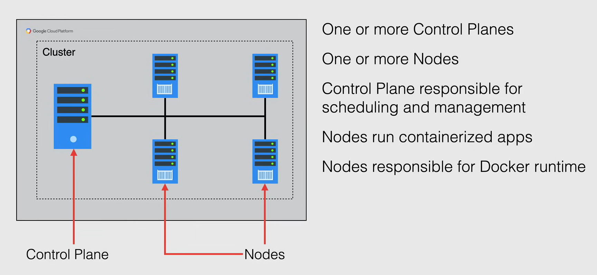
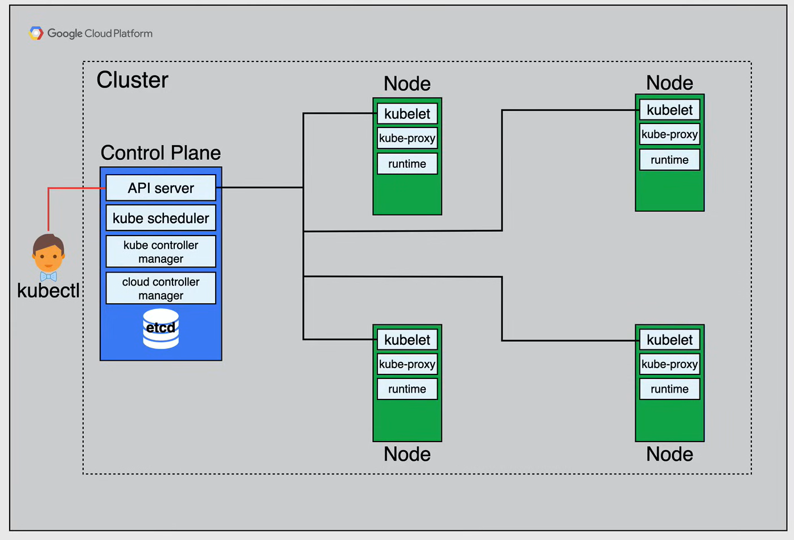

# GKE and Kubernetes Concepts

## What is Kubernetes?

**Kubernetes** is an orchestration platform for containers. It is invented by Google and is now maintained by the Cloud Native Computing Foundation (CNCF).

Kubernetes provides a platform for *automate*, *schedule*, and *run* containers on clusters of physical or virtual machines. Thus, eliminating many of the manual processes involved in deploying and scaling containerized applications.

Kubernetes manages the containers that run the applications and ensures that there is no downtime, in a way that the user can define.

For example, if you define that when a container goes down, and another container needs to start, Kubernetes would take care of that for you automatically and seamlessly. 

Kubernetes also provides you with the framework to run distributed systems resiliently, it takes cares of scaling and failover for your application, provides deployment patterns, and allows you to manage your applications with tons of flexibility, reliability, and power.

It works with a range of container tools, including Docker. It groups containers that make up an application into logical units for easy management and discovery.



## What is GKE?

**Google Kubernetes Engine (GKE)** is a managed environment for deploying, managing, and scaling your containerized applications using Google infrastructure.

The GKE environment consists of Compute Engine instances group together to form a cluster, and it provides all the same benefits as on-premises Kubernetes, yet has abstracted the complexity of having to worry about the hardware.


It has the benefits of advanced cluster management features that Google Cloud provides, such as:

- **Cloud Load Balancing**: For distributing traffic across clusters and nodes.
- **Node Pools**: For grouping nodes in a cluster.
- **Automatic scaling**: For adding or removing nodes from a node pool.
- **Automatic upgrades**: For upgrading the Kubernetes version of a cluster.
- **Node auto-repair**: For repairing nodes in a cluster.
- **Logging and Monitoring**: For monitoring the health of the cluster and the applications running on it.

## Cluster Architecture

A **cluster** is the foundation of Google Kubernetes Engine (GKE) and Kubernetes as a whole. 

The Kubernetes objects that represent your containerized applications all run on top of a cluster.

In GKE a cluster consists of at least one **Control Plane** and multiple worker machines called **nodes**. The Control Plane and node machines run the Kubernetes Cluster.

- The Control Plane is responsible to coordinate the entire cluster, and this can include:
  - *scheduling* workloads, like containerized applications, and 
  - *managing* the workloads lifecycle, *scaling*, and *upgrades*.
  - managing network, and storage resources for those workloads,
  - and most importantly, ***it manages the state of the cluster*** and make sure that it is at the desired state.

- The nodes are the worker machine that run your containerized applications and other workloads. 
  - The nodes are Compute Engine VM instances that GKE creates on your behalf when you create a cluster.
  - Each node is managed from the Control Plane, which receives updates on each node's self-reported status.
  - A node also runs the services necessary to support the Docker container that make up your cluster's workloads. 
    - This includes the *Docker runtime* and the Kubernetes node agent, called **kubelet**, which communicates with the Control Plane and it is responsible for starting and running Docker containers, scheduled on that node.



### Control Plane

The **Control Plane** is the unified endpoint for your cluster. The Control Plane's components make global decisions about the cluster, like scheduling, and detecting and responding to cluster events.

#### Kubernetes API Server

All interactions with the cluster are done through Kubernetes API calls, and the Control Plane runs the **Kubernetes API server** to handle those API calls.

- You can make Kubernetes API calls directly via HTTP, GRPC, or indirectly via `kubectl`, which is a command-line tool that communicates with the Kubernetes API server to manage the cluster.

The API server process is the hub for all communication for the cluster.

#### Kube Scheduler

The **Kube Scheduler** is a component that discovers and assigns newly created pods to a node for them to run on.

So any new pods that are created, will automatically be assigned to a node by the Kube Scheduler, taking into consideration any constraints that are in place.

#### Kube Controller Manager

The **Kube Controller Manager** is a component that runs controller processes. It is responsible for things like:

- noticing and responding when nodes go down
- maintaining the correct number of pods
- populating the services and pods
- creating default accounts and API access tokens, for new namespacesù

It is this controller that will basically look to make changes to the cluster when the current state does not meet the desired state.

#### Cloud Controller Manager

The **Cloud Controller Manager** embeds cloud-specific control logic. It lets you link your cluster into any cloud provider's API, and separates out the components that interact with that cloud platform, from components that just interact with your cluster.

Cloud Controller Manager only runs controllers that are specific to your cloud provider.

#### etcd

**etcd** is responsible for storing the cluster's state. It is a consistent and highly-available key-value store that only interacts with the Kubernetes API server.

It saves all the configuration data, along with what nodes are part of the cluster, and pods they are running.

### Nodes

#### Kubelet

The Control Plane need a way to interact with the nodes of the cluster, thus the nodes having components themselves for this communication to occur.

This component is called the **kubelet**. It is an agent that runs on each node in the cluster, that communicates with the Control Plane.

It is responsible for starting and running Docker containers scheduled on that node. It takes a set of pod specifications that are provided to it, and ensures that the containers described in those pod specifications are running and healthy.

#### Kube Proxy

The **Kube Proxy** is a component that maintains network connectivity to the pods in a cluster.

#### Container Runtime

The **Container Runtime** is the software that is responsible for running containers. In GKE, the default container runtime is *Docker*. It supports other container runtimes, like *containerd*.




## GKE Abstractions

GKE manages all the Control Plane components. The endpoint expose:

- the Kubernetes API, that kubectl uses to communicate with the cluster Control Plane.
- the Kubernetes API Server, that kubectl uses to communicate with the cluster Control Plane.

The endpoint IP is displayed in the GCP Console, and it allows you to interact with the cluster.

When you run the command:

```bash
gcloud container clusters get-credentials
```

you see that the command gets the cluster endpoint as part of updating the *kubeconfig* file.

An IP address for the cluster is then exposed to interact with, and it is responsible for providing, and managing all the infrastructure that is need for the Control Plane.

GKE, also automate the Kubernetes nodes, by launching them as Compute Engine VMs under the hood, but still allows the users to change the machine type, and access upgrade options.

By default, GKE clusters and node pools are upgraded automatically by Google, but you can also control when auto upgrades can and cannot occur, by configuring maintenance windows and exclusions.

**NOTE:** Cluster Control Plane and Nodes do not run necessarily in the same version at all times. 