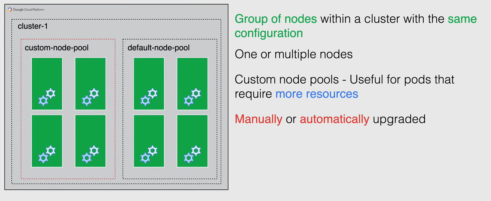
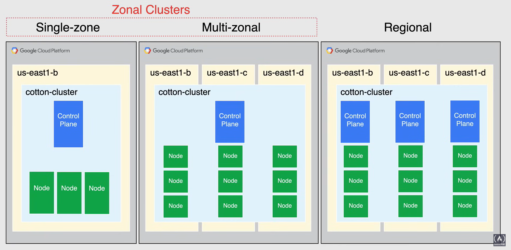
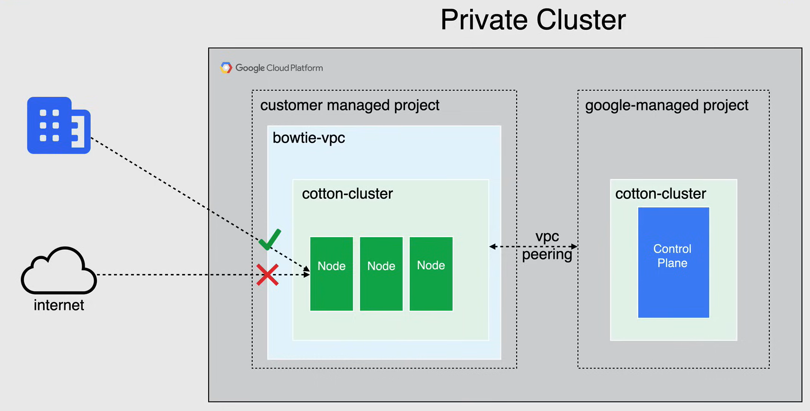

# Cluster and Node Management

## Node Pools

A **node pool** is a group of nodes within a cluster that all have the *same configuration*, and using nodeconfig specification to achieve this.

A node pool can also contain one or multiple nodes.

- When you first create a cluster, the number and the type of nodes that you specify becomes the default node pool.
- Then you can add additional custom node pools of different sizes and types to the cluster. 
- All nodes in any given node pool are **identical** to each other.

**Custom node pools** are really useful when you need to schedule that require **more resources** than the default node pool can provide.

- You can create, upgrade, and delete node pools individually without affecting the overall cluster.

**NOTE:**  You can configure a single node in any node pool, any configuration changes affect all nodes in that pool. All new node pools run the latest stable version of the Kubernetes node image.

Exisiting node pools can be **manually** or **automatically** upgraded to the latest stable version of the Kubernetes node image.

## Cluster Types

With GKE, you can create a cluster tailored to your available requirements and your budget.

### Zonal and Regional Clusters

The types of available clusters include **zonal**, both single zone of multi-zonal, and **regional**.

#### Zonal Clusters

Zonal clusters have a single Control Plane in a single zone. Depending on what king of availability you need, you can distribute your node for your zonal cluster in a single zone or in multiple zones.

- When you decide to deploy a **single zone cluster**, it has a single Control Plane running in a single zone, that manages workloads on nodes running in the same zone.

- A **multi-zonal cluster** has a single replica of the Control Plane running in a single zone, and the nodes are distributed across multiple zones.
  - During an update of the cluster, or an outage of the zone where the Control Plane runs, workloads still run. However, the cluster, its nodes, and its workloads cannot be configured until the control plane is available again.
  - Multi-zonal clusters are designed to balance availability and cost for consistent workloads.

**NODE:** In the Multi-zonal cluster, the same number of nodes will be deployed to each selected zone and may cost you more than busgeted.

#### Regional Clusters

When you looking to achieve high availability for your cluster, **Regional** clusters are the best option.

Regional clusters have multiple replicas of the Control Plane running in multiple zones within a region. Nodes also run in each zone where a replica of the Control Plane is running, because a regional cluster replicated the Control Plane and nodes, it consumes more Compute Engine resources than a zonal cluster.

The same number of node will be deployed to each selected zone, and the default when selecting a regional cluster is 3 zones.

### Private Clusters

**Private clusters** are clusters that gives you the ability to isolate the nodes from having inbound and outbound connectivity to the public internet. This insolation is achieved as the nodes have internal IP addresses only.

If you want to provide outbound internet access to the nodes, you can use a **Cloud NAT** gateway. By default Private Google Access is enabled and their workloads with limited outbound access to Google APIs and services over Google's private network.

In the Private Cluster the Control Plane's VPC network is connected to your cluster VPC network using **VPC Network Peering**. Your VPC network contains the cluster nodes and a separate Google Cloud VPC network contains the Control Plane. 

The Control Plane's VPC network is locked in a project controlled by Google. Traffic between the Control Plane and the nodes is routed entirely using internal IP addresses.

A Control Plane for a Private Cluster has a private endpoint in addition to the public endpoint. Instead, a Control Plane for a non-private cluster has only a public endpoint.

The private endpoint is an internal IP address is the Control Plane's VPC network. The public endpoint is the external IP address of the Control Plane and you can control the access to this endpoint using authorized networks, or disable access to the public endpoint.

As shown in the diagram below, you can disable the public endpoint and connect to your network using an internal IP address, using Cloud Interconnect or Cloud VPN, and you always have the option to enable and disable the public endpoint.

## Cluster Version

When you create a cluster, you can choose the cluster specific Kubernetes version or you can mix the versions for flexibility on features, either way, it is recommended to enable the **auto-upgrade** feature to keep your cluster up-to-date.

When you have auto-upgrade enabled, you are given the choice to choose from what are called **Release Channels**.

- When you enroll a new cluster in a release channel, Google automatically manages the version and upgrade cadence for the cluster and its node pools.
- All channels offer supported releases of GKE and are considered in *General Availability*.

You can choose from the following release channels:

- **Rapid**: This channel gets the latest Kubernetes release as early as possible, and be able to use new GKE features the moment that they go into general availability.

- **Regular (default)**: With this channel, you have access to GKE and Kubernetes features, reasonably soon after they are released, but on a version that has been qualified two to three month after releasing in the Rapid channel.

- **Stable**: This channel the stability is prioritized over new functionality, changes and new versions in this channel are rolled out last after being validated two/three months in the Regular channel.

If you know that you need to use a **specific supported version** of Kubernetes, for a given workload, you can specify it when you create the cluster.

If you don't need to control the specific patch version you use, consider enrolling your cluster in a release channel, instead of managing its version manually.

## Cluster Upgrades

Control Plane and Nodes *do not always run the same version* at all times.

- A *Control Plane* is always upgraded before its nodes.

- In terms of zonal and regional clusters:
  - *Zonal*: Cannot launch or edit workloads during the upgrade.
  - *Regional*: Each Control Plane is upgraded one by one.

- With Control Plane *auto-upgrade* is enabled by default (**best practice**).

- If you choose, you can do a **manual upgrade**, but you cannot upgrade Control Plane more then one minor version at a time.

- *Maintenance Windows* and *exclusions* are available.

## Node and Node Pool upgrades

- *Auto-upgrade* is enabled by default (**best practice**).
- *Manual upgrades* are available.
- *Maintenance Windows* and *exclusions* are available.

- When a node pool is upgraded, GKE upgrades one node at time.

  - While a node is being upgraded, GKE stops scheduling new pods onto it, and attempts to schedule its running pods onto other nodes in the pool.
  - The node is then recreated at the new version, but using the same name as before.
  - This is similar to other events that recreate the node such as entering or disabling a feature on the node pool.

- The Upgrade is complete only when:
  - *All nodes have been recreated*
  - Cluster is in the *desired state*

**NOTE:**

- When a newly upgraded node registers with the Control Plane, GKE marks the node as *Schedulable*.
- Upgrading a node pool may disrupt workloads running on the nodes in the pool, in order to avoid this, you can create a new node pool with the desired version and migrate the workloads.
- Then, after migration, you can delete the old node pool.

## Surge Upgrades

**Surge upgrades** let you control the number of nodes that GKE can upgrade at the same time, and control how disruptive the upgrades are to your workloads.

You can change how many nodes GKE attempts to upgrade at once, by changing the surge upgrade parameters, on a node pool.

- Surge upgrades reduce disruption to your workloads during cluster maintenance, and also allow you to control the number of nodes upgraded in parallel.

- Surge upgrades also work with cluster auto-scaler to prevent changes to nodes that are being upgraded.

Surge upgrades behavior is determined by two settings:

- `max-surge-upgrade`:
  - The number of additional nodes added to the node pool during an upgrade.
  - Increasing this value, means increasing the number of nodes that can be upgraded at the same time.
    - *Higher Number* = More parallel upgrades

- `max-unavailable-upgrade`:
  - The number of nodes that can be simultaneously unavailable during an upgrade.
  - Increasing this value, means increasing the number of nodes that can be upgraded in parallel.
    - *Higher Number* = More disruptive upgrades

During upgrades, GKE brings down at most the sum of `max-surge-upgrade + max-unavailable-upgrade` nodes at a time.