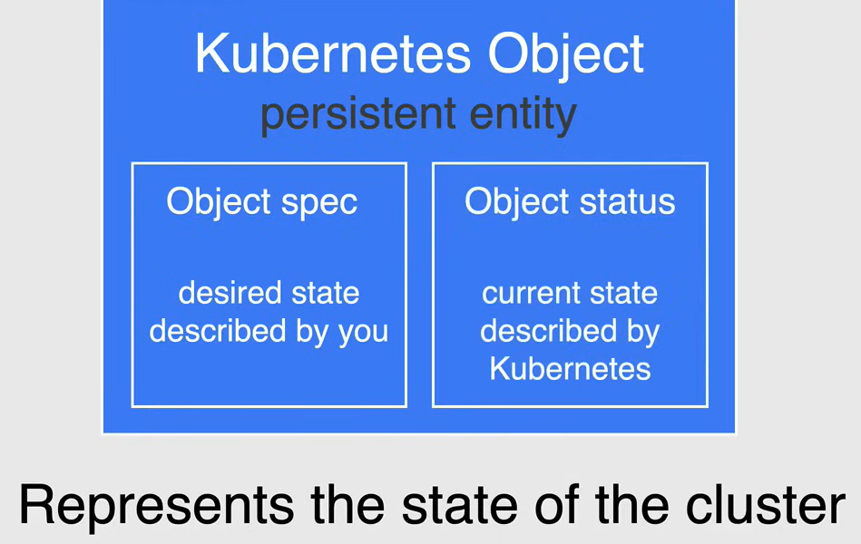
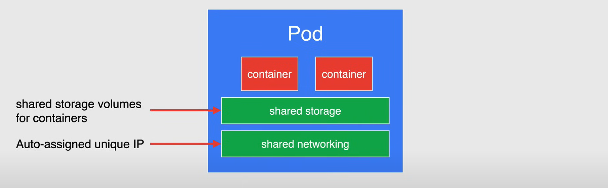
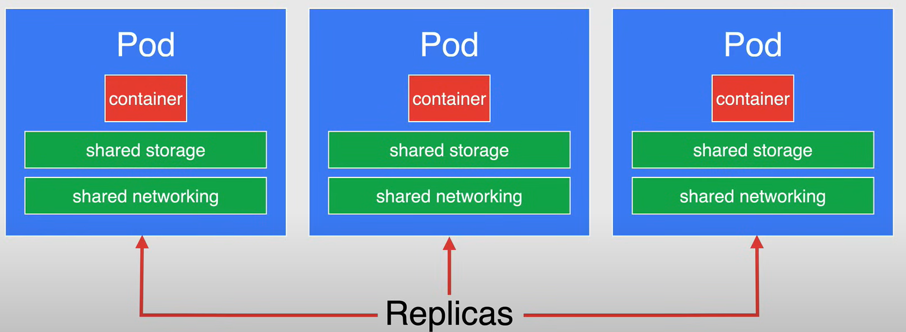
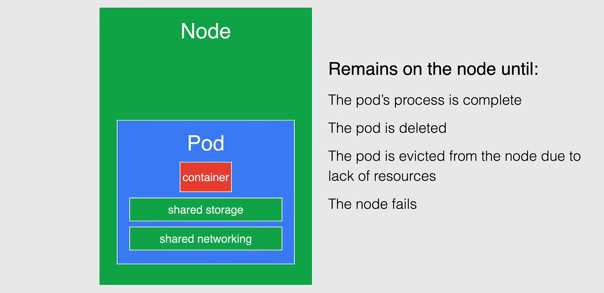
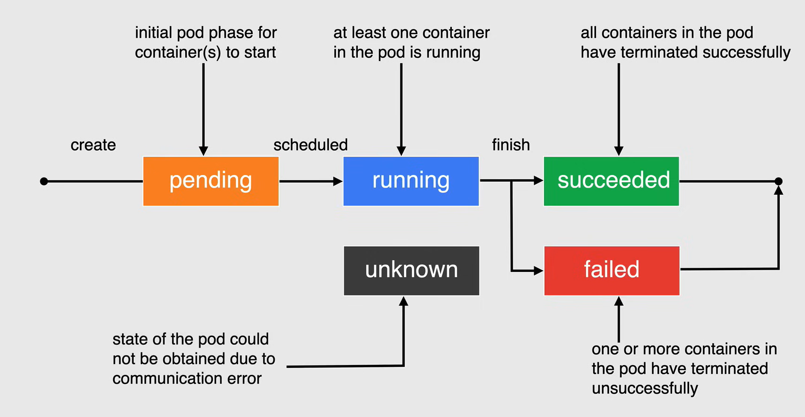

# Pods and Object Management

## Kubernetes Objects

**Kubernetes objects** are persistent entities in the Kubernetes system. Kubernetes uses these entities to *represent the state of your cluster*.

Specifically, they can describe:

- What containerized applications are running (and on which nodes)
- The resources available to those applications

A Kubernetes object is a **record of intent**, once you create the object, the Kubernetes system will constantly work to ensure that object exists. By creating an object, you're effectively telling the Kubernetes system what you want your cluster's workload to look like; this is your **cluster's desired state**.

Every Kubernetes object includes two nested object fields that govern the object's configuration:

- the object **spec**
  - it is the **desired state** of the object
  - we set it when we create the object providing a description of the characteristics we want the resource to have
- the object **status**
  - describes the **current state** of the objectddd

The Kubernetes Control Plane continually and actively manages every object's actual state to match the desired state you supplied.

Each object in a cluster has a **name** that must be unique within the namespace the object is created in. Every object also has a **UID** that is unique across the cluster.



### Manifest File

When creating, updating, or deleting objects in a Kubernetes cluster, you'll be using a **Kubernetes manifest file**, where you *specify the desired state of the object* that Kubernetes will maintain when you apply the manifest file.

Each configuration file can contain multiple manifests, and is a common practice to do so when possible.

A manifest file is defined in the form of a **YAML** or **JSON** file.

    - It is recommended to use YAML because it is easier to read and write than JSON.

In each YAML file for the Kubernetes object that you want to create, there are some required values that need to be set:

- `apiVersion`: The version of the Kubernetes API that you'll use to create the object.
- `kind`: The type of object you want to create.
- `metadata`: Data that helps uniquely identify the object, including a name string, UID, and optional namespace.
- `spec`: The desired state of the object that you want to create.

Here is an example of a simple YAML file that creates a Pod object:

```yaml
apiVersion: v1
kind: Pod
metadata:
  name: my-pod
spec:
    containers:
    - name: my-container
      image: nginx
      ports:
      - containerPort: 80
```

## Pods

**Pods** are the smallest, most basic deployable objects in Kubernetes. *A Pod represents a single instance of a running process in your cluster.*

Pods contain *one or more containers*, such as Docker containers. When a Pod runs multiple containers, the containers are managed as a single entity and share the Pod's resources, which also includes an *shared storage and networking* for thei containers.

Generally, one pod is meant to run a single instance of an application on your cluster, which is self-contained and isolated.



Although a pod is meant to run a single instance of an application in your cluster, *it is not recommended to create individual pods directly*. Instead, you should create a set of identical pods, called a **Replicas** to run your application.

A set of replicated pods are created and managed by a controller such as a **Deployment**.

- Controllers manage the lifecycle of their pods, as well as performing horizontal scaling, changing the number of pods is necessary.

You can interact directly with the pods, for debugging, troubleshooting, or monitoring purposes, but *it is recommended to use a controller to manage your pods.*



Once your pods are created, they are running on nodes in your cluster.

The pod will then remain on its node until:

- The pod's process is complete
- The pod is deleted
- The pod is evicted from the node due to lack of resources
- The node fails



### Namespace

A single GKE cluster should be able to satisfy the needs of multiple users, teams, or projects. To help with this, Kubernetes provides a way to divide cluster resources between multiple users in the form of **namespaces**.

We can think of a namespace as a virtual cluster inside a physical cluster. It is a way to divide cluster resources between multiple users, teams, or projects. So we can have multiple namespaces isolated from each other.

We can name the namespaces as we want, but Kubernetes starts with four initial namespaces:

- `default`: The default namespace for objects with no other namespace
- `kube-system`: The namespace for objects created by the Kubernetes system
- `kube-public`: The namespace is created automatically and is readable by all users
- `kube-node-lease`: The namespace for the `Node Lease` objects

When you create a new object in Kubernetes, you can specify the namespace you want it to be created in. If you don't specify a namespace, the object is created in the `default` namespace.

### Labels

**Labels** are key/value pairs that are attached to objects, such as pods. Labels are intended to be used to specify identifying attributes of objects that are meaningful and relevant to users.


### Pod Lifecycle

Pods in Kubernetes are ephemeral, meaning they are not meant to exist forever. They are created, run for a while, and then they are terminated, and when a pod is terminated, it cannot be brought back to life.

In general pods do not disappear until they are deleted by the user or by a controller.

Pods do not heal or repair themselves, for example, if a pod is scheduled on a node which later fails, the pod is deleted, as well if a pod is evicted from a node for any reason, it does not replace itself.

1. When a pod is *created*, it starts in the `Pending` state, and it is the pod initial phase and is waiting for one or more of the container to be set up and made ready to run.
This include the time a pod spends waiting to be scheduled, and downloading the container images.

2. When the pod has completed the pending phase it is moved to be *scheduled* and once it is scheduled it moves to the `Running` state, where it is bound to a node and all of the containers have been created.
The Running phase has at least one container in the pod running or is in the process of starting or restarting.

3. Once the workload is complete the pod will move into the `Succeeded` state, this means that all containers in the pod have terminated in success, and will not be restarted.

4. If all containers in the pod have not terminated successfully, the pod will move into a `Failed` state, this means that all containers in the pod have terminated, and at least one container has terminated in failure.

5. The last state is the `Unknown` state, this means that the state of the pod could not be obtained, typically due to an error in communicating with the node where the pod is running.



### Creating pods

When you are creating pods using a **Deployment**, is a common way to do this.

A Deployment runs multiple replicas of your application and automatically replaces any instances that fail or become unresponsive.

They help to ensure that one or more instances of your application are available to serve user requests.

Deployments use a **pod template**, which contains a specification for its pods, that determines how each pod should look like. Fore example, the pod template specifies:

- what application should run inside its containers
- which volume the pods should mount
- its labels
- ...


When a deployment pod template is changed, new pods are automatically created one at a time.

*Replica Set ensure that a specified number of pod replicas are running at any given time, however, a Deployment is a higher-level concept that manages Replica Sets and provides declarative updates to pods along with a lot of other useful features.*

So using a Deployment is the recommended over using a Replica Set.

### Workloads

Kubernetes workloads are objects that set deployment rules for pods. Based on this rules Kubernetes performs the deployment and updates the workload with the current state of the application.

Workloads let you define the rules for application scheduling, scaling, and upgrading.

There are different types of workloads in Kubernetes:

- **Deployments** are a type of workload, and as we have seen, they run multiple replicas of your application and automatically replace any instances that fail or become unresponsive.
  - They are best suited for stateless applications, such as web servers.

- **StatefulSets** are used for applications that require persistent storage.
  - They are best suited for applications that require to maintain their identity and store data.

- **DaemonSets** are used to ensure that every node in the cluster runs a copy of a pod.
  - They are best suited where you are collecting logs or monitoring node performance.

- **Jobs** are workloads used to run a finite task until completion.
  - They are best suited for running a batch job, such as a data migration.

- **CronJobs** are workloads similar to Jobs, but they run until completion on a schedule.
  - They are best suited for running a job at a specific time, such as a backup job.

- **ConfigMaps** are used to store general configuration information.
  - When you upload a config map any workload can reference it either an environment variable or a volume mount.
  - They are not meant to store sensitive information, if you need to store sensitive information you should use a **Secret**.