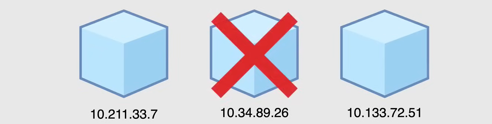
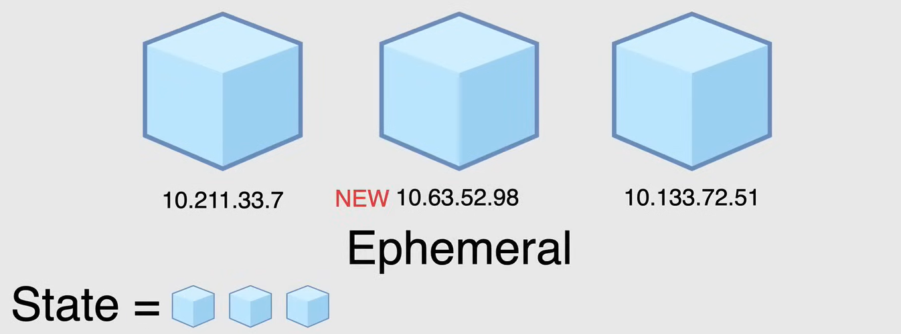
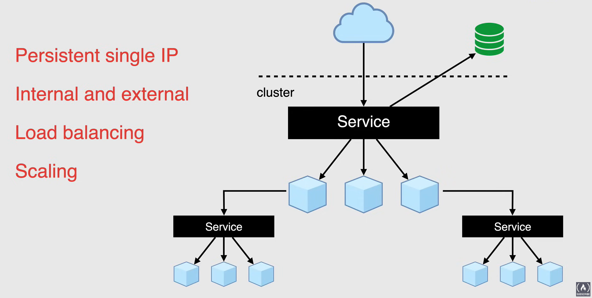
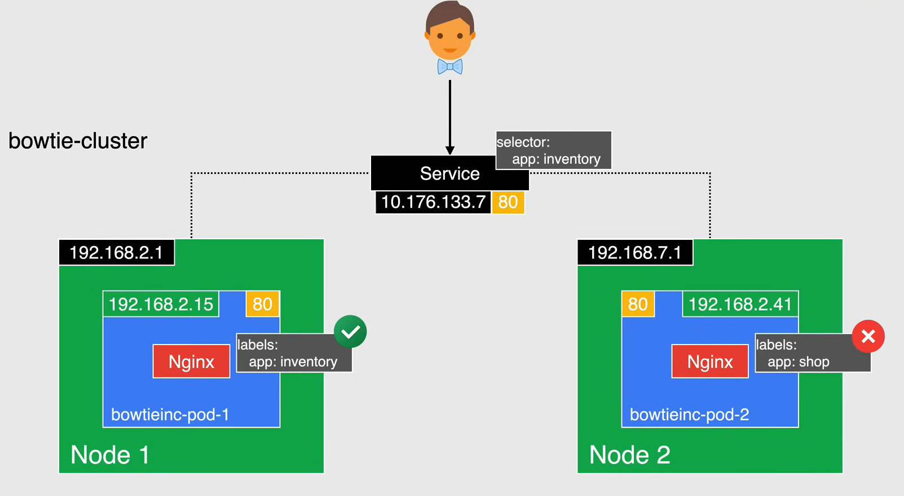
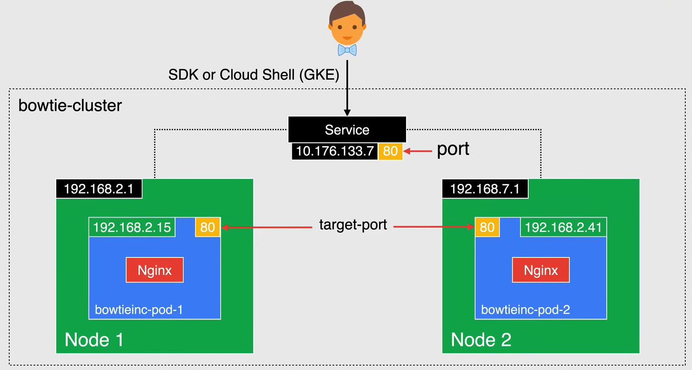
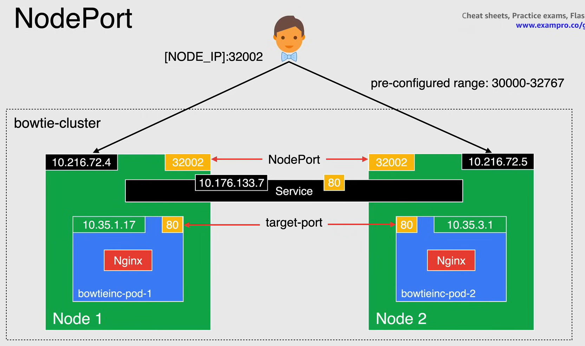
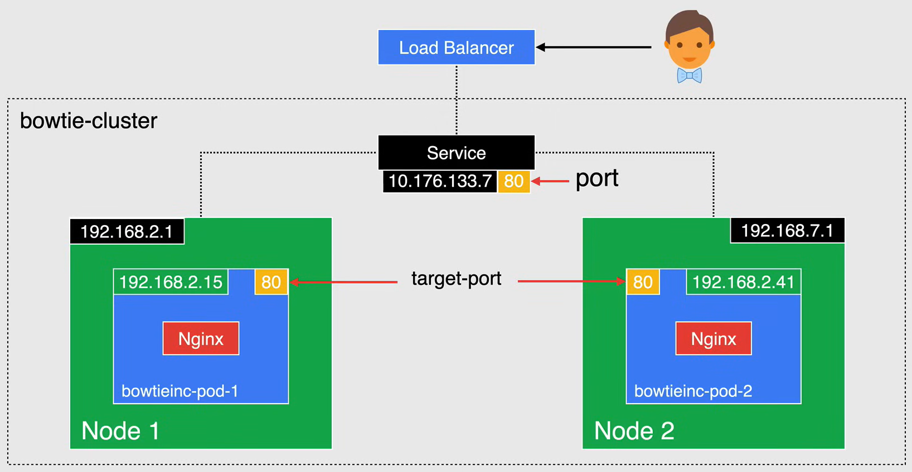
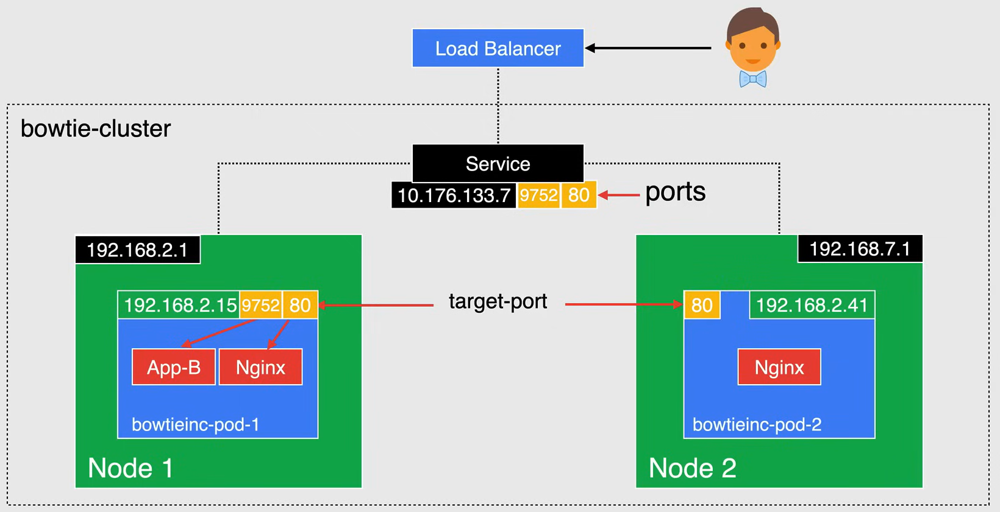
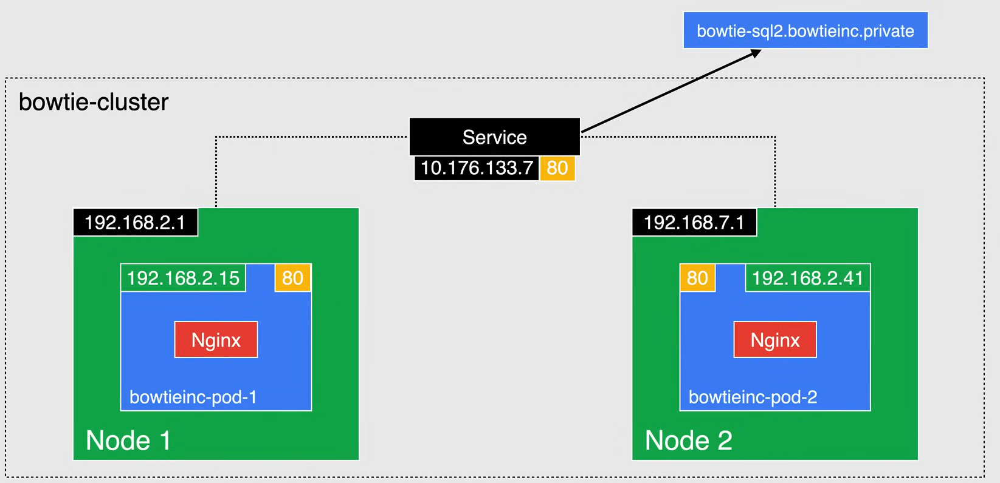
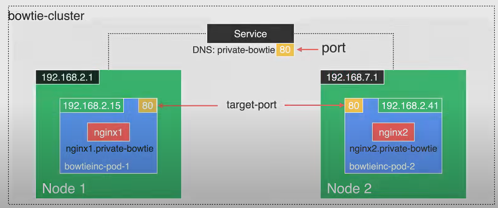

# Kubernetes Services

**NOTE:** Important to understand for the exam.

## Kubernetes approach to networking

As described in the previous lessons, Kubernetes Pods are ephemeral, which means that they can be created and destroyed at any time, to match the state of your cluster, so this resources are never permanent.

A perfect example of this i by using a deployment object so you can create and destroy pods dynamically.




When it comes to networking in Kubernetes, each pod gets its own IP address, however, in a deployment, a pod that is running once destroyed, will be recreated with a new IP address, and there is no real way to keep track of the IP addresses for communication, as they change very frequently, and this is where Kubernetes Services come in.

## What is a Kubernetes Service?

A Service is an abstraction in the sense that it is not a process that listens on some network interface, it can be defined as a logical set of Pods, an abstraction on top of Pods, that provides a *single persistent IP* address and *DNS name* by which the set of Pods can be accessed.

- **Internal and External**: It allows for *routing external traffic* into your Kubernetes cluster and used inside your cluster for more intelligent routing.
  - Allow external access from users to the application inside the cluster without having to know the IP address of the pods.

- **Load Balancing**: With Services it is also very easy to manage *load balancing* configurations, for traffic between replicas.

- **Scaling**: It helps pods scale quickly and easily as the service will automatically handle the recreation of pods and their new IP addresses.

The main goal of Services in Kubernetes is to provide persistent access to its pods without the necessity to look for a pod's IP address, each time a pod is recreated.



## Service Components

In order for a Service to route traffic to the correct pod in the cluster, there are some fields in the *manifest* file that help determine the endpoints on where traffic should be routed.

The following YAML file are an example of a Service and Deployment manifest file. As we can see in the `service.yaml` file, the type is `Service`, and the DNS name is `my-service`, and the `selector` field is used to define which pods should be included in the service, and the label `app: inventory` is used to define which pods. The `type` field is used to define the type of service, in this case, `ClusterIP`, which is used to expose the service on a cluster-internal IP address. The `ports` field is used to define the port that the service will listen on.


`service.yaml`:

```yaml
apiVersion: v1
kind: Service
metadata:
    name: clusterip-service     # DNS name of the service
spec:
    selector:
        app: inventory          # Forward requests to pods with this label
    type: ClusterIP             # Type of service
    ports:
        - protocol: TCP
        port: 80                # Port number exposed internally in cluster
        targetPort: 80          # Port that container listens on
```

`deployment.yaml`:

```yaml
apiVersion: apps/v1
kind: Deployment
metadata:
    name: bowtie-service
spec:
    replicas: 2
    template:
        metadata:
            labels:
                app: inventory
        spec:
            containers:
                - name: bowtie-service
                  image: nginx:lastest
```

## Selectors and Labels

Kubernetes has a very unique way of routing traffic, and when it comes to Services, it's not any different.

Services select pods based on their labels.

When a selector request is made to the service, it selects all pods in the cluster matching the key-value under the `selector` field in the service manifest file.

It chooses one of the pods if there are more than one with the same key-value pair, and forward the request to it.

In the following example you can see the selector specified for the service as a key-value pair of `app: inventory`. You can see the pods on `Node 1`, holds the label `app: inventory`, and the service will forward the request to one of the pods.
If you look at the label for the pod in `Node 2`, the label does not match the selector, so the service will not forward the request to that pod.
To summarize, the label on the pod matching the selector in the service manifest file is what determines which pod the service will forward the request to.



## Service Types

There are different types of services in Kubernetes available to route traffic to the pods in the cluster:

- **ClusterIP**
- **NodePort**
- **LoadBalancer**
- **Ingress**
- **Multi-Port Services**
- **ExternalName**
- **Headless**

Kubernetes services provides the interfaces through which pods can communicate with each other. 

They also act as the main gateway for your application. 

Services use selectors to identify which pods they should control.

They expose an IP address and a port that is not necessarily the same port at which the pod is listening. Services can expose more than one port and can also route traffic to other services, external IP addresses or DNS names.

Services make it really easy to create network services in Kubernetes.

Each Service can be backed with as many pods as needed without having to make your code aware of how each service is backed.


### ClusterIP

The ClusterIP service is the default type of service in Kubernetes, and it gives you a service inside your cluster that other apps inside your cluster can access.

The service is not exposed outside the cluster, but can be addressed from within the cluster.

When you create a service with the type `ClusterIP`, Kubernetes creates a stable IP address that is accessible from nodes in the cluster. Clients in the cluster call the service by using the cluster IP address and the port number specified in the service manifest file.

The request if forwarded to one of the member pods on the ports specified in the `targetPort` field in the service manifest file.



**NOTE:** This IP address is stable for the lifetime of the service.

In the following example, a client calls the service at `10.176.133.7` on port `80`, and the request is forwarded to one of the pods in the cluster on TCP port `80`.
The member pod must have a container that is listening on TCP port `80`. If there is no container listening on that port, the request will fail.

A great use case of `ClusterIP` is when you have a DNS record that you don't want to change, and you want the name to resolve to the same IP address or you merely want a static IP address for your workload.

Although the service is not accessible by network requests from outside the cluster, if you need to access the service from outside the cluster, you can still connect to it with the CloudSDK or Cloud Shell by using the exposed IP address of the cluster.

The following is an example of a `ClusterIP` service manifest file:

```yaml
apiVersion: v1
kind: Service
metadata:
    name: clusterip-service     # DNS name of the service
spec:
    selector:
        app: inventory          # Forward requests to pods with this label
    type: ClusterIP             # Type of service
    ports:
        - protocol: TCP
          port: 80              # Port number exposed internally in cluster
          targetPort: 80        # Port that container listens on
```

### NodePort

When you create a service of type `NodePort`, you specify a note port value.

The `NodePort` is a static port and is chosen from a pre-configured range between `30000` and `32767`.

- You can specify your own value within this range.
- *But any value outside of this range will not be accepted by Kubernetes.*
- If you do not choose a value, a random value within the range specified will be assigned.



Once this port range has been assigned to the service, then the service is accessible by using the IP address of any node along with the `NodePort` value.

The service is then exposed on a port on every node in the cluster. Service can then be accessed externally at the node's IP along with the NodePort.

When using NodePort services, you must make sure that the selected port is not already open on your nodes.

**NOTE:** the NodePort type is an extension of the ClusterIP type. So a service of type NodePort naturally has a cluster IP address.

And so this method isn't very secure, as it opens up each node to external entry, and it relies on knowing the IP addresses of the notes, which could change at anytime.

```yaml
apiVersion: v1
kind: Service
metadata:
    name: nodeport-service      # DNS name of the service
spec:
    selector:
        app: inventory          # Forward requests to pods with this label
    type: NodePort              # Type of service
    ports:
        - protocol: TCP
          port: 80              # Port number exposed internally in cluster
          targetPort: 80        # Port that container listens on
          nodePort: 32002       # Port exposed on the nodes
```

### LoadBalancer

`LoadBalancer` is exposed as a load balancer in the cluster. LoadBalancer services will create an internal Kubernetes service that is connected to a cloud provider's Load Balancer (in this case, Google Cloud).

This will create a static, publicly addressable IP address and an DNS name that can be used to access your cluster from an external source.



The LoadBalancer type is an extension of the `NodePort` type, so a service of type LoadBalancer naturally has a ClusterIP address. If you want to directly expose a service, this is the default method.

All traffic on the port you specify will be forwarded to the service.

There is no filtering or routing, and it means you can send many different types of traffic to it, like HTTP(S), TCP or UDP and more.

The **downside** here is that for each service you expose with a load balancer you pay for that LoadBalancer, so you can rack up your bill if you are using multiple LoadBalancers.

```yaml
apiVersion: v1
kind: Service
metadata:
    name: loadbalancer-service  # DNS name of the service
spec:
    selector:
        app: inventory          # Forward requests to pods with this label
    type: LoadBalancer          # Type of service
    ports:
        - protocol: TCP
          port: 80              # Port number exposed internally in cluster
          targetPort: 80        # Port that container listens on
```

### Multi-Port Services

`Multi-Port Services` is used when you need to expose more than one port. 

Kubernetes lets you configure multiple port definitions on a service object. So when using multiple ports for a service, you must give all your ports names, and if you have multiple service ports, these names must be unique.



In this example, if a client calls the service at `10.176.133.7` on TCP port `80`, the request is forwarded to a member pod on TCP port `80`, on either `Node 1` or `Node 2`.

But if a client calls the service at `10.176.133.7` on TCP port `9752` the request is forwarded to the pod on TCP port `9752` that resides on `Node 1`.

Each member pod must have a container listening on TCP port `80` and a container listening on TCP port `9752`. This could be a single container with two threads or two containers running in the same pod.

And of course, as shown here, is a manifest showing the multi port services.

```yaml
apiVersion: v1
kind: Service
metadata:
    name: loadbalancer-service  # DNS name of the service
spec:
    selector:
        app: inventory          # Forward requests to pods with this label
    type: LoadBalancer          # Type of service
    ports:
        - name: Nginx
          protocol: TCP
          port: 80              # Port number exposed internally in cluster
          targetPort: 80        # Port that container listens on
        - name: App-B
          protocol: TCP
          port: 9752            # Port number exposed internally in cluster
          targetPort: 9752      # Port that container listens on
```

### ExternalName

A service of type `ExternalName` provides an internal alias for an external DNS name.

Internal clients make requests using the internal DNS name and the requests are redirected to the external name. When you create a service, creates a DNS name that internal clients can use to call the service.



In this example, the internal DNS name is `bowtie-sql` when an internal client makes a request to the internal DNS name of `bowtie-sql`, the request gets redirected to `bowtie-sql2.bowtieinc.private`.

The ExternalName service type is a bit different than other service types as it's not associated with a set of pods or an IP address.

It is a mapping from an internal DNS name to an external DNS name.

The service does a simple CName redirection and is a great use case for any external service that resides outside of your cluster. 

```yaml
apiVersion: v1
kind: Service
metadata:
    name: bowtie-sql                                # Internal DNS name
spec:
    type: ExternalName
    externalName: bowtie-sql2.bowtieinc.private     # External DNS name redirect
```

### Headless

`Headless` service type, is used when you don't need or want load balancing and a single service IP.

In this case you can create `Headless` services by specifying `None` as a service type in the manifest file.

This option also allows you to choose other service discovery mechanisms without being tied to Kubernetes implementation.



Applications can still use a self registration pattern with this service, and so a great use case for this is when you don't need any low balancing or routing. You only need the service to patch the request to the back end pod, no IP is needed.

`Headless` service is typically used with stateful sets where the name of the pods are fixed. This is useful in situations like when you're saying up a `mysql` cluster, where you need to know the name of the master. 

And so here is a manifest for the headless service.

```yaml
apiVersion: v1
kind: Service
metadata:
    name: headless-service
spec:
    selector:
        app: inventory
    type: None                  # Type of service
    ports:
        - protocol: TCP
          port: 80
          targetPort: 80
```