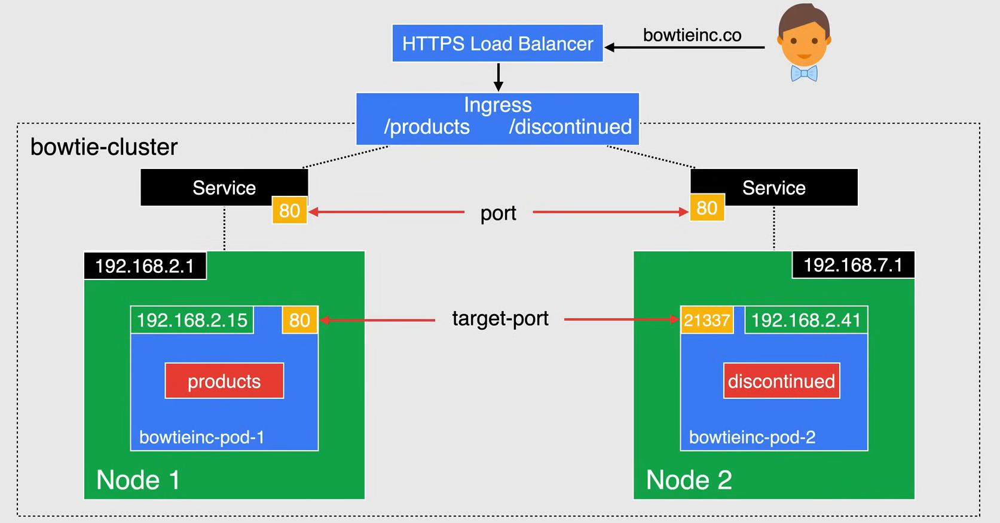
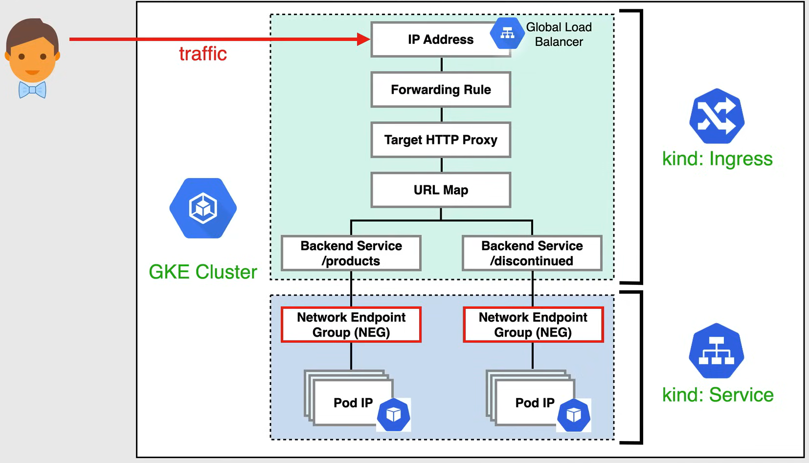

# Ingress for GKE

**NOTE:** Important for the exam.

In GKE, an **Ingress** object defines rules for routing HTTP and HTTPS traffic to applications running in a cluster.

An Ingress object is associated with one or more service objects, each of which is associated with a set of pods. 

When you create an Ingress object, the GKE Ingress Controller creates a Google Cloud HTTP or HTTPS Load Balancer and configures it according to the information in the Ingress and it's associated services.

GKE Ingress is a built in and managed Ingress Controller.

This controller implements Ingress Resources as Google Cloud load balancers for HTTP and HTTPS workloads in GKE.

The low balancer is given a stable IP address that you can associate with a domain name. Each external HTTP and HTTPS load balancer or internal HTTP or HTTPS load balancer uses a single URL map which references one or more back end services. One back end service corresponds to each service referenced by the Ingress.



In this example, assume that you have associated the low balancer's IP address with the domain name `bowtieinc.co`.

- When a client sends a request to `bowtieinc.co` the request is routed to a Kubernetes service named `products` on port `80`.
- When a client sends a request to `bowtieinc.co/discontinued`, the request is routed to a Kubernetes service named `discontinued` on port `21337`.

'Ingress` is probably the most powerful way to expose your services, but can also be very complex as there are also many types of Ingress controllers to choose from along with plugins for Ingress controllers.

Ingress is the most useful and cost effective if you want to expose multiple services under the same IP address as you only pay for one load balancer, if you are using the native GCP integration and comes with a slew of features.

- `ingress.yaml`:

    ```yaml
    apiVersion: networking.k8s.io/v1
    kind: Ingress
    metadata:
        name: ingress-net
    spec:
        rules:
        - http:
            paths:
            - path: /*
                backend:
                    serviceName: products
                    servicePort: 80
            - path: /discontinued
                backend:
                    serviceName: discontinued
                    servicePort: 21337
    ```

- `products-service.yaml`:

    ```yaml
    apiVersion: v1
    kind: Service
    metadata:
        name: products
    spec:
        type: NodePort
        selector:
            app: products
        ports:
        - protocol: TCP
            port: 80
            targetPort: 80
    ```

- `discontinued-service.yaml`:

    ```yaml
    apiVersion: v1
    kind: Service
    metadata:
        name: discontinued
    spec:
        type: NodePort
        selector:
            app: discontinued
        ports:
        - protocol: TCP
            port: 21337
            targetPort: 21337
    ```

## Network Endpoint Groups (NEGs)

**Network Endpoint Groups** (NEGs) is a configuration object that specifies a group of back end endpoints for services.

NEGs are useful for container native load balancing, where each container can be represented as an endpoint to the low balancer.

The NEGs are used to track pod endpoints dynamically, so the Google load balancer can route traffic to its appropriate back ends.

So traffic is low balanced from the low balancer directly to the pod IP, as opposed to traversing the VM IP and Coupe proxy networking.

In these conditions Services will be annotated automatically, indicating that NEG should be created to mirror the pod IPs within the service.

NEGs is what allows Compute Engine load balancers to communicate directly with pods.

The diagram shown here is the Ingress to compute engine resource mappings of the manifest that you saw earlier, where the GK Ingress Controller deploys and manages Compute Engine, low balancer resources based on the Ingress Resources that are deployed in the cluster.



## Health Checks

If there are no specified **Health Check** parameters for a corresponding service, using a Backend Custom resource definition, a set of *default and inferred parameters are used*.

**Health check** parameters for you back end service should be explicitly defined by creating a Backend Config *custom resource definition (CRD)* for the service.

A Backend Config custom resource definition should also be used if:

- *Anthos* Ingress controller is used.
- you have *more than one container* in the serving pods,
- you need control over the *port that's used for the load balancers health checks*.

Now you can specify the back end services Health Check parameters using the Health Check parameter of a Backend Config custom resource definition, referenced by the corresponding service.

This gives you more flexibility and control over Health Checks for a Google Cloud External HTTP or HTTPS load balancer or internal HTTP(s) load balancer created by an ingress. 

## SSL Certificates

There are three ways to provide SSL certificates to an HTTP, or HTTPS, low balancer.

- **Google Managed Certificates**
  - Completely managed by Google: provisioned, deployed, renewed and managed for your domains.
  - Do not support wild card domains.

- **Self Managed Certificates**
  - Managed and shared shared with Google Cloud.
  - You can *provision your own SSL certificate* and create a certificate resource in your Google Cloud Project.
  - You can then *list the certificate resource in an annotation* on an Ingress to create an HTTP(S) load balancer that uses the certificate.

- **Self Managed Certificates as Secret Resources**
  - You can *provision your own SSL certificate*
  - *Create a Secret* to hold it.
  - You can then *refer to the Secret* as an Ingress specification to create an HTTP(S) load balancer that uses the certificate.

*You can specify multiple certificates in an Ingress manifest*. The load balancer chooses a certificate if the common name in the certificate matches the host name used in the request.

