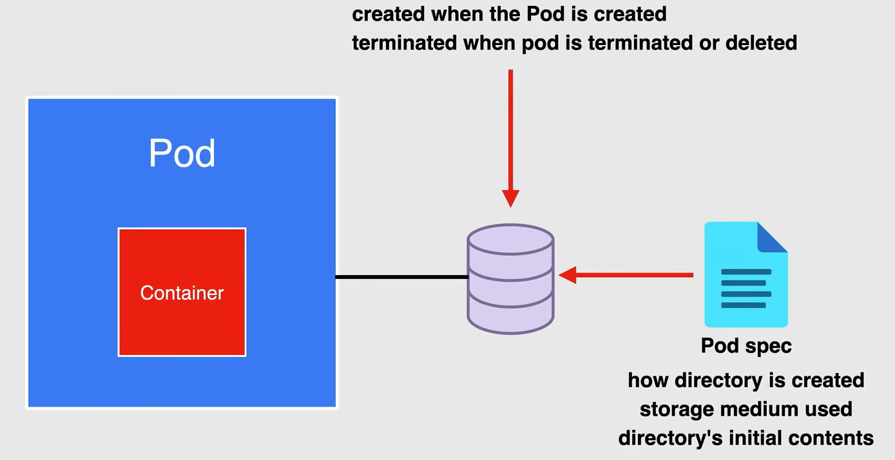
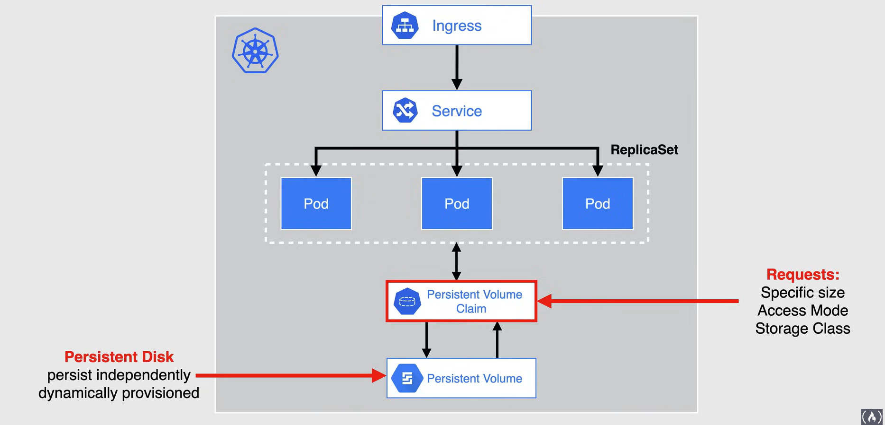
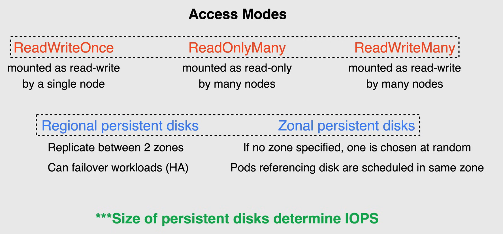

# GKE Storage Options


There are several storage options for applications running on GKE. The choice is very in terms of flexibility and ease of use. Google Cloud offers several storage options that can be used for your specific workload.

Kubernetes also provide storage abstractions.

The easiest storage options are Google Cloud's managed storage products.

- If you need to connect a database to your cluster, you can consider using **Cloud SQL** data store or **Cloud Spanner**. 
- When it comes to *object storage*, **Cloud Storage** would be an excellent option to fill the gap. 
- **Filestore** is a great option for when your application requires manage network attached storage.
- If your application requires *block storage*, the best option is to use **Persistent Disks** and can be provisioned manually or provision dynamically through Kubernetes.

## Docker Storage

A **docker volume** is a directory on disk or in another container.

Docker provides *volume drivers*, but the functionality is somewhat limited.

A Docker container has a writable layer, and this is where the data is stored by default, making the data ephemeral, and so data is not persisted when the container is removed. So storing data inside a container is not always recommended.

There are three ways to mount data inside a Docker container. 

1. **Docker volume**

   - It sits inside the Docker area within the host file system, and can be shared amongst other containers
   - This volume is a Docker object and is decoupled from the container
   - They can be attached and shared across multiple containers

2. **Bind mounting**

   - It is coming directly from the host file system
   - Bind mounts are great for local application development, yet cannot be shared across containers

3. **tmpfs**

   - It is stored in the host memory
   - This way is great for ephemeral data and increases performance as it no longer lies in the container's writable layer.


## Kubernetes Storage Abstractions

With **Kubernetes Storage Abstractions**, file system and block-based storage are provided to your pods, but are different than Docker in nature.

*Volumes* are the basic storage unit in Kubernetes that decouples the storage from the container and tie it to the pod, and not the container like in Docker.

- A regular volume simply called **Volume**, is basically a directory that the containers in a pod have access to.

- The particular volume type used is what will determine its purpose.

- Some volume types are backed by ephemeral storage like `empty-dir`, `configmap` and `secrets`. And these volumes do not persist after the pod ceases to exist. 

Volumes are useful for caching temporary information, sharing files between containers, or to load data into a pod. 

Other volume types are backed by durable storage, and persist beyond the lifetime of a pod, like **Persistent Volumes** and **Persistent Volume Claims**.

- A *Persistent Volume* is a cluster resource that pods can use for durable storage
- A *Persistent Volume Claim* can be used to dynamically provision a persistent volume, backed by Persistent Disks
  - Persistent Volume Claims can also be used to provision other types of backing storage, like NFS.


## Volumes

In Docker, on disk files in a container are the simplest place for an application to write data.

But *files are lost when the container crashes or stops for any other reason*, as well as being unaccessible to other containers running in the same pod.

In Kubernetes the volume source declared in the pod specification determines how the directory is created.

- The storage medium used and the directories initial contents.

A* pod specifies what volumes it contains*, and the path where containers mount the volume.

Ephemeral volume types live the same amount of time as the pods they are connected to. These volumes are created when the pod is created, and persist through container restarts, only when the pod terminates or is deleted, are them volumes terminated as well.

Other volume types are **interfaces** to durable storage that exist independently of a pod, like ephemeral volumes, data in a volume backed by durable storage, is preserved when the pot is removed.

The volume is merely unmounted, and the data can be handed off to another pod.



### Volume Types

Volumes differ in their storage implementation and their initial contents.

You can choose the volume source that best fits your use case. 

- **emptyDir**: An emptyDir volume provides an empty directory that containers in the pod can read and write from.
  - When the pod is removed from a node for any reason, the data in the empty dirt is deleted forever. 
  - An emptyDir volume is stored on whatever medium is backing the node, which might be a disk, SSD or network storage. 
  - emptyDir volumes are useful for scratch space and sharing data between multiple containers in a pod. 

- **ConfigMap**: A ConfigMap is a resource that provides a way to inject configuration data into pods.
  - The data stored in a ConfigMap object can be referenced in a volume of type ConfigMap and then consumed through files running in upon.

- **Secret**: A Secret volume is used to make sensitive data, such as passwords, Oauth tokens and SSH Keys, available to applications.
  - The data stored in a Secret object can be referenced in a volume of type Secret, and then consumed through files running in a pod.

- **Downward API**: this volume makes Downward API data available to applications.
  - So this data includes information about the pod, and container in which an application is running in.
  - An example of this would be to expose information about the pods, namespace and IP address to applications.
  
- **PersistentVolumeClaim**: A PersistentVolumeClaim volume can be used to provision durable storage so that they can be used by applications. 
  - A pod uses a PersistentVolumeClaim to mount a volume that is backed by this durable storage. 

## Persistent Volumes

**Persistent Volume** resources are used to manage durable storage in a cluster.

In GKE, a persistent volume is typically backed by a *persistent disk* or *Filestore* can be used as an NFS solution.

Unlike volumes, the persistent volume lifecycle is managed by Kubernetes and can be dynamically provisioned without the need to manually create and delete the backing storage.

Persistent volume resources are cluster resources that exist independently of pods and continue to persist as the cluster changes, and as pods are deleted and recreated.



Moving on to *Persistent Volume Claims*, this is a request for and claim to a persistent volume resource.

- Persistent volume claim objects request a specific size, access mode and storage class for the persistent volume.

- If an existing persistent volume can satisfy the request or can be provisioned the persistent volume claim is bound to that persistent volume.

**NOTE:** Pods use claims as volumes. The cluster inspects the claim to find the bound volume and mounts that volume for the pod.

### Storage Classes

These volume implementations, such as GCE Persistent Disk, are configured through StorageClass resources.

GKE creates a default StorageClass for you, which uses the standard Persistent Disk type of EXT4 as shown here.
The default storage class is used when a persistent volume claim doesn't specify a storage class name and can also be replaced with one of your choosing.
You can even create your own storage class resources to describe different classes of storage and is helpful when using Windows Nodes Pools.

```yaml
apiVersion: storage.k8s.io/v1
kind: StorageClass                          # StorageClass resource
metadata:
  name: standard
provisioner: kubernetes.io/gce-pd
parameters:
  type: pd-standard
  fstype: ext4                              # Default storage class                    
  replication-type: none
reclaimPolicy: Retain
allowVolumeExpansion: true
mountOptions:
  - debug
volumeBindingMode: Immediate
```

### Persistent Volume - Provisioning

Persistent Volume Claims can automatically provision Persistent Disks for you.

When you create this Persistent Volume Claim object, Kubernetes dynamically creates a corresponding Persistent Volume object.

Due to the GKE default storage class, this Persistent Volume is backed by a new empty Compute Engine Persistent Disk.

You use this disk in a pod by using the claim as a volume, when you delete a claim, the corresponding Persistent Volume object and the provision Compute Engine Persistent Disk are also deleted.

To prevent deletion, you can set the *reclaim policy* of the persistent disk resource or its storage class resource to retain.

Now, deployments, as shown here in this diagram, are designed for stateless applications. So all replicas of a deployment, share the same persistent volume claim, which is why stateful sets are the recommended method of deploying stateful applications, that require a unique volume per replica.

By using stateful sets with persistent volume claim templates, you can have applications that can scale up automatically with unique, persistent volume claims associated to each replica pod.

### Persistent Volume - Access Modes

There are 3 supported modes for your persistent disks that allow read/write access and are listed here.

- **ReadWriteOnce** is where the volume can be mounted as read-write by a single node.
- **ReadOnlyMany** is where the volume can be mounted as read only by many notes.
- **ReadWriteMany** is where the volume can be mounted as read-write by many notes. 

**NOTE:** ReadWriteOnce is the most common use case for persistent disks and works as the default access mode for most applications.

The type of persistent disks that are available are:

- **Regional Persistent Disks**
  - These are multi zonal resources that replicate data between two zones in this same region
  - It can be used similarly to zonal persistent disks. 
  - In the event of a zonal outage, Kubernetes can fail over workloads using the volume to the other zone.
  - Regional persistent disks are great for highly available solutions for stateful workloads on GKE. 

- **Zonal Persistent Disks**
  - Xonal persistent disks are zonal resources and so unless a zone is specified, GKE assigns the disk to a single zone and chooses the zone at random.
  - Once a persistent disk is provisioned, any pods referencing the disk are scheduled to the same zone as the disk

**NOTE:** Using anti-affinity on zones allows stateful set pods to be spread across zones along with the corresponding disks.

And the last point that I wanted to cover when it comes to persistent volume access is the speed of access. Now, as stated in an earlier lesson, the size of persistent disks determine the IOps and throughput of the disk.

GKE typically uses persistent disks as boot disks and to back Kubernetes persistent volumes.

So whenever possible, *use larger and fewer disks to achieve higher IOps and throughput*.

