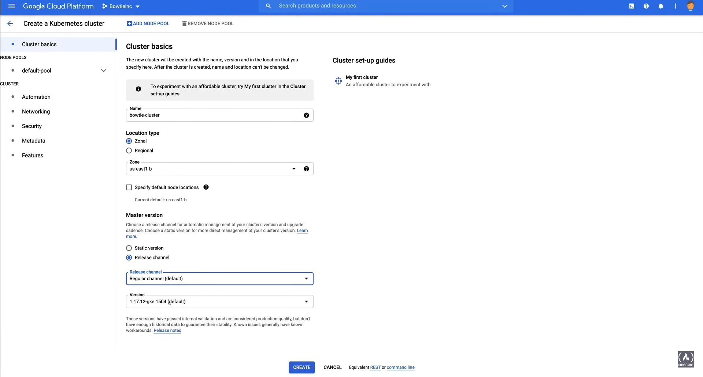
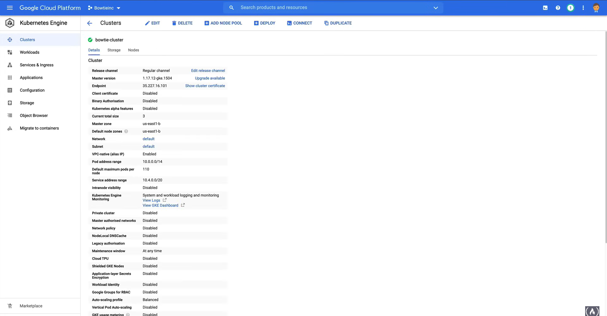
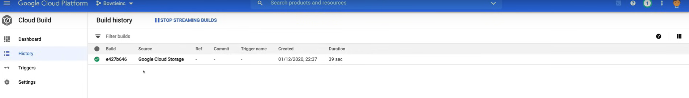
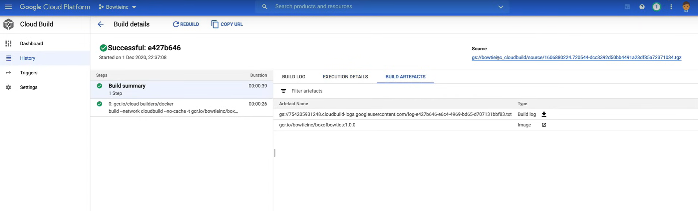
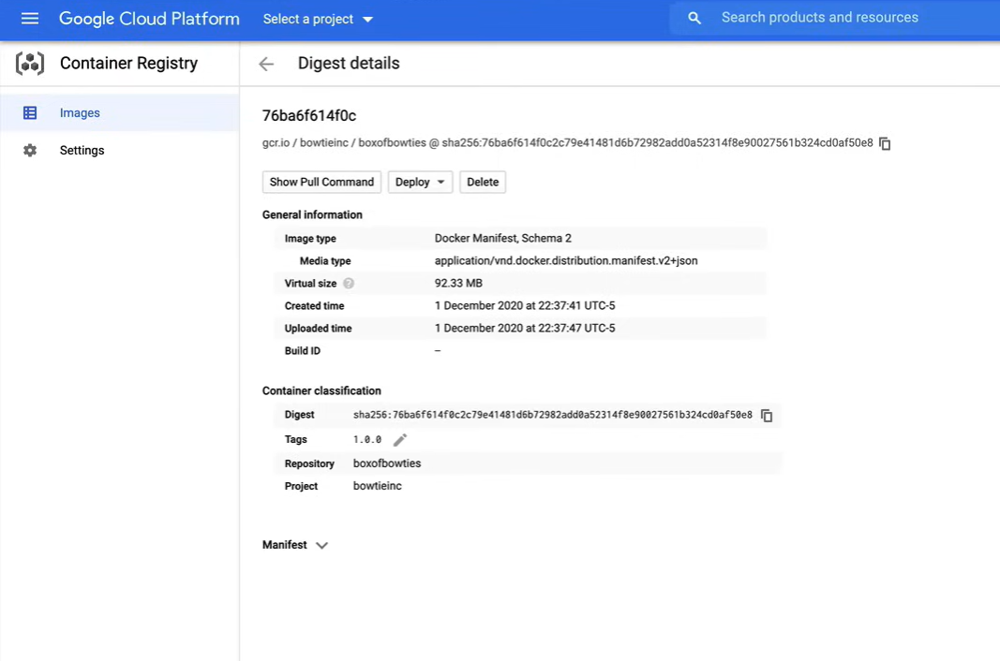
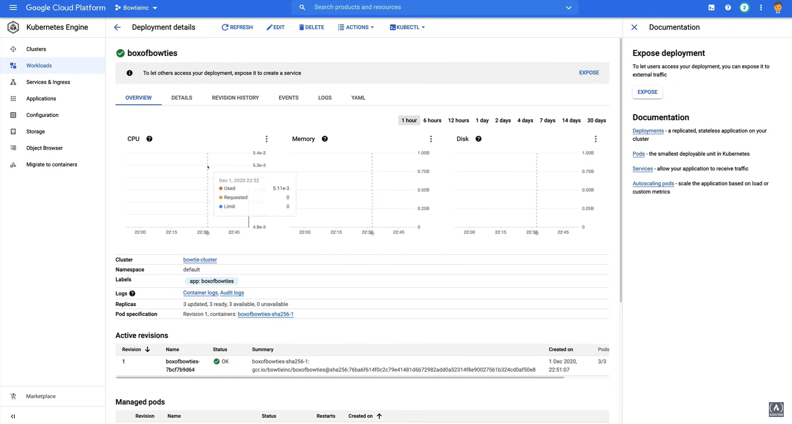
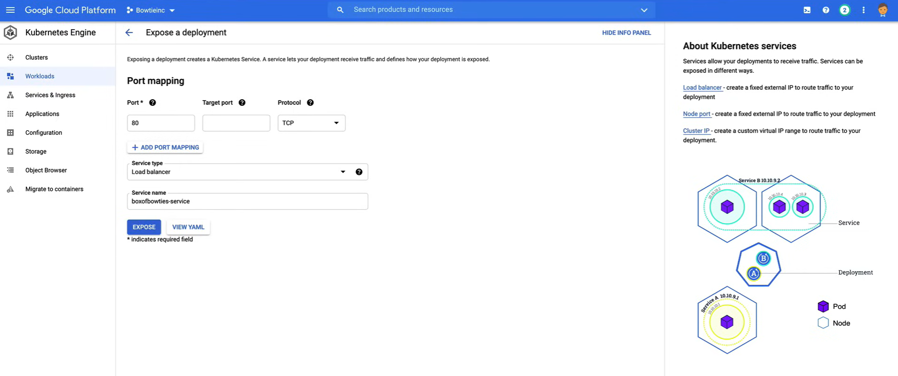
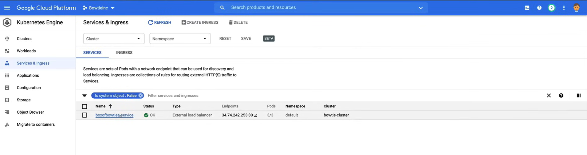
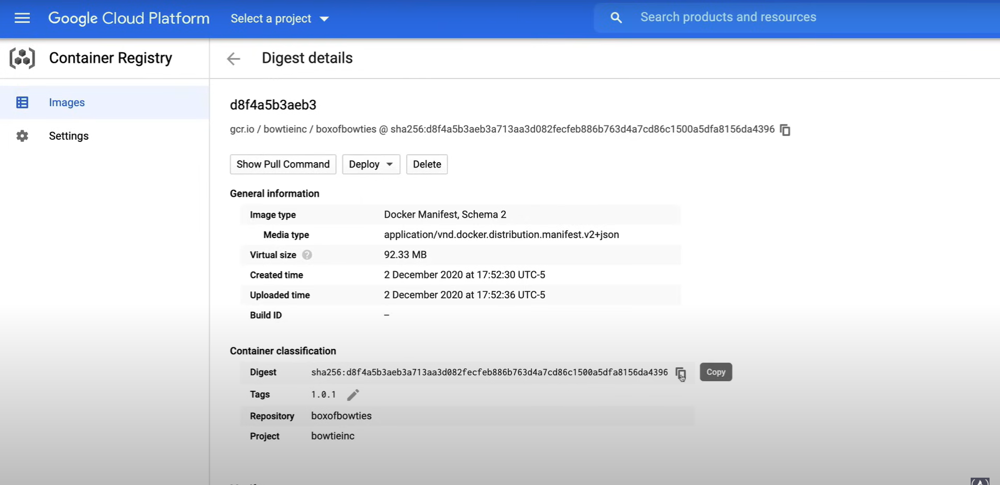

# Creating a GKE Cluster

A demo of the following lab is available [here](https://youtu.be/jpno8FSqpc8?si=_6Z6Pe4Zk_Q-P_hK&t=57431).

## Create a GKE cluster

First, make sure that you have the `default` VPC network configured.

1. Go to the **Kubernetes Engine** page in the GCP Console.
2. Go to the **Clusters** page and click **Create Cluster**.

    

3. Click on **Cluster basic** and fill in the following fields:
    - **Name**: `bowtie-cluster`
    - **Location type**: `Zonal`
    - **Zone**: `us-east1-b`
      - **NOTE:** It is where the Control Plane will be located.
    - **Specify default node locations**: `Unchecked`. Used to make a multi-zone cluster.
      - **NOTE:** If Regional is selected, the same number of nodes will be created in each zone.
    - **Master version**: `Release version`
      - **Release channel**: `Regular`
      - **Select version**: `1.17.12-gke.1504`

4. Click on **default-pool** and fill in the following fields:
    - **Name**: `default-pool`
    - **Size**: `3`
    - **Enable autoscaling**: `Checked`
      - **Minimum nodes**: `1`
      - **Maximum nodes**: `3`
    - **Specify node locations**: `Unchecked`
    - **Surge upgrade**:
      - **Max Surge**: `1`
      - **Max Unavailable**: `0`

   1. Click on **Nodes** under **default-pool** and fill in the following fields:
       - **Image type**: `Container-Optimized OS`
       - **Machine Configuration**:
         - **Series**: `E2`
         - **Machine type**: `e2-micro`
         - **Boot disk type**: `Standard persistent disk`
         - **Size (GB)**: `10`

   2. Click on **Security** under **default-pool** and fill in the following fields:
       - **Service account**: `Compute Engine default service account`
       - **Access scopes**: `Allow default access`
       - **Shielded options**: `Enable integrity monitoring`

   3. Click on **Metadata** under **default-pool** and fill in the following fields:
       - **GCE instance metadata**:
         - **Key**: `disable-legacy-endpoints`
         - **Value**: `true`

5. Click on **Automation** and fill in the following fields:
    - **Enable Maintenance Window**: `Unchecked`
      - **NOTE:** It is used to specify a maintenance window for the cluster.
    - **Enable Vertical Pod Autoscaling**: `Unchecked`
      - **NOTE:** It is used to automatically adjust the resources of the pods.
    - **Enable node auto-provisioning**: `Unchecked`
      - **NOTE:** It is used to automatically provision nodes based on the workload.
    - **Autoscaling profile**: `Balanced`
      - **NOTE:** It is used to optimize the cluster for cost or performance.

6. Click on **Networking** and fill in the following fields:
    - **Public cluster**: `Checked`
    - **Network**: `default`
    - **Node subnet**: `default`
    - **Advanced options**:
      - **Enable VPC-native traffic routing**: `Checked`
      - **Maximum pods per node**: `110`
      - **Enable HTTP load balancing**: `Checked`
        - **NOTE:** It is required to use Google CLoud Load Balancer.

7. Click on **Security** and fill in the following fields:
    - Leave the default values (all unchecked).

8. Click on **Metadata**, here we can add a description to the cluster and labels.

9.  Click on **Features** and fill in the following fields:
    - **Serverless**:
      - **Enable Cloud Run for Anthos**: `Unchecked`
    - **Operations**:
      - **Enable Kubernetes Engine Monitoring**: `Checked`
      - `System and workload monitoring`
        - **NOTE:** If we use a third party monitoring tool, we can disable this option.
    - **Other**:
      - Leave the default values (all unchecked).

10. Click on **Create**.



To create the cluster with the command line, enter in the terminal and run the following command:

```bash
# For default install
gcloud container clusters create bowtie-cluster --num-nodes 3 --zone us-east1-b

# Or the same configuration as the GUI
gcloud container clusters create bowtie-cluster-2
    --zone us-east1-b 
    --no-enable-basic-auth 
    --machine-type e2-micro 
    --disk-type pd-standard 
    --disk-size 10 
    --num-nodes 3 
    --enable-stackdriver-kubernetes 
    --enable-autoscaling 
    --min-nodes 1 
    --max-nodes 3 
    --no-enable-master-authorized-networks 
    --addons HttpLoadBalancing 
    --enable-autoupgrade 
    --enable-autorepair
```

To interact with the cluster, if you created a cluster through the Console, then you need to run the following command to retrieve the cluster's credentials and configure the `kubectl` command-line tool with them:

```bash
gcloud container clusters get-credentials bowtie-cluster --zone us-east1-b
```

If you created a cluster with the `gcloud container clusters create` command listed above, then you do not need to complete this step.

```bash
# Run kubectl command to verify the configuration
kubectl get pods

# Output
# No resources found in default namespace.
```

```bash
# Run kubectl command to verify the configuration
kubectl get nodes

# Output
# NAME                                           STATUS   ROLES    AGE   VERSION
# gke-bowtie-cluster-default-pool-0b3b3b3a-0j5z   Ready    <none>   2m    v1.17.12-gke.1504
# gke-bowtie-cluster-default-pool-0b3b3b3a-1j5z   Ready    <none>   2m    v1.17.12-gke.1504
# gke-bowtie-cluster-default-pool-0b3b3b3a-2j5z   Ready    <none>   2m    v1.17.12-gke.1504
```

## Build a Docker image

We use Cloud Build a serverless CI/CD platform to build the Docker image, and the file inside the [`container`](res\08_Creating_a_GKE_Cluster\container) directory is the source code.

1. First enable the Cloud Build API:

    ```bash
    gcloud services enable cloudbuild.googleapis.com
    ```

2. Copy the `container` directory to the Cloud Shell and navigate to the directory.

3. Run the following command to build the Docker image:

    ```bash
    gcloud builds submit --tag gcr.io/$[GOOGLE_CLOUD_PROJECT}/boxofbowties:1.0.0 .
    ```

    *When we run the command, Cloud Build compresses the files, moves them to the Cloud Storage bucket, and then uses the Dockerfile to execute the docker build process.*

    

    1. If we click on the link, we can see the build details.

        
    
    2. If we click on the link near to `images`, we can see the Docker image details.

        
    
    3. If we click on `Deploy`, we can deploy the Docker image directly from here, to the GKE cluster, or to the Cloud Run.

Instead of deploying the Docker image from here we go in the **Kubernetes Engine** page in the GCP Console and click on **Deploy**, and fill in the following fields:

- **Container**:
  - **Edit container**: `Existing container image`
    - **Image Path**: Click on `Select` and choose the image `gcr.io/bowtieinc/boxofbowties:1.0.0`
  - Leave the default values and click on **Continue**.
- **Configuration**:
  - **Application name:** `boxofbowties`
  - **Namespace**: `default`
  - **Labels**: `app: boxofbowties`
- Leave the default values and click on **Deploy**.



Now we want to verify the deployment, so we run the following command:

```bash
kubectl get all

# Output
# NAME                            READY   STATUS    RESTARTS   AGE
# pod/boxofbowties-7b8b8b8b8-abcde   1/1     Running   0          2m
# pod/boxofbowties-7b8b8b8b8-fghij   1/1     Running   0          2m
# pod/boxofbowties-7b8b8b8b8-klmno   1/1     Running   0          2m

# NAME                 TYPE           CLUSTER-IP      EXTERNAL-IP     PORT(S)        AGE
# service/kubernetes   ClusterIP      10.4.0.1        <none>          443/TCP        3m

# NAME                           READY   UP-TO-DATE   AVAILABLE   AGE
# deployment.apps/boxofbowties   3/3     3            3           2m

# NAME                                      DESIRED   CURRENT   READY   AGE
# replicaset.apps/boxofbowties-7b8b8b8b8   3         3         3       2m

# NAME                            REFERENCE          TARGETS         MINPODS   MAXPODS   REPLICAS   AGE
# horizontalpodautoscaler.autoscaling/boxofbowties   Deployment/boxofbowties   <unknown>/50%   1         10        3          2m
```

Get the deployment:

```bash
kubectl get deployments

# Output
# NAME           READY   UP-TO-DATE   AVAILABLE   AGE
# boxofbowties   3/3     3            3           2m
```

Dive into the pods:

```bash
kubectl get pods

# Output
# NAME                            READY   STATUS    RESTARTS   AGE
# boxofbowties-7b8b8b8b8-abcde   1/1     Running   0          2m
# boxofbowties-7b8b8b8b8-fghij   1/1     Running   0          2m
# boxofbowties-7b8b8b8b8-klmno   1/1     Running   0          2m
```

To get a specific pod and much more information about it, run the following command:

```bash
kubectl get pod [pod-name]

# Example
kubectl get pod boxofbowties-7b8b8b8b8-abcde
```

Now we want to expose the deployment to the internet.

1. Go to the **Kubernetes Engine** page in the GCP Console.
2. Go to the **Workloads** page and click on the deployment `boxofbowties`.
3. Scroll down and click on `Expose`, and fill in the following fields:
    - **Port Mapping**:
      - **Port**: `80`
      - **Target Port**: `80`
      - **Protocol**: `TCP`
      - **Service Type**: `LoadBalancer`
      - **Service Name**: `boxofbowties-service`
    - Click on **Expose**.



Go to the **Services & Ingress** page and click on the service `boxofbowties-service`.



Click on the `External endpoints` link to see the application.

## Managing workloads on GKE

1. Go to the **Kubernetes Engine** page in the GCP Console.
2. Go to the **Workloads** page and click on the deployment `boxofbowties`.
3. Click on the `Actions` button and click on `Scale`.
   1. Set the number of replicas to `1` and click on `Scale`.
   2. To do it with the command line, run the following command:

        ```bash
        # First, get running pods
        kubectl get pods


        # Scale the deployment
        kubectl scale deployment boxofbowties --replicas=1


        # Verify the running pods
        kubectl get pods

        # Output
        # NAME                            READY   STATUS    RESTARTS   AGE
        # boxofbowties-7b8b8b8b8-abcde    1/1     Running   0          2m


        # Scale the deployment back to 3
        kubectl scale deployment boxofbowties --replicas=3
        ```

4. Move to the `container` directory and make a change in the `index.html` file.

5. Run the following command to edit the file in the editor:

    ```bash
    edit index.html
    ```

6. Change the content of the `h2` tag to `Well, I could always use something to eat`.

    ```html
    <html>
        <head>
            <title> Box of Bowties </title>
        </head>
        <style>
            h1 {
            text-align: center;
            font-size: 50px;
            }
            h2 {
            text-align: center;
            font-size: 40px;
            }
            h3 {
            text-align: right;
            }
        </style>
        <body style="font-family: sans-serif"></body>
        <body>
            <h1>Aaaand.... Success!</h1>
            <h2>Well, I could always use something to eat</h2>
            <section id="photos">
                <p style="text-align:center;"></p>
            </section>
        </body>
    </html>
    ```

7. In the Cloud Shell, run the following command to build the Docker image:

    ```bash
    gcloud builds submit --tag gcr.io/$[GOOGLE_CLOUD_PROJECT}/boxofbowties:1.0.1 .
    ```

8. Go to the **Cloud Build** page in the GCP Console to check the build details and if the build was successful.
   1. Click on the link near to `images` to see the Docker image details.
   2. Copy the image SHA to use it in the deployment.

        

9. Go to the **Kubernetes Engine** page in the GCP Console.
10. Go to the **Workloads** page and click on the deployment `boxofbowties`.
11. Click on `Actions` and click on `Rolling update`.
    - **Minimum seconds ready**: `0`
    - **Maximum surge**: `25%`
    - **Maximum unavailable**: `25%`
    - **Image of boxofbowties-sha256**: Paste the image SHA.
    - Click on `Update`.

11. Check the endpoint to see the changes.


## Cleaning up

See the instructions [here](https://youtu.be/jpno8FSqpc8?si=hwU_U5W4vLgi3w9U&t=59984).