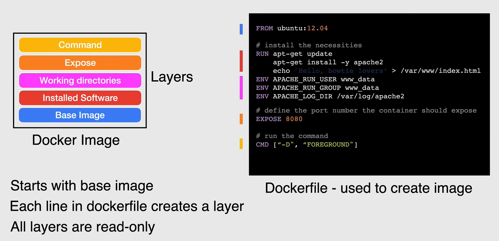
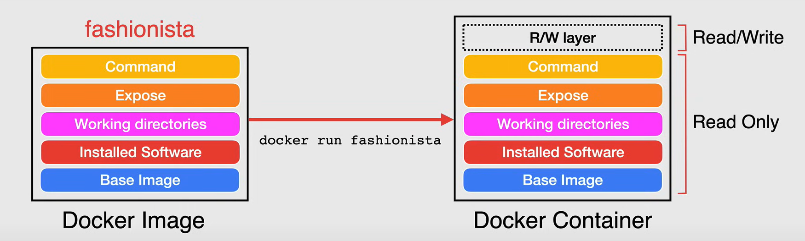
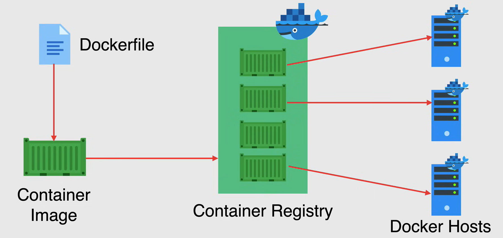

# Introduction to Containers

## Containers

Container technology gets its name from the shipping industry. Containers are used to transport goods. Containers are **standardized**, so they can be loaded onto ships, trains, and trucks. This standardization makes it easy to move containers between different modes of transportation.

### Virtual Machines vs. Containers

Un ottimo modo per parlare dei container è confrontarli con le macchine virtuali.

Con le VM, i sistemi vengono virtualizzati attraverso un **hypervisor**, che si trova sopra l'hardware sottostante e quest'ultimo viene virtualizzato in modo che più istanze di sistemi operativi possano essere eseguite sull'hardware stesso.
Ogni VM esegue il proprio sistema operativo e ha accesso alle risorse virtualizzate che rappresentano l'hardware sottostante.

A causa di questo processo, le VM hanno un **elevato overhead**, in quanto devono eseguire un intero sistema operativo e l'hypervisor, che è un software molto grande. Inoltre, c'è una mancanza di standardizzazione, poiché ogni VM può eseguire un sistema operativo diverso e le VM non sono portabili tra diversi hypervisor.


Invece, con i **container**, l'infrastruttura host sottostante è ancora presente, ma anziché utilizzare un hypervisor e astrarre l'hardware sottostante, con la containerizzazione si astrae il sistema operativo, lasciando l'applicazione con tutte le sue dipendenze e librerie in un container ordinato e standardizzato.

Ciò viene fatto installando il sistema operativo sopra l'infrastruttura host e quindi un livello separato sopra il sistema operativo host, chiamato **container engine**. Invece di avere il proprio sistema operativo, i container condividono il kernel del sistema operativo con altri container, pur operando in modo indipendente eseguendo solo il codice dell'applicazione e le dipendenze necessarie per eseguire quell'applicazione.

Ciò consente a ciascun container di consumare pochissima memoria o spazio su disco, rendendo i container molto **leggeri**, **efficienti** e **portabili**.

Le applicazioni containerizzate possono avviarsi in pochi secondi e molte più istanze dell'applicazione possono essere eseguite sulla stessa macchina rispetto a un ambiente VM.

Questi container possono essere trasferiti su altri ambienti che eseguono **Docker** e possono essere eseguiti senza preoccuparsi di incontrare problemi di compatibilità.


## Docker Image Breakdown

Un **Docker image** è una collezione o una pila di layer, che vengono creati da istruzioni sequenziali in un *Dockerfile*.

Ogni riga nel Dockerfile viene eseguita linea per linea, e viene scritto un layer unico in sola lettura nell'immagine.
Ciò che rende uniche le immagini Docker è che ogni volta che si aggiunge un'altra istruzione nel Dockerfile, viene creato un nuovo layer.

Ora passando a un esempio pratico, supponiamo di avere un Dockerfile con il seguente contenuto:

```Dockerfile
FROM ubuntu:12.04

# Install the necessities
RUN apt-get update
    apt-get install -y apache2
    echo "Hello, bowtie lovers" > /var/www/index.html
ENV APACHE_RUN_USER www_data
ENV APACHE_RUN_GROUP www_data
ENV APACHE_LOG_DIR /var/log/apache2

# Define the port number the container should expose
EXPOSE 8080

# Run the command
CMD ["-D", "FOREGROUND"]
```

Quando costruiamo l'immagine, il motore Docker creerà un layer per ogni istruzione nel Dockerfile.

- **Base Image Layer**: Questo è il layer dell'immagine di base, che è l'immagine di Ubuntu 12.04, questa è l'istruzione `FROM`.
- **Installed Software Layer**: Questo layer installa Apache2, è l'istruzione `RUN`.
- **Working Directory Layer**: Questo layer crea le variabili d'ambiente, sono le istruzioni `ENV`.
- **Exposed Port Layer**: Questo layer espone la porta 8080, è l'istruzione `EXPOSE`.
- **Command Layer**: Questo layer esegue il comando per avviare il server Apache2, è l'istruzione `CMD`.

**NOTA:**

- Ogni immagine Docker parte da un'immagine di base, che è il primo layer.
- Ogni istruzione nel Dockerfile crea un nuovo layer.
- Tutti i layer sono in sola lettura e non possono essere modificati a meno che il Dockerfile non venga modificato e l'immagine non venga ricostruita.



## Docker Image to Docker Container

Un **container Docker** è un'istanza in esecuzione di un'immagine Docker.

I container che utilizzano la stessa immagine sono identici tra loro in termini di codice dell'applicazione e dipendenze di runtime. Quindi potremmo utilizzare la stessa immagine per eseguire più copie dello stesso container che hanno compiti diversi.

Ciò che rende ogni singolo container diverso è che i container in esecuzione includono un layer scrivibile sopra il contenuto in sola lettura. Le modifiche durante l'esecuzione, inclusi i diritti e gli aggiornamenti dei dati e dei file, vengono salvate in questo layer scrivibile.

Quindi, utilizzando l'esempio precedente, utilizzando il comando:

```bash
docker run fashionista
```
Un container Docker verrà istanziato dall'immagine Docker `fashionista`, e verrà aggiunto uno strato di lettura/scrittura sopra gli strati di sola lettura, scrivendo tutti i file necessari per l'applicazione.

**NOTA:** I container Docker vengono sempre creati dalle immagini Docker, e i container possono utilizzare la stessa immagine ma avranno sempre uno strato di lettura/scrittura diverso, indipendentemente dal numero di container in esecuzione su un determinato host.



## Container Registry

Quando i container vengono creati, vengono archiviati in un **container registry**.

Un **container registry** è un unico luogo in cui archiviare e gestire le immagini Docker. Quando si crea il proprio Dockerfile e si costruisce l'immagine, è necessario archiviare quell'immagine in un repository centrale, che sia pubblico o privato.

- Un **public registry** è un registro aperto al pubblico, da cui chiunque può scaricare le immagini. Il registro pubblico più popolare è **Docker Hub**.

- Un **private registry** è un registro accessibile solo a un gruppo selezionato di persone. Questo è utile quando si desidera mantenere le proprie immagini private e non condividerle con il pubblico.

Quando si dispone di un container registry, è necessario essere in grado di eseguire questi container, quindi è necessario avere **Docker Hosts**, che possono essere costituiti da qualsiasi macchina in esecuzione su *Docker Engine*.

