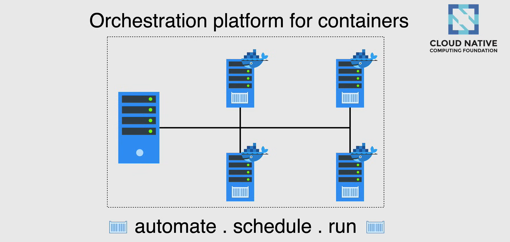
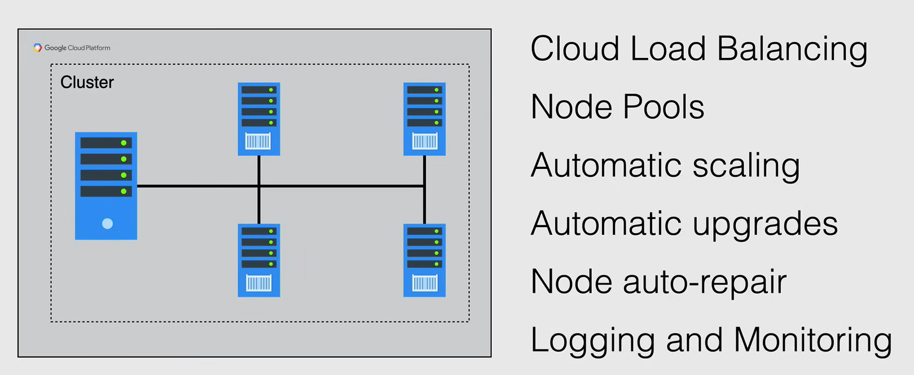
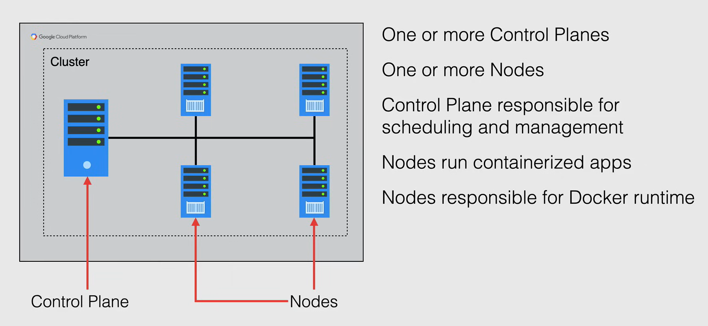
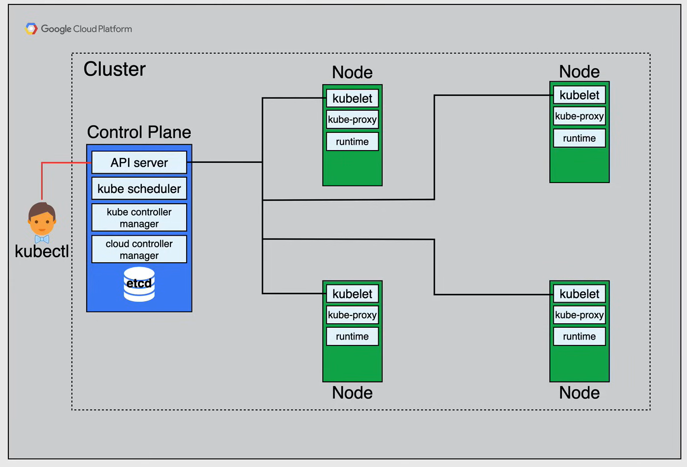

# GKE and Kubernetes Concepts

## What is Kubernetes?

**Kubernetes** è una piattaforma di orchestrazione per i container. È stata inventata da Google ed è ora mantenuta dalla Cloud Native Computing Foundation (CNCF).

Kubernetes fornisce una piattaforma per *automatizzare*, *pianificare* ed *eseguire* i container su cluster di macchine fisiche o virtuali. In questo modo, elimina molti dei processi manuali coinvolti nel deploy e nella scalabilità delle applicazioni containerizzate.

Kubernetes gestisce i container che eseguono le applicazioni e si assicura che non ci sia downtime, in modo che l'utente possa definire.

Ad esempio, se si definisce che quando un container va giù e un altro container deve avviarsi, Kubernetes si occuperà di farlo automaticamente e in modo trasparente.

Kubernetes fornisce anche il framework per eseguire sistemi distribuiti in modo resiliente, si occupa di scalare e gestire i failover per le applicazioni, fornisce modelli di deployment e consente di gestire le applicazioni con flessibilità, affidabilità e potenza.

Funziona con una serie di strumenti per i container, tra cui Docker. Raggruppa i container che compongono un'applicazione in unità logiche per una gestione e una scoperta semplici.



## What is GKE?

**Google Kubernetes Engine (GKE)** è un ambiente gestito per il deploy, la gestione e la scalabilità delle tue applicazioni containerizzate utilizzando l'infrastruttura di Google.

L'ambiente GKE consiste in istanze di Compute Engine raggruppate per formare un cluster e fornisce tutti i vantaggi di Kubernetes on-premises, ma ha astratto la complessità di doversi preoccupare dell'hardware.



Ha i vantaggi delle funzionalità avanzate di gestione del cluster fornite da Google Cloud, come:

- **Cloud Load Balancing**: per distribuire il traffico tra cluster e nodi.
- **Node Pools**: per raggruppare i nodi in un cluster.
- **Automatic scaling**: per aggiungere o rimuovere nodi da un node pool.
- **Automatic upgrades**: per aggiornare la versione di Kubernetes di un cluster.
- **Node auto-repair**: per riparare i nodi in un cluster.
- **Logging and Monitoring**: per monitorare la salute del cluster e delle applicazioni in esecuzione su di esso.

## Cluster Architecture

Un **cluster** è la base di Google Kubernetes Engine (GKE) e di Kubernetes nel complesso.

Gli oggetti Kubernetes che rappresentano le tue applicazioni containerizzate vengono eseguiti su un cluster.

In GKE, un cluster è composto da almeno un **Control Plane** e da più macchine worker chiamate **nodes**. Il Control Plane e le macchine nodes eseguono il Cluster Kubernetes.

- Il Control Plane è responsabile di coordinare l'intero cluster, e questo può includere:
  - *scheduling* dei carichi di lavoro, come applicazioni containerizzate, e
  - *gestione* del ciclo di vita dei carichi di lavoro, *scalabilità* e *aggiornamenti*.
  - gestione delle risorse di rete e di storage per quei carichi di lavoro,
  - e, cosa più importante, ***gestisce lo stato del cluster*** e si assicura che sia nello stato desiderato.

- I nodes sono le macchine worker che eseguono le tue applicazioni containerizzate e altri carichi di lavoro.
  - I nodes sono istanze di macchine virtuali Compute Engine che GKE crea per tuo conto quando crei un cluster.
  - Ogni node è gestito dal Control Plane, che riceve aggiornamenti sullo stato segnalato autonomamente da ciascun node.
  - Un node esegue anche i servizi necessari per supportare il container Docker che costituisce i carichi di lavoro del tuo cluster.
    - Questo include l'*esecuzione di Docker* e l'agente node Kubernetes, chiamato **kubelet**, che comunica con il Control Plane ed è responsabile di avviare ed eseguire i container Docker, pianificati su quel node.



### Control Plane

Il **Control Plane** è il punto di accesso unificato per il tuo cluster. I componenti del Control Plane prendono decisioni globali sul cluster, come la pianificazione e il rilevamento e la risposta agli eventi del cluster.

#### Kubernetes API Server

Tutte le interazioni con il cluster vengono effettuate tramite chiamate API di Kubernetes, e il Control Plane esegue il **Kubernetes API server** per gestire tali chiamate API.

- Puoi effettuare chiamate API di Kubernetes direttamente tramite HTTP, GRPC o indirettamente tramite `kubectl`, che è uno strumento a riga di comando che comunica con il Kubernetes API server per gestire il cluster.

Il processo del server API è il punto centrale di tutte le comunicazioni per il cluster.

#### Kube Scheduler

Il **Kube Scheduler** è un componente che scopre e assegna i pod appena creati a un nodo su cui eseguirli.

Quindi, tutti i nuovi pod che vengono creati saranno automaticamente assegnati a un nodo dal Kube Scheduler, tenendo conto di eventuali vincoli presenti.

#### Kube Controller Manager

Il **Kube Controller Manager** è un componente che esegue processi di controllo. È responsabile di cose come:

- rilevare e rispondere quando i nodi vanno giù
- mantenere il numero corretto di pod
- popolare i servizi e i pod
- creare account predefiniti e token di accesso API per i nuovi namespace

È questo controller che cercherà essenzialmente di apportare modifiche al cluster quando lo stato attuale non soddisfa lo stato desiderato.

#### Cloud Controller Manager

Il **Cloud Controller Manager** incorpora la logica di controllo specifica del cloud. Ti consente di collegare il tuo cluster all'API di qualsiasi fornitore di cloud e separa i componenti che interagiscono con quella piattaforma cloud dai componenti che interagiscono solo con il tuo cluster.

Il Cloud Controller Manager esegue solo i controller specifici del tuo fornitore di cloud.

#### etcd

**etcd** è responsabile per la memorizzazione dello stato del cluster. È un archivio chiave-valore coerente e altamente disponibile che interagisce solo con il server API di Kubernetes.

Salva tutti i dati di configurazione, insieme a quali nodi fanno parte del cluster e ai pod che eseguono.

### Nodes

#### Kubelet

Il Control Plane ha bisogno di un modo per interagire con i nodi del cluster, quindi i nodi hanno componenti stessi per consentire questa comunicazione.

Questo componente è chiamato **kubelet**. È un agente che viene eseguito su ogni nodo nel cluster e comunica con il Control Plane.

È responsabile di avviare ed eseguire i container Docker pianificati su quel nodo. Prende un insieme di specifiche di pod che gli vengono fornite e si assicura che i container descritti in quelle specifiche di pod siano in esecuzione e sani.

#### Kube Proxy

Il **Kube Proxy** è un componente che mantiene la connettività di rete ai pod in un cluster.

#### Container Runtime

Il **Container Runtime** è il software responsabile dell'esecuzione dei container. In GKE, il container runtime predefinito è *Docker*. Supporta altri container runtime, come *containerd*.



## GKE Abstractions

GKE gestisce tutti i componenti del Control Plane. Il punto finale espone:

- l'API di Kubernetes, che kubectl utilizza per comunicare con il Control Plane del cluster.
- il server API di Kubernetes, che kubectl utilizza per comunicare con il Control Plane del cluster.

L'IP del punto finale viene visualizzato nella Console di GCP e consente di interagire con il cluster.

Quando si esegue il comando:

```bash
gcloud container clusters get-credentials
```

si nota che il comando ottiene il punto finale del cluster come parte dell'aggiornamento del file *kubeconfig*.

Viene quindi esposto un indirizzo IP per il cluster con cui interagire, ed è responsabile di fornire e gestire tutta l'infrastruttura necessaria per il Control Plane.

GKE automatizza anche i nodi di Kubernetes, avviandoli come VM di Compute Engine sotto il cofano, ma consente comunque agli utenti di modificare il tipo di macchina e accedere alle opzioni di aggiornamento.

Per impostazione predefinita, i cluster e i pool di nodi GKE vengono aggiornati automaticamente da Google, ma è anche possibile controllare quando possono e non possono verificarsi gli aggiornamenti automatici, configurando finestre di manutenzione ed esclusioni.

**NOTA:** Il Control Plane del cluster e i nodi non eseguono necessariamente la stessa versione in ogni momento.