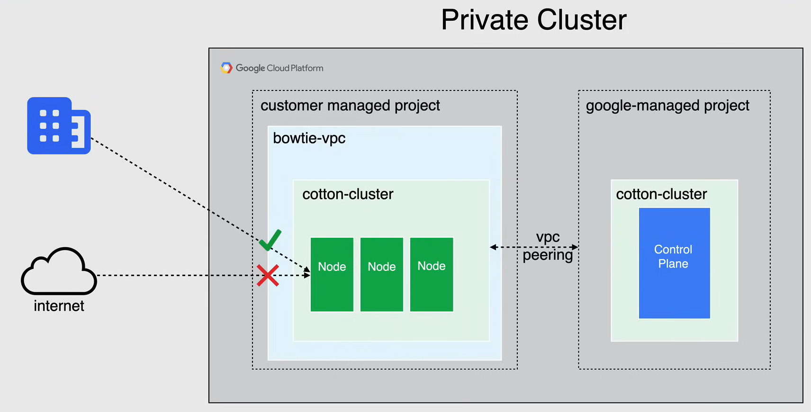

# Cluster and Node Management

## Node Pools

Un **node pool** è un gruppo di nodi all'interno di un cluster che hanno tutti la *stessa configurazione*, utilizzando la specifica nodeconfig per raggiungere questo obiettivo.

Un node pool può contenere uno o più nodi.

- Quando crei un cluster per la prima volta, il numero e il tipo di nodi specificati diventano il node pool predefinito.
- Successivamente puoi aggiungere ulteriori node pool personalizzati di diverse dimensioni e tipi al cluster.
- Tutti i nodi in un determinato node pool sono **identici** tra loro.

I **node pool personalizzati** sono molto utili quando hai bisogno di pianificare risorse che richiedono **più risorse** rispetto a quelle fornite dal node pool predefinito.

- Puoi creare, aggiornare ed eliminare i node pool individualmente senza influire sul cluster nel complesso.

**NOTA:** Puoi configurare un singolo nodo in qualsiasi node pool, le modifiche alla configurazione influiscono su tutti i nodi in quel pool. Tutti i nuovi node pool eseguono l'ultima versione stabile dell'immagine del nodo Kubernetes.

I node pool esistenti possono essere aggiornati **manualmente** o **automaticamente** all'ultima versione stabile dell'immagine del nodo Kubernetes.

## Tipi di Cluster

### Cluster Zonali e Regionali

I tipi di cluster disponibili includono **zonali**, sia a zona singola che multi-zonale, e **regionali**.

#### Cluster Zonali

I cluster zonali hanno un singolo Control Plane in una singola zona. A seconda delle necessità di disponibilità, è possibile distribuire i nodi del cluster zonale in una singola zona o in più zone.

- Quando si decide di distribuire un **cluster a zona singola**, ha un singolo Control Plane in esecuzione in una singola zona, che gestisce i carichi di lavoro sui nodi in esecuzione nella stessa zona.

- Un **cluster multi-zonale** ha una singola replica del Control Plane in esecuzione in una singola zona e i nodi sono distribuiti su più zone.
  - Durante un aggiornamento del cluster o un'interruzione della zona in cui viene eseguito il Control Plane, i carichi di lavoro continuano a funzionare. Tuttavia, il cluster, i suoi nodi e i suoi carichi di lavoro non possono essere configurati fino a quando il control plane non è nuovamente disponibile.
  - I cluster multi-zonali sono progettati per bilanciare la disponibilità e il costo per carichi di lavoro consistenti.

**NOTA:** Nel cluster multi-zonale, lo stesso numero di nodi verrà distribuito in ogni zona selezionata e potrebbe costarti più del previsto.

#### Cluster Regionali

Quando si desidera ottenere un'elevata disponibilità per il proprio cluster, i **cluster regionali** sono la migliore opzione.

I cluster regionali hanno più repliche del Control Plane in esecuzione in più zone all'interno di una regione. I nodi vengono eseguiti anche in ogni zona in cui è in esecuzione una replica del Control Plane. Poiché un cluster regionale replica il Control Plane e i nodi, consuma più risorse di Compute Engine rispetto a un cluster zonale.

Lo stesso numero di nodi verrà distribuito in ogni zona selezionata e il valore predefinito quando si seleziona un cluster regionale è di 3 zone.

### Cluster Privati

I **cluster privati** sono cluster che ti consentono di isolare i nodi impedendo loro di avere connettività in entrata e in uscita verso Internet pubblico. Questo isolamento viene ottenuto assegnando ai nodi solo indirizzi IP interni.

Se si desidera fornire accesso a Internet in uscita ai nodi, è possibile utilizzare un gateway **Cloud NAT**. Per impostazione predefinita, l'accesso privato a Google è abilitato e i carichi di lavoro hanno un accesso limitato in uscita alle API e ai servizi di Google tramite la rete privata di Google.

Nel cluster privato, la rete VPC del Control Plane è collegata alla rete VPC del cluster utilizzando **VPC Network Peering**. La rete VPC contiene i nodi del cluster e una rete VPC separata di Google Cloud contiene il Control Plane.

La rete VPC del Control Plane è bloccata in un progetto controllato da Google. Il traffico tra il Control Plane e i nodi viene instradato interamente utilizzando indirizzi IP interni.

Un Control Plane per un cluster privato ha un endpoint privato oltre all'endpoint pubblico. Invece, un Control Plane per un cluster non privato ha solo un endpoint pubblico.

L'endpoint privato è un indirizzo IP interno nella rete VPC del Control Plane. L'endpoint pubblico è l'indirizzo IP esterno del Control Plane e è possibile controllare l'accesso a questo endpoint utilizzando le reti autorizzate o disabilitando l'accesso all'endpoint pubblico.

Come mostrato nel diagramma seguente, è possibile disabilitare l'endpoint pubblico e connettersi alla propria rete utilizzando un indirizzo IP interno, utilizzando Cloud Interconnect o Cloud VPN, e si ha sempre l'opzione di abilitare e disabilitare l'endpoint pubblico.

## Versione del Cluster

Quando si crea un cluster, è possibile scegliere la versione specifica di Kubernetes per il cluster o è possibile combinare le versioni per flessibilità sulle funzionalità. In entrambi i casi, è consigliabile abilitare la funzionalità di **auto-upgrade** per mantenere il cluster aggiornato.

Quando si ha l'auto-upgrade abilitato, è possibile scegliere tra ciò che viene chiamato **Release Channels**.

- Quando si iscrive un nuovo cluster a un canale di rilascio, Google gestisce automaticamente la versione e la cadenza di aggiornamento per il cluster e i suoi node pool.
- Tutti i canali offrono versioni supportate di GKE e sono considerati in *General Availability*.

È possibile scegliere tra i seguenti canali di rilascio:

- **Rapid**: Questo canale ottiene l'ultimo rilascio di Kubernetes il prima possibile e consente di utilizzare le nuove funzionalità di GKE nel momento in cui vengono rese disponibili al pubblico.

- **Regular (predefinito)**: Con questo canale, si ha accesso alle funzionalità di GKE e Kubernetes, abbastanza presto dopo il loro rilascio, ma su una versione che è stata qualificata due o tre mesi dopo il rilascio nel canale Rapid.

- **Stable**: In questo canale, la stabilità è prioritaria rispetto alle nuove funzionalità. Le modifiche e le nuove versioni in questo canale vengono distribuite per ultime dopo essere state validate due o tre mesi nel canale Regular.

Se si sa di dover utilizzare una **versione specifica supportata** di Kubernetes per un determinato carico di lavoro, è possibile specificarla durante la creazione del cluster.

Se non è necessario controllare la versione specifica di patch utilizzata, è consigliabile iscrivere il cluster a un canale di rilascio anziché gestire manualmente la sua versione.

## Aggiornamenti del Cluster

Il Control Plane e i nodi *non eseguono sempre la stessa versione* in ogni momento.

- Un *Control Plane* viene sempre aggiornato prima dei suoi nodi.

- Per quanto riguarda i cluster zonali e regionali:
  - *Zonale*: Non è possibile avviare o modificare i carichi di lavoro durante l'aggiornamento.
  - *Regionale*: Ogni Control Plane viene aggiornato uno alla volta.

- L'auto-upgrade del Control Plane è abilitato per impostazione predefinita (**best practice**).

- Se si desidera, è possibile eseguire un **aggiornamento manuale**, ma non è possibile aggiornare il Control Plane di più di una versione minore alla volta.

- Sono disponibili *Finestre di manutenzione* ed *esclusioni*.

## Aggiornamenti dei Nodi e dei Node Pool

- L'auto-upgrade dei nodi è abilitato per impostazione predefinita (**best practice**).
- Sono disponibili aggiornamenti manuali.
- Sono disponibili *Finestre di manutenzione* ed *esclusioni*.

- Quando viene eseguito l'aggiornamento di un node pool, GKE aggiorna un nodo alla volta.

  - Durante l'aggiornamento di un nodo, GKE smette di pianificare nuovi pod su di esso e cerca di pianificare i pod in esecuzione su altri nodi del pool.
  - Il nodo viene quindi ricreato alla nuova versione, ma utilizzando lo stesso nome di prima.
  - Questo è simile ad altri eventi che ricreano il nodo, come l'attivazione o la disattivazione di una funzionalità nel node pool.

- L'aggiornamento è completo solo quando:
  - *Tutti i nodi sono stati ricreati*
  - Il cluster è nello *stato desiderato*

**NOTA:**

- Quando un nodo appena aggiornato si registra presso il Control Plane, GKE lo segna come *Schedulable*.
- L'aggiornamento di un node pool potrebbe interrompere i carichi di lavoro in esecuzione sui nodi del pool. Per evitare ciò, è possibile creare un nuovo node pool con la versione desiderata e migrare i carichi di lavoro.
- Successivamente, dopo la migrazione, è possibile eliminare il vecchio node pool.

## Aggiornamenti di Emergenza

Gli **aggiornamenti di emergenza** ti consentono di controllare il numero di nodi che GKE può aggiornare contemporaneamente e di controllare quanto sono disturbanti gli aggiornamenti per i tuoi carichi di lavoro.

È possibile modificare il numero di nodi che GKE tenta di aggiornare contemporaneamente modificando i parametri di aggiornamento di emergenza su un node pool.

- Gli aggiornamenti di emergenza riducono le interruzioni ai carichi di lavoro durante la manutenzione del cluster e consentono anche di controllare il numero di nodi aggiornati in parallelo.

- Gli aggiornamenti di emergenza funzionano anche con il cluster auto-scaler per evitare modifiche ai nodi che vengono aggiornati.

Il comportamento degli aggiornamenti di emergenza è determinato da due impostazioni:

- `max-surge-upgrade`:
  - Il numero di nodi aggiuntivi aggiunti al node pool durante un aggiornamento.
  - Aumentando questo valore, si aumenta il numero di nodi che possono essere aggiornati contemporaneamente.
    - *Numero più alto* = Più aggiornamenti in parallelo

- `max-unavailable-upgrade`:
  - Il numero di nodi che possono essere simultaneamente non disponibili durante un aggiornamento.
  - Aumentando questo valore, si aumenta il numero di nodi che possono essere aggiornati in parallelo.
    - *Numero più alto* = Aggiornamenti più disturbanti

Durante gli aggiornamenti, GKE porta giù al massimo la somma di `max-surge-upgrade + max-unavailable-upgrade` nodi alla volta.
