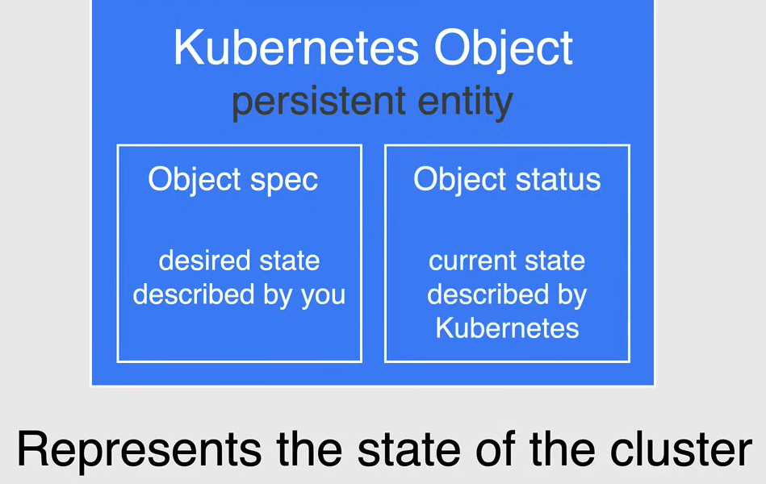
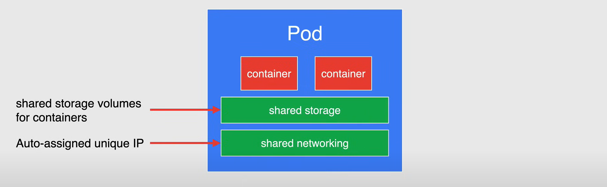
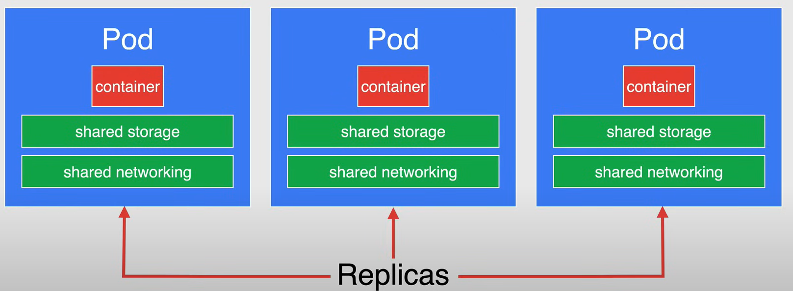
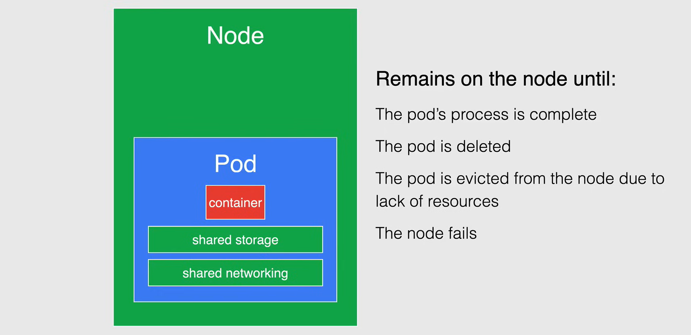
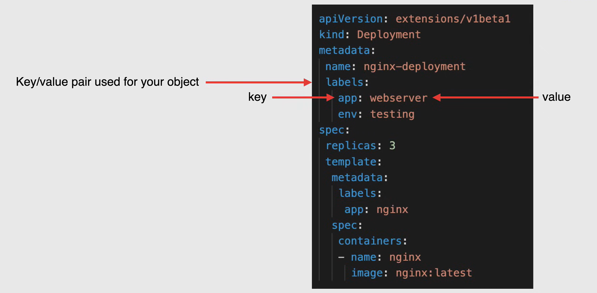
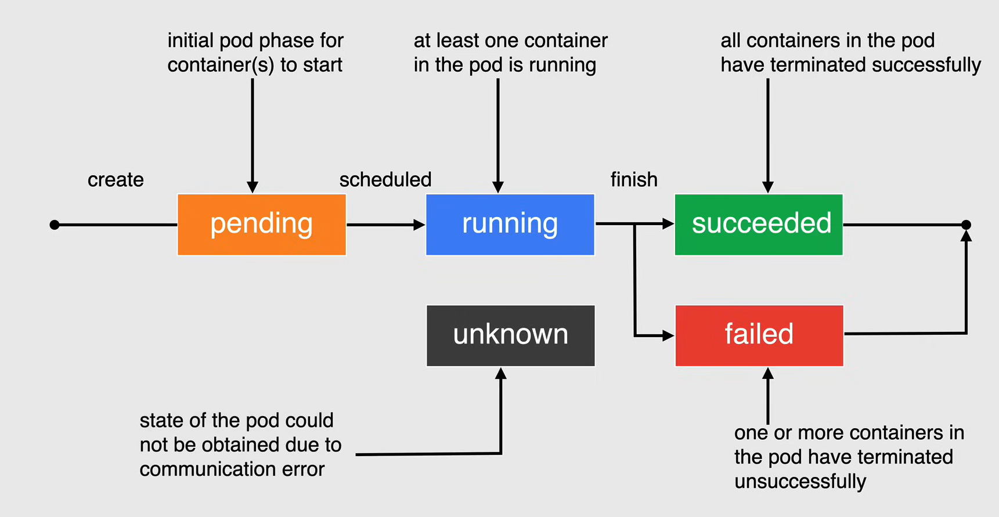
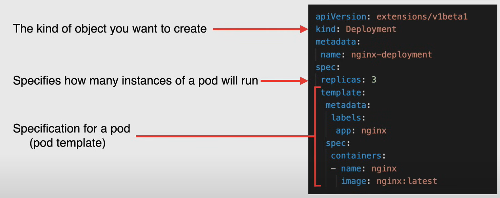

# Pods and Object Management

## Kubernetes Objects

**Gli oggetti Kubernetes** sono entità persistenti nel sistema Kubernetes. Kubernetes utilizza questi oggetti per *rappresentare lo stato del tuo cluster*.

In particolare, possono descrivere:

- Quali applicazioni containerizzate sono in esecuzione (e su quali nodi)
- Le risorse disponibili per tali applicazioni

Un oggetto Kubernetes è un **registro di intenti**, una volta creato l'oggetto, il sistema Kubernetes lavorerà costantemente per garantire che l'oggetto esista. Creando un oggetto, stai effettivamente dicendo al sistema Kubernetes come desideri che il carico di lavoro del tuo cluster sia; questo è lo **stato desiderato** del tuo cluster.

Ogni oggetto Kubernetes include due campi oggetto nidificati che governano la configurazione dell'oggetto:

- lo **spec** dell'oggetto
  - è lo **stato desiderato** dell'oggetto
  - lo impostiamo quando creiamo l'oggetto fornendo una descrizione delle caratteristiche che vogliamo che la risorsa abbia
- lo **status** dell'oggetto
  - descrive lo **stato attuale** dell'oggetto

Il Control Plane di Kubernetes gestisce in modo continuo e attivo lo stato effettivo di ogni oggetto per farlo corrispondere allo stato desiderato fornito.

Ogni oggetto in un cluster ha un **nome** che deve essere univoco all'interno dello spazio dei nomi in cui viene creato l'oggetto. Ogni oggetto ha anche un **UID** che è univoco in tutto il cluster.



### Manifest File

Quando crei, aggiorni o elimini oggetti in un cluster Kubernetes, userai un **file di manifesto Kubernetes**, in cui *specificare lo stato desiderato dell'oggetto* che Kubernetes manterrà quando applichi il file di manifesto.

Ogni file di configurazione può contenere più manifesti ed è pratica comune farlo quando possibile.

Un file di manifesto è definito in forma di file **YAML** o **JSON**.

  - Si consiglia di utilizzare YAML perché è più facile da leggere e scrivere rispetto a JSON.

In ogni file YAML per l'oggetto Kubernetes che desideri creare, ci sono alcuni valori obbligatori che devono essere impostati:

- `apiVersion`: La versione dell'API Kubernetes che utilizzerai per creare l'oggetto.
- `kind`: Il tipo di oggetto che desideri creare.
- `metadata`: Dati che aiutano a identificare univocamente l'oggetto, inclusa una stringa di nome, UID e namespace opzionale.
- `spec`: Lo stato desiderato dell'oggetto che desideri creare.

Ecco un esempio di un semplice file YAML che crea un oggetto Pod:

```yaml
apiVersion: v1
kind: Pod
metadata:
  name: my-pod
spec:
    containers:
    - name: my-container
      image: nginx
      ports:
      - containerPort: 80
```

## Pods

**Pods** sono gli oggetti più piccoli e basilari che possono essere distribuiti in Kubernetes. *Un Pod rappresenta un'istanza singola di un processo in esecuzione nel tuo cluster*.

I Pods contengono *uno o più container*, come i container Docker. Quando un Pod esegue più container, i container sono gestiti come un'entità singola e condividono le risorse del Pod, che includono anche uno *spazio di archiviazione e una rete condivisi* per i loro container.

In generale, un pod è destinato ad eseguire un'istanza singola di un'applicazione nel tuo cluster, che è autosufficiente e isolata.



Anche se un pod è destinato ad eseguire un'istanza singola di un'applicazione nel tuo cluster, *non è consigliato creare singoli pod direttamente*. Invece, dovresti creare un insieme di pod identici, chiamato **Replicas**, per eseguire la tua applicazione.

Un insieme di pod replicati viene creato e gestito da un controller come un **Deployment**.

- I controller gestiscono il ciclo di vita dei loro pod, nonché eseguono il ridimensionamento orizzontale, modificando il numero di pod se necessario.

Puoi interagire direttamente con i pod, per scopi di debug, risoluzione dei problemi o monitoraggio, ma *è consigliato utilizzare un controller per gestire i tuoi pod*.



Una volta creati i tuoi pod, vengono eseguiti sui nodi del tuo cluster.

Il pod rimarrà sul suo nodo fino a quando:

- Il processo del pod è completato
- Il pod viene eliminato
- Il pod viene espulso dal nodo a causa della mancanza di risorse
- Il nodo fallisce



### Namespace

Un singolo cluster GKE dovrebbe essere in grado di soddisfare le esigenze di più utenti, team o progetti. Per aiutare in questo, Kubernetes fornisce un modo per dividere le risorse del cluster tra più utenti sotto forma di **namespace**.

Possiamo pensare a un namespace come a un cluster virtuale all'interno di un cluster fisico. È un modo per dividere le risorse del cluster tra più utenti, team o progetti. Quindi possiamo avere più namespace isolati l'uno dall'altro.

Possiamo dare un nome ai namespace come vogliamo, ma Kubernetes parte con quattro namespace iniziali:

- `default`: Il namespace predefinito per gli oggetti senza altri namespace
- `kube-system`: Il namespace per gli oggetti creati dal sistema Kubernetes
- `kube-public`: Il namespace viene creato automaticamente e può essere letto da tutti gli utenti
- `kube-node-lease`: Il namespace per gli oggetti `Node Lease`

Quando crei un nuovo oggetto in Kubernetes, puoi specificare il namespace in cui desideri che venga creato. Se non specifici un namespace, l'oggetto viene creato nel namespace `default`.

### Labels

Le **Labels** sono coppie chiave/valore che vengono associate agli oggetti, come i pod. Le etichette sono destinate a essere utilizzate per specificare attributi identificativi degli oggetti che sono significativi e rilevanti per gli utenti.



### Ciclo di vita del Pod

Pods in Kubernetes sono effimeri, il che significa che non sono destinati a esistere per sempre. Vengono creati, eseguiti per un po' e poi terminati, e quando un pod viene terminato, non può essere riavviato.

In generale, i pod non scompaiono fino a quando non vengono eliminati dall'utente o da un controller.

I pod non si riparano o si ripristinano da soli, ad esempio, se un pod viene pianificato su un nodo che successivamente fallisce, il pod viene eliminato, così come se un pod viene espulso da un nodo per qualsiasi motivo, non si sostituisce.

1. Quando un pod viene *creato*, inizia nello stato `Pending`, ed è la fase iniziale del pod in attesa che uno o più dei container vengano configurati e resi pronti per l'esecuzione.
Questo include il tempo che un pod trascorre in attesa di essere pianificato e il download delle immagini del container.

2. Quando il pod ha completato la fase di attesa, viene *pianificato* e una volta pianificato passa allo stato `Running`, in cui è associato a un nodo e tutti i container sono stati creati.
La fase di esecuzione ha almeno un container nel pod in esecuzione o è in fase di avvio o riavvio.

3. Una volta completato il carico di lavoro, il pod passerà allo stato `Succeeded`, ciò significa che tutti i container nel pod sono terminati con successo e non verranno riavviati.

4. Se tutti i container nel pod non sono terminati con successo, il pod passerà allo stato `Failed`, ciò significa che tutti i container nel pod sono terminati e almeno uno dei container è terminato in modo errato.

5. L'ultimo stato è lo stato `Unknown`, ciò significa che non è stato possibile ottenere lo stato del pod, tipicamente a causa di un errore nella comunicazione con il nodo in cui il pod è in esecuzione.



### Creating pods

Quando crei i pod utilizzando un **Deployment**, è un modo comune per farlo.

Un Deployment esegue più repliche della tua applicazione e sostituisce automaticamente le istanze che falliscono o diventano non rispondenti.

Aiuta a garantire che una o più istanze della tua applicazione siano disponibili per servire le richieste degli utenti.

I Deployment utilizzano un **pod template**, che contiene una specifica per i suoi pod, che determina come dovrebbe apparire ogni pod. Ad esempio, il pod template specifica:

- quale applicazione deve essere eseguita all'interno dei suoi container
- quale volume i pod devono montare
- le sue etichette
- ...



Quando viene modificato il pod template di un deployment, vengono creati automaticamente nuovi pod uno alla volta.

*Replica Set garantisce che un numero specificato di repliche di pod sia in esecuzione in qualsiasi momento, tuttavia, un Deployment è un concetto di livello superiore che gestisce Replica Set e fornisce aggiornamenti dichiarativi ai pod insieme a molte altre utili funzionalità.*

Quindi, l'utilizzo di un Deployment è consigliato rispetto all'utilizzo di un Replica Set.

### Workloads

I carichi di lavoro di Kubernetes sono oggetti che impostano le regole di distribuzione per i pod. Sulla base di queste regole, Kubernetes esegue la distribuzione e aggiorna il carico di lavoro con lo stato corrente dell'applicazione.

I carichi di lavoro consentono di definire le regole per la pianificazione, la scalabilità e l'aggiornamento delle applicazioni.

Esistono diversi tipi di carichi di lavoro in Kubernetes:

- **Deployments** sono un tipo di carico di lavoro e, come abbiamo visto, eseguono più repliche della tua applicazione e sostituiscono automaticamente qualsiasi istanza che fallisce o diventa non responsiva.
  - Sono più adatti per applicazioni stateless, come i server web.

- **StatefulSets** sono utilizzati per applicazioni che richiedono archiviazione persistente.
  - Sono più adatti per applicazioni che devono mantenere la loro identità e memorizzare dati.

- **DaemonSets** sono utilizzati per garantire che ogni nodo nel cluster esegua una copia di un pod.
  - Sono più adatti quando si raccolgono log o si monitora le prestazioni dei nodi.

- **Jobs** sono carichi di lavoro utilizzati per eseguire un'attività finita fino al completamento.
  - Sono più adatti per eseguire un lavoro batch, come una migrazione di dati.

- **CronJobs** sono carichi di lavoro simili ai Jobs, ma vengono eseguiti fino al completamento secondo una pianificazione.
  - Sono più adatti per eseguire un lavoro a un'ora specifica, come un lavoro di backup.

- **ConfigMaps** sono utilizzati per memorizzare informazioni di configurazione generali.
  - Quando si carica una config map, qualsiasi carico di lavoro può farvi riferimento come variabile d'ambiente o come mount di volume.
  - Non sono destinati a memorizzare informazioni sensibili; se è necessario memorizzare informazioni sensibili, si dovrebbe utilizzare un **Secret**.
