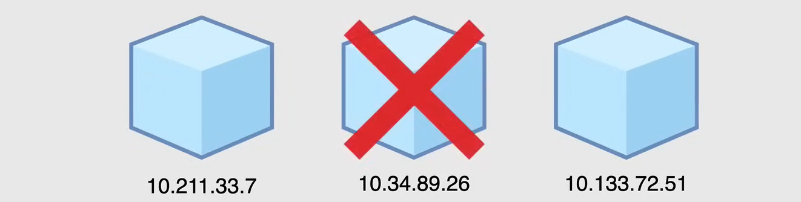
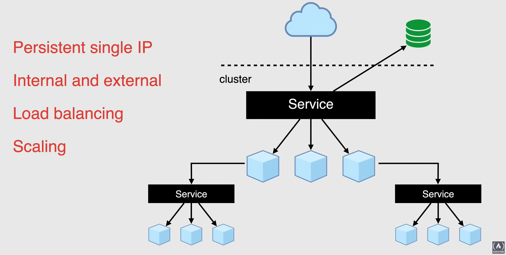
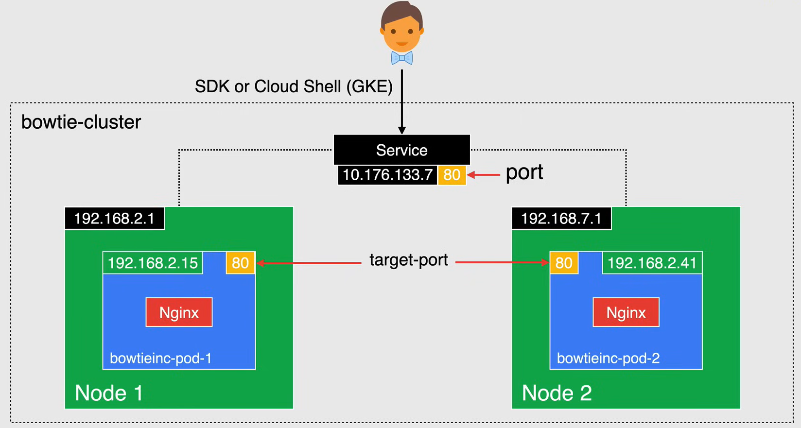
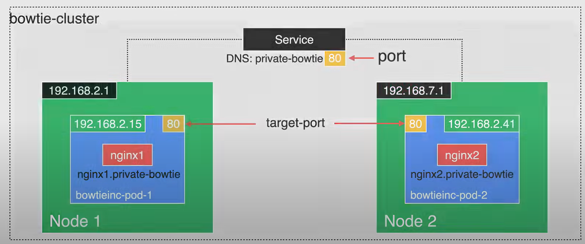

# Kubernetes Services

**NOTE:** Important to understand for the exam.

## Kubernetes approach to networking

Come descritto nelle lezioni precedenti, i Pod di Kubernetes sono effimeri, il che significa che possono essere creati e distrutti in qualsiasi momento, per adattarsi allo stato del tuo cluster, quindi queste risorse non sono mai permanenti.

Un esempio perfetto di ciò è l'utilizzo di un oggetto di deployment in modo da poter creare e distruggere i pod in modo dinamico.




Quando si tratta di networking in Kubernetes, ogni pod ottiene il proprio indirizzo IP, tuttavia, in un deployment, un pod che viene eseguito una volta distrutto, verrà ricreato con un nuovo indirizzo IP, e non c'è un modo reale per tenere traccia degli indirizzi IP per la comunicazione, poiché cambiano molto frequentemente, ed è qui che entrano in gioco i servizi di Kubernetes.

## What is a Kubernetes Service?

Un Service è un'astrazione nel senso che non è un processo che ascolta su una qualche interfaccia di rete, può essere definito come un insieme logico di Pods, un'astrazione sopra i Pods, che fornisce un *singolo indirizzo IP persistente* e un *nome DNS* tramite il quale l'insieme di Pods può essere accessibile.

- **Interno ed Esterno**: Consente di *instradare il traffico esterno* nel tuo cluster Kubernetes e viene utilizzato all'interno del tuo cluster per un instradamento più intelligente.
    - Consente l'accesso esterno degli utenti all'applicazione all'interno del cluster senza dover conoscere l'indirizzo IP dei pods.

- **Bilanciamento del carico**: Con i Services è anche molto facile gestire le configurazioni di *bilanciamento del carico*, per il traffico tra le repliche.

- **Scaling**: Aiuta i pods a scalare rapidamente e facilmente poiché il service gestirà automaticamente la ricreazione dei pods e i loro nuovi indirizzi IP.

L'obiettivo principale dei Services in Kubernetes è fornire un accesso persistente ai suoi pods senza la necessità di cercare l'indirizzo IP di un pod ogni volta che viene ricreato.



## Service Components

Per consentire a un Service di instradare il traffico al pod corretto nel cluster, ci sono alcuni campi nel file di *manifest* che aiutano a determinare gli endpoint su cui instradare il traffico.

I seguenti file YAML sono un esempio di un file di manifest per un Service e un Deployment. Come possiamo vedere nel file `service.yaml`, il tipo è `Service`, il nome DNS è `my-service`, e il campo `selector` viene utilizzato per definire quali pod devono essere inclusi nel service, e l'etichetta `app: inventory` viene utilizzata per definire quali pod. Il campo `type` viene utilizzato per definire il tipo di service, in questo caso, `ClusterIP`, che viene utilizzato per esporre il service su un indirizzo IP interno al cluster. Il campo `ports` viene utilizzato per definire la porta su cui il service ascolterà.


`service.yaml`:

```yaml
apiVersion: v1
kind: Service
metadata:
    name: clusterip-service     # DNS name of the service
spec:
    selector:
        app: inventory          # Forward requests to pods with this label
    type: ClusterIP             # Type of service
    ports:
        - protocol: TCP
        port: 80                # Port number exposed internally in cluster
        targetPort: 80          # Port that container listens on
```

`deployment.yaml`:

```yaml
apiVersion: apps/v1
kind: Deployment
metadata:
    name: bowtie-service
spec:
    replicas: 2
    template:
        metadata:
            labels:
                app: inventory
        spec:
            containers:
                - name: bowtie-service
                  image: nginx:lastest
```

## Selectors and Labels

Kubernetes ha un modo molto unico di instradare il traffico e, per quanto riguarda i Servizi, non è diverso.

I Servizi selezionano i pod in base alle loro etichette.

Quando viene effettuata una richiesta al selettore del servizio, vengono selezionati tutti i pod nel cluster che corrispondono alla coppia chiave-valore specificata nel campo `selector` nel file di manifesto del servizio.

Se ci sono più pod con la stessa coppia chiave-valore, ne viene scelto uno e la richiesta viene inoltrata ad esso.

Nell'esempio seguente puoi vedere il selettore specificato per il servizio come una coppia chiave-valore di `app: inventory`. Puoi vedere che i pod su `Node 1` hanno l'etichetta `app: inventory` e il servizio inoltrerà la richiesta a uno dei pod.
Se guardi l'etichetta del pod su `Node 2`, l'etichetta non corrisponde al selettore, quindi il servizio non inoltrerà la richiesta a quel pod.
In sintesi, l'etichetta sul pod che corrisponde al selettore nel file di manifesto del servizio è ciò che determina a quale pod il servizio inoltrerà la richiesta.


## Service Types

Ci sono diversi tipi di servizi disponibili in Kubernetes per instradare il traffico ai pod nel cluster:

- **ClusterIP**
- **NodePort**
- **LoadBalancer**
- **Ingress**
- **Multi-Port Services**
- **ExternalName**
- **Headless**

I servizi di Kubernetes forniscono le interfacce attraverso le quali i pod possono comunicare tra loro.

Agiscono anche come il gateway principale per la tua applicazione.

I servizi utilizzano i selettori per identificare quali pod devono controllare.

Espongono un indirizzo IP e una porta che non è necessariamente la stessa porta su cui il pod sta ascoltando. I servizi possono esporre più di una porta e possono anche instradare il traffico verso altri servizi, indirizzi IP esterni o nomi DNS.

I servizi rendono molto facile creare servizi di rete in Kubernetes.

Ogni servizio può essere supportato da quanti pod sono necessari senza dover rendere il tuo codice consapevole di come ogni servizio è supportato.


### ClusterIP

Il servizio ClusterIP è il tipo di servizio predefinito in Kubernetes e ti fornisce un servizio all'interno del tuo cluster a cui altre applicazioni all'interno del cluster possono accedere.

Il servizio non è esposto all'esterno del cluster, ma può essere indirizzato dall'interno del cluster.

Quando crei un servizio con il tipo `ClusterIP`, Kubernetes crea un indirizzo IP stabile a cui è possibile accedere dai nodi nel cluster. I client nel cluster chiamano il servizio utilizzando l'indirizzo IP del cluster e il numero di porta specificato nel file di manifesto del servizio.

La richiesta viene inoltrata a uno dei pod membri sulle porte specificate nel campo `targetPort` nel file di manifesto del servizio.



**NOTA:** Questo indirizzo IP è stabile per tutta la durata del servizio.

Nell'esempio seguente, un client chiama il servizio all'indirizzo `10.176.133.7` sulla porta `80`, e la richiesta viene inoltrata a uno dei pod nel cluster sulla porta TCP `80`.
Il pod membro deve avere un container che sta ascoltando sulla porta TCP `80`. Se non c'è un container in ascolto su quella porta, la richiesta fallirà.

Un ottimo caso d'uso di `ClusterIP` è quando hai un record DNS che non vuoi modificare, e vuoi che il nome risolva allo stesso indirizzo IP o semplicemente vuoi un indirizzo IP statico per il tuo carico di lavoro.

Anche se il servizio non è accessibile tramite richieste di rete dall'esterno del cluster, se hai bisogno di accedere al servizio dall'esterno del cluster, puoi comunque connetterti ad esso con il CloudSDK o Cloud Shell utilizzando l'indirizzo IP esposto del cluster.

Di seguito è riportato un esempio di file di manifesto per un servizio `ClusterIP`:

```yaml
apiVersion: v1
kind: Service
metadata:
    name: clusterip-service     # DNS name of the service
spec:
    selector:
        app: inventory          # Forward requests to pods with this label
    type: ClusterIP             # Type of service
    ports:
        - protocol: TCP
          port: 80              # Port number exposed internally in cluster
          targetPort: 80        # Port that container listens on
```

### NodePort

Quando crei un servizio di tipo `NodePort`, specifica un valore di porta del nodo.

Il `NodePort` è una porta statica e viene scelta da un intervallo preconfigurato tra `30000` e `32767`.

- Puoi specificare il tuo valore all'interno di questo intervallo.
- *Ma qualsiasi valore al di fuori di questo intervallo non sarà accettato da Kubernetes*.
- Se non scegli un valore, verrà assegnato un valore casuale all'interno dell'intervallo specificato.


Una volta che questo intervallo di porte è stato assegnato al servizio, il servizio è accessibile utilizzando l'indirizzo IP di qualsiasi nodo insieme al valore `NodePort`.

Il servizio viene quindi esposto su una porta su ogni nodo del cluster. Il servizio può quindi essere accessibile esternamente all'indirizzo IP del nodo insieme a NodePort.

Quando si utilizzano i servizi NodePort, assicurarsi che la porta selezionata non sia già aperta sui nodi.

**NOTA:** il tipo NodePort è un'estensione del tipo ClusterIP. Quindi un servizio di tipo NodePort ha naturalmente un indirizzo IP del cluster.

E quindi questo metodo non è molto sicuro, poiché apre ogni nodo all'accesso esterno e si basa sulla conoscenza degli indirizzi IP dei nodi, che potrebbero cambiare in qualsiasi momento.

```yaml
apiVersion: v1
kind: Service
metadata:
    name: nodeport-service      # DNS name of the service
spec:
    selector:
        app: inventory          # Forward requests to pods with this label
    type: NodePort              # Type of service
    ports:
        - protocol: TCP
          port: 80              # Port number exposed internally in cluster
          targetPort: 80        # Port that container listens on
          nodePort: 32002       # Port exposed on the nodes
```

### LoadBalancer

`LoadBalancer` è esposto come un bilanciamento del carico nel cluster. I servizi LoadBalancer creano un servizio Kubernetes interno che è collegato al bilanciamento del carico del provider cloud (in questo caso, Google Cloud).

Questo creerà un indirizzo IP statico e pubblicamente accessibile e un nome DNS che può essere utilizzato per accedere al tuo cluster da una fonte esterna.


Il tipo LoadBalancer è un'estensione del tipo `NodePort`, quindi un servizio di tipo LoadBalancer ha naturalmente un indirizzo ClusterIP. Se si desidera esporre direttamente un servizio, questo è il metodo predefinito.

Tutto il traffico sulla porta specificata verrà inoltrato al servizio.

Non ci sono filtri o instradamenti, il che significa che è possibile inviare molti tipi diversi di traffico, come HTTP(S), TCP o UDP e altro ancora.

Il **svantaggio** qui è che per ogni servizio esposto con un bilanciamento del carico si paga per quel LoadBalancer, quindi è possibile accumulare costi elevati se si utilizzano più LoadBalancer.

```yaml
apiVersion: v1
kind: Service
metadata:
    name: loadbalancer-service  # DNS name of the service
spec:
    selector:
        app: inventory          # Forward requests to pods with this label
    type: LoadBalancer          # Type of service
    ports:
        - protocol: TCP
          port: 80              # Port number exposed internally in cluster
          targetPort: 80        # Port that container listens on
```

### Multi-Port Services

`Multi-Port Services` viene utilizzato quando è necessario esporre più di una porta.

Kubernetes consente di configurare più definizioni di porta su un oggetto di servizio. Quindi, quando si utilizzano più porte per un servizio, è necessario dare nomi a tutte le porte e se si hanno più porte di servizio, questi nomi devono essere univoci.


In questo esempio, se un client chiama il servizio all'indirizzo `10.176.133.7` sulla porta TCP `80`, la richiesta viene inoltrata a un pod membro sulla porta TCP `80`, su `Node 1` o `Node 2`.

Ma se un client chiama il servizio all'indirizzo `10.176.133.7` sulla porta TCP `9752`, la richiesta viene inoltrata al pod sulla porta TCP `9752` che risiede su `Node 1`.

Ogni pod membro deve avere un contenitore in ascolto sulla porta TCP `80` e un contenitore in ascolto sulla porta TCP `9752`. Questo potrebbe essere un singolo contenitore con due thread o due contenitori in esecuzione nello stesso pod.

E naturalmente, come mostrato qui, è un manifesto che mostra i servizi multiporta.

```yaml
apiVersion: v1
kind: Service
metadata:
    name: loadbalancer-service  # DNS name of the service
spec:
    selector:
        app: inventory          # Forward requests to pods with this label
    type: LoadBalancer          # Type of service
    ports:
        - name: Nginx
          protocol: TCP
          port: 80              # Port number exposed internally in cluster
          targetPort: 80        # Port that container listens on
        - name: App-B
          protocol: TCP
          port: 9752            # Port number exposed internally in cluster
          targetPort: 9752      # Port that container listens on
```

### ExternalName

Un servizio di tipo `ExternalName` fornisce un alias interno per un nome DNS esterno.

I client interni fanno richieste utilizzando il nome DNS interno e le richieste vengono reindirizzate al nome esterno. Quando si crea un servizio, viene creato un nome DNS che i client interni possono utilizzare per chiamare il servizio.


In questo esempio, il nome DNS interno è `bowtie-sql`. Quando un client interno effettua una richiesta al nome DNS interno di `bowtie-sql`, la richiesta viene reindirizzata a `bowtie-sql2.bowtieinc.private`.

Il tipo di servizio ExternalName è un po' diverso dagli altri tipi di servizi in quanto non è associato a un set di pod o a un indirizzo IP.

È una mappatura da un nome DNS interno a un nome DNS esterno.

Il servizio esegue un semplice reindirizzamento CName ed è un ottimo caso d'uso per qualsiasi servizio esterno che risiede al di fuori del tuo cluster.

```yaml
apiVersion: v1
kind: Service
metadata:
    name: bowtie-sql                                # Internal DNS name
spec:
    type: ExternalName
    externalName: bowtie-sql2.bowtieinc.private     # External DNS name redirect
```

### Headless

Il tipo di servizio `Headless`, viene utilizzato quando non hai bisogno o non desideri il bilanciamento del carico e un singolo IP di servizio.

In questo caso, puoi creare servizi `Headless` specificando `None` come tipo di servizio nel file di manifesto.

Questa opzione ti consente anche di scegliere altri meccanismi di scoperta del servizio senza essere legato all'implementazione di Kubernetes.



Le applicazioni possono comunque utilizzare un modello di registrazione automatica con questo servizio, quindi un ottimo caso d'uso per questo è quando non hai bisogno di bilanciamento del carico o instradamento. Hai solo bisogno che il servizio inoltri la richiesta al pod di backend, non è necessario un indirizzo IP.

Il servizio `Headless` viene tipicamente utilizzato con gli stateful sets in cui il nome dei pod è fisso. Questo è utile in situazioni come quando si sta configurando un cluster `mysql`, in cui è necessario conoscere il nome del master.

Ecco un esempio di manifesto per il servizio `Headless`.


```yaml
apiVersion: v1
kind: Service
metadata:
    name: headless-service
spec:
    selector:
        app: inventory
    type: None                  # Type of service
    ports:
        - protocol: TCP
          port: 80
          targetPort: 80
```