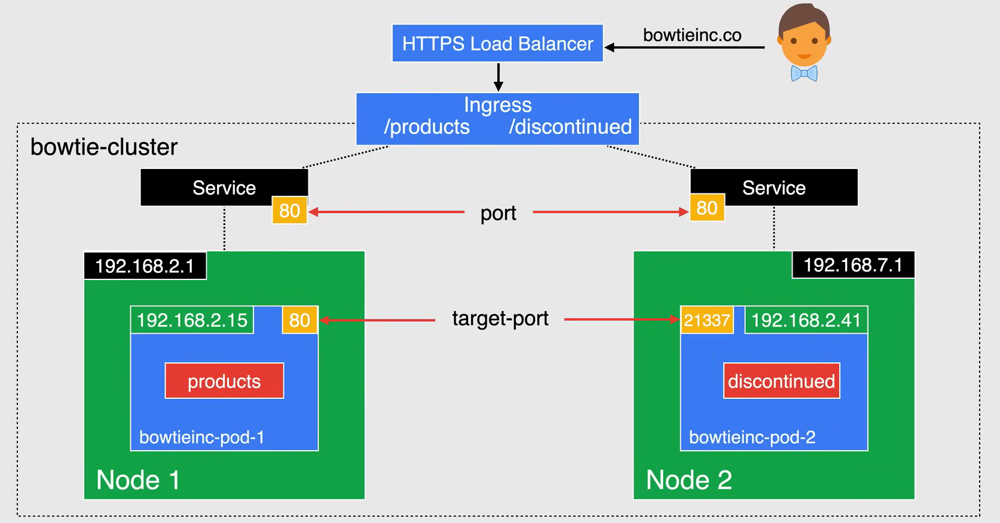
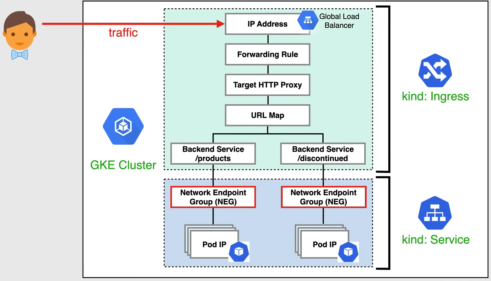

# Ingress for GKE

**NOTA:** Importante per l'esame.

In GKE, un oggetto **Ingress** definisce le regole per il routing del traffico HTTP e HTTPS verso le applicazioni in esecuzione in un cluster.

Un oggetto Ingress è associato a uno o più oggetti di servizio, ognuno dei quali è associato a un insieme di pod.

Quando si crea un oggetto Ingress, il controller Ingress di GKE crea un bilanciatore di carico HTTP o HTTPS di Google Cloud e lo configura in base alle informazioni presenti nell'Ingress e nei relativi servizi.

GKE Ingress è un Ingress Controller integrato e gestito.

Questo controller implementa le risorse Ingress come bilanciatori di carico Google Cloud per i carichi di lavoro HTTP e HTTPS in GKE.

Al bilanciatore di carico viene assegnato un indirizzo IP stabile che è possibile associare a un nome di dominio. Ogni bilanciatore di carico HTTP e HTTPS esterno o bilanciatore di carico HTTP o HTTPS interno utilizza una mappa URL singola che fa riferimento a uno o più servizi di back-end. Un servizio di back-end corrisponde a ciascun servizio referenziato dall'Ingress.



In questo esempio, assumiamo che tu abbia associato l'indirizzo IP del bilanciatore di carico al dominio `bowtieinc.co`.

- Quando un client invia una richiesta a `bowtieinc.co`, la richiesta viene instradata verso un servizio Kubernetes chiamato `products` sulla porta `80`.
- Quando un client invia una richiesta a `bowtieinc.co/discontinued`, la richiesta viene instradata verso un servizio Kubernetes chiamato `discontinued` sulla porta `21337`.

L'**Ingress** è probabilmente il modo più potente per esporre i tuoi servizi, ma può anche essere molto complesso in quanto ci sono molti tipi di controller Ingress tra cui scegliere, insieme a plugin per i controller Ingress.

L'Ingress è molto utile ed economico se si desidera esporre più servizi con lo stesso indirizzo IP, in quanto si paga solo per un bilanciatore di carico se si utilizza l'integrazione nativa di GCP ed è dotato di una serie di funzionalità.

- `ingress.yaml`:

    ```yaml
    apiVersion: networking.k8s.io/v1
    kind: Ingress
    metadata:
        name: ingress-net
    spec:
        rules:
        - http:
            paths:
            - path: /*
                backend:
                    serviceName: products
                    servicePort: 80
            - path: /discontinued
                backend:
                    serviceName: discontinued
                    servicePort: 21337
    ```

- `products-service.yaml`:

    ```yaml
    apiVersion: v1
    kind: Service
    metadata:
        name: products
    spec:
        type: NodePort
        selector:
            app: products
        ports:
        - protocol: TCP
            port: 80
            targetPort: 80
    ```

- `discontinued-service.yaml`:

    ```yaml
    apiVersion: v1
    kind: Service
    metadata:
        name: discontinued
    spec:
        type: NodePort
        selector:
            app: discontinued
        ports:
        - protocol: TCP
            port: 21337
            targetPort: 21337
    ```

## Network Endpoint Groups (NEGs)

**Network Endpoint Groups** (NEGs) è un oggetto di configurazione che specifica un gruppo di endpoint di back-end per i servizi.

NEGs sono utili per il bilanciamento del carico nativo dei contenitori, dove ogni contenitore può essere rappresentato come un endpoint per il bilanciatore.

I NEGs vengono utilizzati per tenere traccia dinamicamente degli endpoint dei pod, in modo che il bilanciatore di carico di Google possa instradare il traffico verso i relativi back-end.

Quindi il traffico viene bilanciato direttamente dal bilanciatore di carico al pod IP, invece di attraversare l'IP della VM e la rete del proxy di Coupe.

In queste condizioni, i servizi verranno automaticamente annotati, indicando che deve essere creato un NEG per riflettere gli IP dei pod all'interno del servizio.

I NEGs sono ciò che consente ai bilanciatori di carico di Compute Engine di comunicare direttamente con i pod.

Il diagramma mostrato qui rappresenta il mapping delle risorse Ingress verso le risorse del motore di calcolo, basato sulle risorse Ingress che vengono distribuite nel cluster.



## Health Checks

Se non sono specificati parametri **Health Check** per un servizio di backend corrispondente, vengono utilizzati un insieme di parametri *predefiniti e dedotti*.

I parametri **Health Check** per il tuo servizio di backend dovrebbero essere definiti esplicitamente creando una definizione di risorsa personalizzata Backend Config (CRD) per il servizio.

Una definizione di risorsa personalizzata Backend Config dovrebbe essere utilizzata anche se:

- viene utilizzato il controller Ingress di *Anthos*.
- hai *più di un contenitore* nei pod di servizio,
- hai bisogno di controllo sul *porta utilizzata per i controlli di salute dei bilanciatori di carico*.

Ora puoi specificare i parametri di Health Check dei servizi di backend utilizzando il parametro Health Check di una definizione di risorsa personalizzata Backend Config, referenziata dal servizio corrispondente.

Ciò ti offre maggiore flessibilità e controllo sui controlli di salute per un bilanciatore di carico HTTP o HTTPS esterno di Google Cloud o un bilanciatore di carico HTTP(s) interno creato da un ingress.

## SSL Certificates

Ci sono tre modi per fornire certificati SSL a un bilanciatore di carico HTTP o HTTPS.

- **Google Managed Certificates**
    - Completamente gestiti da Google: forniti, implementati, rinnovati e gestiti per i tuoi domini.
    - Non supportano domini wild card.

- **Self Managed Certificates**
    - Gestiti e condivisi con Google Cloud.
    - Puoi *progettare il tuo certificato SSL* e creare una risorsa certificato nel tuo progetto Google Cloud.
    - Puoi quindi *elencare la risorsa certificato in un'annotazione* su un Ingress per creare un bilanciatore di carico HTTP(S) che utilizza il certificato.

- **Self Managed Certificates come risorse Secret**
    - Puoi *progettare il tuo certificato SSL*.
    - *Crea un Secret* per contenerlo.
    - Puoi quindi *fare riferimento al Secret* come specifica Ingress per creare un bilanciatore di carico HTTP(S) che utilizza il certificato.

*Puoi specificare più certificati in una manifestazione Ingress*. Il bilanciatore di carico sceglie un certificato se il nome comune nel certificato corrisponde al nome host utilizzato nella richiesta.

