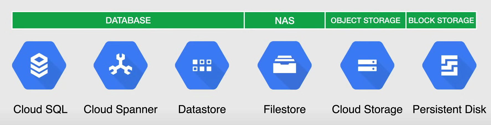
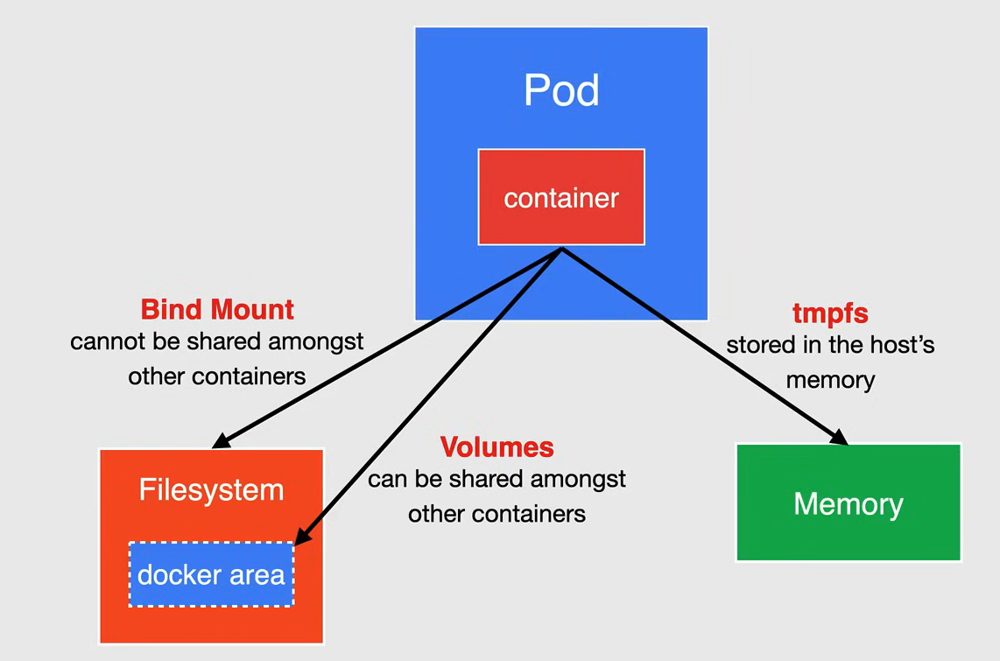
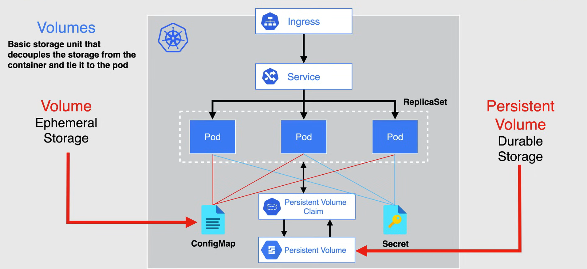
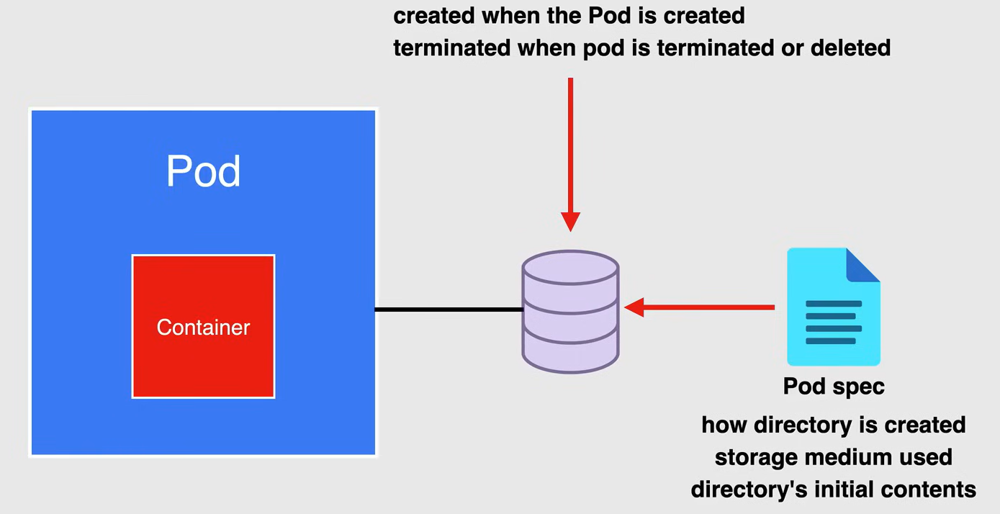
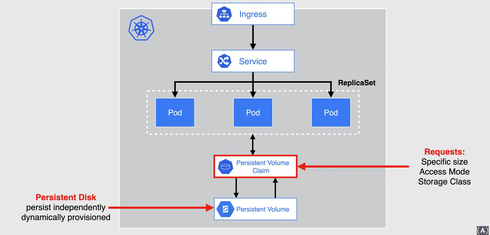
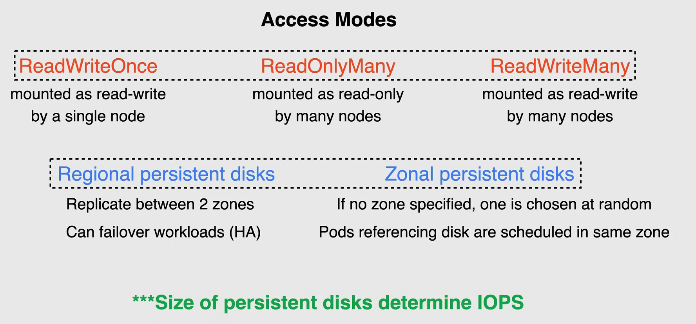

# GKE Storage Options



Ci sono diverse opzioni di archiviazione per le applicazioni in esecuzione su GKE. La scelta varia molto in termini di flessibilità e facilità d'uso. Google Cloud offre diverse opzioni di archiviazione che possono essere utilizzate per il tuo carico di lavoro specifico.

Kubernetes fornisce anche astrazioni di archiviazione.

Le opzioni di archiviazione più semplici sono i prodotti di archiviazione gestiti di Google Cloud.

- Se hai bisogno di connettere un database al tuo cluster, puoi considerare l'utilizzo del datastore **Cloud SQL** o di **Cloud Spanner**.
- Per quanto riguarda l'*archiviazione degli oggetti*, **Cloud Storage** sarebbe un'ottima opzione per colmare il divario.
- **Filestore** è un'ottima opzione quando la tua applicazione richiede una gestione dello storage di rete.
- Se la tua applicazione richiede *archiviazione a blocchi*, la migliore opzione è utilizzare **Persistent Disks** che possono essere provisionati manualmente o in modo dinamico tramite Kubernetes.

## Docker Storage

Un **docker volume** è una directory su disco o in un altro container.

Docker fornisce *volume drivers*, ma la funzionalità è un po' limitata.

Un container Docker ha uno strato scrivibile, ed è qui che i dati vengono memorizzati per impostazione predefinita, rendendo i dati effimeri e quindi non persistenti quando il container viene rimosso. Pertanto, non è sempre consigliabile memorizzare i dati all'interno di un container.

Ci sono tre modi per montare i dati all'interno di un container Docker.

1. **Docker volume**

  - Si trova all'interno dell'area Docker all'interno del file system dell'host e può essere condiviso tra altri container
  - Questo volume è un oggetto Docker ed è disaccoppiato dal container
  - Possono essere collegati e condivisi tra più container

2. **Bind mounting**

  - Viene direttamente dal file system dell'host
  - I bind mounts sono ottimi per lo sviluppo di applicazioni locali, ma non possono essere condivisi tra i container

3. **tmpfs**

  - Viene memorizzato nella memoria dell'host
  - Questo metodo è ottimo per i dati effimeri e aumenta le prestazioni in quanto non si trova più nello strato scrivibile del container.



## Kubernetes Storage Abstractions

Con **Kubernetes Storage Abstractions**, viene fornito uno storage basato su file system e su blocchi ai tuoi pod, ma è diverso dalla natura di Docker.

I *volumi* sono l'unità di base di storage in Kubernetes che scollega lo storage dal container e lo lega al pod, e non al container come in Docker.

- Un volume regolare chiamato semplicemente **Volume**, è essenzialmente una directory a cui i container in un pod hanno accesso.

- Il tipo di volume utilizzato determina il suo scopo.

- Alcuni tipi di volumi sono supportati da storage effimero come `empty-dir`, `configmap` e `secrets`. Questi volumi non persistono dopo la cessazione del pod.

I volumi sono utili per la memorizzazione temporanea di informazioni, la condivisione di file tra i container o il caricamento di dati in un pod.

Altri tipi di volumi sono supportati da storage durevole e persistono oltre la durata di un pod, come **Persistent Volumes** e **Persistent Volume Claims**.

- Un *Persistent Volume* è una risorsa del cluster che i pod possono utilizzare per lo storage durevole.
- Un *Persistent Volume Claim* può essere utilizzato per la creazione dinamica di un persistent volume, supportato da Persistent Disks.
  - I Persistent Volume Claims possono essere utilizzati anche per la creazione di altri tipi di storage di supporto, come NFS.



## Volumes

In Docker, i file su disco in un container sono il posto più semplice per un'applicazione per scrivere dati.

Ma *i file vengono persi quando il container si blocca o si interrompe per qualsiasi altro motivo*, oltre a non essere accessibili ad altri container in esecuzione nello stesso pod.

In Kubernetes, la fonte del volume dichiarata nella specifica del pod determina come viene creata la directory.

- Il supporto di archiviazione utilizzato e il contenuto iniziale delle directory.

Un *pod specifica quali volumi contiene* e il percorso in cui i container montano il volume.

I tipi di volumi effimeri vivono per lo stesso periodo di tempo dei pod a cui sono collegati. Questi volumi vengono creati quando viene creato il pod e persistono attraverso i riavvii del container, solo quando il pod termina o viene eliminato, i volumi vengono terminati.

Altri tipi di volumi sono **interfacce** per l'archiviazione durevole che esistono indipendentemente da un pod, come i volumi effimeri, i dati in un volume supportato da archiviazione durevole vengono preservati quando il pod viene rimosso.

Il volume viene semplicemente smontato e i dati possono essere passati a un altro pod.



### Volume Types

I volumi differiscono nella loro implementazione di archiviazione e nei loro contenuti iniziali.

Puoi scegliere la fonte del volume che meglio si adatta al tuo caso d'uso.

- **emptyDir**: Un volume emptyDir fornisce una directory vuota a cui i container nel pod possono leggere e scrivere.
  - Quando il pod viene rimosso da un nodo per qualsiasi motivo, i dati nell'emptyDir vengono eliminati in modo permanente.
  - Un volume emptyDir è memorizzato su qualsiasi supporto sottostante il nodo, che potrebbe essere un disco, un SSD o un'archiviazione di rete.
  - I volumi emptyDir sono utili per lo spazio temporaneo e la condivisione di dati tra più container in un pod.

- **ConfigMap**: Un ConfigMap è una risorsa che fornisce un modo per iniettare dati di configurazione nei pod.
  - I dati memorizzati in un oggetto ConfigMap possono essere referenziati in un volume di tipo ConfigMap e quindi utilizzati dai file in esecuzione in un pod.

- **Secret**: Un volume Secret viene utilizzato per rendere disponibili alle applicazioni dati sensibili, come password, token OAuth e chiavi SSH.
  - I dati memorizzati in un oggetto Secret possono essere referenziati in un volume di tipo Secret e quindi utilizzati dai file in esecuzione in un pod.

- **Downward API**: questo volume rende i dati della Downward API disponibili alle applicazioni.
  - Questi dati includono informazioni sul pod e sul container in cui viene eseguita un'applicazione.
  - Un esempio di ciò potrebbe essere l'esposizione di informazioni sui pod, sul namespace e sull'indirizzo IP alle applicazioni.

- **PersistentVolumeClaim**: Un volume PersistentVolumeClaim può essere utilizzato per fornire archiviazione durevole in modo che possa essere utilizzata dalle applicazioni.
  - Un pod utilizza un PersistentVolumeClaim per montare un volume che è supportato da questa archiviazione durevole.

## Persistent Volumes

Le risorse **Persistent Volume** vengono utilizzate per gestire lo storage durevole in un cluster.

In GKE, un persistent volume è tipicamente supportato da un *persistent disk* o può essere utilizzato *Filestore* come soluzione NFS.

A differenza dei volumi, il ciclo di vita del persistent volume è gestito da Kubernetes e può essere provisionato in modo dinamico senza la necessità di creare e eliminare manualmente lo storage di supporto.

Le risorse persistent volume sono risorse del cluster che esistono indipendentemente dai pod e continuano a persistere durante i cambiamenti del cluster e durante l'eliminazione e la ricreazione dei pod.



Passando a *Persistent Volume Claims*, questa è una richiesta e una pretesa di una risorsa persistent volume.

- Gli oggetti persistent volume claim richiedono una dimensione specifica, una modalità di accesso e una classe di storage per il persistent volume.

- Se un persistent volume esistente può soddisfare la richiesta o può essere provisionato, il persistent volume claim viene associato a quel persistent volume.

**NOTA:** I pod utilizzano i claim come volumi. Il cluster ispeziona il claim per trovare il volume associato e monta quel volume per il pod.

### Storage Classes

Queste implementazioni di volumi, come GCE Persistent Disk, sono configurate tramite risorse StorageClass.

GKE crea automaticamente una StorageClass predefinita per te, che utilizza il tipo di Persistent Disk standard EXT4 come mostrato qui.
La storage class predefinita viene utilizzata quando una richiesta di Persistent Volume non specifica un nome di storage class e può anche essere sostituita con una di tua scelta.
Puoi anche creare le tue risorse storage class per descrivere diverse classi di storage ed è utile quando si utilizzano Windows Nodes Pools.

```yaml
apiVersion: storage.k8s.io/v1
kind: StorageClass                          # StorageClass resource
metadata:
  name: standard
provisioner: kubernetes.io/gce-pd
parameters:
  type: pd-standard
  fstype: ext4                              # Default storage class                    
  replication-type: none
reclaimPolicy: Retain
allowVolumeExpansion: true
mountOptions:
  - debug
volumeBindingMode: Immediate
```

### Persistent Volume - Provisioning

Le richieste di Persistent Volume possono automaticamente fornire Persistent Disks per te.

Quando crei questo oggetto Persistent Volume Claim, Kubernetes crea dinamicamente un corrispondente oggetto Persistent Volume.

A causa della storage class predefinita di GKE, questo Persistent Volume è supportato da un nuovo Compute Engine Persistent Disk vuoto.

Puoi utilizzare questo disco in un pod utilizzando la richiesta come un volume, quando elimini una richiesta, vengono eliminati anche l'oggetto Persistent Volume corrispondente e il Compute Engine Persistent Disk fornito.

Per evitare l'eliminazione, puoi impostare la *reclaim policy* della risorsa persistent disk o della risorsa storage class su retain.

Ora, i deployments, come mostrato qui in questo diagramma, sono progettati per applicazioni senza stato. Quindi tutte le repliche di un deployment condividono la stessa richiesta di persistent volume, motivo per cui gli stateful sets sono il metodo consigliato per distribuire applicazioni con stato che richiedono un volume unico per replica.

Utilizzando gli stateful sets con i template di richiesta di persistent volume, puoi avere applicazioni che possono scalare automaticamente con richieste di persistent volume uniche associate a ogni pod replica.

### Persistent Volume - Access Modes

Ci sono 3 modalità supportate per i tuoi dischi persistenti che consentono l'accesso in lettura/scrittura e sono elencate qui.

- **ReadWriteOnce** è dove il volume può essere montato come lettura/scrittura da un singolo nodo.
- **ReadOnlyMany** è dove il volume può essere montato come sola lettura da molti nodi.
- **ReadWriteMany** è dove il volume può essere montato come lettura/scrittura da molti nodi.

**NOTA:** ReadWriteOnce è il caso d'uso più comune per i dischi persistenti e funziona come modalità di accesso predefinita per la maggior parte delle applicazioni.

I tipi di dischi persistenti disponibili sono:

- **Regional Persistent Disks**
  - Queste sono risorse multi-zonali che replicano i dati tra due zone nella stessa regione.
  - Può essere utilizzato in modo simile ai dischi persistenti zonali.
  - In caso di interruzione di una zona, Kubernetes può ripristinare i carichi di lavoro che utilizzano il volume nell'altra zona.
  - I dischi persistenti regionali sono ottimi per soluzioni altamente disponibili per carichi di lavoro con stato su GKE.

- **Zonal Persistent Disks**
  - I dischi persistenti zonali sono risorse zonali e quindi, a meno che non venga specificata una zona, GKE assegna il disco a una singola zona e sceglie la zona in modo casuale.
  - Una volta che un disco persistente viene provisionato, qualsiasi pod che fa riferimento al disco viene pianificato nella stessa zona del disco.

**NOTA:** Utilizzando l'anti-affinità sulle zone, i pod di stateful set possono essere distribuiti tra le zone insieme ai dischi corrispondenti.

L'ultimo punto che volevo affrontare riguardo all'accesso ai volumi persistenti è la velocità di accesso. Come già detto in una lezione precedente, la dimensione dei dischi persistenti determina le IOps e la velocità di trasferimento del disco.

GKE utilizza tipicamente i dischi persistenti come dischi di avvio e per supportare i volumi persistenti di Kubernetes.

Quindi, quando possibile, *utilizza dischi più grandi e meno dischi per ottenere IOps e velocità di trasferimento più elevate*.

