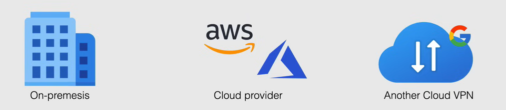
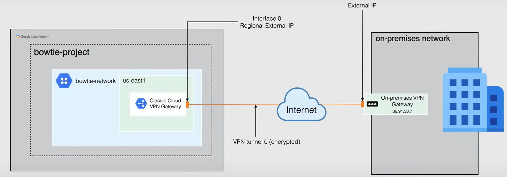

# Cloud VPN

Cloud VPN securely connects your peer network to your VPC network through an IPsec VPN connection. 

- *Peer network*: on premises VPN devic, or VPN service, a VPN Gateway hosted by another cloud provider, such as AWS or azure or another Google Cloud VPN gateway.

And so this is an IPsec or encrypted tunnel from your peer network to your VPC network that traverses the public Internet. 

- *IPsec* being short for Internet security protocol. And this is a set of protocols using algorithms, allowing the transport of secure data over an IP network. IP sec operates at the network layer, so layer three of the OSI model, which allows it to be independent of any applications.

And so when creating your cloud VPN,*traffic traveling between the two networks is encrypted by one VPN gateway and then decrypted by the other VPN gateway*.

Now moving on to some details about cloud VPN:

- It is a **Regional service**
  - Take that into consideration when connecting your on premises location to Google Cloud for the least amount of latency.
  - It also means that if that region were to go down, you would lose your connection until the region is back up and running.
- It is also a **site to site VPN only**, and therefore it does not support site to client.
  - So this means that if you have a laptop or a computer at home, you cannot use this option with a VPN client to connect to Google Cloud.
- It can also be used in conjunction with **Private Google Access** for your on-premises hosts.
  - So if you're using Private Google Access within GCP, you can simply connect to your data center with VPN, and have access as if you were already in GCP.
  - So if you're looking to extend Private Google Access to your on premises data center, Cloud VPN would be the perfect choice.
- Each Cloud VPN tunnel can support up to **3 gigabits per second** total for Ingress and egress.
- Routing options that are available are **static** and **dynamic**, but are only available as dynamic for HA-VPN. 
- Cloud VPN supports **IKEv1** and **IKEv2** using Shared Secret.
  - IKE stands for Internet Key Exchange, and this helps establish a secure, authenticated communication channel by using a key exchange algorithm to generate a shared secret key to encrypt communications.
  - So know that when you choose Cloud VPN, that your connection is both private and secure.

## Types of Cloud VPN

So now there are two types of VPN options that are available in Google Cloud:

- **Classic VPN**

    - *99.9% SLA*: Provides a service level agreement of 99.9% also known as an SLA of three nines
    - Supports both *static* and *dynamic* routing
    - Classic VPN gateways have a single interface and a single external IP address and support tunnels using static routing as well as dynamic routing in the static routing can be either route based or policy based
    - Deprecated as of 2021, but still supported

- **HA VPN**

    - *99.99% SLA*: provides a four nines sla when configure with two interfaces and two external IPs.
    - HA VPN supports *dynamic routing only*, and this must be done through BGP using Cloud Router.
    - HA VPN gateways can be configured for 2 interfaces and two external IPS for true HA capabilities
    - New default option for VPN in Google Cloud

### Classic VPN

Classic VPN is a Cloud VPN solution that lets you connect your peer network to your VPC network through an IPsec VPN connection in a single region.

Now, unlike HA VPN, Classic VPN offers no redundancy out of the box, you would have to create another VPN connection, and if the connection were to go down, you would have to manually switch over the connection from one to the other.

Now, as you can see here, when you create a VPN Gateway, Google Cloud automatically chooses only one external IP address for its interface and the diagram shown here shows that of a Classic VPN network connected from the `bowtie-network` VPC in `bowtie-project` to an on-premises network configured using a static route to connect.

### HA VPN

HA VPN is a highly available cloud VPN solution that lets you connect your peer network to your VPC network using an IPsec VPN connection in a single region, exactly like classic VPN.

Where HA VPN differs is that it provides four-nines SLA, and as you can see here, it supports double the connections.

So when you create an HA VPN gateway, Google Cloud automatically chooses 2 external IP addresses, 1 for each of its fixed number of two interfaces. Each IP address is automatically chosen from a unique address pool to support high availability. Each of these HA VPN gateway interfaces support multiple tunnels, which allows you to create multiple HA VPN gateways.

You can configure an HA VPN gateway with only one active interface and 1 public IP address. However, this configuration does not provide a four-nine SLA.

Now for HA VPN gateway, you configure an external peer VPN gateway resource that represents your physical peer gateway in Google Cloud. You can also create this resource as a standalone resource and use it later.

In this diagram, the two interfaces of an HA VPN gateway in the `bowtie-network` VPC living in `bowtie-project` are connected to two peer VPN gateways in an on premises network.
In this connection is using dynamic routing with BGP connecting to a Cloud Router in Google Cloud. 

## When to use Cloud VPN

When using cloud VPN makes sense?

- **Public Internet access in needed**. 
  - When you're sharing files or your company needs a specific Sass product that's only available on the Internet, VPN would be your only option.

- **Peering location is not available**.
  - When you're looking to use interconnect and you're **peering location is not available**.
  - So you're not able to connect to your data center to the colocation facility of your choice, VPN wouldn't be the only other option that you have.

- **Budget constraints**.
  - If **budget constraints** come into play when deciding on connecting to your peer network, VPN would always be the way to go
  - As cloud interconnect is gonna be the more expensive option.

- **High speed network and low latency not needed**.
  - If you **don't need a high speed network and low latency** is not really a concern for you.

- **Outgoing traffic (egress) from GCP**
  - You only have **regular outgoing traffic** coming from Google Cloud, then VPN would suffice for your everyday needs.