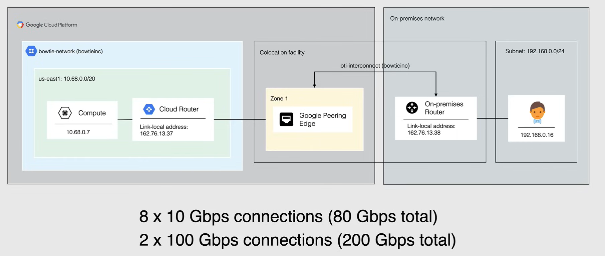
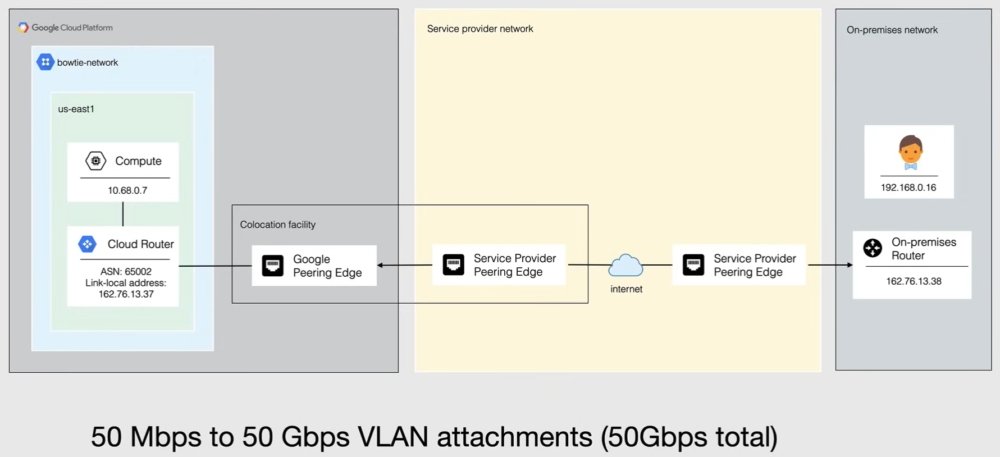

# Cloud Interconnect

Cloud Interconnect is a connection type that allows connectivity from your on premises environment to your Google Cloud VPC.

Cloud Interconnect is the most common connection for most larger organizations and are for those that demand fast/low latency connections. 

- Cloud interconnect is a **low latency, highly available connectio**n between your on premises data center and Google Cloud VPC networks. 

- Cloud Interconnect connections provide internal IP address connections, which means *internal IP addresses are directly accessible from both networks*.
  - And so on premises hosts can use internal IP addresses and take advantage of **Private Google Access** rather than external IP addresses to reach Google APIs and services.

- Traffic between your on premises network and your VPC network **doesn't traverse the public Internet**.
  - Traffic traverses a dedicated connection or a three service provider with a dedicated connection or VPC network's internal IP addresses are directly accessible from your on premises network.

- Unlike VPN, this connection **is not encrypted**.
  - If you need to encrypt your traffic at the IP layer, you can create one or more self managed VPN gateways in your VPC network and assign a private IP address to each gateway.

- Although this may be a very fast connection, it also comes with a **very high price tag** and is the highest price connection type.

Cloud interconnect offers two options for extending your on premises network:

- **Dedicated Interconnect**, which provides a direct physical connection between your on-premises network and Google's network
- **Partner Interconnect**, which provides connectivity between your on premises and VPC networks through supported service provider

## Dedicated Interconnect

Dedicated Interconnect provides a direct physical connection between your on-premises network and Google's network.

Dedicated Interconnect enables you to transfer large amounts of data between your network and Google Cloud, which can be more cost effective than purchasing additional bandwidth over the public Internet.

For Dedicated Interconnection you provision a Dedicated Interconnect connection between the Google Network and your own router in a common location.

The following example shown here shows a single Dedicated Interconnect connection between a VPC network and an on-premises network for this basic setup, a Dedicated Interconnect connection is provisioned between the Google Network and the on-premises router in a common colonization facility.

When you create a V-LAN attachment, you associate it with a Cloud Router, that creates a BGP session for the V-LAN attachment and its corresponding on-premises peer router. These routes are added as custom dynamic routes in your VPC network.

And so for Dedicated Interconnect connection capacity is delivered over 1 or more 10 gigabits per second or 100 gigabits per second, Ethernet connections with the follow on maximum capacity supported per interconnect connection.

So with your 10 gigabit per second connections, you can get up to eight connections totaling speed of 80 Gbps, with the 100 gigabit per second connection you can connect two of them together to have a total speed of 200 gigabits per second.

And so for Dedicated Interconnect, your network must physically meet Google's network in a supported co-location facility, also known as an **interconnect connection location**. This facility is where a vendor, the co-location facility provider, provisions a circuit between your network and a Google Edge point of presence, also known as *pop*.

The setup shown here is suitable for non critical applications that can tolerate some downtime, but for sensitive production applications at least two interconnect connections in 2 different edge availability domains are recommended.

## Partner Interconnect

**Partner Interconnect** provides connectivity between your on-premises network and your VPC network through supported service provider.

So this is not a direct connection from your on premises network to Google as the service provider provides a conduit between your on premises network and Google's pop.

A Partner Interconnect connection is useful if it Dedicated Interconnect colocation facility is physically out of reach, or your workloads don't warrant an entire 10 gigabit per second connection.

For Partner Interconnect 50 megabits per second to 50 gigabits per second V-LAN attachments are available with the maximum supported attachment size of 50 gigabits per second.

Service providers have existing physical connections to Google's network that they make available for their customer to use. So in this example shown here you would provision a Partner Interconnect connection with these service providers and connecting your on-premises network to that service provider.

After connectivity is established with the service provider, a Partner Interconnect connection is requested from the service providers and the service provider configures your VLAN attachment for use.

Once your connection is provisioned, you can start passing traffic between your networks by using the service providers network.

To build a highly available topology, you can use multiple service providers, as well you must build redundant connections for each service provider in each metropolitan.

## Other Connection Types

And so now there's a couple more connection types that run through service providers that are not on the exam, but I wanted you to be aware of them, if ever the situation arises in your role as a cloud engineer.

### Direct Peering

Direct Peering enables you to establish a direct peering connection between your business network and Google's edge network and exchange high throughput cloud traffic.

This capability is available at any of more than 100 locations in 33 countries around the world.

When established direct peering provides a direct path from your on premises network to Google services, including. Google Cloud products that can be exposed through one or more public IP addresses.

Traffic from Google's network to your on premises network also takes that direct path, including traffic from VPC networks in your projects.

Now you can also save money and receive direct egress pricing for your projects after they have established direct peering with Google.

Direct peering exists outside of Google Cloud unless you need to access Google Workspace applications the recommended methods of access to Google Cloud are Dedicated Interconnect or Partner Interconnect.

Establishing a direct peering connection with Google is free and there are no costs per port and no per hour charges. You just have to meet Google's technical peering requirements and can then be considered for the direct peering service

### CDN Interconnect

**CDN** standing for content delivery network is what caches content at the network edge to deliver files faster to those requesting in one of the main ways to improve website performance.

CDN interconnect this connection type enables select 3rd party CDN providers like Akamai and Cloud Slayer along with others, to establish and optimize your CDN population costs by using direct peering links with Google's edge network.

That enables you to direct your traffic from your VPC networks to the providers network. And so your egress traffic from Google Cloud through one of these links benefits from the direct connectivity to the CDM provider and is build automatically with reduced pricing.

Typical use cases for CDN interconnect is if you're populating your CDN with large data files from Google Cloud, where you have frequent content updates stored in different CDN locations.

## When to use Cloud Interconnect

- **Prevent traffic from traversing the public Internet**
- **Dedicated** physical connection
- Extension of your VPC network to your on premises network
- High speed and low latency is needed (200 Gbps)
- Heavy outgoing traffic (egress) from GCP
- Private Google Access

