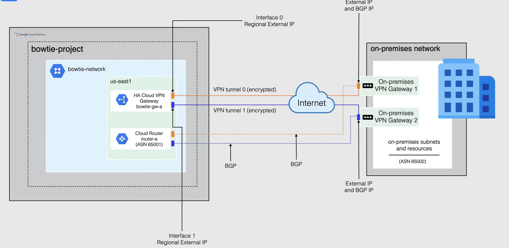

# Cloud VPN

Cloud VPN collega in modo sicuro la tua rete peer alla tua rete VPC tramite una connessione VPN IPsec.

- *Rete peer*: dispositivo VPN in loco o servizio VPN, un gateway VPN ospitato da un altro provider cloud, come AWS o Azure o un altro gateway Cloud VPN di Google.

E quindi si tratta di un tunnel IPsec o crittografato dalla tua rete peer alla tua rete VPC che attraversa Internet pubblico.

- *IPsec* è l'abbreviazione di Internet security protocol. Si tratta di un insieme di protocolli che utilizzano algoritmi, consentendo il trasporto di dati sicuri su una rete IP. IPsec opera al livello di rete, quindi al livello tre del modello OSI, il che gli consente di essere indipendente da qualsiasi applicazione.

E quindi, quando crei la tua Cloud VPN, *il traffico che viaggia tra le due reti viene crittografato da un gateway VPN e quindi decrittato dall'altro gateway VPN*.

Ora passiamo ad alcuni dettagli su Cloud VPN:

- È un **servizio regionale**
  - Tienilo in considerazione quando colleghi la tua posizione in loco a Google Cloud per ridurre al minimo la latenza.
  - Significa anche che se quella regione dovesse andare offline, perderai la connessione fino a quando la regione non tornerà online.
- È anche solo una **VPN sito-sito**, quindi non supporta la connessione sito-cliente.
  - Ciò significa che se hai un laptop o un computer a casa, non puoi utilizzare questa opzione con un client VPN per connetterti a Google Cloud.
- Può essere utilizzato anche in combinazione con **Private Google Access** per i tuoi host in loco.
  - Quindi, se stai utilizzando Private Google Access all'interno di GCP, puoi semplicemente connetterti al tuo data center con VPN e avere accesso come se fossi già in GCP.
  - Quindi, se stai cercando di estendere Private Google Access al tuo data center in loco, Cloud VPN sarebbe la scelta perfetta.
- Ogni tunnel Cloud VPN può supportare fino a **3 gigabit al secondo** in totale per ingresso ed uscita.
- Le opzioni di routing disponibili sono **statiche** e **dinamiche**, ma sono disponibili solo come dinamiche per HA-VPN.
- Cloud VPN supporta **IKEv1** e **IKEv2** utilizzando un Shared Secret.
  - IKE sta per Internet Key Exchange e aiuta a stabilire un canale di comunicazione sicuro e autenticato utilizzando un algoritmo di scambio chiave per generare una chiave segreta condivisa per crittografare le comunicazioni.
  - Quindi, quando scegli Cloud VPN, la tua connessione è sia privata che sicura.

## Tipi di Cloud VPN

Quindi ora ci sono due tipi di opzioni VPN disponibili in Google Cloud:

- **Classic VPN**

  - *99,9% SLA*: Fornisce un accordo di livello di servizio del 99,9%, noto anche come SLA di tre nove.
  - Supporta sia il routing *statico* che il routing *dinamico*.
  - I gateway Classic VPN hanno un'interfaccia singola e un singolo indirizzo IP esterno e supportano tunnel utilizzando il routing statico e il routing dinamico, in cui il routing statico può essere basato su route o basato su policy.
  - Deprecato a partire dal 2021, ma ancora supportato.

- **HA VPN**

  - *99,99% SLA*: Fornisce un accordo di livello di servizio di quattro nove quando configurato con due interfacce e due indirizzi IP esterni.
  - HA VPN supporta solo il *routing dinamico*, che deve essere effettuato tramite BGP utilizzando Cloud Router.
  - I gateway HA VPN possono essere configurati con 2 interfacce e 2 indirizzi IP esterni per una vera capacità di alta disponibilità.
  - Nuova opzione predefinita per VPN in Google Cloud

### Classic VPN

Classic VPN è una soluzione Cloud VPN che consente di collegare la tua rete peer alla tua rete VPC tramite una connessione VPN IPsec in una singola regione.

Ora, a differenza di HA VPN, Classic VPN non offre ridondanza di default, dovresti creare un'altra connessione VPN e se la connessione dovesse interrompersi, dovresti passare manualmente da una connessione all'altra.

Come puoi vedere qui, quando crei un Gateway VPN, Google Cloud sceglie automaticamente solo un indirizzo IP esterno per la sua interfaccia e il diagramma mostrato qui mostra quello di una rete Classic VPN collegata dalla VPC `bowtie-network` nel progetto `bowtie` a una rete in loco configurata utilizzando una route statica per la connessione.

### HA VPN

HA VPN è una soluzione di VPN cloud altamente disponibile che consente di collegare la tua rete peer alla tua rete VPC utilizzando una connessione VPN IPsec in una singola regione, esattamente come la VPN classica.

La differenza di HA VPN è che fornisce un accordo di livello di servizio (SLA) di quattro nove, e come puoi vedere qui, supporta il doppio delle connessioni.

Quindi, quando crei un gateway HA VPN, Google Cloud sceglie automaticamente 2 indirizzi IP esterni, 1 per ciascuna delle sue due interfacce fisse. Ogni indirizzo IP viene scelto automaticamente da un pool di indirizzi unici per garantire l'alta disponibilità. Ciascuna di queste interfacce del gateway HA VPN supporta più tunnel, il che ti consente di creare più gateway HA VPN.

Puoi configurare un gateway HA VPN con una sola interfaccia attiva e 1 indirizzo IP pubblico. Tuttavia, questa configurazione non fornisce un accordo di livello di servizio (SLA) di quattro nove.

Ora, per il gateway HA VPN, puoi configurare una risorsa gateway VPN peer esterna che rappresenta il tuo gateway peer fisico in Google Cloud. Puoi anche creare questa risorsa come risorsa indipendente e utilizzarla in seguito.

In questo diagramma, le due interfacce di un gateway HA VPN nella VPC `bowtie-network` nel progetto `bowtie` sono collegate a due gateway VPN peer in una rete in loco. In questa connessione viene utilizzato il routing dinamico con BGP che si connette a un Cloud Router in Google Cloud.

## Quando utilizzare Cloud VPN

Quando ha senso utilizzare Cloud VPN?

- **Accesso a Internet pubblico necessario**.
  - Quando condividi file o la tua azienda ha bisogno di un prodotto Sass specifico disponibile solo su Internet, VPN sarebbe la tua unica opzione.

- **La posizione di peering non è disponibile**.
  - Quando cerchi di utilizzare l'interconnessione e la tua **posizione di peering non è disponibile**.
  - Quindi non puoi connetterti al tuo data center alla struttura di colocation di tua scelta, VPN sarebbe l'unica altra opzione che hai.

- **Vincoli di budget**.
  - Se entrano in gioco **vincoli di budget** quando decidi di connetterti alla tua rete peer, VPN sarebbe sempre la scelta migliore
  - Poiché l'interconnessione cloud sarà l'opzione più costosa.

- **Non è necessaria una rete ad alta velocità e una bassa latenza**.
  - Se **non hai bisogno di una rete ad alta velocità e la bassa latenza** non è davvero una preoccupazione per te.

- **Traffico in uscita (egress) da GCP**
  - Hai solo **traffico in uscita regolare** proveniente da Google Cloud, quindi VPN sarebbe sufficiente per le tue esigenze quotidiane.
