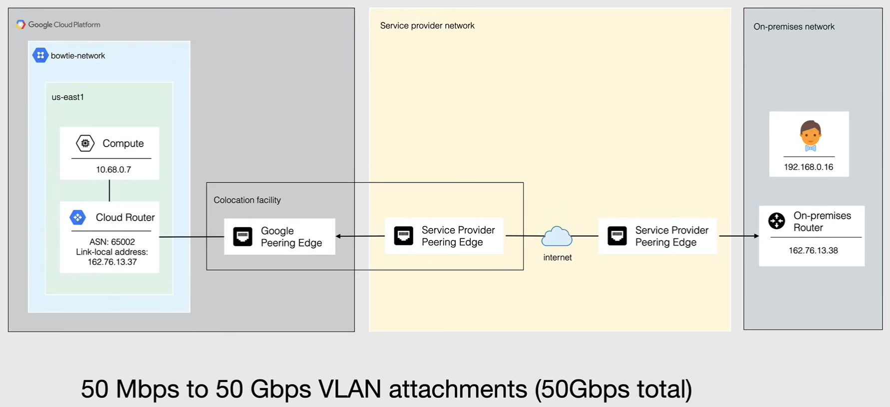

# Cloud Interconnect

# Cloud Interconnect

Cloud Interconnect è un tipo di connessione che consente la connettività dal tuo ambiente on-premises alla tua rete VPC di Google Cloud.

Cloud Interconnect è la connessione più comune per la maggior parte delle grandi organizzazioni e per coloro che richiedono connessioni veloci/a bassa latenza.

- Cloud Interconnect è una connessione a **bassa latenza e altamente disponibile** tra il tuo data center on-premises e le reti VPC di Google Cloud.
  
- Le connessioni Cloud Interconnect forniscono connessioni con indirizzi IP interni, il che significa che *gli indirizzi IP interni sono direttamente accessibili da entrambe le reti*.
  - E quindi gli host on-premises possono utilizzare gli indirizzi IP interni e beneficiare di **Private Google Access** anziché degli indirizzi IP esterni per raggiungere le API e i servizi di Google.

- Il traffico tra la tua rete on-premises e la tua rete VPC **non attraversa Internet pubblico**.
  - Il traffico attraversa una connessione dedicata o un provider di servizi con una connessione dedicata o gli indirizzi IP interni della rete VPC sono direttamente accessibili dalla tua rete on-premises.

- A differenza di una VPN, questa connessione **non è crittografata**.
  - Se è necessario crittografare il traffico a livello IP, è possibile creare uno o più gateway VPN gestiti autonomamente nella rete VPC e assegnare a ciascun gateway un indirizzo IP privato.

- Anche se questa può essere una connessione molto veloce, ha anche un **costo molto elevato** ed è il tipo di connessione più costoso.

Cloud Interconnect offre due opzioni per estendere la tua rete on-premises:

- **Dedicated Interconnect**, che fornisce una connessione fisica diretta tra la tua rete on-premises e la rete di Google.
- **Partner Interconnect**, che fornisce connettività tra la tua rete on-premises e le reti VPC tramite un provider di servizi supportato.

## Dedicated Interconnect

## Dedicated Interconnect

Dedicated Interconnect fornisce una connessione fisica diretta tra la tua rete on-premises e la rete di Google.

Dedicated Interconnect consente di trasferire grandi quantità di dati tra la tua rete e Google Cloud, il che può essere più conveniente rispetto all'acquisto di larghezza di banda aggiuntiva tramite Internet pubblico.

Per la connessione Dedicated Interconnect, si configura una connessione Dedicated Interconnect tra la rete di Google e il proprio router in una posizione comune.

L'esempio seguente mostra una singola connessione Dedicated Interconnect tra una rete VPC e una rete on-premises. Per questa configurazione di base, viene configurata una connessione Dedicated Interconnect tra la rete di Google e il router on-premises in una struttura di colocation comune.

Quando si crea un collegamento V-LAN, lo si associa a un Cloud Router, che crea una sessione BGP per il collegamento V-LAN e il relativo router peer on-premises. Queste route vengono aggiunte come route dinamiche personalizzate nella rete VPC.

Per la connessione Dedicated Interconnect, la capacità viene fornita tramite una o più connessioni Ethernet da 10 gigabit al secondo o 100 gigabit al secondo, con la capacità massima supportata per ogni connessione interconnect.

Quindi, con le connessioni da 10 gigabit al secondo, è possibile ottenere fino a otto connessioni per una velocità totale di 80 Gbps, mentre con la connessione da 100 gigabit al secondo è possibile collegarne due insieme per una velocità totale di 200 gigabit al secondo.

Per la connessione Dedicated Interconnect, la tua rete deve incontrare fisicamente la rete di Google in una struttura di colocation supportata, nota anche come "interconnect connection location". Questa struttura è dove un fornitore, il provider della struttura di colocation, configura un circuito tra la tua rete e un punto di presenza di Google, noto anche come "pop" (point of presence).

La configurazione mostrata qui è adatta per applicazioni non critiche che possono tollerare un certo tempo di inattività, ma per applicazioni di produzione sensibili si consiglia di avere almeno due connessioni interconnect in due diversi domini di disponibilità edge.

## Partner Interconnect

**Partner Interconnect** fornisce connettività tra la tua rete on-premises e la tua rete VPC tramite un provider di servizi supportato.

Quindi, questa non è una connessione diretta dalla tua rete on-premises a Google, poiché il provider di servizi fornisce un canale tra la tua rete on-premises e il punto di presenza di Google.

Una connessione Partner Interconnect è utile se la struttura di colocation di Dedicated Interconnect è fisicamente fuori portata o se i tuoi carichi di lavoro non richiedono una connessione da 10 gigabit al secondo completa.

Per Partner Interconnect, sono disponibili allegati V-LAN da 50 megabit al secondo a 50 gigabit al secondo, con una dimensione massima di allegato supportata di 50 gigabit al secondo.

I provider di servizi hanno connessioni fisiche esistenti alla rete di Google che mettono a disposizione dei loro clienti. Quindi, in questo esempio mostrato qui, dovresti configurare una connessione Partner Interconnect con questi provider di servizi e collegare la tua rete on-premises a quel provider di servizi.

Dopo che la connettività è stata stabilita con il provider di servizi, viene richiesta una connessione Partner Interconnect dai provider di servizi e il provider di servizi configura il tuo allegato V-LAN per l'uso.

Una volta che la connessione è stata configurata, puoi iniziare a inviare traffico tra le tue reti utilizzando la rete del provider di servizi.

Per creare una topologia altamente disponibile, puoi utilizzare più provider di servizi e devi anche creare connessioni ridondanti per ogni provider di servizi in ogni area metropolitana.

## Other Connection Types

E quindi ora ci sono un paio di altri tipi di connessione che passano attraverso i provider di servizi che non sono nell'esame, ma volevo che tu ne fossi consapevole, nel caso in cui si presentasse la situazione nel tuo ruolo di cloud engineer.

### Direct Peering

Direct Peering consente di stabilire una connessione di peering diretta tra la tua rete aziendale e la rete di Google e scambiare traffico cloud ad alta velocità.

Questa capacità è disponibile in oltre 100 posizioni in 33 paesi in tutto il mondo.

Quando viene stabilito il peering diretto, viene fornito un percorso diretto dalla tua rete on-premises ai servizi di Google, inclusi i prodotti di Google Cloud che possono essere esposti attraverso uno o più indirizzi IP pubblici.

Anche il traffico dalla rete di Google alla tua rete on-premises segue questo percorso diretto, inclusi il traffico dalle reti VPC nei tuoi progetti.

Ora puoi anche risparmiare denaro e ottenere prezzi di uscita diretti per i tuoi progetti dopo aver stabilito un peering diretto con Google.

Il peering diretto esiste al di fuori di Google Cloud, a meno che tu non abbia bisogno di accedere alle applicazioni di Google Workspace. I metodi consigliati per accedere a Google Cloud sono Dedicated Interconnect o Partner Interconnect.

Stabilire una connessione di peering diretta con Google è gratuito e non ci sono costi per porta o addebiti per ora. Devi solo soddisfare i requisiti tecnici di peering di Google e puoi quindi essere considerato per il servizio di peering diretto.

### CDN Interconnect

**CDN** (Content Delivery Network) è ciò che memorizza nella cache i contenuti al margine della rete per fornire file più velocemente a coloro che li richiedono ed è uno dei principali modi per migliorare le prestazioni del sito web.

CDN Interconnect è un tipo di connessione che consente a determinati fornitori di CDN di terze parti, come Akamai e Cloud Slayer, insieme ad altri, di stabilire e ottimizzare i costi di popolazione della CDN utilizzando collegamenti di peering diretto con la rete di bordo di Google.

Ciò consente di indirizzare il traffico dalle tue reti VPC alla rete del fornitore. Quindi, il traffico in uscita da Google Cloud attraverso uno di questi collegamenti beneficia della connettività diretta con il fornitore di CDN ed è fatturato automaticamente con una tariffa ridotta.

I casi d'uso tipici per CDN Interconnect sono se stai popolando la tua CDN con grandi file di dati da Google Cloud, dove hai frequenti aggiornamenti dei contenuti memorizzati in diverse posizioni della CDN.

## When to use Cloud Interconnect

- **Prevenire il traffico che attraversa l'Internet pubblico**
- Connessione fisica **dedicata**
- Estensione della tua rete VPC alla tua rete on-premises
- Necessità di alta velocità e bassa latenza (200 Gbps)
- Traffico intenso in uscita (egress) da GCP
- Private Google Access

